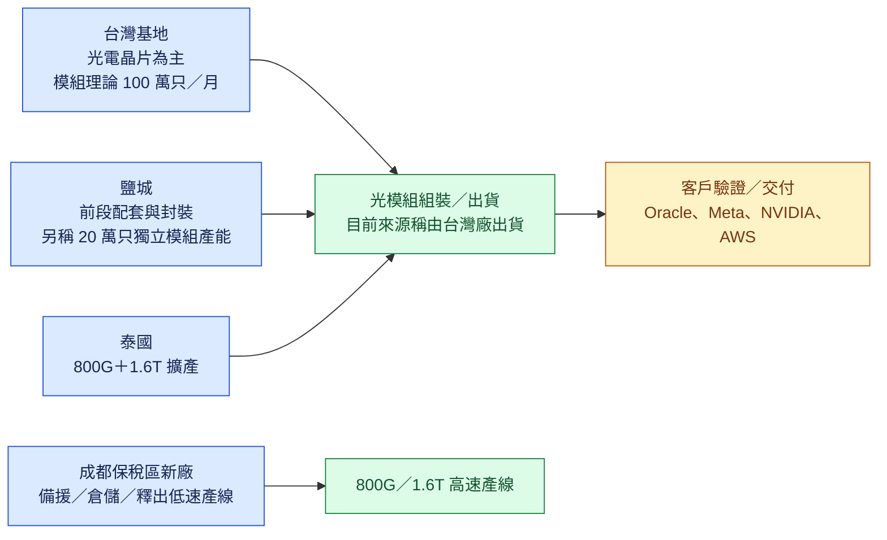

# 索爾思光電（未）

## 基本資料

索爾思光電（Source Photonics）為高速光模組與光電晶片供應商。本頁主要根據匿名專家會議整理，追蹤其 400G、800G、1.6T 光模組的出貨、產能與客戶驗證，並非公司正式公告。2026 年 7、8、9 月整體光模組出貨分別約 80 萬、100 萬與 100 萬只；訪談稱公司滿載極限約 150 萬只／月，但當時並未滿載。[[memo_索爾思光電專家會議_日期不詳]]（會議日期未提供；2026-09-29 收錄）

成長動能集中於 800G 放量與 1.6T 導入。來源稱 1.6T 已於 2026 年 9 月開始生產，當月預估僅 1–2 萬只，主要限制是訂單量而非光電晶片缺料；第一批 [[ORCL.US(oracle)]] 訂單預定於 2026Q4 交付。上述均屬專家／渠道口徑，需以客戶採購與實際出貨驗證。

## 核心技術／競爭優勢

- **EML 1.6T 路線已啟動**：來源稱目前 1.6T 採 EML 而非矽光方案，且光電晶片主要由台灣基地供應（信心中低，受訪者自估把握約七至八成）。
- **晶片與模組垂直資源配置**：台灣廠理論模組產能約 100 萬只／月，但實際僅約 10–20 萬只／月，原因是人員與資源需優先維持光電晶片生產；不能把理論模組產能直接當作可交付量。
- **多地製造彈性**：來源描述鹽城承接前段配套／封裝且另有 20 萬只獨立模組產能、成都保稅區新廠作備援與倉儲、泰國規劃承接 800G 與 1.6T；各基地的有效產能與權責仍待釐清。

## 產品與應用

| 產品／服務 | 應用 | 相關客戶／下游 |
|---|---|---|
| 400G 光模組 | 既有資料中心互連 | 2026Q3 出貨被描述為很少，未揭露客戶 |
| 800G 光模組 | AI 資料中心 scale-out 網路 | [[META.US(meta)]] 被列為 2027 潛在主力；[[NVDA.US(nvidia)]] 的送樣合作已暫停 |
| 1.6T EML 光模組 | 下一代 AI 資料中心高速互連 | [[ORCL.US(oracle)]] 首批訂單預定 2026Q4 交付；[[META.US(meta)]] 專案仍處論證 |
| 100G 光電晶片／產品 | 成熟速率產品 | 來源稱常州基地主要生產 100G，未揭露客戶 |

## 圖片 / 架構圖

圖說：來源描述的光電晶片—封裝—高速模組產能配置；基地功能、額定產能與實際可交付產能不可混用，均待公司揭露驗證。[[memo_索爾思光電專家會議_日期不詳]]

## 時間軸

| 時間 | 事件 | 類型 | 重要性 | 備註 |
|---|---|---|---|---|
| 2026-07 | 整體光模組出貨約 80 萬只 | 出貨 | ⭐⭐ | 專家口徑 |
| 2026-08–09 | 整體光模組出貨各約 100 萬只 | 出貨 | ⭐⭐ | 專家口徑 |
| 2026-09 | 1.6T EML 光模組開始生產，當月估 1–2 萬只 | 技術下線／小量出貨 | ⭐⭐⭐ | 訂單量被指為主要限制 |
| 2026Q4 | [[ORCL.US(oracle)]] 首批 1.6T 訂單預定交付 | 出貨／驗證 | ⭐⭐⭐ | 非客戶公告，待實際交付驗證 |
| 2026 年底 | 泰國廠規劃釋放 80–100 萬只／月；另有「200 萬只產線爬滿」說法 | 擴產／放量 | ⭐⭐⭐ | 兩種產能口徑未能確認是否同一階段 |
| 2027E | 管理層提出 3,500 萬只年出貨目標 | 放量 | ⭐⭐⭐ | 來源稱產能可支撐，不是已確認訂單 |

→ 跨年度節點詳見 [[時程_2026-2027索爾思光電]]。

## 供應鏈位置

- 上游／內部光電晶片：來源稱 1.6T 的光電晶片主要來自台灣基地；常州主要為 100G。這是受訪者判斷，非工廠正式產能揭露。
- 模組製造：台灣現為來源所稱的出貨基地；鹽城、成都與泰國分別承擔配套、備援／空間釋放及海外擴產角色。
- 所屬供應鏈：[[供應鏈_AI光互聯]]；技術基礎見 [[技術_光模塊]]、[[技術_光電芯片]]。

## 相關公司

| 公司 | 關係 | 說明 |
|---|---|---|
| [[ORCL.US(oracle)]] | 客戶／交付 | 來源稱已取得首批 1.6T 訂單，要求 2026Q4 交付；待客戶或公司交付資料驗證 |
| [[META.US(meta)]] | 潛在客戶／驗證 | 來源稱 1.6T 專案仍在論證，但另稱 2027 年 800G 需求具高確定性；與較早渠道說法有落差 |
| [[NVDA.US(nvidia)]] | 送樣測試客戶 | 800G／1.6T 第一階段送樣測試大致完成；來源稱合作已因需求端原因暫停 |
| [[AMZN.US(amazon)]] | 潛在客戶 | 來源稱 AWS 尚未出貨或送樣，亦未收到明確採購需求；不將市場傳聞視為訂單 |
| [[COHR.US(coherent)]] | 競爭者 | 來源稱 Meta 業務的另一主要供應商為 Coherent；個別份額未獲證實 |

> [!warning] 資訊衝突與風險
> - 同一訪談對 2026Q3 800G 出貨給出「至少 280 萬只」及「400–870 萬只」兩種範圍；且 7–9 月整體出貨合計約 280 萬只。數字口徑或提問來源未明，不能作為單一結論。
> - 泰國產能同時出現「2026 年底釋放 80–100 萬只／月」與「200 萬只產線於年底爬滿」；未確認是否為不同期別或不同產線。
> - 2027 年客戶需求、價格與出貨目標均為匿名專家／市場口徑。AWS 尚未送樣、NVIDIA 專案暫停，故不能把大額傳聞需求視為已取得訂單。

## 來源

- [[memo_索爾思光電專家會議_日期不詳]]（使用者提供之專家會議紀錄；會議日期未提供，2026-09-29 收錄）
- [[memo_光模块龙头_光芯片产能_Meta_AWS_acecamptech_20260503]]（AceCamp Tech，2026-05-03；較早期的 Source Photonics 專家訪談，Meta／AWS 與產能說法需與本次來源並列驗證）

## 相關頁面

- [[分析_索爾思光電800G與1.6T出貨追蹤]]
- [[分析_20260918-29專家紀要公司辨識與光互連供給觀察]]
