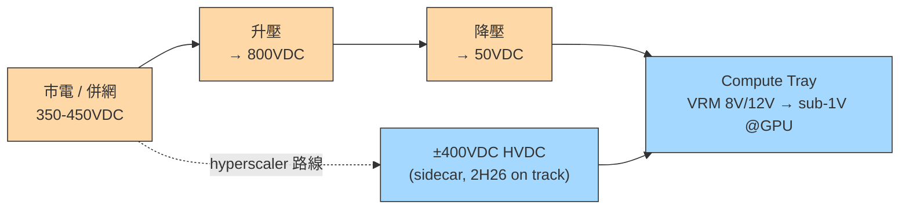
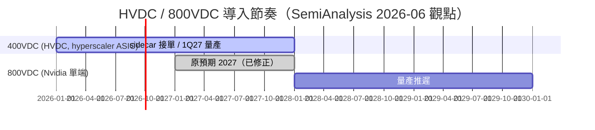

# 技術_800VDC供電架構

## 定義

800VDC 是 Nvidia 主導推動的 AI 機櫃供電架構：隨機櫃功率快速攀升，把電力集中以更高電壓輸送、盡量靠近 compute tray 才降壓，以減少轉換損耗與線路損耗。它與 hyperscaler 自行推動的 **±400VDC（HVDC）** 是**不同**的兩件事——後者是雲端廠為自家 ASIC 部署的高壓直流架構，目的同樣是集中供電、避開 UPS 的 AC-DC-AC 轉換損耗。

**機櫃功耗世代對應（公開資訊約值）**：

| 機櫃世代         | 規格                  | 單櫃功耗        | 800VDC 需求           |
| ------------ | ------------------- | ----------- | ------------------- |
| GB300 NVL72  | Blackwell Ultra     | ~130 kW     | 否（50VDC 供電）         |
| VR200 NVL72  | Vera Rubin（2026 量產） | ~200 kW+    | 否（Rubin 不需要）        |
| Kyber NVL576 | Rubin Ultra（2027+）  | **~600 kW** | **是**（800VDC 為必要條件） |

Kyber 世代（~600kW）是 800VDC 從「可選」變為「必要」的臨界點，原因是如此功率等級靠傳統低壓配電線損過大。OCP 陣營（Google/Meta/Microsoft）同步推進 **OCP Diablo 400**（Mount Diablo）規格，把電力轉換拆到獨立 sidecar 電力櫃，支撐 100 kW–1 MW 級機櫃。

> [!note] 800VDC ≠ 400VDC
> 400VDC（±400V HVDC）由 hyperscaler 推動、主要服務自家 ASIC，**2H26 照計畫進行**；800VDC（Nvidia 單端）量產則被推遲。兩者常被混為一談，但時程與推手不同。

## NVIDIA 產業對齊與執行框架（2026-08-20）

NVIDIA《800 VDC Architecture: Industry Alignment & Execution》把路線從概念驗證推進到部署與認證框架，提出三種並行選項：**Rack-level Power Rack**、**Cluster-level Power Center**、以及面向高密度資料廳的 **DC Power Block**。白皮書不是單一量產承諾，而是把電力轉換、保護分區、故障偵測、法規認證與端到端驗證列為產業共同執行項目。

| 部署選項 | 系統位置 | 白皮書重點 | 投資觀察 |
|---|---|---|---|
| Power Rack | 機櫃旁 | 以 800VDC 介面接入 compute rack，兼容既有 AC 基礎設施 | 最接近短期設備與電源驗證需求，但受機房 footprint 約束 |
| Power Center | Cluster 級 | 集中式整流、800VDC switchboard 與 1.6MW 級電力中心 | 觀察 SST、整流、配電與保護設備的共同驗證 |
| DC Power Block | Data hall 級 | 約 **4.8MW／block**、6000A 級 DC busduct 與模組化集群 | 長期高密度路線，法規、電弧與維運能力是瓶頸 |

> [!warning] 時程與資訊邊界
> 白皮書指出產業正由「技術可行」轉向「系統級執行」，但未等同於 NVIDIA 已承諾所有資料中心立即採用完整 800VDC。先前來源對 800VDC 大規模量產落在 2028+ 的判斷仍保留；本白皮書新增的是部署選項、保護架構與認證工作流，屬公司文件的 roadmap／execution framework。

## 圖解

![[nvidia-800-vdc-industry-alignment-white-paper_001.png]]
*圖（NVIDIA，2026-08-20）：既有 AC 架構與 Power Rack、Power Center、DC Power Block 三種 800VDC 部署層級；白皮書把 800VDC 從單一機櫃方案延伸為跨 rack／cluster／data hall 的執行框架。*

![[報告_Semianalysis_PCB_20250826_008.png]]
*圖（SemiAnalysis，2025-08）：Vera Rubin NVL72 主板架構——圖中 Power Distribution Inner Busbar（供電分配內部匯流排，黃色橫條）是 800VDC 在機柜內配電的關鍵結構。800VDC 市電入柜後先到 Busbar 匯流排，再分配至各 Rubin GPU compute tray 與 Vera CPU tray；Tray 內 VRM 逐級降壓（8V/12V → sub-1V @GPU 核心）。Busbar 替代傳統銅纜束線，降低壓降損耗並提升配電密度，是 800VDC 架構「高壓傳輸、近端降壓」邏輯的物理實現。*

![[報告_富邦_Kyber機櫃延後_20260721_005.png]]

*圖（台達電／富邦投顧，2026-07-21）：800VDC 列間電源系統把高壓直流轉換與配電集中在獨立 power rack，支援未來數百 kW 級 compute rack。*

以下 Mermaid 補充供電路徑架構：

hyperscaler 的質疑：把市電 350–450VDC 升到 800VDC 再降回 50VDC 餵 compute tray「效率不佳」，傾向用更高電壓直送、靠近 tray 再降壓。

## 技術原理

- **驅動力**：機櫃功率上升、集中式供電、降低轉換損耗（把降壓拉近 compute tray）。
- **何時非 800V 不可**：當 GPU compute tray 輸入要求 800VDC 時。Rubin 仍用 50VDC；Rubin Ultra / Feynman 才較可能必要——Rubin Ultra/Oberon 的 compute tray 預期超過 15kW TDP，原生 HVDC 分電在極高功率下才有說服力。
- **板級供電鏈不受影響**：VRM smart power stage 把 8V/12V 降到 GPU die 的 sub-1V，這段無論上游是 AC、400V 或 800V 都一樣。

## 關鍵參數 / 判斷指標

| 指標               | 意義              | 觀察重點                        |
| ---------------- | --------------- | --------------------------- |
| compute tray TDP | 決定是否需要原生 HVDC   | Rubin Ultra/Oberon >15kW    |
| 轉換級數與損耗          | 多一次升降壓即多一次損耗    | 800V 升降回 50V 的效率爭議          |
| WBG 含量           | 800V 才是寬能隙真正放量點 | SiC/GaN vs Si superjunction |

## 技術瓶頸 / 風險

- hyperscaler 對 Nvidia 單端 800VDC 有 pushback（Rubin 世代有多種供電選項，800V 非必要）。
- Rubin Ultra 設計今年稍晚才定案，導入存在不確定性。

> [!warning] 資訊衝突：800VDC 時程（機構自我修正）
> - SemiAnalysis 先前觀點：視 800VDC 為 **2027** 的故事。
> - [[報告_Semianalysis_CPOand800VDC_20260609]]（報告日：2026-06-09）：量產推遲到 **2028+**；2H26/2027 滲透率低（Vera Rubin 不需要）；原本要由 Rubin Ultra/Kyber 帶動的 sidecar 量移到 2028 視窗。
> - 狀態：屬技術導入推遲、非取消；400VDC sidecar 仍 2H26 接單、1Q27 量產。

> [!warning] 資訊衝突：2026–2028 滲透節奏
> - [[報告_富邦_Kyber機櫃延後_20260721]]（報告日：2026-07-21）：估 2H26 仍有低於 500 台的 800V power rack 出貨、VR200 HVDC 滲透率約 10%，2027 年 HVDC 採用率 10–20%，2028 年再擴張。
> - [[報告_Semianalysis_CPOand800VDC_20260609]]（報告日：2026-06-09）：認為 Kyber 原生 800VDC 帶動的主要 sidecar 量遞延至 2028+。
> - 狀態：設備 readiness／少量 power rack 與 Kyber compute tray 大規模採用是不同口徑；並列保留，信心中。

## 關鍵廠商

| 環節 | 廠商 | 角色（June note 讀法） |
|------|------|------|
| 電源機櫃 / sidecar | [[VRT.US(vertiv)]] | 中性偏正：800V 延後延長其大型 UPS 業務壽命 |
| 800VDC 供電+冷卻系統（JV）| [[6503.JP(mitsubishi electric)]] | 與 NVIDIA 共同開發 800VDC 供電暨冷卻系統，FY2028 商業化目標；CDU 已出貨 |
| 板級被動 / MLCC | [[2327_國巨（市）]] | MLCC 隨機櫃 TDP 線性成長 |

電源機櫃（未建頁）：台達電 2308.TW、光寶科 2301.TW（sidecar/power rack 轉型照走，延後視為中性）。Grey-space 電氣設備（未建頁，**轉正面**）：Fortrend/FPS、Legrand、Schneider、Hammond Power、ABB——800V 延後反而延長低壓變壓器/開關/busway 內容。板級 VRM / 功率半導體（未建頁，架構中立受惠）：Infineon（跨 Si/SiC/GaN，定位最佳）、MPS、Renesas、Vishay、TXN、ON。被動元件（未建頁）：Murata、三星電機、國巨 2327.TW、TDK。寬能隙純玩家（未建頁，**轉負面**）：Wolfspeed、Navitas——800V 是 WBG 含量真正起飛點，延後使其近期缺乏催化劑。

> [!info] 新增：三菱電機 × NVIDIA 800VDC JV（GF Japan Tour，~2026-06）
> 三菱電機已開始出貨 CDU（液冷分配機），並與 NVIDIA 共同開發 **800VDC 供電暨冷卻系統**，商業化目標 FY2028；另與 Zutacore 合作熱交換系統。FY2025 IT 冷卻業務 ¥320 億，目標 FY2031 ¥1,000 億+，FY2036 ¥3,000 億。（詳見 [[6503.JP(mitsubishi electric)]]）

## 技術演進時程

## 三階段部署框架（UBS，2026-07-07）

> 來源：報告_UBS_800VDC三階段架構_數據中心電力_20260707（UBS，Andre Kukhnin team，2026-07-07）

![[20260709_0823_800VDC_UBS_20260707_006.png]]
*圖（UBS，2026-07-07）：800VDC 三階段架構演進——Phase 1（ORV3，~150kW）→ Phase 2（Sidecar，~400kW）→ Phase 3（Full Solid-State，~1MW）。每階段電力轉換鏈與設備組成變化一目瞭然。*

| 階段 | 架構名稱 | 機櫃功率密度 | 核心改變 | 對設備廠商的衝擊 |
|------|---------|------------|---------|--------------|
| Phase 1 | ORV3 | ~150kW | 在既有 AC 配電架上增加 800V DC 匯流排；降壓在 rack 內完成 | 現有架構衝擊小；PDU/busway 廠商中性 |
| Phase 2 | Sidecar | ~400kW | 獨立 sidecar 機櫃將 400V AC → 800V DC；rack 內去除大量 AC 配電設備 | 對傳統 AC 配電（busbar/PDU）有替代壓力；sidecar 廠商受惠 |
| Phase 3 | Full Solid-State | ~1MW | MV UPS + 固態變壓器（SST）直接 11kV AC → 800V DC；原低壓開關設備/LV UPS 消失 | 顛覆性：LV 設備需求大幅萎縮；SST/MV UPS 廠商取而代之 |

**效益量化（UBS 專家電話，2026-07-07）**：
- 每少一次轉換步驟：效率提升 **1-3%**；全系統潛在電力節省約 **~5%**
- 減少銅線用量、簡化基礎設施（UPS/PDU 需求下降）
- 挑戰：高壓絕緣、EMI 管理、安全規範提升系統複雜度

**採用時程（Legrand 法說，2Q26）**：
- Sidecar hybrid 方案預計 **2027/28** 開始貢獻業績
- 預估 **2030 年** 達全球新增 IT 負載的 10-20%

## UBS 關鍵廠商立場（2026-07-07）

| 廠商 | 地區 | 評等 | 800VDC 策略 | UBS 觀點 |
|------|------|------|-----------|---------|
| Siemens | 歐洲 | Buy | 積極切入 DC 配電；電氣化部門 DC 電流斷路器已有產品 | 2026Q3 有機訂單成長預估 +30%；資料中心持續高增 |
| Schneider Electric | 歐洲 | Buy | 已推 sidecar 原型；Q2 毛利率受 800VDC 組合影響「持平至略降」 | 頂選之一；sidecar 量產在 2027/8 |
| Munters | 歐洲 | Buy | 數據中心冷卻+高功率空調 | 受惠 AI DC 密度攀升 |
| ABB | 歐洲 | Neutral | 不做 sidecar（視為過渡品類）；聚焦 SST + MV UPS | 已有 DC 斷路器（基於功率電子）；認為 MV UPS 是關鍵成長品類 |
| Legrand | 歐洲 | Neutral | 有 sidecar 原型，將於 CMD（Sep 2026）正式發布 | 80% 業務中性到正面；20% 有負面衝擊（LV PDU） |
| GE Vernova | 美國 | Buy | SST 由 hyperscaler 客戶聯合出資開發；Sep 2026 開始測試，商業化約 6 個月後 | 「最佳定位」之一，並列 Vertiv/Eaton |
| Vertiv | 美國 | — | 800VDC 延後延長大型 UPS 業務生命週期；sidecar 中性 | 中性偏正（延後反而護住現有業務） |
| Eaton | 美國 | — | 高壓電源系統；DC 配電組件 | UBS 列為「最佳定位」之一 |
| [[2308_台達電（市）]] | 亞洲 | — | sidecar / power rack 轉型照走 | UBS Asia 首選：「未來幾年定位良好」 |

> [!info] GEV 固態變壓器（SST）進度
> GE Vernova SST 由某 hyperscaler 客戶聯合出資，2026 年 9 月開始測試，商業化約在測試後 6 個月（約 1Q27）。若成功，是 Phase 3 架構最重要的單一設備里程碑。

## 應用場景

- AI 機櫃集中式高壓供電（Rubin Ultra / Kyber 等高功率機櫃）
- hyperscaler 自家 ASIC 的 ±400VDC sidecar 部署

## BBU 在 HVDC 架構中的位置

![[報告_Citi_順達AIDC_BBU成長週期_20260707_014.png]]

圖說：Citi（2026-07-07）以 HVDC power architecture 說明 BBU 從 rack 內低壓模組移向 sidecar／power rack 後，需同時升級高壓保護、BMS、DC/DC 與熱管理。

| 世代 / 功率 | BBU 形態 | 技術要求 | 投資觀察 |
|---|---|---|---|
| GB300 NVL72 | 約 5kW 模組、rack-level shelf | 快速 ride-through、5+1 冗餘 | Citi 估 content US$15–16k／rack |
| Rubin | 更高功率模組 | 較高放電率、系統通訊 | Citi 估 content US$17–18k／rack |
| Rubin Ultra／HVDC | 約 25kW 模組、sidecar／power rack | 400／800V 絕緣、安全、DC/DC、集中式 BMS | Citi 估 content US$33–34k／rack；仍屬 estimate |

[[3211_順達科技（櫃）]] 2025-07 電話會議表示已開發 400V／800V HVDC，技術可支援 20kW 以上產品，目標 2026–2027 量產。這與本頁「800VDC 系統整體可能延後至 2028+」不必然矛盾：模組完成開發／認證可早於完整資料中心架構大規模部署。

## 相關技術

- [[技術_CPO]]（2026-06 同一份報告重設的兩大題材，定位呈鏡像翻轉）

> [!info] Computex 2026 確認（MS，2026-06-07）：NVIDIA 現場展示 800 VDC Equipment Readiness 路線圖：
> - **Q3 2026**：Option 1A - Power Rack（660 kW），Deployment Ready
> - **Q2 2027**：Option 1B - DC Power Center（1.6 MW）
> - **Q1 2028**：Option 1C - Power Block（4.8 MW+）
>
> MS 渠道確認 800V DC 獨立電源機櫃在 4Q26 出貨進度符合預期。注意：這是「電源機櫃」產品本身，與 Kyber compute tray 需要 800V 輸入是不同時程。
>
> ![[260607_ms_computex_019.png]]
> *圖（NVIDIA at Computex 2026，MS 拍攝）：800VDC Equipment Readiness 路線圖——3Q26 Power Rack（660 kW）→ 2Q27 DC Power Center（1.6 MW）→ 1Q28 Power Block（4.8 MW+）三階段部署時程。*

## AI 電源半導體市場規模（JPM，2026-06-24）

> 來源：報告_JPM_AI電源半導體_20260624（J.P. Morgan，Sandeep Deshpande team，2026-06-24）

| 年份 | AI 電源半導體市場 | 備註 |
|------|----------------|------|
| 2025E | ~$2.7bn | 基準 |
| 2028E | ~$16bn（upside $20bn+） | 3年 CAGR ~82% |

基礎假設：2028 年 AI 資料中心新增容量 ~80GW；65GW 基準情境 × $250/kW 半導體含量。

**半導體含量（$/kW）**：

| 材料 | 現今（2026） | 長期（目標） | 主要應用段 |
|------|------------|------------|---------|
| Silicon（Si） | $150/kW | $180/kW | Stage 2 VRM/PoL（主流、成本最低） |
| Silicon Carbide（SiC） | $30/kW | $60/kW | Stage -1/0：SST、SSCB、ESS、AC-DC 前端 |
| Gallium Nitride（GaN） | $3/kW | $46/kW | Stage 1：800V→48V/6V 中間匯流排轉換 |

> Infineon 指引：現今半導體含量 ~$175/kW，指引區間 $100-$250/kW；隨垂直供電模組及 WBG 採用，趨向指引上緣以上。

## 供電四段架構（JPM 定義）

| 段位 | 名稱 | 轉換 | 主要器件 | 主要廠商 |
|------|------|------|---------|---------|
| Stage -1 | 電網至設施 | MV AC → 400-480V AC | IGBT、SiC MOSFET（SST/SSCB）| Infineon、Wolfspeed、onsemi |
| Stage 0 | AC-DC 前端 PSU | 400V AC → 48V/12V DC | SiC MOSFET、GaN HEMT | Infineon、Wolfspeed、onsemi、STMicro、Navitas、TI |
| Stage 1 | 中間匯流排轉換 | 800V DC → 48V/12V/6V DC | GaN HEMT（650V） | Navitas、Infineon、Onsemi+GF、Innoscience、Vicor、MPS |
| Stage 2 | VRM / Point-of-Load | 48V/12V → sub-1V @ GPU | Si MOSFET（<100V） + 多相控制器 | Infineon、MPS、Renesas、ADI |

**VRM（Stage 2）補充**：VRM 是最大美元池；每 GPU 世代相數持續增加（更多電流 × 更嚴電壓精度）；垂直供電模組 ASP 為 discrete 的 3×+；GaN 已在 VRM 開始滲透。

## 電源半導體廠商定位（JPM，2026-06-24）

| 廠商 | 強項 | 在 Nvidia 供電鏈地位 |
|------|------|----------------|
| Infineon | Si/SiC/GaN 全覆蓋；Stage 1 & 2 最大供應商 | CoolSiC MOSFET、CoolGaN；Stage 2 多相控制器+智慧功率級 |
| MPS（Monolithic Power） | Stage 2 VRM 控制器+整合功率級 | 與 Infineon 並列 Nvidia 主要 VRM 供應商 |
| Renesas | Stage 2 VRM | 擴大 Nvidia VRM 份額中 |
| Navitas | GaN 專家；Stage 0 & 1 | 10kW all-GaN DC-DC（800V→50V）；800V→6V board（96.5% eff.） |
| Wolfspeed | 高壓 SiC（SST/SSCB/ESS） | 10kV+ SiC MOSFET；800V 延後是近期負面催化劑 |
| onsemi | Stage 0 SiC；與 GF 合作 650V GaN | H1 2026 取樣；EliteSiC |
| STMicro | Stage 0 SiC PSU | 多個 AI server PSU design win |
| TI | GaN FET；PFC/LLC 控制器；BMS IC | 電網側能源儲存 BMS 主要供應商 |
| ADI | Stage 2 VRM 擴大中 | — |
| Rohm | EcoGaN 650V HEMT | AI server PSU Stage 0 |
| Innoscience | GaN 規模製造（中國） | Stage 1 供應商 |

## 來源

- [[報告_DIGITIMES_AI伺服器電源需求_HVDC800V供應鏈_20260822]] — DIGITIMES，下載日 2026-08-21；GaN 產能、SST 至 HVDC 800V 架構與功率元件供應鏈整理
- [[20260709_0823_800VDC_UBS_20260707]]（UBS，2026-07-07；800VDC 供電架構與 AI 資料中心電力路徑）
- 報告_MS_Computex2026_20260607（Computex 2026 Takeaways，2026-06-07；800VDC 電源機櫃 4Q26 出貨確認）
- [[報告_Semianalysis_CPOand800VDC_20260609]]（800VDC Pushout & CPO Delays，2026-06-09）
- [[報告_GF廣發_日本科技巡訪_202606]]（GF Securities HK，~2026-06；三菱電機 × NVIDIA 800VDC JV、CDU 出貨現況）
- [[研究導引_AI硬體架構資源總覽_202607]]（自研讀書導引，2026-07；VR200 ~200kW+、Kyber ~600kW 功耗、OCP Diablo 400 規格確認）
- 報告_UBS_800VDC三階段架構_數據中心電力_20260707（UBS，2026-07-07；三階段架構框架 Phase1/2/3、每階段功率密度 150kW/400kW/1MW、廠商立場：GEV SST 測試 Sep 2026、Legrand sidecar 2027/8、ABB 不做 sidecar、台達電亞洲首選）
- 報告_JPM_AI電源半導體_20260624（JPM First Principles，2026-06-24；AI 電源半導體市場 $2.7bn→$16bn（2025→2028E）；Si/SiC/GaN $/kW 分析；四段架構廠商定位；SST 2030 $1bn+、SSCB 2030 $800m+）
- [[報告_Citi_順達AIDC_BBU成長週期_20260707]]（Citi Research，2026-07-07；BBU 在 HVDC 的架構位置、content 與滲透率估算）
- [[活動_順達2Q25電話會議_20250725]]（順達電話會議，2025-07-25；400／800V BBU 開發與量產窗口）
- [[報告_富邦_Kyber機櫃延後_20260721]]（富邦投顧，2026-07-21；600kW Kyber、2H26 power rack 少量出貨與 HVDC 滲透率估算）

## 相關頁面

- [[NVTS.US(navitas)]]
- [[ON.US(on_semiconductor)]]

- [[TXN.US(texas_instruments)]]
- [[分析_AI資料中心供電與電熱整合]]
- [[3211_順達科技（櫃）]]
- [[分析_MS_AI供應鏈_HBM降規與Kyber延遲_20260810]]
- [[技術_垂直供電VPD]]
- [[供應鏈_AI伺服器散熱]]
- [[供應鏈_被動元件]]
- [[技術_CoWoS與先進封裝]]
- [[技術_MLCC]]

## 2026-08 電熱整合與 onsite power 更新

- [[Sinopac_電力設備]]（永豐投顧，2026-08-23）將 AI 資料中心瓶頸由 IT 設備延伸至場址供電、散熱與 time-to-power；短期由模組化 onsite power 補電，中長期由 CCGT／大型燃氣輪機承接基載。
- 研究整理的 800VDC 路線是分階段演進：既有 AC 搭配 800VDC sidecar → 中壓 AC 集中整流 → SST 轉換至 800VDC bus；完整架構仍取決於客戶驗證與機櫃功率密度，屬產業 thesis，信心：中。
- 燃氣輪機上游瓶頸集中於熱端葉片、高溫鑄件與大型鍛件；此鏈條與 Vertiv 的資料中心電熱整合屬互補而非同一產品環節。

## Vertiv 實務觀點（大和，2026-08-10）

![[報告_大和_Vertiv電話會議摘要_20260810_002.png]]

*圖（Vertiv／大和，2026-08-10）：DC 高壓供電由 rack、pod 演進至 data hall；既有 AC、DC sidecar 與完整 800VDC 可能並存。*

- [[VRT.US(vertiv)]] 正與 NVIDIA 及 hyperscaler 協作；放量取決於次世代晶片功耗與機櫃密度。
- 完整 800VDC 可能拉動中伏 UPS、SST、BESS 與高壓維護服務，提高每 MW content。
- single-phase direct-to-chip 目前仍是液冷主流；熱通量超過其能力才會迫使 two-phase 加速，浸沒式仍屬小眾。

> [!note] Claim 類型與信心
> 以上為管理層技術路線觀點（thesis／guidance，2026-08-10，信心：中），不代表產業已確定單一時程。

- [[報告_大和_Vertiv電話會議摘要_20260810]] — 大和，2026-08-10
