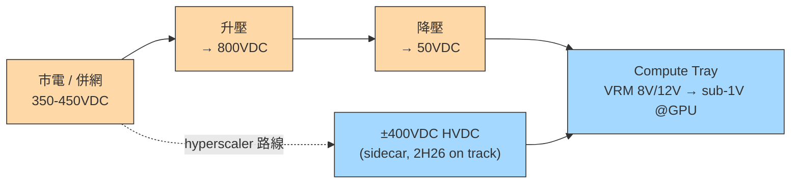
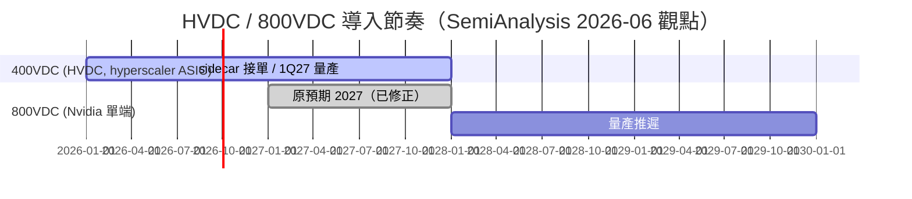

# 技術_800VDC供電架構

## 定義

800VDC 是 Nvidia 主導推動的 AI 機櫃供電架構：隨機櫃功率快速攀升，把電力集中以更高電壓輸送、盡量靠近 compute tray 才降壓，以減少轉換損耗與線路損耗。它與 hyperscaler 自行推動的 **±400VDC（HVDC）** 是**不同**的兩件事——後者是雲端廠為自家 ASIC 部署的高壓直流架構，目的同樣是集中供電、避開 UPS 的 AC-DC-AC 轉換損耗。

> [!note] 800VDC ≠ 400VDC
> 400VDC（±400V HVDC）由 hyperscaler 推動、主要服務自家 ASIC，**2H26 照計畫進行**；800VDC（Nvidia 單端）量產則被推遲。兩者常被混為一談，但時程與推手不同。

## 圖解

![[報告_Semianalysis_PCB_20250826_008.png]]
*圖（SemiAnalysis，2025-08）：Vera Rubin NVL72 主板架構——圖中 Power Distribution Inner Busbar（供電分配內部匯流排，黃色橫條）是 800VDC 在機柜內配電的關鍵結構。800VDC 市電入柜後先到 Busbar 匯流排，再分配至各 Rubin GPU compute tray 與 Vera CPU tray；Tray 內 VRM 逐級降壓（8V/12V → sub-1V @GPU 核心）。Busbar 替代傳統銅纜束線，降低壓降損耗並提升配電密度，是 800VDC 架構「高壓傳輸、近端降壓」邏輯的物理實現。*

以下 Mermaid 補充供電路徑架構：

hyperscaler 的質疑：把市電 350–450VDC 升到 800VDC 再降回 50VDC 餵 compute tray「效率不佳」，傾向用更高電壓直送、靠近 tray 再降壓。

## 技術原理

- **驅動力**：機櫃功率上升、集中式供電、降低轉換損耗（把降壓拉近 compute tray）。
- **何時非 800V 不可**：當 GPU compute tray 輸入要求 800VDC 時。Rubin 仍用 50VDC；Rubin Ultra / Feynman 才較可能必要——Rubin Ultra/Oberon 的 compute tray 預期超過 15kW TDP，原生 HVDC 分電在極高功率下才有說服力。
- **板級供電鏈不受影響**：VRM smart power stage 把 8V/12V 降到 GPU die 的 sub-1V，這段無論上游是 AC、400V 或 800V 都一樣。

## 關鍵參數 / 判斷指標

| 指標 | 意義 | 觀察重點 |
|------|------|----------|
| compute tray TDP | 決定是否需要原生 HVDC | Rubin Ultra/Oberon >15kW |
| 轉換級數與損耗 | 多一次升降壓即多一次損耗 | 800V 升降回 50V 的效率爭議 |
| WBG 含量 | 800V 才是寬能隙真正放量點 | SiC/GaN vs Si superjunction |

## 技術瓶頸 / 風險

- hyperscaler 對 Nvidia 單端 800VDC 有 pushback（Rubin 世代有多種供電選項，800V 非必要）。
- Rubin Ultra 設計今年稍晚才定案，導入存在不確定性。

> [!warning] 資訊衝突：800VDC 時程（機構自我修正）
> - SemiAnalysis 先前觀點：視 800VDC 為 **2027** 的故事。
> - [[報告_Semianalysis_CPOand800VDC_20260609]]（報告日：2026-06-09）：量產推遲到 **2028+**；2H26/2027 滲透率低（Vera Rubin 不需要）；原本要由 Rubin Ultra/Kyber 帶動的 sidecar 量移到 2028 視窗。
> - 狀態：屬技術導入推遲、非取消；400VDC sidecar 仍 2H26 接單、1Q27 量產。

## 關鍵廠商

| 環節 | 廠商 | 角色（June note 讀法） |
|------|------|------|
| 電源機櫃 / sidecar | [[VRT.US(vertiv)]] | 中性偏正：800V 延後延長其大型 UPS 業務壽命 |
| 板級被動 / MLCC | — | MLCC 隨機櫃 TDP 線性成長 |

電源機櫃（未建頁）：台達電 2308.TW、光寶科 2301.TW（sidecar/power rack 轉型照走，延後視為中性）。Grey-space 電氣設備（未建頁，**轉正面**）：Fortrend/FPS、Legrand、Schneider、Hammond Power、ABB——800V 延後反而延長低壓變壓器/開關/busway 內容。板級 VRM / 功率半導體（未建頁，架構中立受惠）：Infineon（跨 Si/SiC/GaN，定位最佳）、MPS、Renesas、Vishay、TXN、ON。被動元件（未建頁）：Murata、三星電機、國巨 2327.TW、TDK。寬能隙純玩家（未建頁，**轉負面**）：Wolfspeed、Navitas——800V 是 WBG 含量真正起飛點，延後使其近期缺乏催化劑。

## 技術演進時程

## 應用場景

- AI 機櫃集中式高壓供電（Rubin Ultra / Kyber 等高功率機櫃）
- hyperscaler 自家 ASIC 的 ±400VDC sidecar 部署

## 相關技術

- [[技術_CPO]]（2026-06 同一份報告重設的兩大題材，定位呈鏡像翻轉）

## 來源

- [[報告_Semianalysis_CPOand800VDC_20260609]]（800VDC Pushout & CPO Delays，2026-06-09）
