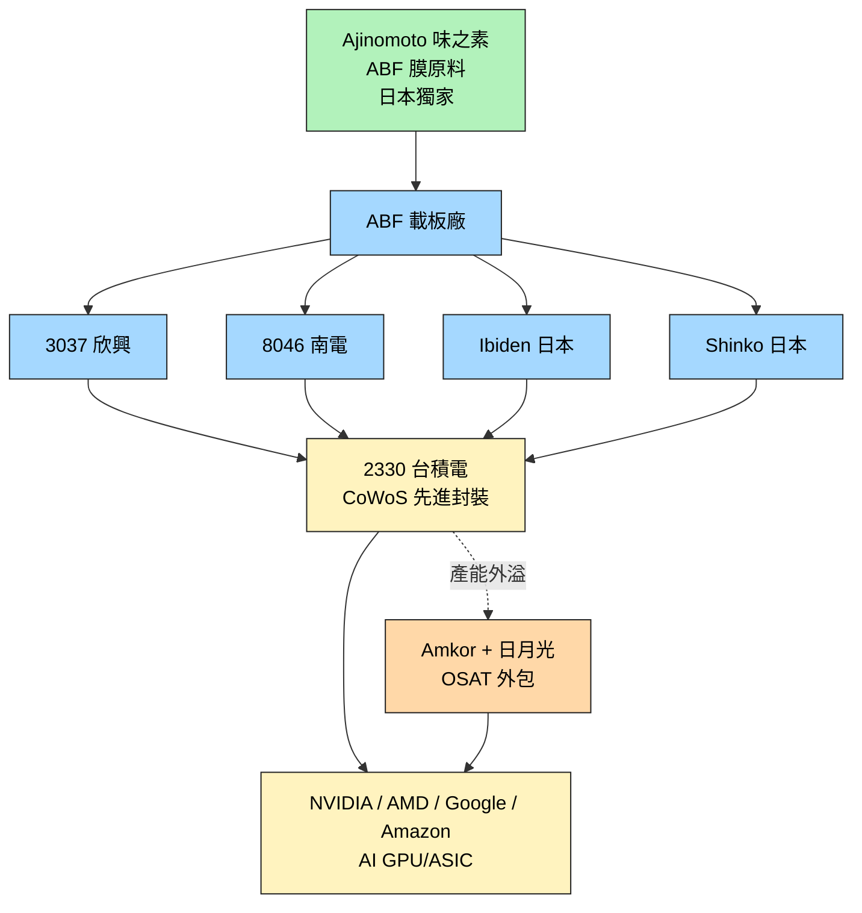
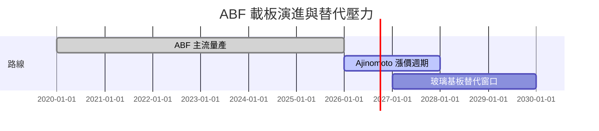

# 技術_ABF載板

## 定義
ABF（Ajinomoto Build-up Film）載板是由日本味之素（Ajinomoto）開發的封裝載板材料，採用「填膠 → 烘乾 → 鑽孔 → 鍍銅 → 線路成型」反覆堆疊形成多層結構。為當前 AI/HPC GPU、Server CPU、AI ASIC 等高階先進封裝晶片的關鍵載板材料，台廠 [[3037_欣興（市）]] 與 [[8046_南電（市）]] 為主要供應商。

主要資料來源：[[報告_MS_ABF產業_260508]]（Morgan Stanley，2026-05-08）、[[報告_其他_玻璃基板_20260511]]（國金證券，2026-05-11，提供替代技術視角）。

## 圖解

![[報告_GS_亞洲科技ABF漲價_20260712_001.png]]
*圖（Goldman Sachs，2026-07-12）：ABF 產業 TAM 與 ROE 歷史週期（2004-2028E）——2025-28E CAGR 62%，由 AI 雲端基礎設施 + 伺服器升級週期共同驅動，ROE 預估創歷史新高。*

![[報告_GS_亞洲科技ABF漲價_20260712_003.png]]
*圖（Goldman Sachs，2026-07-12）：2028E AI ABF TAM 上修瀑布圖——基礎 $8.27bn → NVIDIA AI GPU 出貨量增加（+$1.18bn）→ AI ASIC 基板（+$1.4bn）→ Mix 效應（-$0.09bn）→ 新預估 $10.75bn，顯示 AI GPU/ASIC 每顆 ABF 面積大幅增加是 TAM 上修主要驅動力。*

![[報告_統一投顧_ABF載板專題_20260324_004.png]]
圖說：ABF 載板截面結構示意圖（頂：C4 Solder bump → ABF Build-up Film → CCL 芯板（玻纖布/銅箔/樹脂）→ ABF Build-up Film → 底：Solder ball），來源：統一投顧 2026-03，載板廠整理。

## 技術原理
- **上游原材料**：ABF 膜，由日本 Ajinomoto 獨家配方供應；T-glass（低 CTE 玻纖布）為 CCL 核心，Nittobo 全球約 90% 供應份額
- **製程**：填膠堆疊 + 鑽孔（雷射 / 機械）+ 鍍銅 + 線路成型 + 反覆 build-up 多層堆疊
- **結構功能**：載板上下面為晶片接點與 PCB 接點，承擔訊號路由 + 散熱 + 機械支撐
- **層數規模**：AI 加速卡 17–18 層（目前），次世代 Rubin 18–22 層，未來 Feynman 24 層

### ABF 需求正確計算方式

**舊模型失效**：「GPU 出貨量 × 平均基板單價」在 AI 時代系統性低估需求，因各晶片面積／層數／良率差異極大。

**正確需求方程**：
> ABF 總消耗量 = Σ（晶片面積 × 層數 × 良率倒數）

| AI 晶片 | 尺寸 | 結構 | ABF 消耗量倍數（相對 Trainium2）|
|---------|------|------|-------------------------------|
| AWS Trainium2（基準）| 87.5×72.5 mm | 7+2+7（14 層）| 1.0× |
| NVIDIA B300 | 85×125 mm | 9+2+9（20 層）| **1.8×** |
| Google TPU v6 | ~100×100 mm | 8+2+8（16 層）| **2.4×** |
| AWS Trainium4（估算）| 120×120 mm | 9+2+9 | **3.2×** |

### 全球月產能（2025 年實際數據）

| 廠商 | 月產能（千 ㎡/月）| 動向 |
|------|---------------|------|
| Ibiden（日本）| **495** | 大幅擴產（大野廠+河間廠）|
| 欣興（台灣）| **450** | 穩步擴產 |
| Nanya 南亞（台灣）| 276 | 無顯著擴產 |
| Semco（韓國）| 290 | — |
| AT&S（奧地利）| 260 | 無擴產計畫 |
| Kyocera（日本）| 65→**55**（縮減）| 川內工廠關閉，缺乏 AI 訂單競爭力 |
| 景碩 / 南電 / AT&S / 大德 | — | **均無擴產計畫** |
| 臻鼎（台灣）| — | 高雄+深圳大幅擴產；計劃 **2027 年泰國建廠** |

### 大尺寸 FC-BGA 市場格局

| 廠商 | 全球大尺寸 FC-BGA 份額 | 備註 |
|------|---------------------|------|
| **欣興** | **~40%** | 台灣最大，全球前沿 AI 基板市場主力 |
| **Ibiden** | **~30%** | 日本龍頭 |
| 其餘（南亞/景碩等）| ~30% | 量產上限約 **70×70 mm**，無法進入前沿 AI 基板市場 |

## 關鍵參數 / 判斷指標

| 指標 | 意義 | 觀察重點 |
|------|------|----------|
| 層數 | 訊號路由容量 | 18 層以上算高階；AI GPU 對層數需求高 |
| 線寬 / 線距 | 訊號密度 | μm 級別 |
| 翹曲（warpage） | 大尺寸載板良率瓶頸 | CTE 接近矽片是難題 |
| ABF 膜價格 | 上游成本 | Ajinomoto 2026-05 啟動 per-customer 漲價 |
| 產能交期 | AI 端需求動能 | 2026 年 AI 載板交期長 |

## 供給瓶頸層級（由剛性到彈性）

| 層級 | 瓶頸 | 狀況 |
|------|------|------|
| ① 最剛性 | **T-glass 織布機** | 豐田訂單排到 **2028–2030 年**，物理瓶頸，無法加速 |
| ② 高風險有路徑 | **T-glass 產量** | 台玻/富橋認證+Nittobo-南亞代工部分填補；2027 年缺口可能重新擴大至 30% |
| ③ 中高風險 | **CCL/Core 覆銅板** | Resonac/三菱瓦斯認證周期 **9 個月–1 年**；不向大陸廠供貨 |
| ④ 中等風險 | **ABF 膜** | 味之素 2026 年翻倍至 **200 萬 ㎡/月**，2029 年目標 350 萬 ㎡/月；穩價策略防國產替代 |
| ⑤ 新浮現 | **鑽頭和鑽孔機** | Q布引入後，鑽頭消耗急劇增加；主要供應商：[[8021_尖點（市）]]（台）、UNION TOOL（日）、金洲/鼎泰高科（中）|

## 技術瓶頸 / 風險

- **T-glass 供應鏈高度集中**：Nittobo（全球 ~90%）→ Resonac（FC-BGA 級 CCL **>90%**）→ 欣興/Ibiden；2026 年下半年高端 FC-BGA 供應缺口可能超過 **40%**
- **大尺寸翹曲**：載板尺寸放大時 CTE 不匹配導致翹曲，限制單片可承載晶片數
- **CCL 材料封閉**：力森諾科（Resonac）/ 三菱瓦斯（MGC）**不向大陸客戶供貨**，大陸 ABF 載板廠難進國際 AI 供應鏈
- **ABF 膜配額**：大陸 ABF 載板廠被限制，進一步鞏固台日廠護城河
- **替代技術風險**：[[技術_玻璃基板]] 正推進量產（中期）；CoWoP 嘗試晶片直接倒裝到 PCB，但 PCB 精度無法達到 ABF 水平 → **高性能 AI 加速卡仍依賴 ABF，短期無解**；**CoPoS 推遲至不早於 2030 年**，ABF 載板產業鏈現有格局比市場預期至少延長兩年

> [!warning] Nvidia 伺服器 ABF 份額衝突（兩份來源矛盾）
> - **統一投顧（2026-03）**：GB200/GB300 Ibiden 80–90%、欣興 10–20%；VR200 Ibiden 90–95%、欣興 5–10%
> - **acecamptech memo（2026-05）**：Nvidia 伺服器 ABF Ibiden **≈35%**、欣興 **≈65%**；大尺寸 FC-BGA 全球欣興 ~40%、Ibiden ~30%
> 兩份來源時間差約 2 個月，差異可能反映（a）計算口徑不同（面積 vs 數量）、（b）2026 年訂單結構轉變、（c）分析師估算差異。暫並列保留，待後續法說資料核實。

> [!warning] 技術路線轉向（兩份來源並列）
> **短期觀點（Morgan Stanley，2026-05-08，[[報告_MS_ABF產業_260508]]）**
> - Ajinomoto 開始 per-customer 漲價 → ABF 載板廠 100% 轉嫁至下游，AI 端可能多賺一點 ASP
> - MS 維持 [[3037_欣興（市）]] 與 [[8046_南電（市）]] 為 Overweight
> - 上行：CoWoP 等不需基板技術良率持續無解 → ABF 載板廠受惠延長
>
> **中期觀點（國金證券，2026-05-11，[[報告_其他_玻璃基板_20260511]]）**
> - [[技術_玻璃基板]] / TGV 正推進量產，可能取代 ABF 載板 + 矽中介層
> - [[INTC.US(intel)]] 2026-2030（亞利桑那 >10 億美元）、[[AAPL.US(apple)]] 2027 後（三星電機 T-glass）、[[2330_台積電（市）]]「未來幾年內」CoPoS
> - 中期可能壓縮 ABF 載板成長空間
>
> 兩份來源觀察時點僅差 3 天，反映「短期 cash flow 強化 vs 中期路線替代」並存的時間結構，**不互相否定**。

## 關鍵廠商

### 上游原材料

| 環節 | 廠商 | 角色 |
|------|------|------|
| ABF 膜 | Ajinomoto（味之素，日本，未建頁） | 獨家供應；2026-05 啟動 per-customer 漲價 |

### ABF 載板製造

| 環節 | 廠商 | 角色 |
|------|------|------|
| ABF 載板 | [[3037_欣興（市）]] | 台廠 ABF 雙雄之一；MS 維持 OW |
| ABF 載板 | [[8046_南電（市）]] | 台廠 ABF 雙雄之一；MS 維持 OW，中期成長率較高 |
| ABF 載板 | Ibiden（日本 4062，未建頁） | 日廠 ABF 領先 |
| ABF 載板 | Shinko（日本 6967，未建頁） | 日廠 ABF |
| ABF 載板 | Kinsus 景碩（台灣 3189，未建頁） | 台廠 ABF |

### 下游 / 先進封裝端

| 環節 | 廠商 | 角色 |
|------|------|------|
| 先進封裝平台 | [[2330_台積電（市）]] | CoWoS 主代工，ABF 載板主要需求方 |
| OSAT 外溢 | [[AMKR.US(amkor)]] | TSMC CoWoS 外溢承接 |
| AI GPU 終端 | [[NVDA.US(nvidia)]] | ABF 載板間接消費者 |

## 技術演進時程

## 景碩法說補充：材料與資本的雙重瓶頸（2026-07-30）

- [[3189_景碩（市）]]估 T-glass／E-glass 缺料影響營收 10–15%，新供應商雖完成認證但供給有限，真正緩解仍依賴日東紡擴產，短缺可能延續至 2027 年底。
- ABF 設備交期已拉長至 10 個月以上；景碩 2028–29 年部分設備由客戶出資鎖產能，顯示瓶頸已由單純材料供給延伸至設備與資本配置。
- 2H26 公司實際漲價口徑為每季約 7–8%，ABF 高於 BT；與 Citi 先前預估幅度不同，需以季度營收／毛利率回推驗證。

來源：[[活動_景碩法說電話會議_20260730]]（2026-07-30）
## 應用場景
- AI / HPC GPU（NVIDIA Hopper / Blackwell / Rubin）
- AI ASIC（Google TPU、AWS Trainium、Amazon Inferentia 等）
- Server CPU（Intel Xeon、AMD EPYC）
- 高階 FPGA

## 相關技術
- [[技術_玻璃基板]]（中期替代候選）
- CoWoP（不需基板的封裝方案，本次未建頁）
- CoWoS（先進封裝平台，本次未建頁）

## 供應鏈
→ [[供應鏈_先進封裝載板]]

---

## 供需數據更新（2026-2028）

### 全球 ABF 產能供給

| 廠商 | 2024 | 2025 | 2026E | 2027E | 2028E | 主要擴產廠 |
|------|------|------|-------|-------|-------|-----------|
| Ibiden | 9,000 | 11,700 | 15,795 | 21,323 | 28,786 | 大野廠、河間廠 |
| 欣興 | 10,000 | 11,200 | 12,544 | 14,802 | 17,466 | 光復一/二、楊梅一/二 |
| 景碩 | 4,000 | 4,000 | 4,200 | 5,000 | 5,150 | 楊梅 K6 |
| 南電 | 5,000 | 5,000 | 5,150 | 5,305 | 5,464 | 樹林一/二期 |
| 其他 | 6,884 | 7,091 | 7,303 | 7,523 | 7,748 | — |
| 合計 | 34,884 | 38,991 | 44,992 | 53,952 | 64,614 | — |
| YoY | +14% | +12% | +15% | +20% | +20% | — |

單位：萬顆（37×37mm/8L 基準）。資料來源：統一投顧（2026-03-24）

### ABF 載板需求結構轉變

| 應用 | 2021 | 2023 | 2025 | 2026E |
|------|------|------|------|-------|
| PC | 50% | 35% | 20% | 13% |
| AI（GPU/ASIC/Switch） | 0% | 1% | 27% | 46% |
| 通用型伺服器 | 20% | 31% | 32% | 25% |
| 網通（不含DC） | 5% | 8% | 8% | 6% |
| 電競/汽車/其他 | 25% | 25% | 13% | 10% |

AI 佔 ABF 載板比重 2021 至 2026E 從 0% 升至 46%，是供需逆轉的核心驅動力。

### AI 加速器對 ABF 需求成長率預估

| 年度 | CoWoS 出貨 (K/wpm) | 載板面積 | 層數 | 需求 YoY |
|------|-------------------|---------|------|----------|
| 2025 | 70 | 80x80mm | 16 | +408% |
| 2026E | 120 | 100x100mm | 18 | +133% |
| 2027E | 160 | 100x150mm | 20 | +66% |
| 2028E | 180 | 150x150mm | 22 | +32% |

### 供需缺口預估

| 年度 | 供需狀況 | 缺口估計 |
|------|----------|----------|
| 2025 | 供需平衡 | — |
| 2026 | 供不應求（開始） | 約 1% |
| 2027E | 缺口擴大 | 約 26% |
| 2028E | 缺口持續擴大 | 約 46% |

資料來源：福邦投顧（2026-03-19 預估）

### T-glass 缺料：根本制約因素

ABF 載板的核心層材料 T-glass（低熱膨脹係數玻璃纖維布）供應嚴重受限：

| 供應商 | 市占 | 說明 |
|--------|------|------|
| Nittobo 日東紡 | 50-60% | 全球獨家主要供應商；2025-08-29 宣布投入 150 億日圓擴產，預計 4Q26 產能達目前 3 倍 |
| 台玻 1802 | 15-20% | 4Q25 通過載板廠/CCL廠認證，但產能仍低 |
| 宏和電子 | 10-15% | 台廠第三 |
| 南亞 1303 | 新進 | 4Q25 陸續通過認證，產能仍低 |
| Asahi、AST | — | 已停產 T-glass |

關鍵機制：AI 晶片世代升級使 T-glass 需求呈倍增態勢——H100 每片載板用 6 層 T-glass，GB300 升至 12 層，Rubin（2027）預估 18 層。晶片面積同步放大，T-glass 每顆晶片用量複合成長率遠超產能擴充速度。

---

## Goldman Sachs 供需更新（2026-07-12）

來源：[[報告_GS_亞洲科技ABF漲價_20260712]]（Goldman Sachs，2026-07-12）

### 市場規模預估

| 指標 | 2025 | 2028E | CAGR |
|------|------|-------|------|
| ABF 載板 TAM | — | **US$33B** | **62%**（前估 33%） |
| AI 伺服器需求 | — | — | 101%（2025-28E） |
| 一般伺服器需求 | — | — | 47%（2025-28E） |

GS 大幅上修 ABF 市場規模預估，由前次 33% CAGR 調升至 62% CAGR，主要驅動力為 AI GPU 世代升級導致每片晶片 ABF 面積大幅增加。

### 供需缺口

| 年度 | GS 估短缺率 | 前版估計（福邦 2026-03） |
|------|------------|------------------------|
| 2026E | **8%** | ~1% |
| 2027E | **34%** | ~26% |
| 2028E | **51%** | ~46% |

### 每世代 ABF 面積消耗（GS 估算）

| 晶片 | 前世代 | 新世代 | ABF 面積增幅 |
|------|--------|--------|------------|
| NVIDIA GPU | Blackwell | **Rubin** | **+123%** |
| NVIDIA CPU | Grace | **Vera** | **+47%** |
| 網路 ASIC | — | Tomahawk 6 | 單顆最大用量 |

### 價格動態

- **2Q26 現況**：Spot 價格已較年初 **+40–60%**；交期由年初 3–4 個月拉長至 **12 個月以上**
- **3Q26 起展望**：
  - LTA（長約）價格季增 **+10–15%**
  - Spot 價格季增 **+20% 以上**
- **上游驅動**：Ajinomoto ABF 膜對每家客戶分別啟動漲價（per-customer negotiation），GS 預期 ABF 膜漲幅進一步推動基板端漲價

### GS 評等與目標價更新

| 公司 | 評等 | TP（NT$）| 說明 |
|------|------|----------|------|
| 南電 [[8046_南電（市）]] | Buy（CL）| **NT$2,310** | Conviction List |
| 景碩 Kinsus（3189） | Buy | **NT$1,120** | — |
| 欣興 [[3037_欣興（市）]] | Neutral | **NT$1,140** | 最保守；產能擴充較慢 |
| ZDT（臻鼎） | Buy | **NT$824** | — |

漲價傳導鏈：T-glass 缺料 → CCL 廠漲價（Resonac 3/1 起+30%，MGC 4/1 起+30%）→ ABF 載板廠漲價

## 先進封裝路線比較（ABF 載板定位）

| 封裝方式 | 需要 ABF 載板？ | 現況 | 主要應用 |
|----------|---------------|------|----------|
| CoWoS（TSMC）| 需要 | 量產主流 | NV/Google/AWS |
| CoPoS（TSMC）| 換成玻璃基板 | 未到量產 | 未來路線 |
| CoWoP | 不需要 | 良率仍是問題 | 未來路線 |
| EMIB-T（Intel）| 需要（高階） | 供應商僅 Ibiden+欣興 | Google TPU v9 |
| FOPLP（力成）| 需要 ABF 基板 | 驗證中，1H27 量產 | AI 晶片 |

## 主要供應商更新

Ibiden（日本，未建頁）：全球 ABF 載板龍頭，NV GB300 主供應商（80-90% 份額），Rubin 主供應商（90-95% 份額），2026-2028 大規模擴產（大野廠 2,800 億日圓 + 河間廠 2,200 億日圓）。

景碩（台灣 3189，未建頁）：台廠 ABF 第三，統一投顧買進 TP NT$（原始數值待核對）（中性版），2026-28 產能 CAGR 約 10%（楊梅 K6 廠）。

## 來源（補充）

- [[報告_統一投顧_ABF載板專題_20260324]]（統一投顧，2026-03-24；供需缺口、T-glass 分析、各廠擴產計畫）
- [[報告_福邦_PCB載板產業展望_20260401]]（福邦投顧，2026-03-19；2027-28 缺口 26%/46% 預估、T-glass 供應商市占）

- [[2026H2 PCB產業報告-AI不止，缺料不息202607]]（福邦投顧，2026-07；26H2–2027 ABF 產能與缺料延續）
- [[260806_citi_nypcb]]（Citi Research，2026-08-06；南電 NT$46.8bn 擴產、最早 2028H2 量產判斷）
- [[報告_Daiwa_南電_NYPCB_20260806]]（Daiwa，2026-08-06；南電 2Q26、BT/ABF ASP 與 2029 高階載板擴產估計）
- [[報告_GoldmanSachs_南電_NYPCB_20260806]]（Goldman Sachs，2026-08-06；昆山稼動率、高階 CoPoS substrate 與毛利率估計）
- [[報告_Daiwa_欣興_20260729]]（Daiwa，2026-07-29；欣興 ABF capex、EMIB-T 與毛利率估計）
- [[報告_JPMorgan_欣興_20260723]]（J.P. Morgan，2026-07-23；AI HDI、ASIC server HDI 與 2027E EPS）

## 2026-08 供需與產能更新

- **價格與毛利**：南電 2Q26 毛利率 24.7%，Daiwa／GS 分別預期 2H26 仍受 BT／ABF ASP 上升推動；欣興則由 2Q26 毛利率 24.8% 朝 3Q26 約 30% 改善，均為券商 estimate／公司結果解讀。
- **供給擴張的時間差**：欣興 NT$53.7bn capex 中約 85% 指向 ABF，南電 NT$46.8bn 高階大尺寸載板投資則較晚，Daiwa 估 2029 年上線；兩者反映短期價格循環與長期供給釋放並存。
- **替代與新封裝**：EMIB-T 首階段良率、玻璃核心基板、CoWoP／CoPoS 仍是中期路線變數；現有來源沒有把任何一條路線寫成已量產事實。

---

## 全球載板供需更新（JPM 2026-04-10）

### 全球載板產能供給（等效 30×30mm / 6層，百萬片）

| 廠商 | 2022 | 2023 | 2024 | 2025 | 2026E | 2027E | 2028E |
|------|------|------|------|------|-------|-------|-------|
| 欣興 Unimicron | 67 | 69 | 73 | 79 | 92 | 102 | 117 |
| Ibiden | 60 | 63 | 65 | 72 | 82 | 95 | 107 |
| 南電 Nanya | 42 | 45 | 47 | 48 | 50 | 54 | 57 |
| SEMCO | 22 | 24 | 30 | 32 | 33 | 36 | 40 |
| Shinko | 41 | 44 | 46 | 49 | 50 | 53 | 55 |
| 景碩 Kinsus | 21 | 26 | 26 | 27 | 28 | 31 | 37 |
| AT&S | 32 | 35 | 38 | 40 | 42 | 45 | 49 |
| 其他 | 15 | 20 | 23 | 26 | 30 | 34 | 41 |
| 合計 | 300 | 326 | 348 | 373 | 407 | 449 | 503 |
| YoY | — | +8.7% | +6.8% | +7.0% | +9.3% | +10.2% | +12.1% |

資料來源：JPMorgan（2026-04-10）

### 全球載板需求結構（JPM 預估，百萬 mm²）

| 應用 | 2024 | 2025 | 2026E | 2027E | 2028E | 25-28 CAGR |
|------|------|------|-------|-------|-------|-----------|
| AI 伺服器+交換機 | 2,448 | 4,634 | 8,301 | 13,638 | 21,522 | 67% |
| 一般伺服器 | 3,210 | 3,243 | 3,682 | 3,911 | 4,183 | 9% |
| 消費性 | 3,812 | 3,431 | 2,941 | 3,006 | 3,055 | -4% |
| 合計 | 9,470 | 11,308 | 14,924 | 20,555 | 28,759 | 36% |
| AI 佔比 | 26% | 41% | 56% | 66% | 75% | — |

資料來源：JPMorgan（2026-04-10）

### 主要 AI 晶片尺寸與層數（JPM 2026-04-10）

| 廠商 | 晶片 | 晶片面積 (mm²) | ABF 層數 | 載板總面積 (mm²) |
|------|------|-------------|---------|----------------|
| Nvidia | Hopper | 3,190 | 12 | 38,280 |
| Nvidia | Blackwell | 5,913 | 14 | 82,782 |
| Nvidia | Rubin | 8,051 | 18 | 144,918 |
| Nvidia | Rubin Ultra | 16,102 | 20 | 322,040 |
| Nvidia | Feynman（次代）| 18,000 | 24 | 432,000 |
| Nvidia | NVLink 6（Switch）| 4,500 | 18 | 81,000 |
| Nvidia | NVLink 7 | 5,500 | 20 | 110,000 |
| Google TPU | Hellcat v7（BRCM）| 3,460 | 12 | 41,520 |
| Google TPU | Sunfish v8（BRCM）| 7,037 | 18 | 126,666 |
| Google TPU | Pumafish v9（BRCM）| 18,000 | 24 | 432,000 |
| AWS | Trainium 2 | 5,514 | 14 | 77,200 |
| AWS | Trainium 3 | 6,344 | 18 | 114,188 |
| AWS | Trainium 4 | 14,400 | 24 | 345,600 |

資料來源：JPMorgan（2026-04-10）

## MS 升評紀錄（2026-02-22）

Morgan Stanley（2026-02-22）首次升評欣興至 OW（from EW）、南電至 OW（from UW）：
- 分析師 Howard Kao / Sharon Shih / Irene Yen / Shawn Kim
- TP：欣興 NT$（原始數值待核對）（from NT$（原始數值待核對）.75）、南電 NT$（原始數值待核對）（from NT$（原始數值待核對））
- 核心論點：AI 驅動 ABF 上行週期將持續至 2030 年代末；PC 相關需求佔比從 2015 年 70% 降至 2030E 約 15%，AI 相關需求佔比從 10% 升至 75%
- ABF 市場市值 CAGR 2025-30E 預估 16.1%（vs 過去五年 9.0%）
- 預估 2027 年起進入供給不足；欣興 2025-28E EPS CAGR 105%，南電 113%
- 注意：此為 2/22 升評版本，TP 低於後來 5/8 版本（欣興未揭露、南電未揭露）

## 重要客戶時程

| 客戶 | 產品 | 時程 | 重要性 |
|------|------|------|--------|
| AMD | Venice（26 層，~18 週生產周期）| **2026 Q2 Confirmed PO** | ⭐⭐⭐ |
| Intel | Diamond Rapids | 2026 Q4 量產計劃 | ⭐⭐ |
| Google | TPU | **2026 年 6 月下單** | ⭐⭐⭐ |
| Amazon | Trainium | 2026 年 6 月跟進 | ⭐⭐⭐ |
| Nvidia | GR150（CoWoP 測試場景）| 2026–2027 年末 | ⭐⭐（觸發催化）|

## 定價機制

| 類型 | 漲價方式 | 幅度 |
|------|--------|------|
| 有 LTA 約束（Ibiden 等日系）| 年度談判，無定價權 | 約 20% |
| 無 LTA（台系/大陸，散單）| 每季度漲 | **+10–20%/季，全年 30%+** |
| 味之素 ABF 膜 | 穩價策略 | 防止國產替代 |

- 平均報價：**100–200 美元/顆**；新一代打樣 200–300 美元/顆

### ABF 漲價預測（Citi 2026-06-30，[[報告_Citi_ABF載板BT_20260630]]）

| 季度 | ABF ASP QoQ 漲幅 | 驅動因素 |
|------|-----------------|---------|
| 3Q26 | **+15-20%** | 旺季需求增加 + 供給仍吃緊；客戶更積極付款意願 |
| 4Q26 | **+10-15%** | 進入淡季，漲幅收窄 |
| 2027 | 持續偏緊 | T-glass 供給緊張至全年；中國 UTR 改善驗證需求強度 |

**BT 基板供需（Citi 2026-06-30）**：
- 同業（Unimicron 以外）逐步降低 BT 接單意願或將 BT 產線改造 ABF；
- **欣興 2026 年底削減 BT 產能 15%**（主要為台廠 WBCSP 相關），中期削減 **40-50%**；
- T-glass 預計仍為 2027 全年主要供給瓶頸（若新產能爬坡慢於預期）。

## 國產替代現狀

- **ABF 載板**：主要服務華為昇腾等內循環；某龍頭企業第三條 ABF 產線計劃 **2026 年 9 月投產**
- **BT 載板**：深南電路已完成三星/SK Hynix/美光認證
- **CCL 封鎖**：力森諾科/三菱瓦斯不向大陸供貨 → 大陸 ABF 廠難進國際 AI 伺服器供應鏈

## 來源（補充）

- [[報告_JPM_亞洲PCB_CCL_載板_20260410]]（JPMorgan，2026-04-10；全球載板供需、AI 晶片規格、CCL/PCB TAM）
- [[報告_MS_ABF產業_20260222]]（Morgan Stanley，2026-02-22；首次升評欣興/南電至 OW）
- [[memo_ABF载板日本龙头调研_AI驱动规格毛利双升_acecamptech_20260526]]（月產能、Nvidia/AMD 份額、客戶時程）
- [[memo_ABF载板龙头调研_AI需求翻倍_2027缺货_acecamptech_20260511]]（2027 需求翻倍、T-glass 應對、CoWoS 節奏）
- [[memo_ABF载板专家访谈总结_供需格局演变_材料瓶颈_acecamptech_20260518]]（供給瓶頸層級、定價機制、CoWoP 評估）
- [[memo_ABF需求被出货量模型低估_AI时代_acecamptech_20260526]]（正確需求方程、FC-BGA 格局、CoPoS 延遲）
- [[memo_日本CCL龙头产品及供应链分析_acecamptech_20260427]]（Resonac 市場地位、T-glass 供應鏈層級）

## 相關頁面

- [[7795_長廣（興）]]
- [[分析_先進封裝與RDL]]
- [[技術_垂直供電VPD]]
- [[技術_矽電容]]
- [[技術_CoWoS與先進封裝]]
- [[技術_MLCC]]
- [[供應鏈_AI伺服器PCB]]
- [[技術_CCL]]
- [[技術_CPO]]
- [[技術_HVLP銅箔]]
- [[技術_PCB]]

## 2026-07 至 2026-08 新增觀察

- [[20260721_電子元件板塊：FC_BGA（ABF）基板技術研討會紀錄_JPM]]（JPMorgan，2026-07-14）指出 CoWoS-L 大尺寸 reticle 的翹曲與焊接可靠度是主要瓶頸；EMIB-T 雖可降低大面積 interposer 翹曲，但基板與組裝量產能力尚未成熟。
- 玻璃核心具低 CTE、高剛性與平坦度優勢，但大規模量產基礎設施仍不足；此路線與 ABF 短期主流地位並存，不將玻璃核心寫成已量產替代。
- [[260731_daiwa_Kinsus]]、[[Daiwa-7795 20260805]] 與 [[ms 3037]] 顯示 ABF 成長同時受材料、設備交期、客戶共投資與高階產品良率限制；產能及 EPS 均保留 estimate／公司展望屬性。
## 2026-08-23 產業更新

- [[260804_ms_ABF]]、[[260811_gs_nypcb]]、[[daiwa 3037]] 與 [[gs 3037]] 顯示 2Q26 ABF 毛利率與 ASP 改善，高階交換器／AI ASIC 需求推動欣興與南電擴產；數字保留為券商 estimate 或公司展望。
- [[FC-BGA (ABF) substrate JPM 260721]] 指出 EMIB-T 尚未建立量產技術，CoWoP、玻璃核心、翹曲、鑽孔精度與良率仍是替代路線的主要瓶頸，不能直接視為 ABF 已被取代。
