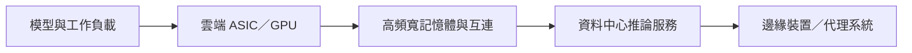

# 技術_AI推論與ASIC平台

## 定義

AI 推論是模型完成訓練後，在雲端、邊緣或終端執行預測、生成與代理任務的階段。DIGITIMES 2026-08-21 簡報估計，2027 年高階雲端 ASIC 出貨量約 1,526 萬顆、年增 110.9%，首次超過高階雲端 GPU 約 1,069 萬顆；此為簡報估計，非公司指引。

## 圖解

## 技術原理

推論平台的核心不只在加速器，也包括記憶體階層、互連、供電與散熱。ASIC 可針對固定模型或資料流最佳化能效與成本；GPU 則保有較高的軟體彈性。推論工作負載若由單一模型推理擴展至多代理、長上下文與多模態，會推高記憶體容量、互連頻寬與系統級協同需求。

## 關鍵參數 / 判斷指標

| 指標 | 觀察意義 |
|---|---|
| ASIC 出貨量與雲端客戶採用 | 判斷客製化加速器是否持續替代部分 GPU |
| 記憶體容量與頻寬 | 長上下文、多模態與代理工作負載的瓶頸 |
| 每瓦推論效能與總擁有成本 | 雲端服務商選擇 ASIC／GPU 的核心經濟性 |

## 產業動能

- 2027 年 ASIC 出貨量估計年增 110.9%，反映雲端服務商擴大自研或客製化加速器。
- AI 運算架構同時需要高速互連、記憶體、儲存、供電與冷卻；因此推論成長會外溢至完整資料中心供應鏈。

## 技術瓶頸 / 風險

- 出貨估計高度依賴雲端客戶專案進度與 ASIC 量產良率。
- ASIC 軟體生態與可程式化程度低於 GPU，若模型快速變化，導入風險上升。
- 推論需求成長不必然等比例轉化為單一晶片廠商營收，需追蹤客戶自研、外包與平台混用。

## 來源

- [[報告_DIGITIMES_AI推論時代_2027雲端運算平台_20260822]] — DIGITIMES，下載日 2026-08-21

## 相關頁面

- [[分析_2026-08_AI網通與硬體報告更新]]
- [[報告_DIGITIMES_AI運算架構與演進趨勢_20260822]] — DIGITIMES／MediaTek 講座，2026-08-20
