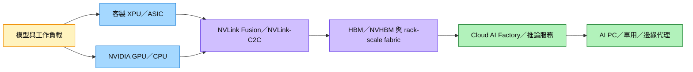

# 技術_AI推論與ASIC平台

## 定義

AI 推論是模型完成訓練後，在雲端、邊緣或終端執行預測、生成與代理任務的階段。DIGITIMES 2026-08-21 簡報估計，2027 年高階雲端 ASIC 出貨量約 1,526 萬顆、年增 110.9%，首次超過高階雲端 GPU 約 1,069 萬顆；此為簡報估計，非公司指引。

## 圖解

圖說：NVLink Fusion 讓客製 XPU 不必與 GPU 生態完全分離，而可透過共同 scale-up／scale-out fabric、CPU 與 HBM 整合進 rack-scale AI factory。

## 技術原理

推論平台的核心不只在加速器，也包括記憶體階層、互連、供電與散熱。ASIC 可針對固定模型或資料流最佳化能效與成本；GPU 則保有較高的軟體彈性。推論工作負載若由單一模型推理擴展至多代理、長上下文與多模態，會推高記憶體容量、互連頻寬與系統級協同需求。

NVLink Fusion 類平台改變的是系統邊界：客製 XPU 可用 NVLink-C2C 與 CPU／其他處理器互連，並透過 NVLink fabric 與 NVIDIA GPU、網路共同組成 rack-scale 系統。NVHBM 則把客製記憶體能力納入平台，讓設計服務商除晶片設計外，還需協調 HBM、ABF 載板、先進封裝與晶圓產能準備。

### MoE、NVLink 與 Dynamo 的系統關係

[[video_NVIDIA_GTC2026_AI平台與NVL576_202603]] 說明，Mixture of Experts（MoE）雖只啟用部分 experts，expert parallelism 仍會在 GPU 間產生大量 all-to-all 通訊；因此推論效能不能只看算力，還要看 scale-up fabric 是否能讓通訊與運算重疊。NVIDIA 在該場演講以 NVL72 的每 GPU 1,800 GB/s NVLink，對比其所稱當代 Ethernet 約 100 GB/s／GPU，主張約 18 倍通訊速度差；這些數字是公司簡報口徑，需以實際模型、訊息大小與拓撲驗證。

Dynamo 則位於軟體調度層，把 prefill、decode 與 KV cache routing 解耦，依 GPU 忙碌程度與 KV cache 位置調度請求。公司宣稱導入可帶來 7 倍改善，且 NVSwitch／Dynamo 等整體最佳化使 Hopper 到 GB300 的每瓦效能提升約 50 倍；兩者均為 NVIDIA 場景化 benchmark，不宜直接外推至所有模型與叢集。

## 關鍵參數 / 判斷指標

| 指標 | 意義 | 投資觀察 |
|---|---|---|
| ASIC 出貨量與雲端客戶採用 | 判斷客製化加速器是否持續替代部分 GPU | 需區分已量產客戶與第二／第三客戶 design win 的券商推測 |
| 記憶體容量與頻寬 | 長上下文、多模態與代理工作負載的瓶頸 | HBM／NVHBM 採購與 ABF 載板準備可能提前占用資金與產能 |
| 每瓦推論效能與總擁有成本 | 雲端服務商選擇 ASIC／GPU 的核心經濟性 | ASIC 的能效優勢需抵銷開發、軟體與量產風險 |
| 平台互通性 | XPU 能否接入既有 GPU／CPU／網路 fabric | NVLink Fusion 可降低客戶採用客製 XPU 的系統整合摩擦，但生態依賴上升 |
| Expert all-to-all 通訊 | MoE 的 token routing 是否被跨 GPU 通訊拖慢 | NVLink／NVSwitch 頻寬、拓撲與 collective software 決定 GPU 能否維持在 compute-bound |
| KV cache 調度 | 長上下文推論能否避免搬移與閒置 | Dynamo 類 disaggregated serving 需同時觀察 prefill／decode 配比、cache locality 與儲存層級 |

## 產業動能

- 2027 年 ASIC 出貨量估計年增 110.9%，反映雲端服務商擴大自研或客製化加速器。
- AI 運算架構同時需要高速互連、記憶體、儲存、供電與冷卻；因此推論成長會外溢至完整資料中心供應鏈。
- **平台型合作提高 design-win 選項**：[[NVDA.US(nvidia)]] 於 2026-08-31 投資 [[2454_聯發科（市）]] US$3.5bn 可轉債，雙方把合作擴至 NVLink Fusion、AI PC／本地運算與車用；[[GOOGL.US(alphabet)]] 亦參與 US$3.9bn CB。投資與合作公告屬 fact，第二／第三 CSP 勝率上升為 Citi／Morgan Stanley thesis（[[報告_Citi_聯發科_20260831]]、[[報告_MorganStanley_聯發科_20260831]]）。

## 概念股 / 族群

| 類型 | 廠商 | 角色 | 觀察點 |
|------|------|------|--------|
| 客製 ASIC 設計 | [[2454_聯發科（市）]] | Google TPU 與 NVLink Fusion 客製 XPU 路線 | 首顆 4Q26 量產、第二／第三 CSP design win、HBM／ABF 準備 |
| GPU／互連平台 | [[NVDA.US(nvidia)]] | NVLink Fusion、NVLink-C2C、NVHBM 與 rack-scale AI factory | 開放客製 XPU 是否擴大平台總量並維持生態控制力 |
| 雲端客戶／投資方 | [[GOOGL.US(alphabet)]] | TPU 客戶並參與聯發科 CB | TPU 專案節奏與策略投資的長期合作含義 |

> [!note] 信心水準
> 可轉債金額與合作範圍已有公告／券商轉述，信心高；第二或第三 CSP 客戶、材料準備收入與個別平台量產份額仍屬券商 thesis／estimate，信心中。

## 技術瓶頸 / 風險

- 出貨估計高度依賴雲端客戶專案進度與 ASIC 量產良率。
- ASIC 軟體生態與可程式化程度低於 GPU，若模型快速變化，導入風險上升。
- 推論需求成長不必然等比例轉化為單一晶片廠商營收，需追蹤客戶自研、外包與平台混用。
- NVLink 相容性降低整合門檻的同時，也提高客製 XPU 對 NVIDIA fabric、軟體與平台路線的依賴。

## 來源

- [[報告_DIGITIMES_AI推論時代_2027雲端運算平台_20260822]] — DIGITIMES，下載日 2026-08-21
- [[報告_Citi_聯發科_20260831]] — Citi Research，2026-08-31；NVIDIA 投資與 NVLink Fusion 合作
- [[報告_MorganStanley_聯發科_20260831]] — Morgan Stanley，2026-08-31；NVIDIA／Alphabet 參與 CB 與供應鏈資金用途 thesis
- [[video_NVIDIA_GTC2026_AI平台與NVL576_202603]] — NVIDIA GTC 2026 Session S81911；MoE expert parallelism、NVLink／NVSwitch、Dynamo 與 NVL576 原型

## 相關頁面

- [[分析_Anthropic與OpenAI_PreIPO_TokenEconomics算力ASIC估值]]
- [[分析_2026-08_AI網通與硬體報告更新]]
- [[分析_Gartner生成式AI模型市場與Token效率_20260906]]
- [[報告_DIGITIMES_AI運算架構與演進趨勢_20260822]] — DIGITIMES／MediaTek 講座，2026-08-20

## 2026-09-15–18 推論與 ASIC 平台更新

- 永豐訪談指出，開源模型與蒸餾會壓低單 token 價格，但價格下降可能反過來擴大使用量；GPU 小時租金、利用率與 1–2 年回收期仍是雲端資本支出的核心驗證指標。來源：[[報告_永豐_AI產業趨勢對談_20260916]]。
- UBS 觀察 inference 需求、ASIC 與 rack-level 整合持續推進，Inventec 的 ASIC 出貨量已超過 AI GPU 伺服器；[[6533_晶心科（市）]]則以 Meta 多代 MTIA 專案、80 系列伺服器 CPU／加速器路線作為後續 royalty 與獲利驗證，均待實際出貨與認列確認。來源：[[報告_UBS_台灣高峰會Day1科技硬體_20260915]]、[[報告_CTBC_晶心科_20260918]]。

- [[分析_AgenticAI光互連與先進封裝瓶頸_20260916]]
