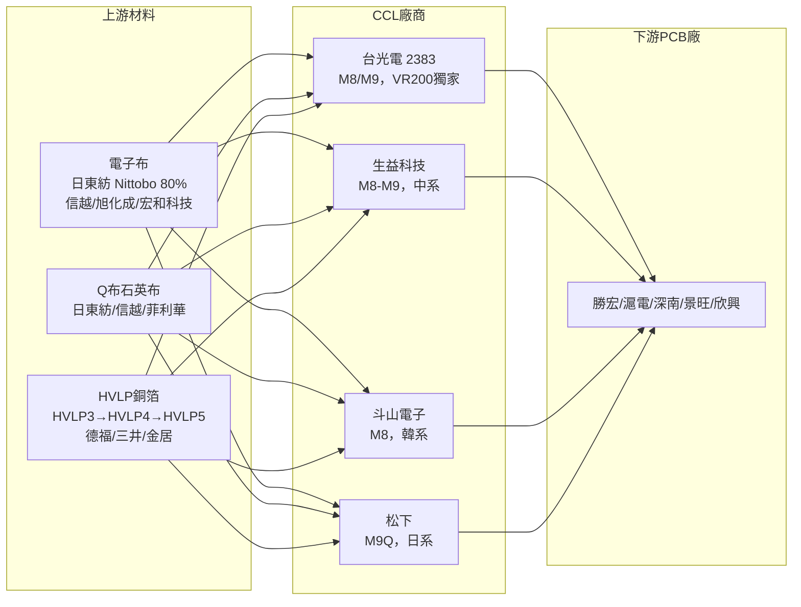

# 技術_CCL

## 定義

CCL（Copper Clad Laminate，覆銅板）是 PCB 的核心基材，由銅箔 + 玻纖布（電子布）+ 樹脂系統壓合而成。AI 伺服器 CCL 的核心技術壁壘在於超低介電常數（Dk）和介電損耗（Df）、配合 Q布（石英布）的加工性、以及與 HVLP 銅箔的相容性。材料等級從 M7 到 M9/M10 每升一級售價提升 1.5–2 倍。

## 圖解

![[報告_Semianalysis_PCB_20250826_003.png]]
圖說：CCL 實體層結構（Filler System / Resin System / Glass Fabric / Copper Foil）——上方銅箔為導電層，中間玻璃纖維布+樹脂為絕緣骨架，來源：SemiAnalysis 2025-08。

## 技術原理

### 材料等級體系

| 等級 | 電子布 | 典型售價/張 | 售價/㎡ | AI 平台主要應用 | 主供應商 |
|------|--------|-----------|--------|--------------|---------|
| FR4 | E-glass（標準）| — | 150–170 元 | 消費電子 | 多家 |
| M6 | E-glass | — | ~260 元 | 一般伺服器 | 台光/生益 |
| M7 | 一代布（E-glass）| 400–500 元 | ~500 元 | GB300 Compute Tray | 台光/生益/台燿 |
| M8 | Low Dk 二代布 | ~1,200 元 | ~2,100 元（~4,800/㎡ per 張）| Rubin Compute Tray, OAM, Switch | 台光/生益/斗山 |
| M8.5 | Low Dk 二代布＋增強 | — | — | ASIC 副板（MTIA/MAIA）| 台光 |
| M9 | Low Dk 二代布＋Q布 | 2,000–2,200 元 | **2,400–2,800 元/㎡（>7,000 元/張）** | Rubin 正交背板/CPX/LPU；VR200 OAM | 台光（獨家 NPR）|
| M9Q | Q布強化 | ~3,000 元 | — | 超高規格板 | 松下 |
| M10 | Q布＋碳氫混合（90%+PTFE）| — | **~4,800–5,000 元/㎡（估算）** | 超高層交換背板（2028E）/ 3.2T 光模塊 | 台光電驗證中；南亞 Prepreg 領先 |
| PTFE（替代方案）| — | — | ~1,600 元 | 正交背板 M8+PTFE 方案 | — |

**注意**：M9 良率目前 **<70%**，M10 良率更低；整體 CCL 供需改善最快至 **2027 年中期**（2026 年全年供不應求）。

### PTFE 混合材料：把更低損耗與可製造性分開處理

[[報告_SemiAnalysis_PTFE延伸銅互連_20260820]] 指出，PTFE 的對稱 C–F 結構使其在 10 GHz 的 Dk 約 2.1、Df 約 0.0003，具更低損耗與較佳化學穩定性；代價是熱塑性、低表面能與較差機械強度，使多次壓合、鑽孔除膠渣、孔壁品質與尺寸穩定性變得困難。報告描述的可行方向是「**PTFE core + M9 級玻纖布 prepreg**」混合結構：PTFE 負責訊號性能，M9 玻纖布層提供機械支撐與較易製造性。

> [!warning] Rubin Ultra PTFE 導入仍未定案
> SemiAnalysis（2026-08-20）稱 NVIDIA 正評估在 Portia（NVSwitch 7）板採用 PTFE/M9 混合結構，生益科技、WUS、[[2383_台光電（市）]] 與 TaiFlex 為其追蹤的材料／PCB 參與者；設計與採用仍取決於材料與 PCB 廠成熟度。此為研究機構供應鏈判讀，不能延伸為已取得訂單或已量產的公司事實。

### Nvidia CCL 供應格局演變

| 時間 / 板型 | 斗山（韓）| 生益（中）| 台光（台）| 松下（日）|
|-----------|---------|---------|---------|---------|
| 2025 整體 | **50%** | 30% | 20% | 部分 |
| 2026 整體 | 20–30% | 30–40% | **40–50%** | 退出部分（UL 認證被取消）|
| VR200 OAM | **被踢出** | — | **100%（獨家）** | — |
| GB300 OAM | 部分 | — | 部分 | — |
| GB300 Switch | 部分 | 部分 | **未進入** | — |

> [!warning] 正交背板材料方案衝突（2026 決策中）
> 四種規格同時驗證（26×3 / 26×4 各有 M8+PTFE 和純 M9），預計 **2026 年 7 月底定案**：
> - **M8+PTFE**：成本低 600–800 元/㎡，良率更高，多位專家預判採用概率更高
> - **純 M9**：>7,000 元/㎡，台光主推
> 若採 PTFE 方案，台光 M9 份額不如預期。

#### 板卡 → CCL 供應對應（SemiAnalysis，2026-07-02）

[[報告_SemiAnalysis_NvidiaCCL_20260702]] 以 VR NVL72 BoM 模型量化各板卡 CCL 分工，並確認 EMC 自 **2026-06** 起價值反超斗山：

| 世代 | [[000150.KR(doosan)]] 斗山 | [[2383_台光電（市）]] EMC |
|------|------|------|
| GB300 | Bianca 板 | NVSwitch(Rosalind) 板 |
| VR NVL72 | Strata 板 | CX(Orchid)、Bluefield、Midplane、NVSwitch(Rosalind) |

- VR NVL72 世代 EMC 內容加總為斗山 **1.51x**；EMC 較斗山多約 **50%** 採購價值。
- **第二來源**：[[1303_南亞（市）]] M7/M8 通過 NVIDIA 認證、M10 用於 Kyber Midplane 送樣，可望成 NVLink Switch(Rosalind)、CX(Orchid) 第二來源（超低損耗 NPG 系列）。
- EMC 月產能 2026 ~1.15m → 2027 底 1.5m sheets，2028 崑山/中山再增 1.8m（總產能倍增），並切入高階 IC 載板 CCL。

### 電子布（Electronic Glass Fiber Cloth）供需

AI 伺服器主要用**薄布**（1067 等規格），vs 消費電子常用厚布（7628）。薄布生產速度慢、Dk/Df 要求嚴苛，若全轉產 AI 薄布，產能效率損失三分之二。

**供需缺口時間線：**

| 時間 | 電子布供需狀況 |
|------|-------------|
| 2025 | AI 薄布缺口 ~500 萬米 |
| 2026 | 普通電子布全面緊張，缺口蔓延；5 月再漲 10%，下半年旺季至少再兩次漲價 |
| 2026 下半年 | 新產能開始點火（最早 10 月後有效產量）|
| 2027 | 供需逐步改善；整體市場規模 5,000–6,000 萬米 |

**電子布主要供應商：**

| 供應商 | 份額 | 特點 |
|--------|------|------|
| 日東紡 Nittobo（日本）| ~80% | T-Glass 主力；現有 ~1,000 萬米/年；2026Q4 新廠投產後達 ~3,000 萬米（3 倍）|
| 旭化成（日本）| 次要 | 價格與 Nittobo 相當 |
| 宏和科技 | 小批量 | 已認證，品質接近 Nittobo，價低 10–20% |
| 中材科技 | 小批量 | 已認證，主力偏中厚布 |
| [[1802_台玻（市）]] | 測試中 | T-glass 台廠，認證進行中 |

**電子布價格：** 2025 年底 120–150 元/米 → 2026Q1 漲 30% → 累計漲 50%，預計再漲 20%。

### 南亞垂直整合與高階材料選擇權

[[報告_摩根大通_台灣能源南亞目標價調升_20260713]] 將 [[1303_南亞（市）]] 的優勢歸因於 E-glass→T-glass、RTF／HVLP1–3、M4–M8 CCL、環氧樹脂與 PCB 的垂直整合。當同業受玻纖布或銅箔短缺限制時，跨材料內製可提高供貨穩定性。

| 指標 | 摩根大通 2026-07-13 假設 | 判讀 |
|---|---:|---|
| 玻纖織布機 | 逾 4,300 台 | 可轉產特規薄布，但轉換損失仍會壓縮一般品供給 |
| 2026 玻纖營收成長 | +230% YoY | estimate；反映 T-glass／Low-Dk 量價齊升 |
| 2026 CCL 營收成長 | +80% YoY | estimate；含漲價與 AI-grade mix |
| 2027 電子材料 OPM | 30% | 由原估 18% 上修，假設敏感度高 |
| M9／M10 | 認證中，未納入基準 | 若取得 10% 市占，報告估 2028 獲利有逾 NT$4.5bn 上行空間 |

> [!note] Claim 類型與信心
> 已量產的 M4–M8、玻纖與銅箔垂直整合屬 fact（信心：高）；2026 成長、2027 OPM 與 M9／M10 市占屬券商 estimate／thesis（信心：中），需以公司法說與客戶認證交叉驗證。

## 關鍵參數 / 判斷指標

| 指標 | 意義 | 觀察重點 |
|------|------|---------|
| Dk（介電常數）| 決定訊號傳輸速度 | M9 Dk < M8 < M7，越低越好 |
| Df（介電損耗）| 決定訊號衰減 | 越低越好，M9 最優 |
| 材料等級 | 直接決定 CCL 售價和 PCB 價值量 | M9 滲透率：2026 <10% → 2027 70–80% |
| 電子布規格 | 薄布（AI）vs 厚布（消費）| AI 薄布 500 萬米缺口，2027 才緩解 |

## 技術瓶頸 / 風險

- **電子布供應瓶頸**：AI 薄布產能受限，供需缺口持續到 2027 年
- **M9 擴產延遲**：電子布缺貨＋設備延遲，台光等部分產能由 4Q26 延至 1H27
- **正交背板材料方案未定**：PTFE vs M9，影響台光 M9 份額（2026 年 7 月定案）
- **供需週期**：CCL 行業格局顯著變化在 2027–2028 年；5 年內完成供不應求→平衡→供大於求

## 關鍵廠商

| 環節 | 廠商 | 角色 |
|------|------|------|
| CCL 龍頭（台灣）| [[2383_台光電（市）]] | M9 唯一 Nvidia NPR；VR200 OAM 獨家；2026 份額提升至 40–50% |
| CCL 第二（台灣）| [[6274_台燿（市）]] | M7–M8 主力，AI 訂單溢出受惠 |
| CCL 第三（台灣）| [[6213_聯茂（市）]] | M6–M7，技術落後，GS Sell |
| CCL（韓國）| 斗山電子（未建頁）| M8，2026 份額降至 20–30%，VR200 OAM 被踢出 |
| CCL（中國）| 生益科技（中國，未建頁）| M8–M9，2026 份額 30–40% |
| CCL（日本）| 松下（未建頁）| M9Q；UL 認證問題退出部分市場 |
| 電子布（日本）| 日東紡 Nittobo（未建頁）| T-Glass 全球 ~80% 份額；2027 擴產 3 倍 |
| 電子布（台灣）| [[1802_台玻（市）]] | T-glass 台廠，2026 Q1 通過三菱瓦斯認證 |
| Low DK 布（日本）| 旭化成（未建頁）| Low DK 一代/二代 供應商，前三名 |
| Low DK 布（中國）| 泰山玻纖（中國，未建頁）| 華為推薦進入；Low DK 一/二代及 Low CTE 首選 |
| FC-BGA CCL（日本）| Resonac 力森諾科（未建頁）| ABF/BT 載板 CCL **35–40% 份額，FC-BGA 級 CCL >90%** |
| FC-BGA CCL（日本）| 三菱瓦斯化學 MGC（未建頁）| ABF/BT 載板 CCL ~20%；均**不向大陸客戶供貨** |
| M10 Prepreg（台灣）| 南亞塑料（未建頁）| M10 粘接片領先，自 2016 年與華為深度合作 |
| 上游銅箔（台灣）| [[8358_金居（市）]] | HVLP4 台廠第一 |

## 應用場景

- AI 伺服器各類 PCB（GPU Compute Tray、Switch Board、正交背板、光模塊 PCB）
- IC 封裝基板（ABF 載板、BT 載板）

## 相關技術

- [[技術_PCB]]（CCL 的主要下游，AI 伺服器 PCB 架構）
- [[技術_Q布]]（M9/M10 CCL 的核心基材石英布）
- [[技術_HVLP銅箔]]（M8/M9 CCL 配套銅箔，第四代 HVLP4 對應 M9）
- [[技術_ABF載板]]（PCB 上層的 IC 封裝載板，不同層次）
- [[技術_正交背板]]（CCL 正交背板材料方案是關鍵決策）

## 供應鏈

→ [[供應鏈_AI伺服器PCB]]

## 來源

- [[報告_摩根大通_台灣能源南亞目標價調升_20260713]]（摩根大通，2026-07-13；南亞垂直整合、T-glass、M8–M10 與 OPM 假設）
- [[報告_摩根大通_南亞4月營收創高_20260507]]（摩根大通，2026-05-07；CCL 10–40% 漲價與一般／特規產能排擠）
- [[報告_摩根大通_南亞AI_CCL銅箔投資論點_20250728]]（摩根大通，2025-07-28；Low-Dk 玻纖、HVLP 與 M8 材料解決方案）
- [[報告_SemiAnalysis_NvidiaCCL_20260702]]（SemiAnalysis，2026-07-02；板卡→CCL 供應對應、EMC 反超斗山、南亞第二來源、產能倍增）
- [[報告_SemiAnalysis_PTFE延伸銅互連_20260820]]（SemiAnalysis，2026-08-20；PTFE 低損耗特性、混合材料可製造性與 Rubin Ultra 板材情境）
- [[memo_PCB_CCL调研_GB200_300_Rubin_M9_acecamptech_20260519]]
- [[memo_PCB调研_Rubin_正交背板_M8PTFE_acecamptech_20260518]]
- [[memo_CCL全产业链_电子布供需_acecamptech_20260427]]
- [[memo_CCL规格升级_M9_Q布_Rubin_BackPlane_acecamptech_20260410]]
- [[memo_日系CCL电子布采购_Nittobo_acecamptech_20260609]]
- [[memo_PCB市场调研_VR200_UltraRubin_OAM_mSAP_acecamptech_20260518]]
- [[memo_日本CCL龙头产品及供应链分析_acecamptech_20260427]]（Resonac 市場地位、T-glass 漲價歷程、GB300/Rubin 用料）
- [[memo_CCL大厂调研_旭化成台玻泰山_电子布供需_acecamptech_20260511]]（Low DK 布供應商、泰山競爭優勢）
- [[memo_CCL龙头调研_高端CCL供需紧缺至2027_M10_acecamptech_20260518]]（FR4→M10 完整價格體系、M9/M10 良率、南亞 Prepreg）

## 相關頁面

- [[1326_台化（市）]]
- [[技術_矽微粉]]
- [[NVDA.US(nvidia)]]
- [[技術_HBM高頻寬記憶體]]
- [[技術_mSAP]]

## 2026H2 供需更新

- [[2026H2 PCB產業報告-AI不止，缺料不息202607]]（福邦投顧，2026-07）將 26H2 CCL 漲價與缺料列為主旋律：高階玻纖布、石英布、HVLP 銅箔與 CCL 供需同步偏緊。
- 報告估 2026H2–2027 CCL 漲價仍可能逐季進行；M8/M9 需求與 800G／1.6T 光模組、AI ASIC／交換機平台連動，數字屬券商估計，需與各公司法說交叉驗證。
- [[260729_ml_TUC]]（BofA，2026-07-29）補充 TUC 2028／2029 年產能擴充與 M8 CCL 需求；供應增加可改善客戶缺料，但也提高資本支出與爬坡風險。

## 2026-08 新增券商觀察

- [[260730_gs_TUC]]（Goldman Sachs，2026-07-30）指出 M7/M8 已占台燿營收 39%，M8+ 正進行多個 AI GPU／CPU／ASIC 專案認證；泰國產能提前爬坡，但仍需追蹤高階良率與價格轉嫁。
- [[260808_daiwa_iteq-UG]]（Daiwa，2026-08-08）認為聯茂受高階 CCL 需求、漲價與產能爬坡帶動；營收、EPS 與產能均屬券商 estimate／公司展望。
## 2026-08-23 產業更新

- [[260717_gs_CCL]]、[[260729_gs_CCL]] 與 [[260805_gs_PCB-CCL]] 將高階 AI CCL 的供需瓶頸、M7+/M8+ 漲價與 AI PCB／CCL TAM 上修列為主要變化；需求成長與價格傳導屬券商 estimate，需與實際稼動率、出貨及客戶認證交叉驗證。
- [[Daiwa-6274 20260727]] 補充泰國產能爬坡與 Trainium3 導入，顯示供給擴張與高階規格升級同步發生，並非單純需求量增加。

![[260717_gs_CCL_001.png]]

圖說：Goldman Sachs 對全球 CCL TAM 的 2025–2028E 估計；AI 伺服器與交換器需求是高階 CCL 成長的主要驅動，數字屬券商 estimate。
