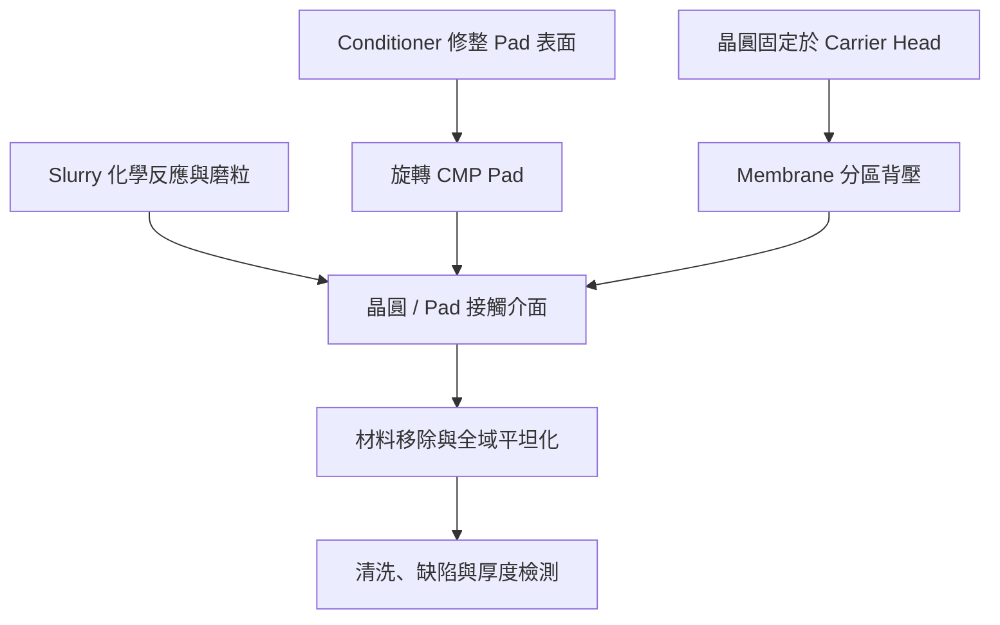

# 技術_CMP

## 定義

CMP（Chemical Mechanical Planarization／Polishing，化學機械平坦化）以化學反應軟化晶圓表面，再由研磨液顆粒與旋轉拋光墊移除材料，使晶圓達到奈米級平坦度。它同時用於前段銅互連、介電層、晶圓再生，以及 CoWoS／SoIC 等先進封裝的薄化與表面整平。

## 圖解

圖說：CMP 結果不是由單一耗材決定，而是 Pad、Slurry、Membrane 背壓、轉速與 Conditioner 共同形成的製程窗口。

## 技術原理／流程

1. Carrier Head 以 Membrane 分區壓力固定晶圓並控制中心到邊緣的受力。
2. Slurry 中的化學成分先氧化或軟化目標材料，磨粒再協助機械移除。
3. Hard Pad 提供較高移除率與全域平坦化；Soft Pad 常用於最後精拋，以降低微刮傷與表面缺陷。
4. Conditioner 持續修整 Pad 表面，維持孔隙、粗糙度與 Slurry 輸送能力。
5. 製程後清洗並檢查膜厚均勻性、刮傷、殘留物、dishing 與 erosion。

## 關鍵參數

| 參數 | 意義 | 主要取捨 |
|------|------|----------|
| Removal Rate | 單位時間材料移除量 | 速度過高可能增加缺陷與局部過磨 |
| WIWNU | 晶圓內厚度不均勻度 | 受 Pad 平整度、Membrane 分區壓力與 Slurry 分布影響 |
| Pad 硬度／孔隙 | 接觸剛性與 Slurry 傳輸 | Hard Pad 利於平坦化；Soft Pad 利於低缺陷精拋 |
| Selectivity | 不同材料的移除速率比 | 決定停止層保護與多材料介面控制 |
| Defectivity | 刮傷、顆粒、殘留與表面缺陷 | 直接影響良率與後續鍵合可靠度 |
| Pad 壽命 | 可維持穩定製程窗口的時間 | 影響耗材成本、停機與批次一致性 |

## 技術瓶頸

- Pad 配方、發泡孔隙與表面微結構需在批次間高度一致，否則移除率與均勻度會漂移。
- 先進封裝同時存在金屬、介電層與大面積結構，局部壓力差更易造成 dishing／erosion。
- Soft Pad 雖較標準化、便於複製，仍需通過長週期客戶認證；高階 Hard Pad 則更依賴客戶製程共同開發。
- 新廠／新產線必須重新完成設備、製程與客戶端認證，產能建成不等於可立即認列營收。

## 應用

| 應用 | CMP 目的 | 主要耗材 |
|------|----------|----------|
| 前段銅互連／介電層 | 去除過量金屬並恢復平坦表面 | Hard Pad、Slurry、Membrane |
| 晶圓再生 | 去除舊膜層與表面缺陷 | Soft Pad、清洗化學品 |
| CoWoS／SoIC | 薄化後整平、鍵合前表面準備 | Hard Pad、Soft Pad、Membrane |
| 最終精拋 | 降低粗糙度與微刮傷 | Soft Pad |

## 相關公司

| 公司 | 角色 | 觀察點 |
|------|------|--------|
| [[7768_頌勝科技（市）]] | CMP Hard／Soft Pad、Membrane | Soft Pad 二供認證、合肥／中科擴產 |

## 相關技術／供應鏈

- [[技術_CoWoS與先進封裝]]
- [[技術_混合鍵合]]
- [[供應鏈_先進封裝載板]]

## 來源

- [[活動_頌勝科技法說_20260814]] — 頌勝科技法說會 memo，2026-08-14（產品、應用、認證與擴產時程）
