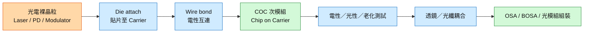

# 技術_COC光模組封裝

## 定義

COC／CoC 是 **Chip on Carrier**，指把雷射、調變器或光偵測器等裸晶粒先固定在載體（carrier／submount）上，完成必要的電性互連與初步測試後，形成可供後段組裝的晶片次模組。它不是單純「買入晶片」的動作，而是晶片採購後、光學耦合與完整 OSA／光模組組裝前的一段封裝狀態。

高速率光模組的通道數與熱、電、光學公差持續收緊，使 COC 的貼片位置、打線品質、散熱路徑及可測試性直接影響後續耦合良率。COC 位於 [[技術_光電芯片]] 與 [[技術_光模塊]] 之間，也是判斷封裝廠是否具備高階光模組製程能力的重要節點。

## 圖解

圖說：COC 是裸晶粒經貼片、打線後形成的中間次模組，後續才進入完整測試、光學耦合與 OSA／光模組組裝。

## 技術原理

| 模組／製程 | 功能 | 觀察重點 |
|------------|------|----------|
| 裸晶粒 | 提供發光、調變或光電轉換 | Known-good die、晶圓測試覆蓋率、晶粒一致性 |
| Carrier／submount | 提供機械支撐、電性導通與熱傳路徑 | 平坦度、熱膨脹匹配、導熱與高頻走線 |
| Die attach | 將晶粒精準固定於載體 | 位置／角度精度、焊料或膠材、空洞率與熱阻 |
| Wire bond | 連接晶粒電極與載體焊墊 | 線長、寄生電感、拉力與高速訊號完整性 |
| COC 測試 | 在昂貴耦合與整機組裝前篩除不良 | 光功率、暗電流、頻寬、老化與溫循覆蓋率 |
| 後段耦合 | 對準透鏡、隔離器、FAU 或光纖 | 主動／被動耦合精度、插損與返修能力 |

與裸晶粒相比，COC 已具備可搬運、可連接與較容易測試的載體；與 COB（Chip on Board）相比，COC 先形成獨立次模組，而 COB 是直接把晶粒固定到最終電路板；與 TOSA／ROSA／BOSA 等 OSA 相比，COC 通常尚未完成完整光學件與光纖介面整合。

## 關鍵參數 / 判斷指標

| 指標 | 意義 | 投資觀察 |
|------|------|----------|
| Die attach 精度 | 決定晶粒相對載體及後段光路的位置誤差 | 速率與通道數上升使高精度設備、製程 know-how 更具價值 |
| 接合熱阻／空洞率 | 影響雷射溫升、波長漂移與壽命 | 高功率 CW／EML 對散熱與材料控制要求更高 |
| Wire bond 寄生效應 | 影響高速電訊號頻寬與眼圖 | 200G／lane 以上需同時優化線長、焊墊與驅動器配置 |
| COC 一次良率 | 反映貼片、接合與打線的綜合穩定度 | 上游 COC 良率愈高，後段昂貴耦合工時被浪費的機率愈低 |
| 測試覆蓋率 | 能否在後段組裝前篩出潛在不良 | 完整的光電與可靠度測試可降低整模組報廢成本 |
| 返修性 | 貼片／打線不良能否重工 | 可返修製程改善成本，但重工次數仍受材料與可靠度限制 |

## 產業動能

- **高速光模組直接採用**：[[research_COC_Chip_on_Carrier_20260830]] 收錄的 MACOM 官方產品頁，把背照式 PIN 明列為 Chip-on-Carrier，應用涵蓋 100G 與 400G PAM4；顯示 CoC 是實際可交付的光電晶片封裝型態。
- **EML／OSA 平台延伸**：同一來源收錄 NTT Innovative Devices 的 EA-DFB＋SOA CoC，應用涵蓋 25G～400G Ethernet，說明發射端雷射也可先以 CoC 次模組交付。
- **台廠強化高精度封裝**：[[活動_華星光法說_20260828]] 記錄 [[4979_華星光（櫃）]] 已布局 COC、COV、KLM 與 BOX，並表示 Die Bond 設備精度可達 0.3 微米；後續觀察 1.6T／NPO 量產時 COC 良率與稼動率。

## 概念股 / 族群

| 類型 | 廠商 | 角色 | 觀察點 |
|------|------|------|--------|
| 光電晶片／CoC 產品 | [[MTSI.US(macom)]] | 提供背照式 PIN Chip-on-Carrier | 高速 PIN CoC 規格、出貨組合與客戶平台 |
| 光通訊封裝 | [[4979_華星光（櫃）]] | 公司法說揭露 COC、Die Bond／Wire Bond 與 NPO 封裝布局 | 1.6T／NPO 認證、良率與量產設備完成時程 |

> [!note] 信心水準
> MACOM 的 CoC 產品與華星光的 COC 製程布局均有官方產品頁或法說原始紀錄支撐；但個別客戶、訂單量、產能利用率與毛利貢獻尚未被這些來源揭露，需後續法說或供應鏈資料驗證。

## 技術瓶頸 / 風險

- **累積良率**：貼片、打線、測試與光學耦合的良率相乘，任何前段不良若到後段才被發現，都會放大材料與工時損失。
- **熱機械可靠度**：晶粒、焊料、carrier 的熱膨脹差異可能在溫循後造成應力、偏移或接合劣化，高功率光源尤其敏感。
- **高速寄生效應**：Wire bond 與載體走線的電感／電容會侵蝕頻寬；世代升級可能迫使封裝轉向 flip-chip、共晶或更高整合架構。
- **規格碎片化**：不同客戶的晶粒尺寸、光路、載體與測試條件不一，專用治具與製程轉線會壓低設備利用率。
- **替代架構**：矽光、CPO／NPO 及更高整合的光引擎可能改變離散 COC 的用量與價值分配，不宜把所有高速光模組都視為相同 BOM。

## 相關技術

- [[技術_光模塊]]（COC 後段的耦合、OSA 與整模組組裝）
- [[技術_光電芯片]]（EML、CW Laser、PD 等裸晶粒來源）
- [[技術_FAU]]（COC／PIC 後段的光纖對準介面）
- [[技術_CPO]]（更高整合光引擎對封裝與測試的要求）

## 來源

- [[research_COC_Chip_on_Carrier_20260830]] — MACOM、NTT Innovative Devices 官方產品頁，2026-08-30 擷取
- [[活動_華星光法說_20260828]] — 華星光，2026-08-28

## 相關頁面

- [[分析_CPO_NPO_XPO與409.6T光互連轉折]]

