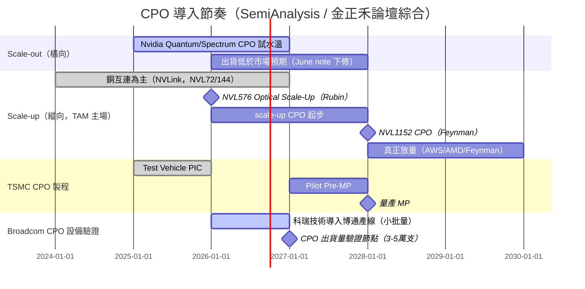

# 技術_CPO

## 定義

CPO（Co-Packaged Optics，共封裝光學）是把「光引擎（Optical Engine, OE）」直接封裝在 XPU 或交換器 ASIC 旁邊的互連技術。傳統可插拔光模組（transceiver）插在前面板的 cage 上，距離 ASIC 約 15–30 cm，訊號得先用長距（LR）SerDes 拉過去、再經模組內的 DSP 還原與轉光；CPO 把光引擎移到 ASIC 旁，省掉 DSP、改用低功耗短距 SerDes，較 DSP 可插拔光模組可省電 50% 以上（業界目標上看 80%）。

CPO 在 **scale-out（後端橫向擴展）** 提供選項，但真正的主戰場是 **scale-up（縱向擴展，GPU 對 GPU 高頻寬低延遲互連）**——銅互連的觸及距離只有約 2 公尺，限制了單一 scale-up 域的「world size」，光互連是突破機櫃邊界把 world size 做大的關鍵。SemiAnalysis 判斷 CPO 的 TAM 會由 scale-up 主導。

## 圖解

![[報告_Semianalysis_CPO_20260102_001.png]]
*圖（SemiAnalysis，2026-01）：CPO 概念——光引擎緊鄰 XPU/ASIC，省去 DSP 與長距 SerDes，較 DSP 光模組大幅降低每位元能耗。*

![[報告_Semianalysis_CPO_20260102_008.png]]
*圖（SemiAnalysis，2026-01）：CPO 系統內 PIC（光子）／EIC（電子）與光纖耦合的封裝關係示意。*

![[報告_金正禾論壇_CPO光電共封裝_20260325_004.png]]
*圖（金正禾論壇，2026-03-25）：NVIDIA GTC 2026 完整路線圖——Blackwell（NVL72 銅）→ Rubin（2026，NVL72/NVL576/NVL144）→ Feynman（2028，NVLink 8 CPO、Spectrum7 204T CPO、NVL1152 CPO 光學 Scale-Up）。*

## 技術原理

**互連演進**：銅 →（co-packaged copper）→ DSP 光模組 → LPO（線性可插拔，去 DSP）→ CPO。每一步都在拿掉訊號鏈上的耗電元件。

![[報告_Semianalysis_CPO_20260102_014.png]]
*圖（SemiAnalysis，2026-01）：從 DSP-based transceiver 演進到 LPO 再到 CPO 的訊號鏈簡化。*

**封裝整合：TSMC COUPE（Compact Universal Photonic Engine）成為主流選項。** PIC（含調變器、波導、光偵測器）用成熟的 N65 製程（光元件不靠微縮、大尺寸反而更好）；EIC（驅動器、TIA、控制邏輯）用先進的 N7。兩顆 die 以 TSMC SoIC 無凸塊混合鍵合，在 iso-power 下較凸塊整合提供逾 23 倍的頻寬密度。採 COUPE 等於綁定 TSMC 製造的 PIC（TSMC 不替其他晶圓廠的 SiPho 晶圓做封裝）。Nvidia、Broadcom、Ayar Labs 等都把 COUPE 納入路線。

**調變器三選一（MZM／MRM／EAM）**：
- **MRM（微環）**：體積小、可直接做波長多工，但對溫度極敏感（約 70–90 pm/°C，2°C 漂移就可能讓共振失效），需加熱器穩定。Nvidia/TSMC 已能量產 200G MRM。
- **MZM（馬赫–曾德）**：最易實作、熱穩定佳，但體積大、需高電壓擺幅、耗電。
- **EAM（電吸收）**：體積小、熱容忍度高（可容忍瞬間 35°C），是 Celestial AI 的差異化選擇（GeSi EAM，C-band），但較難進入開放 chiplet 生態。

**AI 互連三層架構（Scale-Up / Scale-Out / Scale-Across）**：

| 維度 | Scale-Up（機架內）| Scale-Out（叢集內）| Scale-Across（跨叢集）|
|------|-----------------|-------------------|----------------------|
| 傳輸距離 | 2m–5m | 500m–2km | >100km |
| 現行方案 | 銅纜（NVLink）| 光（PAM）| 光（Coherent）|
| 連接 xPU 數 | >72 | >500 | >10,000 |
| 頻寬/xPU | ~7,200 Gbps | ~800 Gbps | ~100 Gbps |
| 延遲 | ~100 nS | ~µS | ~mS |

**CPO 的主戰場在 Scale-Up**：Scale-Out CPO 已起步（Nvidia Quantum-X/Spectrum-X），但 TAM 主要由 Scale-Up 主導——銅纜（NVLink）在 2m 限制內難以支撐 NVL144→NVL576→NVL1152 的擴展需求，光互連是突破機架邊界的必要路徑（Yole 預測 2024–2030 Scale-Up OE 出貨量遠超 Scale-Out）。

**NVIDIA Scale-Up 光學 Roadmap**：
- **Rubin 世代（2026）**：NVL576 採用 **Optical Scale-Up**（ETL256），NVL72/NVL144 仍用銅
- **Feynman 世代（2028）**：NVLink 8 CPO、Spectrum7 204T CPO，NVL1152 採 **CPO-based Optical Scale-Up**

**NV「Optics on Interposer」架構下的光學元件計算**：

| 單位 | CPO OE | FAU | ELS |
|------|--------|-----|-----|
| 每 GPU（Scale-Up）| 2 | 2 | 0.5（4 個 OE 共享 1 個 ELS）|
| 每 Tray（4 GPU）| 8 | 8 | 2 |

全機架 Full CPO（Scale-Up + Scale-Out）情境：

| 情境 | 每機架 OE | 每機架 FAU | 每機架 ELS |
|------|----------|-----------|-----------|
| A：純 Scale-Out CPO | 72 | 72 | 18 |
| B：Full CPO（Scale-Up + Scale-Out）| **360** | **360** | **90** |

→ 啟動 Scale-Up CPO 後光學元件需求 **5×**（72→360 OE/架）；ELS 需求同步 5×（18→90/架）。

**外部雷射源（ELS）**：CPO 需較高功率的 CW DFB 雷射。Nvidia Q3450 用 18 個 ELS 模組、每模組 8 顆 CW DFB chip，每顆 ~350mW。**ELS 功率門檻（2026 現況）**：最低需 100mW @1310nm；中系廠商在此規格下勉強達標。若升至 200mW/DFB、400mW/DFB，或引入 CWDM 多波長（1270/1290/1310/1330/1350nm），中系廠商在強度與多波長均勻性上暫時無法滿足。供應商：[[LITE.US(lumentum)]] 為 Nvidia 初批 CPO ELS 獨家供應商；[[COHR.US(coherent)]] 預計 2026H2 進入成為第二供應商；中國（Yuanjie、Shijia）因技術門檻暫不在短期供應鏈。詳見 [[技術_InP磷化銦]]。

**光纖耦合（FAU）**：FAU 測試仍高度依賴人工，每個 FAU 測試約 10–15 分鐘（Corning 估算 Spectrum X 系統）。每個 1.6T OE 有 20 根光纖（8 Tx + 8 Rx + 4 ELS），全機架 X800-Q3450 共 1,440 根光纖。FAU 廠商分工：TFC Optical（300394.SH，中國）主供 Nvidia X800-Q3450 FAU；Senko（9069.JP，日本）主供 Nvidia Spectrum X CPO + Broadcom Tomahawk6；[[3363_上詮（櫃）]]（FOCI）聚焦 Nvidia Scale-Up CPO FAU。

**光纖耦合（FAU）**：邊緣耦合（edge coupling）vs 光柵耦合（grating coupling，GC）。GC 利於 2D 密度與晶圓級測試，TSMC COUPE 偏好 GC + MRM。

![[20260522_矽光子發展趨勢：技術演進與機會_015.png]]
*圖（知識力科技，2026-05）：TSMC COUPE 光柵耦合（GC）架構——FAU 從上方對準 PIC 的 GC 接口，EIC 堆疊於 PIC 之上（microbump 互連），整體封裝在 Si Carrier 上。*

![[20260522_矽光子發展趨勢：技術演進與機會_016.png]]
*圖（知識力科技，2026-05）：EIC-on-PIC 3D 堆疊示意——EIC 在上層透過 microbump 連接 PIC（下層），PIC 底部再透過 BGA ball 連接 Host PCB，是 TSMC COUPE 的 SoIC-based 整合架構。*

![[報告_SemiAnalysis_CPO_Part5_001.png]]
*圖（SemiAnalysis CPO Book，2026-01）：Nvidia Silicon Photonic Engine 實物——200 Gb/s MRM、1.6 Tb/s、3.5X 省電；右側放大圖顯示 OE、Fiber Connector（FAU）與 Optical Fibers 的整合關係。*

**頻寬擴展的多重向量**：更多光纖、WDM（波長多工）、更高階調變、提高 baud rate——這是 CPO 相對銅（只能靠更快 SerDes 硬拚）的結構優勢。

## 關鍵參數 / 判斷指標

| 指標 | 意義 | 觀察重點 |
|------|------|----------|
| 光引擎 attach 良率 | 每顆 OE 耦合後須完好（焊接基板無返工路徑） | 目前約 95%；量產經濟需 ~99.5%；32 顆 COUPE 下 95%^32 ≈ 1% 系統良率，99.5% 才達 ~85% |
| 插入損耗（insertion loss） | 吃掉光通道預算 | Spectrum 6 CPO 曾測得 4.5 dB，吃光整個通道預算 |
| 每 lane 速率 | 200G PAM4 為現階段主流 | MRM 能否穩定跑 200G |
| 每位元能耗（pJ/bit） | CPO 賣點 | 較 DSP 光模組省 >50%，目標 80% |
| 調變器熱穩定性 | 直接影響可靠度 | MRM 敏感、EAM 容忍度高 |

## 技術瓶頸 / 風險

- **系統級整合良率是主要關卡**：在 32 顆 COUPE 規模下，attach 良率複利效應使系統良率極低，且焊接式 OE 無返工路徑。
- **可靠度與可維修性**：Google 因可靠度疑慮短期不採 CPO。
- **時程下修風險**（見下方衝突 callout）。

> [!warning] 資訊衝突：CPO 量產時程（觀點演進）
> - [[報告_Semianalysis_CPO_20260102]]（報告日：2026-01-02）：結構性看多，scale-up CPO 自 2026 起放量（AWS/AMD/Feynman），scale-out 由 Nvidia/Broadcom 2025–2026 帶動；Celestial AI 在 Marvell 旗下估 2028 年底達 $1B run-rate。
> - [[報告_Semianalysis_CPOand800VDC_20260609]]（報告日：2026-06-09）：**重設預期**——「2027 CPO 預期太積極」，將下修 2026/2027 的 scale-out CPO 出貨；Spectrum 6 CPO（SN810/SN800）滑期逾兩季、4.5 dB 插損問題未解；市場估 2027 年產 7–10 萬台以上 scale-out CPO 交換器「過於積極」；scale-up CPO 仍自 2026 爬升，但 2028 的跳升「看起來樂觀」。
> - 狀態：同機構（作者群含 Nishball）半年後對自身積極時間表的下修，較新且含實測數字者可信度較高。

## 關鍵廠商

| 環節 | 廠商 | 角色 |
|------|------|------|
| 交換器 / GPU 平台 | [[NVDA.US(nvidia)]] | Quantum-X / Spectrum-X Photonics；首批 COUPE 產品 |
| 交換器 ASIC | [[AVGO.US(broadcom)]] | Humboldt→Bailly→Davisson；CPO 老將，未來轉 COUPE |
| 客製 ASIC / 光互連 | [[MRVL.US(marvell)]] | 收購 Celestial AI，切入 scale-up 光互連 |
| 封裝整合平台 | [[2330_台積電（市）]] | COUPE（PIC N65 + EIC N7，SoIC 混合鍵合） |
| 雷射 / ELS | [[LITE.US(lumentum)]] | Nvidia 首批 CPO ELS 預期主供應商 |
| FAU / 光纖被動件 | [[3363_上詮（櫃）]] | 光纖被動元件、FAU 相關 |
| CPO Insertion 3/4 ATE + 光學對準 | [[2360_致茂（市）]] | Insertion 1 驗證中、Insertion 3 ATE+光學對準切入確認、Insertion 4 FT/SLT 核心強項 |
| CPO Insertion 1-3 探針台 | [[6223_旺矽（櫃）]] | Insertion 1 驗證中、Insertion 2 雙面探針台認證中、Insertion 3 確認 |
| CPO Insertion 3 光通量檢測 | [[6710_汎銓（市）]] | IR-OM 光損偵測裝置，漏光偵測與精準定位 |
| CPO Insertion 2-3 光耦合設備 | [[6187_萬潤（市）]] | FAU 貼合 + 光耦合機台；UPH 聲稱優於主競 ficonTEC；3Q26 首現 CPO 業績（SRS 期中，信心：中）|
| CPO 自動光纖耦合設備（主供）| ficonTEC（飛控泰克，德國未上市）| 博通傳統首供；$300K+/台（SemiAnalysis）；5 nm 精度；CPO 耦合良率 80–90%；實質壟斷 |
| FAU 光纖耦合設備（台灣第二入口）| [[6187_萬潤（市）]]（All Ring Tech）| 2026 開始貢獻耦合設備營收，約 10% 人力投入此領域（SemiAnalysis CPO Book Part 5）|
| FAU 製造（主供，Nvidia X800-Q3450）| TFC Optical（300394.SH，中國，未建頁）| 與 Nvidia 合作設計 CPO 逾 3 年，X800-Q3450 主要 FAU 供應商；亦供 ELS 模組 |
| FAU 製造（Spectrum X / Broadcom）| Senko（9069.JP，日本，未建頁）| SEAT 可拆 FAU 平台；與 GFS 合作邊緣耦合；Spectrum X + Broadcom Tomahawk6 主要 FAU 供應商 |
| FAU 製造（Nvidia Scale-Up）| [[3363_上詮（櫃）]]（FOCI）| 聚焦 Nvidia Scale-Up CPO FAU；FAU 被動元件 |
| Shuffle Box 主供 | T&S Communications（300570.SH，中國，未建頁）| CPO Shuffle Box 市場第一；500 芯版 $1,600；Corning 設計後轉包 T&S 生產 |
| OSAT（Nvidia Rubin-rack CPO）| [[3711_日月光投控（市）]] | Nvidia Rubin-rack CPO 核心 OSAT，異質整合封裝 |
| OSAT（Broadcom CPO，緊密合作）| 訊芯-KY（6451.TW，未建頁）| 與博通 CPO 供應鏈緊密合作（SemiAnalysis CPO Book Part 5）|
| CPO 組裝（Nvidia + 博通候選）| Fabrinet（SFN.US，未建頁）| 傳統 Nvidia 光模組模組商；積極建立 OE 封裝/測試能力；博通 CPO 系統組裝候選 |
| CPO 自動光纖耦合設備（第二供）| 科瑞技術（中國，未建頁）| 2026-01 小批量導入博通產線；良率約 60%（門檻 80%）；博通：降成本 + 供應鏈安全 |
| CPO 耦合設備（硅光方向）| ASMPT（新加坡上市，未建頁）| 技術接近 ficonTEC，主聚焦矽光，尚未切入 CPO |

CPO 純玩家（本次未建頁）：Ayar Labs（TeraPHY，UCIe 光 retimer chiplet）、Nubis（2025/10 被 Ciena 收購，MZM、2D 光纖陣列）、Celestial AI（被 Marvell 收購，EAM、Photonic Fabric）、Lightmatter（Passage M1000 光中介層）、Xscape Photonics（ChromX 可程式雷射）、Ranovus（Odin OE）、Scintil（LEAF Light）。整合測試端（未建頁）：GlobalFoundries、Tower、ASE/SPIL、[[AMKR.US(amkor)]]、Fabrinet、Keysight、Teradyne。

## CPO 光測試流程（Insertion 1-4）

CPO 測試隨製程展開，分為四個插入測試階段（Insertion 1-4），由終端驗證擴展嵌入全製造流程。光測試設備需求隨此轉型大幅增加（CPO ATE 320 萬 USD + 探針台 320 萬 USD = 系統合計 > 640 萬 USD，遠高於傳統電測試 5-300 萬 USD）。

![[光測試期中產業報告_008.png]]
*圖（SRS，2026）：CPO Insertion 1-4 測試全流程——從 PIC 晶圓級到 ASIC+OE 系統封裝後 FT/SLT，測試嵌入製造每個關鍵節點。*

| 階段 | 製程位置 | 測試目標 | 主要設備廠 | 台廠切入 |
|------|---------|---------|----------|---------|
| **Insertion 1** | PIC 鍵合前，晶圓級 | 基礎光學探測，篩檢裸粒性能 | Teradyne ATE、ficonTEC 探針台、Keysight | 致茂（ATE，驗證中）、旺矽（探針台，驗證中）|
| **Insertion 2** | EIC+PIC 鍵合後、切割前 | 光電轉換效率 + 雙面光電同測 | Teradyne/Advantest ATE、ficonTEC 探針台 | 旺矽（雙面探針台，認證中）|
| **Insertion 3** | 晶圓切割後、系統封裝前，Die Level | OE + FAU 整合功能驗證 | ATE + 光學對準 + 探針台 + 光通量檢測 | 致茂（ATE + 光學對準）、旺矽（探針台）、汎銓（光通量檢測）、[[6187_萬潤（市）]]（光耦合設備）|
| **Insertion 4** | ASIC + OE 系統封裝後 FT/SLT | 整機光電相容性 + 熱穩定性驗證 | ATE + Handler（3,000W 功耗）| 致茂（FT/SLT，核心強項）|

### Hybrid Bonding 良率與成本壓力

![[光測試期中產業報告_007.png]]
*圖（SRS，2026）：COUPE 異質整合難度大幅提升——Hybrid bonding 初期良率僅 35%，推動光測試成為良率控管關鍵（報廢成本每顆 OE 額外增加約 32 美元，佔系統 BOM 約 50%）。*

> [!warning] 重要數字（SRS 研究，信心：中）
> - Hybrid bonding 初期良率：~35%（量產門檻估 >80%）
> - 35% 良率假設下，每顆光學引擎額外增加約 **32 美元成本**（良品分攤報廢）
> - 單一良率損失佔系統 BOM 約 **50%**
> - 2026 年 OE 需求：121.6 萬顆；2027 年：783.9 萬顆（年增 **6.4 倍**）
> - CPO 2030 年滲透率目標：**35%**

### Quantum x800 Q3450 BOM

| 元件 | 數量 | 總價（USD）| 佔比 |
|------|------|-----------|------|
| FAU | 72 | $2,880 | 4% |
| 1.6T 光引擎（OE）| 72 | $4,680 | 7% |
| Substrate Interposer | 24 | $22,320 | 33% |
| Switch Chip | 4 | $3,200 | 5% |
| ELS | 18 | $6,300 | 9% |
| MPO 連接器、跳線 | 144 | $5,760 | 9% |
| Shuffle Box | 1 | $3,000 | 4% |
| Others | — | $18,800 | 29% |
| **合計** | — | **$66,940** | 100% |

（光引擎 OE + FAU 合計僅佔 11%，系統成本由運算晶片與先進封裝主導）

SemiAnalysis AI Networking Model 估算（2026-01）：
- BOM 合計 ~$70,640；毛利率 ~60%；售價 $176,600；含 3 年服務 $204,856
- 每顆 1.6T OE 含 FAU（20 根光纖：8 Tx + 8 Rx + 4 ELS）；未來 3.2T OE 每顆 ~$1,000（含 FAU）
- 初批 OE 總成本 $35–40K（3.2T OE 版本）

## CPO 設備生態

CPO 光纖耦合是整條光模塊產線台數最多、精度要求最高的環節（台數比例：1 台共晶 + 3 台固晶 + **16–20 台耦合**），貼片、耦合、測試合計佔整線價值約 90%。

### 耦合精度決定供給格局

| 設備類別 | 耦合精度 | 技術難度 | 國產化狀況 |
|---------|---------|---------|----------|
| 普通光模塊耦合 | 3–5 µm | 基準 | 較高（普莱信、猎奇等，紅海競爭）|
| **CPO 耦合** | **< 0.3 µm** | **約 10×** | **極低，ficonTEC 實質壟斷** |

### 設備投資規模估算

2026 年光模塊新增設備投資約 200–300 億元（基於 800G 出貨 6,000 萬支 + 1.6T 出貨 2,000 萬支）。

**設備需求三重乘數**（彈性遠大於出貨量）：
1. 新增產能（量的增加）
2. 精度升級→台數增加（1.6T 耦合時間 5–6 min vs 800G 約 4 min，同等出貨需多 25–50% 台數）
3. 單台設備價值量提升（CPO 耦合機 ~$500 萬 USD）

> [!info] 追蹤催化劑
> **2027 Broadcom CPO 出貨量 3–5 萬支**：是市場判斷 CPO 設備需求能否規模化的關鍵驗證節點。科瑞技術良率能否突破 80% 是觀察國產替代進展的前哨指標。

## 技術演進時程

## NPO vs CPO 過渡期（2026–2028）

NPO（Near-Package Optics）是 2026–2027 年市場的主流過渡方案：

| 比較項目 | NPO | CPO |
|---------|-----|-----|
| 可維護性 | 較好（靠近芯片但仍可換）| 差（晶圓廠封裝後不可換）|
| 功耗降低 | 中等 | CPO 可低至 14–15 W（vs NPO 降幅 30%+）|
| 量產節點 | 2026–2027 主流 | 2028 年市場爆發預期 |
| 2026 CPO 價格 | — | 比 NPO 高 1.5–2 倍 |

**NVIDIA Spectrum X CPO 進展（2026Q2 調研）**：
- 計劃 2026 年 Q4 啟動量產流程，但仍面臨 DFAU 良率問題和外置光源燒毀端面問題
- Spectrum X 單台售價 ~10 萬 USD，較電交換機高 20–30%（差距 ≤50%）
- Spectrum X：可插拔式 FAU，單個 OE 對應 36 芯；1 台需 16 個外置光源（每個對應兩個 3.2T 光通路），使用 400 mW 激光器
- Quantum X：固定式 FAU，對應 18 芯；2025 計劃交付 2,000–3,000 台但至今未交付

**1.6T CPO 市場規模**（2026 年）：
- 全球 1.6T 光模塊出貨約 1,400–2,000 萬只
- 其中 CPO 滲透率從 10–15% 提升至 20%+，出貨量約 **300–400 萬只**

**Google CPO + OCS 組合採購計劃**（2026–2028）：

| 年份 | Google OCS 需求 | 備註 |
|------|---------------|------|
| 2026 | 2.5–3 萬台 | — |
| 2027 | 4–5 萬台 | — |
| 2028 | 8–10 萬台 | — |
| 合計 | **20 萬台**（3 年）| 2025-11 TPU v7 後德州 $400 億投資推動 |

Google CPO 態度：會採用但需等故障率極低後才大規模部署；每年給 Lumentum 光芯片 forecast 激進（每年翻倍）。

**3.2T NPO 訂單**：
- 谷歌計劃 2027 H2 採購 3.2T NPO，2027–2028 總需求 1,200 萬只
- AWS 配合 Trainium 4，2027 年 5 月起採購，2027–2028 總需求 1,000 萬只
- 3.2T NPO 光引擎單價 ~1,000 USD；配套 ELS 光源（每兩個光引擎一個）~430 USD

## 應用場景

- AI 叢集後端 scale-out 網路（Nvidia Quantum-X800 InfiniBand、Spectrum-X 乙太網）
- AI scale-up 縱向互連（取代/補足 NVLink 銅，擴大 world size）
- 客製 ASIC（hyperscaler）內部 scale-up fabric
- OCS 全光交換機（Google TPU Ironwood + 2026–2028 快速部署）

## 相關技術

- [[技術_800VDC供電架構]]（同屬 2026-06 多空重設的兩大題材）
- [[技術_HVLP銅箔]]（CPO/cableless 延後也影響 PCB 材料節奏）
- [[技術_ABF載板]]、[[技術_玻璃基板]]（先進封裝/基板同源材料鏈）

## 供應鏈

→ [[供應鏈_CPO]]

## 相關技術（補充）

- [[技術_InP磷化銦]]（CPO ELS/雷射光源的核心材料；InP vs SiPh 競合）
- [[技術_TFLN]]（TFLN 調製器在 1.6T CPO 中的角色）
- [[技術_FAU]]（CPO FAU/DFAU 規格與供需）
- [[技術_光電芯片]]（CPO 光引擎中 PD/Driver/TIA 配置）
- [[技術_MPO]]（CPO 交換機中板 32 芯 MPO 連接）

## OCI 200G MSA（規則 #14 — 關係更新）

2026-03-11，**[[META.US(meta)]] + [[AVGO.US(broadcom)]] + [[AMD.US(amd)]]** 三方聯合發布 OCI（Optical Compute Interconnect）200G v1.0 MSA，以開放標準對抗 NVIDIA NVLink 封閉生態：

| 技術押注 | 規格 | 關鍵廠商 |
|---------|------|---------|
| ELSFP 外部雷射 | CW DFB，SMSR 30 dB，RIN −144 dB/Hz | [[LITE.US(lumentum)]]（主供候選）|
| MRR DWDM | 4λ 多路（需熱鎖定，[[技術_矽光子（SiPh）]]）| TSMC COUPE |
| 雙向單纖 | Group A 1308–1315 nm / Group B 1328–1335 nm | 省光纖路由 |
| NRZ×4λ | 212.5 Gbps（合計）| 低複雜度調變 |

速率梯：200G → 400G → 800G → 1.6T。詳見 [[技術_OCI]]。

## 1.6T 出貨節奏（規則 #14 — 生產節奏，W26 2026 更新）

| 指標 | 值 |
|------|----| 
| 2026 全球 1.6T 光模塊出貨 | **~850K 支**（+280% YoY）|
| GB300 NVL72 機櫃 2026 年出貨 | **~55K 台**（+129% YoY）|

## InP 基板供應鏈更新（規則 #14 — 供應鏈）

| 方向 | 狀態 |
|------|------|
| 中國 2026 首批 InP 基板出口 | 恢復 InP 基板受管控後的首批出口 |
| [[COHR.US(coherent)]] 德州 InP 廠 | 6 吋 InP 廠快速擴產，NVIDIA $20 億入股鎖定產能 |
| 台灣（聯亞光電等 InP 磊晶）| 布局 TSMC COUPE 上游，與 [[4971_IET-KY（市）]] 並列 |

## 市場規模更新（Daiwa，2026-07-03）

大和在「光通 AIDC 互連大報告」中提出：

| 指標 | 預測 |
|------|------|
| 2027–2028 全球 CPO switch 需求 | **$12–24B** |
| 對應高功率 CW 雷射需求 | $432–864M |
| 對應 FAU（光纖陣列單元）需求 | $720–1,440M |

**大和觀點**：CPO 製造良率（良率問題是阻礙量產的最大挑戰）與**昂貴的維護成本**仍是主因推遲採用。短期 1–2 年，**NPO（Near-Package Optics）**仍是商用上可行的首選方案——NPO 供應鏈已成熟，CPO 等到 2027–2028E 才開始放量。

### TrendForce 預測（CPO 在光模組滲透率，2026-03）

![[20260522_矽光子發展趨勢：技術演進與機會_005.png]]
*圖（TrendForce，2026-03，來源：知識力科技簡報）：CPO 在 800G+1.6T+3.2T 光模組出貨中的滲透率；真正放量在 2028–2030，與 Rubin Ultra/Feynman 世代吻合。*

| 年份 | CPO 滲透率 |
|------|-----------|
| 2025 | 0.05% |
| 2026F | 0.55% |
| 2027F | 2.21% |
| 2028F | 7.23% |
| 2029F | 22.07% |
| 2030F | 35.74% |

### LightCounting 預測（CPO/LPO 滲透率）

![[CPO 250815 Latitude silicon photonics supply chain_025.png]]
*圖（LightCounting，來源 Latitude，2025-08）：2026–2030 800G、1.6T、3.2T LPO/CPO 端口數量（紅）vs TRX 和 AOC（藍），預測 CPO/LPO 在 2029–2030 年開始大幅擴大佔比。*

## NVIDIA CPO 產品路線圖（Daiwa，2026-07）

| 型號 | Quantum-3 450 CPO | Spectrum-6 810 CPO | Spectrum-6 800 CPO |
|------|-------------------|---------------------|---------------------|
| 上市時間 | 2H25 | 2H26 | 2H26 |
| 網路協議 | InfiniBand | Ethernet | Ethernet |
| 交換 ASIC | Quantum-3 | Spectrum-6 | Spectrum-6 |
| 吞吐量 / 封裝 | 28.8 Tbps | 102.4 Tbps | 102.4 Tbps |
| ASIC 數量 | 4 | 1 | 4 |
| 總頻寬 | **115.2 Tbps** | 102.4 Tbps | **409.6 Tbps** |
| SerDes 速率 | 200 Gb/s | 200 Gb/s | 200 Gb/s |
| MPO 端口數 | 144 | 128 | 512 |
| 每 OE 頻寬 | 1.6T | 3.2T | 3.2T |
| OE 數量 | 72 | 32 | 32 |
| CW 雷射數量 | 144 | 128 | 512 |
| FAU 數量 | 72 | 32 | 32 |
| CPO 交換器 ASP（USD）| $120,000 | $120,000 | **$500,000** |

資料來源：SemiAnalysis / Daiwa Research

## 來源

- [[報告_金正禾論壇_InP晶圓代工CPO_20260130]] — 金正禾論壇（產業專家 Terry），2026-01-30
- [[報告_金正禾論壇_CPO光電共封裝_20260325]] — 金正禾論壇，2026-03-25
- [[報告_Semianalysis_CPO_20260102]]（CPO Book，2026-01-02）
- [[報告_Semianalysis_CPOand800VDC_20260609]]（CPO/800VDC 重設預期，2026-06-09）
- [[memo_光模块及CPO设备学习总结_acecamptech_20260416]]（設備生態、ficonTEC 壟斷格局、科瑞技術驗證進度、設備需求三重乘數）
- [[memo_光通信大厂调研_TFLN_CPO_OCS_acecamptech_20260417]]（TFLN CPO 出貨量、OCS Google 需求 20 萬台、NPO vs CPO 過渡）
- [[memo_光通信大厂调研_CPO出货量_FAU_MPC方案_acecamptech_20260529]]（Spectrum X/Quantum X 進展、DFAU 良率問題、CPO 取代電交換機速度）
- [[memo_OCS_ASIC設計_光通信_LPU_AOC_acecamptech_20260517]]（OCS 格局、MEMS 芯片成本、Google 3.2T NPO 計劃）
- [[memo_1.6T_800G光模块出货更新_NPO_CPO_acecamptech_20260507]]（3.2T NPO 訂單、各 CSP 採購計劃）
- [[research_simpletechtrend_CPO矽光子ECTC2026_20260629]]（OCI 200G MSA；1.6T 850K +280%；GB300 55K +129%；InP 供應鏈更新，2026-06-29）
- [[報告_SemiAnalysis_CPOBook_Part5供應鏈_20260103]]（SemiAnalysis CPO Book Part 5 — Nvidia Q3450 供應鏈地圖：ELS/FAU/Shuffle Box/MPO 廠商全圖；TFC/Senko/FOCI FAU 分工；Lumentum 初批獨供→Coherent 2H26 入局，2026-01-03）
- [[Optical 260703 Daiwa AIDC interconnect OT NPO CPO OCS]]（Daiwa，2026-07-03；CPO 2027–28 市場 $12–24B；NPO 首選；NVIDIA CPO 路線圖）
- [[CPO 250815 Latitude silicon photonics supply chain]]（Latitude Design Systems，2025-08-15；CPO/SiPh 供應鏈；LightCounting 滲透率預測）
- [[Silicon Photonics 260528 TrendForce forum OCI CPO OCS memo]]（TrendForce 論壇，2026-05-28；CPO 2028 Rubin 強制導入；台積電 CPO 產能 2028 需擴 20 倍）
- [[報告_矽光子發展趨勢技術演進與機會_20260522]]（知識力科技 張勤煜，2026-05-22；TrendForce Mar 2026 CPO 滲透率逐年數字；MRM 3D-CPO 相容性分析）
- [[報告_分子尼奧_奈米光學新時代_NIL技術_20260522]]（分子尼奧，2026-05-22；NIL 奈米壓印微影用於 InP DFB/EML 雷射光柵量產 1500+ 片；CPO 模組 PCSEL+Metasurface 異質整合；$20-30B 光轉收器市場）

## 相關頁面

- [[分子尼奧（私）]]
- [[供應鏈_AI伺服器散熱]]
- [[供應鏈_光測試設備]]
- [[供應鏈_半導體測試設備]]
- [[技術_CoWoS與先進封裝]]
- [[APH.US(amphenol)]]
- [[CIEN.US(ciena)]]
- [[KYOCERA（未）]]
- [[Mitsubishi Electric（未）]]
- [[Nokia Bell Labs（未）]]
- [[Qnity Electronics（未）]]
- [[技術_光互連]]
- [[技術_光模塊]]
- [[技術_混合鍵合]]
- [[技術_聚合物波導]]
