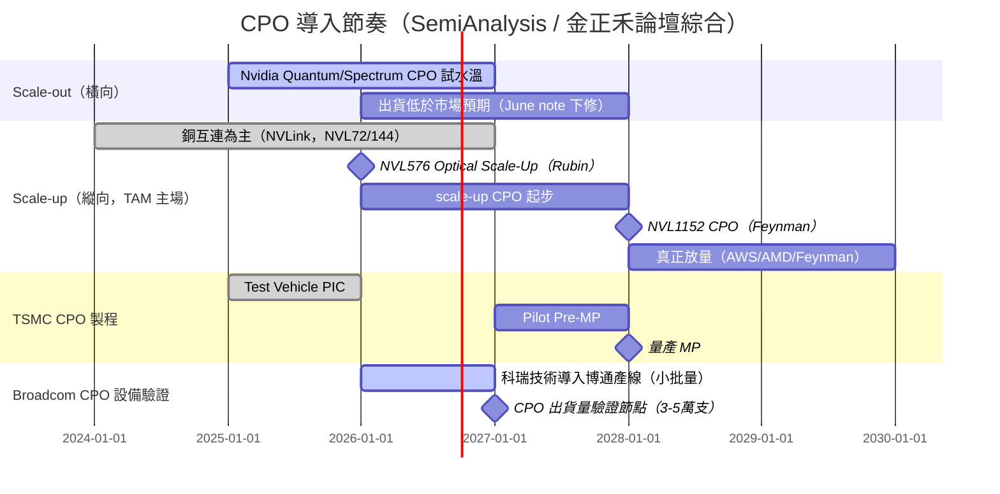

# 技術_CPO

## 定義

CPO（Co-Packaged Optics，共封裝光學）是把「光引擎（Optical Engine, OE）」直接封裝在 XPU 或交換器 ASIC 旁邊的互連技術。傳統可插拔光模組（transceiver）插在前面板的 cage 上，距離 ASIC 約 15–30 cm，訊號得先用長距（LR）SerDes 拉過去、再經模組內的 DSP 還原與轉光；CPO 把光引擎移到 ASIC 旁，省掉 DSP、改用低功耗短距 SerDes，較 DSP 可插拔光模組可省電 50% 以上（業界目標上看 80%）。

CPO 在 **scale-out（後端橫向擴展）** 提供選項，但真正的主戰場是 **scale-up（縱向擴展，GPU 對 GPU 高頻寬低延遲互連）**——銅互連的觸及距離只有約 2 公尺，限制了單一 scale-up 域的「world size」，光互連是突破機櫃邊界把 world size 做大的關鍵。SemiAnalysis 判斷 CPO 的 TAM 會由 scale-up 主導。

**NPO 是 CPO 前的風險折衷，而不是 CPO 的同義詞。**NPO（Near-Packaged Optics）把 OE 放在 ASIC 封裝旁、但保留獨立基板與可插拔／socketed 介面；高速電通道約 150 mm，介於前面板可插拔模組與 CPO 的 <10 mm 通道之間。[[報告_SemiAnalysis_NPO光互連接棒_20260713]] 認為，它可在保留較低功耗、供應商彈性與部分可維修性的同時，避開 CPO 的 attach yield 與供應商鎖定風險；這是研究機構情境推演，並非各平台已定案的採用承諾。

## Rubin Ultra NVL576 的 NPO／CPO 分流

[[報告_SemiAnalysis_RubinUltraNVL576_20260810]] 將 NVL576 expandable Portia switch tray 描述為 NPO 與 CPO 並行開發：兩者都把每架 NVLink Switch ASIC 增至 72 顆的 scale-up 架構，但 NPO 模組可 socket 到 ASIC 旁的 PCB，CPO 則每顆 switch ASIC 配置 4 個不可更換的 optical engine。SemiAnalysis 判斷 NPO 因 form factor 成熟度較高，可能先於 CPO 成為上市版本；這是研究模型，Rubin Ultra 規格仍可能變動。

![[報告_SemiAnalysis_Rubin_Ultra_NVL576_Flash_Overview_20260810_004.png]]
*圖（SemiAnalysis／NVIDIA，2026-08-10）：Portia expandable switch 的 NPO／CPO 配置差異；NPO 保留 socketed 模組，CPO 將 optical engine 固定於 switch ASIC 周邊。*

## 圖解

![[報告_Semianalysis_CPO_20260102_001.png]]
*圖（SemiAnalysis，2026-01）：CPO 概念——光引擎緊鄰 XPU/ASIC，省去 DSP 與長距 SerDes，較 DSP 光模組大幅降低每位元能耗。*

![[報告_Semianalysis_CPO_20260102_008.png]]
*圖（SemiAnalysis，2026-01）：CPO 系統內 PIC（光子）／EIC（電子）與光纖耦合的封裝關係示意。*

![[報告_金正禾論壇_CPO光電共封裝_20260325_004.png]]
*圖（金正禾論壇，2026-03-25）：NVIDIA GTC 2026 完整路線圖——Blackwell（NVL72 銅）→ Rubin（2026，NVL72/NVL576/NVL144）→ Feynman（2028，NVLink 8 CPO、Spectrum7 204T CPO、NVL1152 CPO 光學 Scale-Up）。*

![[報告_元大_光通訊產業_20260723_original_004.png]]
*圖（元大投顧，2026-07-23）：可插拔、LPO/LRO 與 CPO 的位置比較；CPO 將 OE 靠近 ASIC，ELS 留在板緣，降低高速電通道上的介面損耗。*

![[報告_SemiAnalysis_NPO光互連接棒_20260713_original_003.png]]
*圖（SemiAnalysis，2026-07-13）：NPO 把可 socket 的光引擎放在 ASIC 鄰近的高性能基板上；約 150 mm 電通道是其相對 CPO 的功耗、訊號完整性與可維修性取捨。*

## 技術原理

**互連演進**：銅 →（co-packaged copper）→ DSP 光模組 → LPO（線性可插拔，去 DSP）→ CPO。每一步都在拿掉訊號鏈上的耗電元件。

![[報告_Semianalysis_CPO_20260102_014.png]]
*圖（SemiAnalysis，2026-01）：從 DSP-based transceiver 演進到 LPO 再到 CPO 的訊號鏈簡化。*

**封裝整合：TSMC COUPE（Compact Universal Photonic Engine）成為主流選項。** PIC（含調變器、波導、光偵測器）用成熟的 N65 製程（光元件不靠微縮、大尺寸反而更好）；EIC（驅動器、TIA、控制邏輯）用先進的 N7。兩顆 die 以 TSMC SoIC 無凸塊混合鍵合，在 iso-power 下較凸塊整合提供逾 23 倍的頻寬密度。採 COUPE 等於綁定 TSMC 製造的 PIC（TSMC 不替其他晶圓廠的 SiPho 晶圓做封裝）。Nvidia、Broadcom、Ayar Labs 等都把 COUPE 納入路線。

**調變器三選一（MZM／MRM／EAM）**：
- **MRM（微環）**：體積小、可直接做波長多工，但對溫度極敏感（約 70–90 pm/°C，2°C 漂移就可能讓共振失效），需加熱器穩定。Nvidia/TSMC 已能量產 200G MRM。
- **MZM（馬赫–曾德）**：最易實作、熱穩定佳，但體積大、需高電壓擺幅、耗電。
- **EAM（電吸收）**：體積小、熱容忍度高（可容忍瞬間 35°C），是 Celestial AI 的差異化選擇（GeSi EAM，C-band），但較難進入開放 chiplet 生態。

**AI 互連三層架構（Scale-Up / Scale-Out / Scale-Across）**：

| 維度 | Scale-Up（機架內）| Scale-Out（叢集內）| Scale-Across（跨叢集）|
|------|-----------------|-------------------|----------------------|
| 傳輸距離 | 2m–5m | 500m–2km | >100km |
| 現行方案 | 銅纜（NVLink）| 光（PAM）| 光（Coherent）|
| 連接 xPU 數 | >72 | >500 | >10,000 |
| 頻寬/xPU | ~7,200 Gbps | ~800 Gbps | ~100 Gbps |
| 延遲 | ~100 nS | ~µS | ~mS |

**CPO 的主戰場在 Scale-Up**：Scale-Out CPO 已起步（Nvidia Quantum-X/Spectrum-X），但 TAM 主要由 Scale-Up 主導——銅纜（NVLink）在 2m 限制內難以支撐 NVL144→NVL576→NVL1152 的擴展需求，光互連是突破機架邊界的必要路徑（Yole 預測 2024–2030 Scale-Up OE 出貨量遠超 Scale-Out）。

**NVIDIA Scale-Up 光學 Roadmap**：
- **Rubin 世代（2026）**：NVL576 採用 **Optical Scale-Up**（ETL256），NVL72/NVL144 仍用銅
- **Feynman 世代（2028）**：NVLink 8 CPO、Spectrum7 204T CPO，NVL1152 採 **CPO-based Optical Scale-Up**

**NV「Optics on Interposer」架構下的光學元件計算**：

| 單位 | CPO OE | FAU | ELS |
|------|--------|-----|-----|
| 每 GPU（Scale-Up）| 2 | 2 | 0.5（4 個 OE 共享 1 個 ELS）|
| 每 Tray（4 GPU）| 8 | 8 | 2 |

全機架 Full CPO（Scale-Up + Scale-Out）情境：

| 情境 | 每機架 OE | 每機架 FAU | 每機架 ELS |
|------|----------|-----------|-----------|
| A：純 Scale-Out CPO | 72 | 72 | 18 |
| B：Full CPO（Scale-Up + Scale-Out）| **360** | **360** | **90** |

→ 啟動 Scale-Up CPO 後光學元件需求 **5×**（72→360 OE/架）；ELS 需求同步 5×（18→90/架）。

**外部雷射源（ELS）**：CPO 需較高功率的 CW DFB 雷射。Nvidia Q3450 用 18 個 ELS 模組、每模組 8 顆 CW DFB chip，每顆 ~350mW。**ELS 功率門檻（2026 現況）**：最低需 100mW @1310nm；中系廠商在此規格下勉強達標。若升至 200mW/DFB、400mW/DFB，或引入 CWDM 多波長（1270/1290/1310/1330/1350nm），中系廠商在強度與多波長均勻性上暫時無法滿足。供應商：[[LITE.US(lumentum)]] 為 Nvidia 初批 CPO ELS 獨家供應商；[[COHR.US(coherent)]] 預計 2026H2 進入成為第二供應商；中國（Yuanjie、Shijia）因技術門檻暫不在短期供應鏈。詳見 [[技術_InP磷化銦]]。

**內置與外置 CW 的功率預算**：[[memo_EML_InP_CW_ELS_NPO_CPO專家觀點_日期不詳]] 認為，外置 ELS 經保偏光纖傳輸後耦合效率約 60%～70%，因此需使用約 350／400mW 高功率 CW；內置光源透過透鏡與隔離器直接耦合 PIC，效率可達 90% 以上，且可把 200mW 額定元件降額運行在約 120～150mW以改善溫漂與壽命。這些效率與功率數字為匿名訪談 estimate，須用實際平台 link budget 驗證。

| 架構 | 光源位置 | 訪談中的典型配置 | 維修／可靠度取捨 |
|------|----------|------------------|------------------|
| 外置 ELS | 光引擎外，經 PMF 導光 | 350／400mW CW；3.2T ELS 可對應兩個光引擎 | 光源故障可直接更換，但 PMF、連接器與較低耦合效率提高成本與功率 |
| 內置 NPO CW | ASIC 鄰近光引擎內 | 3.2T 光引擎可用 4×200mW CW；單顆約對應 800G | 省 PMF、成本較低；需降額與功率冗餘降低高溫失效率 |

**光纖耦合（FAU）**：FAU 測試仍高度依賴人工，每個 FAU 測試約 10–15 分鐘（Corning 估算 Spectrum X 系統）。每個 1.6T OE 有 20 根光纖（8 Tx + 8 Rx + 4 ELS），全機架 X800-Q3450 共 1,440 根光纖。FAU 廠商分工：TFC Optical（300394.SH，中國）主供 Nvidia X800-Q3450 FAU；Senko（9069.JP，日本）主供 Nvidia Spectrum X CPO + Broadcom Tomahawk6；[[3363_上詮（櫃）]]（FOCI）聚焦 Nvidia Scale-Up CPO FAU。

**光纖耦合（FAU）**：邊緣耦合（edge coupling）vs 光柵耦合（grating coupling，GC）。GC 利於 2D 密度與晶圓級測試，TSMC COUPE 偏好 GC + MRM。

![[20260522_矽光子發展趨勢：技術演進與機會_015.png]]
*圖（知識力科技，2026-05）：TSMC COUPE 光柵耦合（GC）架構——FAU 從上方對準 PIC 的 GC 接口，EIC 堆疊於 PIC 之上（microbump 互連），整體封裝在 Si Carrier 上。*

![[20260522_矽光子發展趨勢：技術演進與機會_016.png]]
*圖（知識力科技，2026-05）：EIC-on-PIC 3D 堆疊示意——EIC 在上層透過 microbump 連接 PIC（下層），PIC 底部再透過 BGA ball 連接 Host PCB，是 TSMC COUPE 的 SoIC-based 整合架構。*

![[報告_SemiAnalysis_CPO_Part5_001.png]]
*圖（SemiAnalysis CPO Book，2026-01）：Nvidia Silicon Photonic Engine 實物——200 Gb/s MRM、1.6 Tb/s、3.5X 省電；右側放大圖顯示 OE、Fiber Connector（FAU）與 Optical Fibers 的整合關係。*

**頻寬擴展的多重向量**：更多光纖、WDM（波長多工）、更高階調變、提高 baud rate——這是 CPO 相對銅（只能靠更快 SerDes 硬拚）的結構優勢。

## 關鍵參數 / 判斷指標

| 指標 | 意義 | 觀察重點 |
|------|------|----------|
| 光引擎 attach 良率 | 每顆 OE 耦合後須完好（焊接基板無返工路徑） | 目前約 95%；量產經濟需 ~99.5%；32 顆 COUPE 下 95%^32 ≈ 1% 系統良率，99.5% 才達 ~85% |
| 插入損耗（insertion loss） | 吃掉光通道預算 | Spectrum 6 CPO 曾測得 4.5 dB，吃光整個通道預算 |
| 每 lane 速率 | 200G PAM4 為現階段主流 | MRM 能否穩定跑 200G |
| 每位元能耗（pJ/bit） | CPO 賣點 | 較 DSP 光模組省 >50%，目標 80% |
| 調變器熱穩定性 | 直接影響可靠度 | MRM 敏感、EAM 容忍度高 |
| NPO 電通道與 socket 可靠度 | NPO 以約 150 mm 高性能基板通道換取可拆換 OE | 能否在 200G/lane PAM4 下維持訊號完整性，決定它是否可作為 CPO 的過渡方案 |
| 外置 ELS 光路效率 | 決定 CW 額定功率、熱與供給需求 | 追蹤 PMF／FAU／連接器總插損；不能只用晶片 mW 規格比較平台效率 |
| 內置 CW 降額幅度 | 壽命、溫漂與故障率管理 | 額定 200mW 若僅運行 120～150mW，冗餘有助可靠度但提高單位頻寬的晶片用量 |

## 技術瓶頸 / 風險

- **系統級整合良率是主要關卡**：在 32 顆 COUPE 規模下，attach 良率複利效應使系統良率極低，且焊接式 OE 無返工路徑。
- **可靠度與可維修性**：Google 因可靠度疑慮短期不採 CPO。
- **時程下修風險**（見下方衝突 callout）。
- **NPO 並非零風險替代**：雖可降低 CPO attach yield 與鎖定風險，仍須驗證 socket、較長電通道、OE 量產與現場維修流程；未必適合每一個 scale-up 或 scale-out 拓撲。

> [!warning] 資訊衝突：CPO 量產時程（觀點演進）
> - [[報告_Semianalysis_CPO_20260102]]（報告日：2026-01-02）：結構性看多，scale-up CPO 自 2026 起放量（AWS/AMD/Feynman），scale-out 由 Nvidia/Broadcom 2025–2026 帶動；Celestial AI 在 Marvell 旗下估 2028 年底達 $1B run-rate。
> - [[報告_Semianalysis_CPOand800VDC_20260609]]（報告日：2026-06-09）：**重設預期**——「2027 CPO 預期太積極」，將下修 2026/2027 的 scale-out CPO 出貨；Spectrum 6 CPO（SN810/SN800）滑期逾兩季、4.5 dB 插損問題未解；市場估 2027 年產 7–10 萬台以上 scale-out CPO 交換器「過於積極」；scale-up CPO 仍自 2026 爬升，但 2028 的跳升「看起來樂觀」。
> - [[memo_日月光_CoWoS_CPO_專家會議_20260520]]（日月光矽品/環旭電子封測商視角，2026-05）：TSMC CPO OE 良率 75%（5月），從 50-60%（2025 Q4）爬升；量產門檻 90-95% 未達；外包給矽品時程 7 月→9 月→**11 月**持續延遲；2026 全年 CPO 交換機出貨估 **約 1.5 萬台**（基於 70% 良率推算）。
> - 狀態：同機構（作者群含 Nishball）半年後對自身積極時間表的下修，較新且含實測數字者可信度較高。
> - [[報告_MS_AI供應鏈_20260810]]（2026-08-10）：Kyber blade rack 因 PCB 與散熱挑戰延後、尚無明確時程；首代 Rubin Ultra 可能延用 Oberon NVL72，但 MS 仍認為跨機櫃 CPO 是 NVIDIA 偏好方向。這進一步支持「短期機架延後、中長期光互連不變」的分流判斷。
> - [[報告_SemiAnalysis_NPO光互連接棒_20260713]]（2026-07-13）：將 NPO／Pluggable CPO 視為較低風險的先行路徑，並以 AWS Trainium3、華為與 Meta 多路徑探索為例；文中關於 NVIDIA Rubin Ultra、特定客戶與供應商配置均屬研究機構模型，須待設計定案、驗證與量產資料交叉確認。

### TSMC CPO 良率軌跡（2026-05 封測商管道）

> 來源：[[memo_日月光_CoWoS_CPO_專家會議_20260520]]（信心：中高，直接接觸 TSMC 外包團隊）

| 時間點 | TSMC PIC OE 全流程良率 |
|--------|---------------------|
| 2025 Q4（11-12 月）| 50–60% |
| 2026 年 4 月 | ~70% |
| 2026 年 5 月（目前）| ~75%（未突破 80%）|
| 量產門檻 | **90–95%**（尚未達到）|

**良率損耗主要環節**：
1. **PIC + EIC 晶圓鍵合**（TSMC 執行，不外包）：~10% 損耗
2. **FAU 貼合 + 光耦合校準**：信號完整性/斷層問題
3. **Burn-in + FT + SLT 多重測試**：累積良率損耗

→ 兩環節良率相乘後，整體良率約剩 **70-75%**。

**TSMC PIC 月產能規劃**：

| 時間點 | TSMC PIC 月投入量 |
|--------|-----------------|
| 2026 年 5 月（目前）| ~2,000 片/月 |
| 2026 Q3-Q4 目標 | 5,000–7,000 片/月 |
| 2027 Q1 目標 | **10,000 片/月** |
| 2027 年底目標 | ~20,000 片/月 |

> 注意：上述為「投入量（input）」而非產出量；實際有效產出需乘以良率。良率若維持 75%，相當於 25% 的晶圓成本損耗，台積電需多增 ~25% 設備投資（約 US$40-50億）。

**2026 年 TSMC CPO 交付時程演變**：

| 時間點 | 計畫交付給外包商（矽品） |
|--------|----------------------|
| 原計畫（2025 設定）| 2026 年 7 月 |
| 2026 年 3 月調整 | 2026 年 9 月 |
| 最新（2026 年 5 月）| **2026 年 11 月** |

初期外包模式：overflow 形式，約 10-20% 比例，每月約 500-600 片 PIC 晶圓。

**2026 年全年 CPO 交換機出貨估算**：

以 70% 良率 × TSMC PIC 產能計算：
- PIC 每片切出 ~500 顆 OE；一台 102.4T 交換機需 **64 顆 OE**
- 估計 2026 全年 CPO 交換機：**約 15,000 台**
- 2027 Q1 若良率達標（1 萬片/月 × 500 顆 × 12 個月 / 64 OE/台）：理論 **~100 萬台/年**（但良率達標高度不確定）

### AMD CPO 進度（矽品視角）

- AMD CPO 目標導入：**MI6 系列**（MI500 或最遲 MI600），預計量產 **2028 H2**
- AMD PIC 同時與 TSMC 及 GlobalFoundries 合作
- 矽品為 AMD 建設 CPO 實驗線（EIC + PIC 後段 + 測試），使用 Teradyne V93K + FormFactor 探針卡進行晶圓雙面測試
- AMD + 矽品 CPO 第一批 sample：預計 **2027 Q1** 在實驗線產出

## 關鍵廠商

| 環節 | 廠商 | 角色 |
|------|------|------|
| 交換器 / GPU 平台 | [[NVDA.US(nvidia)]] | Quantum-X / Spectrum-X Photonics；首批 COUPE 產品 |
| 交換器 ASIC | [[AVGO.US(broadcom)]] | Humboldt→Bailly→Davisson；CPO 老將，未來轉 COUPE |
| 客製 ASIC / 光互連 | [[MRVL.US(marvell)]] | 收購 Celestial AI（EAM），目標 scale-up optics **#1 merchant**（MS bus tour，2026-06-15）；全棧佈局 DCI/scale-out/scale-up/optics/custom silicon |
| 封裝整合平台 | [[2330_台積電（市）]] | COUPE（PIC N65 + EIC N7，SoIC 混合鍵合） |
| CPO 精密散熱 | [[3017_奇鋐（市）]] | 光引擎溫控與液冷方案驗證中；中信估 2027 年起隨 CPO 新產品逐步貢獻 |
| 雷射 / ELS | [[LITE.US(lumentum)]] | Nvidia 首批 CPO ELS 預期主供應商 |
| FAU / 光纖被動件 | [[3363_上詮（櫃）]] | 光纖被動元件、FAU 相關 |
| CPO Insertion 3/4 ATE + 光學對準 | [[2360_致茂（市）]] | Insertion 1 驗證中、Insertion 3 ATE+光學對準切入確認、Insertion 4 FT/SLT 核心強項 |
| CPO Insertion 1-3 探針台 | [[6223_旺矽（櫃）]] | Insertion 1 驗證中、Insertion 2 雙面探針台認證中、Insertion 3 確認 |
| CPO Insertion 3 光通量檢測 | [[6710_汎銓（市）]] | IR-OM 光損偵測裝置，漏光偵測與精準定位 |
| CPO Insertion 2-3 光耦合設備 | [[6187_萬潤（市）]] | FAU 貼合 + 光耦合機台；UPH 聲稱優於主競 ficonTEC；3Q26 首現 CPO 業績（SRS 期中，信心：中）|
| CPO 自動光纖耦合設備（主供）| ficonTEC（飛控泰克，德國未上市）| 博通傳統首供；$300K+/台（SemiAnalysis）；5 nm 精度；CPO 耦合良率 80–90%；實質壟斷 |
| FAU 光纖耦合設備（台灣第二入口）| [[6187_萬潤（市）]]（All Ring Tech）| 2026 開始貢獻耦合設備營收，約 10% 人力投入此領域（SemiAnalysis CPO Book Part 5）|
| FAU 製造（主供，Nvidia X800-Q3450）| TFC Optical（300394.SH，中國，未建頁）| 與 Nvidia 合作設計 CPO 逾 3 年，X800-Q3450 主要 FAU 供應商；亦供 ELS 模組 |
| FAU 製造（Spectrum X / Broadcom）| Senko（9069.JP，日本，未建頁）| SEAT 可拆 FAU 平台；與 GFS 合作邊緣耦合；Spectrum X + Broadcom Tomahawk6 主要 FAU 供應商 |
| FAU 製造（Nvidia Scale-Up）| [[3363_上詮（櫃）]]（FOCI）| 聚焦 Nvidia Scale-Up CPO FAU；FAU 被動元件；下游組裝 HIMX 提供的光學塊 |
| NIL 微光學（CPO FAU 光學塊）| HIMX.US(himax)（HIMX US，2379.TW，未建頁）| NIL 奈米壓印製程生產 FAU 光學塊：22-lens 微透鏡陣列 + 45° 稜鏡 + V-groove 底板；FOCI 下游組裝；TSMC COUPE 供應鏈候選；2026 小量出貨，2027-28 放量（Citrini，2026-03）|
| MOCVD 設備（III-V / InP 磊晶）| AIXTRON（AIXA.GR，德國，未建頁）| MOCVD 70-90% 市場份額；光子學訂單 2026E >+100% YoY（FY26 管理層指引）；Lumentum/Coherent/Nokia InP 擴產必備設備；GaN 800V 資料中心電源次催化（Citrini，2026-03）|
| Shuffle Box 主供 | T&S Communications（300570.SH，中國，未建頁）| CPO Shuffle Box 市場第一；500 芯版 $1,600；Corning 設計後轉包 T&S 生產 |
| OSAT（Nvidia Rubin-rack CPO）| [[3711_日月光投控（市）]] | Nvidia Rubin-rack CPO 核心 OSAT，異質整合封裝 |
| OSAT（Broadcom CPO，緊密合作）| 訊芯-KY（6451.TW，未建頁）| 與博通 CPO 供應鏈緊密合作（SemiAnalysis CPO Book Part 5）|
| CPO 組裝（Nvidia + 博通候選）| Fabrinet（SFN.US，未建頁）| 傳統 Nvidia 光模組模組商；積極建立 OE 封裝/測試能力；博通 CPO 系統組裝候選 |
| CPO 自動光纖耦合設備（第二供）| 科瑞技術（中國，未建頁）| 2026-01 小批量導入博通產線；良率約 60%（門檻 80%）；博通：降成本 + 供應鏈安全 |
 | CPO 耦合設備（矽光方向）| ASMPT（新加坡上市，未建頁）| 技術接近 ficonTEC，主聚焦矽光，尚未切入 CPO |
| 矽光子晶圓代工（光模組）| Tower Semiconductor（TSEM US，未建頁）| end-2026 矽光子月產能目標 **9,500 片/月**，主力客戶含 旭創科技 等光模組廠 |

CPO 純玩家（本次未建頁）：Ayar Labs（TeraPHY，UCIe 光 retimer chiplet）、Nubis（2025/10 被 Ciena 收購，MZM、2D 光纖陣列）、Celestial AI（被 Marvell 收購，EAM、Photonic Fabric）、Lightmatter（Passage M1000 光中介層）、Xscape Photonics（ChromX 可程式雷射）、Ranovus（Odin OE）、Scintil（LEAF Light）。整合測試端（未建頁）：GlobalFoundries、Tower、ASE/SPIL、[[AMKR.US(amkor)]]、Fabrinet、Keysight、Teradyne。

## CPO 光測試流程（Insertion 1-4）

CPO 測試隨製程展開，分為四個插入測試階段（Insertion 1-4），由終端驗證擴展嵌入全製造流程。光測試設備需求隨此轉型大幅增加（CPO ATE 320 萬 USD + 探針台 320 萬 USD = 系統合計 > 640 萬 USD，遠高於傳統電測試 5-300 萬 USD）。

![[光測試期中產業報告_008.png]]
*圖（SRS，2026）：CPO Insertion 1-4 測試全流程——從 PIC 晶圓級到 ASIC+OE 系統封裝後 FT/SLT，測試嵌入製造每個關鍵節點。*

| 階段 | 製程位置 | 測試目標 | 主要設備廠 | 台廠切入 |
|------|---------|---------|----------|---------|
| **Insertion 1** | PIC 鍵合前，晶圓級 | 基礎光學探測，篩檢裸粒性能 | Teradyne ATE、ficonTEC 探針台、Keysight | 致茂（ATE，驗證中）、旺矽（探針台，驗證中）|
| **Insertion 2** | EIC+PIC 鍵合後、切割前 | 光電轉換效率 + 雙面光電同測 | Teradyne/Advantest ATE、ficonTEC 探針台 | 旺矽（雙面探針台，認證中）|
| **Insertion 3** | 晶圓切割後、系統封裝前，Die Level | OE + FAU 整合功能驗證 | ATE + 光學對準 + 探針台 + 光通量檢測 | 致茂（ATE + 光學對準）、旺矽（探針台）、汎銓（光通量檢測）、[[6187_萬潤（市）]]（光耦合設備）|
| **Insertion 4** | ASIC + OE 系統封裝後 FT/SLT | 整機光電相容性 + 熱穩定性驗證 | ATE + Handler（3,000W 功耗）| 致茂（FT/SLT，核心強項）|

### Hybrid Bonding 良率與成本壓力

![[光測試期中產業報告_007.png]]
*圖（SRS，2026）：COUPE 異質整合難度大幅提升——Hybrid bonding 初期良率僅 35%，推動光測試成為良率控管關鍵（報廢成本每顆 OE 額外增加約 32 美元，佔系統 BOM 約 50%）。*

> [!warning] 重要數字（SRS 研究，信心：中）
> - Hybrid bonding 初期良率：~35%（量產門檻估 >80%）
> - 35% 良率假設下，每顆光學引擎額外增加約 **32 美元成本**（良品分攤報廢）
> - 單一良率損失佔系統 BOM 約 **50%**
> - 2026 年 OE 需求：121.6 萬顆；2027 年：783.9 萬顆（年增 **6.4 倍**）
> - CPO 2030 年滲透率目標：**35%**

### Quantum x800 Q3450 BOM

| 元件 | 數量 | 總價（USD）| 佔比 |
|------|------|-----------|------|
| FAU | 72 | $2,880 | 4% |
| 1.6T 光引擎（OE）| 72 | $4,680 | 7% |
| Substrate Interposer | 24 | $22,320 | 33% |
| Switch Chip | 4 | $3,200 | 5% |
| ELS | 18 | $6,300 | 9% |
| MPO 連接器、跳線 | 144 | $5,760 | 9% |
| Shuffle Box | 1 | $3,000 | 4% |
| Others | — | $18,800 | 29% |
| **合計** | — | **$66,940** | 100% |

（光引擎 OE + FAU 合計僅佔 11%，系統成本由運算晶片與先進封裝主導）

SemiAnalysis AI Networking Model 估算（2026-01）：
- BOM 合計 ~$70,640；毛利率 ~60%；售價 $176,600；含 3 年服務 $204,856
- 每顆 1.6T OE 含 FAU（20 根光纖：8 Tx + 8 Rx + 4 ELS）；未來 3.2T OE 每顆 ~$1,000（含 FAU）
- 初批 OE 總成本 $35–40K（3.2T OE 版本）

## CPO 設備生態

CPO 光纖耦合是整條光模塊產線台數最多、精度要求最高的環節（台數比例：1 台共晶 + 3 台固晶 + **16–20 台耦合**），貼片、耦合、測試合計佔整線價值約 90%。

### 耦合精度決定供給格局

| 設備類別 | 耦合精度 | 技術難度 | 國產化狀況 |
|---------|---------|---------|----------|
| 普通光模塊耦合 | 3–5 µm | 基準 | 較高（普莱信、猎奇等，紅海競爭）|
| **CPO 耦合** | **< 0.3 µm** | **約 10×** | **極低，ficonTEC 實質壟斷** |

### 設備投資規模估算

2026 年光模塊新增設備投資約 200–300 億元（基於 800G 出貨 6,000 萬支 + 1.6T 出貨 2,000 萬支）。

**設備需求三重乘數**（彈性遠大於出貨量）：
1. 新增產能（量的增加）
2. 精度升級→台數增加（1.6T 耦合時間 5–6 min vs 800G 約 4 min，同等出貨需多 25–50% 台數）
3. 單台設備價值量提升（CPO 耦合機 ~$500 萬 USD）

> [!info] 追蹤催化劑
> **2027 Broadcom CPO 出貨量 3–5 萬支**：是市場判斷 CPO 設備需求能否規模化的關鍵驗證節點。科瑞技術良率能否突破 80% 是觀察國產替代進展的前哨指標。

## 技術演進時程

## NPO vs CPO 過渡期（2026–2028）

NPO（Near-Package Optics）是 2026–2027 年市場的主流過渡方案：

| 比較項目 | NPO | CPO |
|---------|-----|-----|
 | 可維護性 | 較好（靠近晶片但仍可換）| 差（晶圓廠封裝後不可換）|
| 功耗降低 | 中等 | CPO 可低至 14–15 W（vs NPO 降幅 30%+）|
| 量產節點 | 2026–2027 主流 | 2028 年市場爆發預期 |
| 2026 CPO 價格 | — | 比 NPO 高 1.5–2 倍 |

**NPO 市場規模預測（定錨，2026-07-22）**：

| 年份 | NPO 出貨量 |
|------|-----------|
| 2027E | **1,000 萬支** |
| 2028E | **2,000 萬支** |
| 2029E | **4,000 萬支** |

NPO 成長更確定性高於 CPO：出貨量年複合增速接近 100%，且良率/維護性壓力遠低於 CPO。

**廣發月會更新（2026-08-14）**：另一組 channel check 將 2027／2028 全產業 NPO 需求估為 1,000 萬支以上／約 3,700 萬支，對應 OE 約 1,100 萬／4,000 萬顆；並預期 2027H2 Rubin Ultra、2028H2 Feynman 的 scale-up 先以 NPO 為主。客戶規格口徑為 NVIDIA 3.2T、AWS 6.4T，兩者自 2027 年底開始部署。

> [!warning] 資訊衝突：NPO 數量與客戶規格
> - [[報告_先進封裝技術發展方向_20260722]]（2026-07-22）：2028E NPO 2,000 萬支。
> - [[memo_廣發海外電子通信月度電話會議_20260814]]（2026-08-14）：2028E NPO 約 3,700 萬支、OE 約 4,000 萬顆；AWS 採 6.4T、NVIDIA 採 3.2T。
> - 既有產業訪談另稱 Google／AWS 有 3.2T 採購規畫。不同來源可能混用 NPO 模組、OE 顆數與專案世代，暫不合併成單一基準；追蹤時應分清「模組數、OE 數、lane 速率與客戶平台」。

> [!warning] CSP 對 CPO 態度不激進
> 主要 CSP（Google、AWS、Microsoft）對 CPO 採較保守態度，要求故障率極低後才大規模部署。2026-2027 年 CPO 主要需求來自 **NVIDIA NeoCloud 客戶**（非 Hyperscaler 自建），而非大型 CSP 主動推動。這解釋了 CPO 出貨量集中在小規模 NeoCloud 部署而非 Hyperscaler 大規模採購的現象。
>
> （來源：[[報告_先進封裝技術發展方向_20260722]]，定錨，2026-07-22）

**NVIDIA Spectrum X CPO 進展（2026Q2 調研）**：
- 計劃 2026 年 Q4 啟動量產流程，但仍面臨 DFAU 良率問題和外置光源燒毀端面問題
- Spectrum X 單台售價 ~10 萬 USD，較電交換機高 20–30%（差距 ≤50%）
 - Spectrum X：可插拔式 FAU，單個 OE 對應 36 芯；1 台需 16 個外置光源（每個對應兩個 3.2T 光通路），使用 400 mW 雷射器
- Quantum X：固定式 FAU，對應 18 芯；2025 計劃交付 2,000–3,000 台但至今未交付

**1.6T CPO 市場規模**（2026 年）：
- 全球 1.6T 光模塊出貨約 1,400–2,000 萬只
- 其中 CPO 滲透率從 10–15% 提升至 20%+，出貨量約 **300–400 萬只**

**Google CPO + OCS 組合採購計劃**（2026–2028）：

| 年份 | Google OCS 需求 | 備註 |
|------|---------------|------|
| 2026 | 2.5–3 萬台 | — |
| 2027 | 4–5 萬台 | — |
| 2028 | 8–10 萬台 | — |
| 合計 | **20 萬台**（3 年）| 2025-11 TPU v7 後德州 $400 億投資推動 |

 Google CPO 態度：會採用但需等故障率極低後才大規模部署；每年給 Lumentum 光晶片 forecast 激進（每年翻倍）。

**3.2T NPO 訂單**：
- 谷歌計劃 2027 H2 採購 3.2T NPO，2027–2028 總需求 1,200 萬只
- AWS 配合 Trainium 4，2027 年 5 月起採購，2027–2028 總需求 1,000 萬只
- 3.2T NPO 光引擎單價 ~1,000 USD；配套 ELS 光源（每兩個光引擎一個）~430 USD

## 應用場景

- AI 叢集後端 scale-out 網路（Nvidia Quantum-X800 InfiniBand、Spectrum-X 乙太網）
- AI scale-up 縱向互連（取代/補足 NVLink 銅，擴大 world size）
- 客製 ASIC（hyperscaler）內部 scale-up fabric
- OCS 全光交換機（Google TPU Ironwood + 2026–2028 快速部署）

## 相關技術

- [[技術_800VDC供電架構]]（同屬 2026-06 多空重設的兩大題材）
- [[技術_HVLP銅箔]]（CPO/cableless 延後也影響 PCB 材料節奏）
- [[技術_ABF載板]]、[[技術_玻璃基板]]（先進封裝/基板同源材料鏈）

## 供應鏈

→ [[供應鏈_CPO]]

## 相關技術（補充）

- [[技術_InP磷化銦]]（CPO ELS/雷射光源的核心材料；InP vs SiPh 競合）
- [[技術_TFLN]]（TFLN 調製器在 1.6T CPO 中的角色）
- [[技術_FAU]]（CPO FAU/DFAU 規格與供需）
 - [[技術_光電芯片]]（CPO 光引擎中 PD/Driver/TIA 配置）
- [[技術_MPO]]（CPO 交換機中板 32 芯 MPO 連接）

## OCI 200G MSA（規則 #14 — 關係更新）

2026-03-11，**[[META.US(meta)]] + [[AVGO.US(broadcom)]] + [[AMD.US(amd)]]** 三方聯合發布 OCI（Optical Compute Interconnect）200G v1.0 MSA，以開放標準對抗 NVIDIA NVLink 封閉生態：

| 技術押注 | 規格 | 關鍵廠商 |
|---------|------|---------|
| ELSFP 外部雷射 | CW DFB，SMSR 30 dB，RIN −144 dB/Hz | [[LITE.US(lumentum)]]（主供候選）|
| MRR DWDM | 4λ 多路（需熱鎖定，[[技術_矽光子（SiPh）]]）| TSMC COUPE |
| 雙向單纖 | Group A 1308–1315 nm / Group B 1328–1335 nm | 省光纖路由 |
| NRZ×4λ | 212.5 Gbps（合計）| 低複雜度調變 |

速率梯：200G → 400G → 800G → 1.6T。詳見 [[技術_OCI]]。

## 1.6T 出貨節奏（規則 #14 — 生產節奏，W26 2026 更新）

| 指標 | 值 |
|------|----| 
| 2026 全球 1.6T 光模塊出貨 | **~850K 支**（+280% YoY）|
| GB300 NVL72 機櫃 2026 年出貨 | **~55K 台**（+129% YoY）|

## InP 基板供應鏈更新（規則 #14 — 供應鏈）

| 方向 | 狀態 |
|------|------|
| 中國 2026 首批 InP 基板出口 | 恢復 InP 基板受管控後的首批出口 |
| [[COHR.US(coherent)]] 德州 InP 廠 | 6 吋 InP 廠快速擴產，NVIDIA $20 億入股鎖定產能 |
| 台灣（聯亞光電等 InP 磊晶）| 布局 TSMC COUPE 上游，與 [[4971_IET-KY（市）]] 並列 |

## 市場規模更新（Daiwa，2026-07-03）

大和在「光通 AIDC 互連大報告」中提出：

| 指標 | 預測 |
|------|------|
| 2027–2028 全球 CPO switch 需求 | **$12–24B** |
| 對應高功率 CW 雷射需求 | $432–864M |
| 對應 FAU（光纖陣列單元）需求 | $720–1,440M |

**大和觀點**：CPO 製造良率（良率問題是阻礙量產的最大挑戰）與**昂貴的維護成本**仍是主因推遲採用。短期 1–2 年，**NPO（Near-Package Optics）**仍是商用上可行的首選方案——NPO 供應鏈已成熟，CPO 等到 2027–2028E 才開始放量。

### TrendForce 預測（CPO 在光模組滲透率，2026-03）

![[20260522_矽光子發展趨勢：技術演進與機會_005.png]]
*圖（TrendForce，2026-03，來源：知識力科技簡報）：CPO 在 800G+1.6T+3.2T 光模組出貨中的滲透率；真正放量在 2028–2030，與 Rubin Ultra/Feynman 世代吻合。*

| 年份 | CPO 滲透率 |
|------|-----------|
| 2025 | 0.05% |
| 2026F | 0.55% |
| 2027F | 2.21% |
| 2028F | 7.23% |
| 2029F | 22.07% |
| 2030F | 35.74% |

### LightCounting 預測（CPO/LPO 滲透率）

![[CPO 250815 Latitude silicon photonics supply chain_025.png]]
*圖（LightCounting，來源 Latitude，2025-08）：2026–2030 800G、1.6T、3.2T LPO/CPO 端口數量（紅）vs TRX 和 AOC（藍），預測 CPO/LPO 在 2029–2030 年開始大幅擴大佔比。*

## GS AI 光互連 TAM 升級（Goldman Sachs，2026-04-17）

Goldman Sachs「The next mega trend in AI infrastructure」深入分析 GB300→Rubin Ultra NVL576 的機架美元含量升級與整體 TAM 空間（9× TAM unlock to US$154B）。

### 機架美元含量（Dollar Content，Scale-up + Scale-out 合計）

| 機型 | 出貨期 | Scale-up | Scale-out | 網路成本/架（USD） |
|------|-------|---------|---------|----------------|
| GB300 NVL72 | 2H25-2026 | 銅纜 | 光模塊 1.6T | **$315K** |
| Vera Rubin NVL72 | 2H26-2027 | 銅纜 | 光模塊 1.6T | $489K |
| Vera Rubin NVL72（25% CPO） | 2H26-2027 | 銅纜 | CPO TOR + 光模塊 | $504K |
| Rubin Ultra NVL144（29% CPO） | 2H27-2028 | PCB 中板 | CPO TOR + 光模塊 | $1,113K |
| **Rubin Ultra NVL576**（29% CPO） | 2H27-2028 | 銅纜 + CPO | CPO TOR + 光模塊 | **$1,169K/架**（8架合計 ~$9.4M） |

> NVL576 = 8-rack computing unit；每個 computing unit 合計 ~$9.4M，較 GB300 $315K/架升 **29×**。GS 預估：48K GB300 racks → TAM **$15B**；16.5K Rubin Ultra computing units（132K racks）→ TAM **$154B**（Scale-up 佔 69%，CPO 佔 59%）。

### CPO TAM 逐年預測（高端 Spec B；含 Scale-up + Scale-out CPO 合計）

| 年度 | CPO TAM | 其中 Optical Engine & FAU | ELS | Fiber + Shufflebox |
|------|---------|--------------------------|-----|-------------------|
| 2026E | **$1.0B** | $0.9B | $0.1B | ~$0.05B |
| 2027E | **$24.8B** | $16.3B | $2.8B | $5.8B |
| 2028E | **$70.9B** | $43.9B | $8.0B | $19.1B |

> 低端情境（Spec A）差異顯著：2026 $0、2027 $3.6B、2028 $12.1B，差異主因 CPO scale-out 滲透率假設（Spec B 25-29% vs Spec A 0-27%）。

### CPO Switch BoM（Nvidia Quantum-X Photonics，GS 估算）

| BoM 合計（USD） | 售價（USD） | 毛利率 |
|---------------|------------|-------|
| $75,803 | $130,000 | ~42% |

> [!warning] GlassBridge 風險（Corning，2026-06-24）
> Corning 於首爾 AI 資料中心光學互連技術研討會正式發表 **GlassBridge**——一種 fiber-to-PIC 連接器平台，可將光纖直接耦合到 PIC（繞過傳統 FAU）。
> - **FAU 廠商顛覆風險**：晶圓級被動對準替代方案，支援更高光纖密度，TFC / FOCI / Senko 面臨潛在競爭
> - **短期 AI 轉收器影響**：未來 1–2 年影響有限；GlassBridge 可同時用於 CPO 和 NPO，NPO 應用可能抵消 CPO 風險
> - **商業落地時程**：不確定；已納入 Corning 光子 $10B 業務目標規劃（Analyst Day 2025-09）
>
> 來源：[[AI optical GlassBridge Fiber-to-PIC implications 260629 MS]]（Morgan Stanley，2026-06-28）

### MS bus tour：MRVL / ALAB 光互連更新（2026-06-15）

- **MRVL**：全棧光互連佈局（DCI / scale-out / scale-up / optics / SerDes / custom silicon）；**scale-up optics 目標 #1 merchant**；非 AVGO 替代需求撐盤；scale-up switch 仍為競爭局面但光學優先
- **ALAB**：**NPO 首批部署 2027**；CPO scale-up **2028+**（最少一個客戶可能更早）；aiXscale 收購預計 2027 年貢獻 qualifying revenue；銅互連機架內仍維持多年相關性

來源：[[Semiconductors 260615 MS public company bus tour ALAB MRVL INTC]]（Morgan Stanley，2026-06-15）

## NVIDIA CPO 產品路線圖（Daiwa，2026-07）

| 型號 | Quantum-3 450 CPO | Spectrum-6 810 CPO | Spectrum-6 800 CPO |
|------|-------------------|---------------------|---------------------|
| 上市時間 | 2H25 | 2H26 | 2H26 |
| 網路協議 | InfiniBand | Ethernet | Ethernet |
| 交換 ASIC | Quantum-3 | Spectrum-6 | Spectrum-6 |
| 吞吐量 / 封裝 | 28.8 Tbps | 102.4 Tbps | 102.4 Tbps |
| ASIC 數量 | 4 | 1 | 4 |
| 總頻寬 | **115.2 Tbps** | 102.4 Tbps | **409.6 Tbps** |
| SerDes 速率 | 200 Gb/s | 200 Gb/s | 200 Gb/s |
| MPO 端口數 | 144 | 128 | 512 |
| 每 OE 頻寬 | 1.6T | 3.2T | 3.2T |
| OE 數量 | 72 | 32 | 32 |
| CW 雷射數量 | 144 | 128 | 512 |
| FAU 數量 | 72 | 32 | 32 |
| CPO 交換器 ASP（USD）| $120,000 | $120,000 | **$500,000** |

資料來源：SemiAnalysis / Daiwa Research

## 來源

## 本次 ingest 更新（2026-08-14）

- [[6223_旺矽（櫃）]] 的 CPO Insertion 2／3 認證、工程機與量產窗口，補充了光引擎封裝後測試設備的落地節奏；來源為 Citi、Goldman Sachs 與 BofA，仍屬公司展望／券商 estimate。
- 旺矽的 microbump probe-card 測試案預計 4Q26 可能進入生產，顯示 2nm AI ASIC 的測試複雜度會把 CPO 以外的探針卡內容值一併推高。

- [[memo_OCPAPAC_CPO_NPO_XPO專家會議_20260820]]（OCP APAC panel，2026-08-20；CPO／NPO／XPO 分化、409.6T 密度轉折、EIC/PIC、熱循環與標準化）
- [[260521_2360致茂_aletheia_ATE]]（Aletheia Capital，2026-05-21）：預估致茂於 2026-06 開始 CPO Insertion 3 OE tester pilot-run、2026Q3 末前後交付 Insertion 4 optical tester；屬券商 estimate，實際量產節奏仍待客戶驗證。

- [[報告_MS_AI供應鏈_20260810]]（Morgan Stanley，2026-08-10；Kyber 延後、Oberon NVL72 與跨機櫃 CPO 方向）
- [[報告_中信_奇鋐_20260813]]（中信投顧，2026-08-13；奇鋐 CPO 散熱產品時程與液冷升級）
- [[報告_先進封裝技術發展方向_20260722]]（定錨，2026-07-22；NPO市場 2027 1,000萬→2028 2,000萬→2029 4,000萬支；CSP對CPO不激進/NeoCloud主導；COUPE量産2026H2確認）
- [[報告_金正禾論壇_InP晶圓代工CPO_20260130]] — 金正禾論壇（產業專家 Terry），2026-01-30
- [[報告_金正禾論壇_CPO光電共封裝_20260325]] — 金正禾論壇，2026-03-25
- [[報告_Semianalysis_CPO_20260102]]（CPO Book，2026-01-02）
- [[報告_Semianalysis_CPOand800VDC_20260609]]（CPO/800VDC 重設預期，2026-06-09）
- [[報告_SemiAnalysis_NPO光互連接棒_20260713]]（SemiAnalysis，2026-07-13；NPO／Pluggable CPO 與 CPO 的架構、良率和供應彈性取捨）
- [[報告_SemiAnalysis_RubinUltraNVL576_20260810]]（SemiAnalysis，2026-08-10；NVL576／Oberon rack、NPO／CPO switch tray 與 PCB／背板變化）
 - [[memo_光模块及CPO设备学习总结_acecamptech_20260416]]（設備生態、ficonTEC 壟斷格局、科瑞技術驗證進度、設備需求三重乘數）
 - [[memo_光通信大厂调研_TFLN_CPO_OCS_acecamptech_20260417]]（TFLN CPO 出貨量、OCS Google 需求 20 萬台、NPO vs CPO 過渡）
 - [[memo_光通信大厂调研_CPO出货量_FAU_MPC方案_acecamptech_20260529]]（Spectrum X/Quantum X 進展、DFAU 良率問題、CPO 取代電交換機速度）
 - [[memo_OCS_ASIC設計_光通信_LPU_AOC_acecamptech_20260517]]（OCS 格局、MEMS 晶片成本、Google 3.2T NPO 計劃）
 - [[memo_1.6T_800G光模块出货更新_NPO_CPO_acecamptech_20260507]]（3.2T NPO 訂單、各 CSP 採購計劃）
- [[research_simpletechtrend_CPO矽光子ECTC2026_20260629]]（OCI 200G MSA；1.6T 850K +280%；GB300 55K +129%；InP 供應鏈更新，2026-06-29）
- [[報告_Semianalysis_CPO_Book_PaywallCapture_20260103_original]]（SemiAnalysis CPO Book Part 5 — Nvidia Q3450 供應鏈地圖：ELS/FAU/Shuffle Box/MPO 廠商全圖；TFC/Senko/FOCI FAU 分工；Lumentum 初批獨供→Coherent 2H26 入局，2026-01-03）
- [[Optical 260703 Daiwa AIDC interconnect OT NPO CPO OCS]]（Daiwa，2026-07-03；CPO 2027–28 市場 $12–24B；NPO 首選；NVIDIA CPO 路線圖）
- [[CPO 250815 Latitude silicon photonics supply chain]]（Latitude Design Systems，2025-08-15；CPO/SiPh 供應鏈；LightCounting 滲透率預測）
- [[Optical Networking 260417 GS AI scale out scale up]]（Goldman Sachs，2026-04-17；GB300 $315K/rack → Rubin Ultra $9.4M/computing unit；TAM $15B → $154B；CPO TAM 高端 2026 $1B/2027 $24.8B/2028 $70.9B；Quantum-X BoM $75,803；scale-up 佔 69%）
- [[AI optical GlassBridge Fiber-to-PIC implications 260629 MS]]（Morgan Stanley，2026-06-28；GlassBridge fiber-to-PIC 發表；FAU 廠商顛覆風險；1-2 年影響有限）
- [[Optical Networking 260312 Citrini AI connectivity optics]]（Citrini Research，2026-03-12；HIMX NIL 微光學 FAU 光學塊、FOCI 組裝、AIXTRON MOCVD +100%；CPO photonics 供應鏈深度）
- [[Semiconductors 260615 MS public company bus tour ALAB MRVL INTC]]（Morgan Stanley，2026-06-15；MRVL scale-up optics #1 merchant；ALAB NPO 2027/CPO 2028+）
- [[Silicon Photonics 260528 TrendForce forum OCI CPO OCS memo]]（TrendForce 論壇，2026-05-28；CPO 2028 Rubin 強制導入；台積電 CPO 產能 2028 需擴 20 倍）
- [[20260522_矽光子發展趨勢：技術演進與機會]]（知識力科技 張勤煜，2026-05-22；TrendForce Mar 2026 CPO 滲透率逐年數字；MRM 3D-CPO 相容性分析）
- [[20260522 奈米光學的新時代-分子尼奧]]（分子尼奧，2026-05-22；NIL 奈米壓印微影用於 InP DFB/EML 雷射光柵量產 1500+ 片；CPO 模組 PCSEL+Metasurface 異質整合；$20-30B 光轉收器市場）
- [[memo_廣發海外電子通信月度電話會議_20260814]]（廣發海外電子通信，2026-08-14；Rubin Ultra／Feynman NPO 路線、2027–2028 NPO／OE 數量與 3.2T／6.4T 客戶規格）

## 相關頁面

- [[技術_COC光模組封裝]]
- [[3019_亞光（市）]]
- [[分析_CPO_NPO_XPO與409.6T光互連轉折]]
- [[分析_Lumentum_CPO_NPO_OCS與雷射產能_20260820]]
- [[6526_達發（市）]]
- [[TER.US(teradyne)]]
- [[分析_MS_AI供應鏈_HBM降規與Kyber延遲_20260810]]
- [[7907_源傑科技（興）]]
- [[分析_日月光深度報告]]
- [[分子尼奧（私）]]
- [[供應鏈_AI伺服器散熱]]
- [[供應鏈_光測試設備]]
- HIMX.US(himax)
- [[供應鏈_AI光互聯]]

- [[供應鏈_半導體測試設備]]
- [[技術_CoWoS與先進封裝]]
- [[APH.US(amphenol)]]
- [[CIEN.US(ciena)]]
- [[KYOCERA（未）]]
- [[Mitsubishi Electric（未）]]
- [[Nokia Bell Labs（未）]]
- [[Qnity Electronics（未）]]
- [[技術_光互連]]
- [[技術_光模塊]]
- [[技術_混合鍵合]]
- [[技術_聚合物波導]]
- [[3017_奇鋐（市）]]

### 本次 ingest 更新（DIGITIMES，2026-08-21）

- DIGITIMES 將 CPO 發展課題拆成製造、布建與未來擴大三層：第一階段量產瓶頸偏向封裝、陣列測試與產能；中長期則轉向系統級熱串擾、材料導熱與標準化。
- 交換器端已出現 51.2T CPO、3.2T 光引擎與 200G/lane 的路線，Leaf-to-Spine 以 800G 為主流、1.6T 開始導入；具體平台採用仍屬產業研究整理，非公司訂單事實。
- MicroLED／MOSAIC 被列為雷射式光互連以外的長期路線，DIGITIMES 引述 800G 完整光鏈路約 3.9–6.6 pJ/bit 的論文口徑；該數字需與傳統光模組的系統邊界一致後再比較。

來源：[[CPO時代來臨，AI_高速互連中長期技術演進與挑戰_DIGITIMES]]（DIGITIMES，2026-08-21）。
## 2026-08 測試與設備更新

- [[260818_ubs_allring]] 與 [[260820_MS_MPI 旺矽(6223)]] 顯示 CPO 仍會拉動光學耦合、測試與高 pin density 相關設備；但專案導入速度與客戶採用仍是主要不確定性。
- [[260818_ml_hon-precision]] 另指出 CPO Insertion 4 O/E 測試工程設備預計 2026-10 交付客戶；此為券商估計，並非已確認量產訂單。

## 2026-08 萬潤更新

- [[6187_萬潤（市）]] 2Q26 初步結果顯示 CoWoS 相關高毛利業務改善產品組合；高盛並將 CPO 視為 2027–2028 長期成長驅動，但營收數字仍屬券商估計。來源：[[260811_gs_allring]]（高盛，2026-08-11）。
- 高盛模型估計萬潤 CPO 營收 2027E／2028E 約 NT$1,861m／9,726m；此數字不能直接視為已確認客戶訂單或量產承諾。

## 2026-08-23 路線與系統整合補充

- 小馬光學將 CPO 放在 Pluggable、LPO、XPO、NPO 到 CPO 的連續演進中，強調 FAU／coupling 精度、光電整合與 EPIC 平台是量產瓶頸；此為演講觀點。
- AMD Helios 將 800G NIC、交換晶片與光／銅互連放入同一 rack roadmap；CPO／NPO 的價值需放回 scale-up、scale-out 與系統維護性評估，不能簡化為單一路線取代。

![[2026-08-04-AI 時代光纖到晶片的新賽局-群益證劵-83_006.png]]

圖說：來源演講以電子互連走向光子電子整合的尺寸、功耗與佈線密度目標，說明 CPO／光 I/O 為資料中心互連演進的一部分。

來源：[[2026-08-04-AI 時代光纖到晶片的新賽局-群益證劵-83]]、[[事件分析_AMD Advancing AI Day_20260727]]。

## 2026-08-23 申萬宏源光電整合觀察

[[報告_申万宏源_光通信光電集成深度_20260630]] 指出，光通訊價值量正由分立元件往光電整合移動：EML 向矽光子 PIC 遷移、單通道速率提升，以及 CPO/NPO 並存，是 2026–2027 年的三條主線。報告估計 2027 年全球 AI 數通新投產晶片對 400G 以上光模組／光引擎需求約 1.55 億支、TAM 超過 700 億美元；此為券商估計，信心中。

- **鏈主與價值量**：[[AVGO.US(broadcom)]]、[[MRVL.US(marvell)]] 的交換晶片、DSP／SerDes IP 可能把價值鏈往電芯片與互連平台集中；CPO 取消或降配獨立 DSP，不代表 SerDes 價值消失。
- **光源與封裝**：[[LITE.US(lumentum)]]、[[COHR.US(coherent)]]、[[7907_源傑科技（興）]]、[[3450_聯鈞（市）]] 等，分別對應 CW 光源、光晶片與 CoS／光電封裝環節；實際平台份額仍須以客戶驗證和出貨公告確認。
- **路線判斷**：可插拔模組、NPO 與 CPO 將因維護性、互聯距離、供應商彈性與熱管理差異而長期並存，不能把 CPO 直接寫成可插拔模組的單一路線替代。

> [!warning] 來源邊界
> 以上 TAM、需求量與公司受惠排序均屬申萬宏源研究估計或產業判斷；未改寫為已確認訂單、量產承諾或特定客戶供應關係。

## 2026-08 券商對 NPO／CPO 的交叉驗證

- [[2026-08-11-LITE.OQ-Jefferies-Delivering on Multiple Growth Vectors, NPO a New Leg to Scal...-123789110]] 與 [[2026-08-12-LITE.OQ-JPMorgan-Lumentum F4Q26 Review Executing Ahead of Plan With Incremen...-123791452]] 均把 NPO 視為 CPO 之外的增量機會；JPMorgan 估計 scale-up NPO 可能在 2027 年底開始爬坡，但屬券商估計。
- [[2026-08-12-LITE.OQ-Barclays-Lumentum Holdings Inc. Several Moving Pieces, All in Right ...-123789088]] 指出客戶對 NPO 的興趣比 CPO 更廣，並把 CPO 出貨／部署基準放在 2H27／2028；這支持 NPO 作為可插拔與 CPO 間的過渡路線。
- [[2026-08-12-LITE.OQ-BNP Paribas-LUMENTUM HOLDINGS (+)  Lighting The Way-123789795]] 認為 NPO 可整合中功率 CW 雷射或搭配外部超高功率 CW 雷射；具體 OE、封裝與客戶平台仍未公開定案。
- [[2026-08-11-LITE.OQ-TD Cowen-Continued Strong Execution, But Cycle Questions Linger-123788973]] 提醒 1.6T 世代可能更偏 CW／矽光子，且中國 InP 擴產可能造成中長期供過於求；因此 CPO／NPO 的光源需求不等於所有雷射產品都維持相同毛利。

![[2026-08-11-LITE.OQ-Jefferies-Delivering on Multiple Growth Vectors, NPO a New Leg to Scal...-123789110_003.png]]
*圖：Jefferies 2026-08-11 估計表把 1.6T、OCS、CPO 與 NPO 相關雷射需求放在同一成長模型；數字屬券商 estimate，不是公司承諾。*

## 2026-08-28 Marvell 連結與光互連更新

- [[報告_GFHK_Marvell_20260828]] 將 800G、快速爬坡的 1.6T DSP、51.2T switch 與 1.6T ZR／ZR+ coherent DSP 視為 FY28 營收成長主軸；這使 scale-out 與 scale-across 的光互連需求先於大規模 CPO 量產落地。
- Marvell 透過 Celestial AI 強化 scale-up CPO／NPO 與 optical fabric；GFHK 指出 FY28 scale-up optical 機會高於先前 US$300m，但金額與實際客戶導入仍屬管理層／券商估計。
- Marvell 約 US$1bn supplier prepayments 反映供應能力可能成為限制因素，但不等同於特定光元件供應商已取得訂單。

來源：[[報告_GFHK_Marvell_20260828]]（GF Securities，2026-08-28）。

## 2026-08-30 EML／CW／ELS 專家訪談補充

- Coherent 相關專家把 NPO 與 CPO 的並存原因歸結為客戶機櫃／Switch Tray 佈局、維修性及光源位置，而非單一路線淘汰；其判斷 AWS、Meta 偏向內置方案、NVIDIA 仍偏外置，但未提供具名平台文件，信心低。
- 訪談估計 2027 年 400mW CW 需求可能達 8,000 萬～1 億顆，並以 NVIDIA 對 [[COHR.US(coherent)]] 約 500 萬個 ELS、每個 8 顆 CW 的說法推導；此屬 channel estimate，不能視為 NVIDIA 指引或已確認訂單。
- 3.2T／6.4T 顆數口徑會隨「光引擎、ELS 模組、CW die」而變化；後續追蹤必須先統一單位，避免把模組數與晶片數相乘兩次。

> [!warning] 與既有 ELS 時程／需求估計並列
> - [[2026-08-12-LITE.OQ-JPMorgan-Lumentum F4Q26 Review Executing Ahead of Plan With Incremen...-123791452]]（2026-08-12）：Lumentum 首張 ELS module 訂單預計 2H27 交付，屬公司展望／券商 estimate。
> - [[memo_EML_InP_CW_ELS_NPO_CPO專家觀點_日期不詳]]（日期不詳）：稱 Coherent 2026Q4 開始出貨、2027 年 NVIDIA 對 Coherent 給出 500 萬 ELS 指引，並推估全市場 400mW CW 需求 8,000 萬～1 億顆。
> - 狀態：產品定義與時間基準不一致，兩組估計暫不合併；須等待 Coherent 法說、訂單或平台 BOM 驗證。

來源：[[memo_EML_InP_CW_ELS_NPO_CPO專家觀點_日期不詳]]（Coherent 相關專家訪談，日期不詳；2026-08-30 收錄，信心低）。

## 2026-08-20 Lumentum IR：CPO／NPO 光源與量產節奏

- [[活動_Lumentum_Fubon_LITE_IR_20260820]] 指出，Lumentum 的 CPO 營收剛超過 US$10m，4Q26 預期進入較有意義的量產；NVIDIA ELS 訂單預計 2027H2 開始出貨。
- NVIDIA ELS 業務中，Lumentum 封裝份額約 20%，但雷射晶片份額接近 100%；若 Scale-up CPO 放量，產品組合較偏高毛利雷射晶片，可能推升公司平均毛利率。此為 company claim，信心中。
- NPO 尚在研發，約一半機會為外部光源封裝搭配超高功率雷射，另一半為機櫃內／板級中功率雷射與光學引擎；未來 3–4 個月可能公布成果或訂單，但不等於已確認量產。
