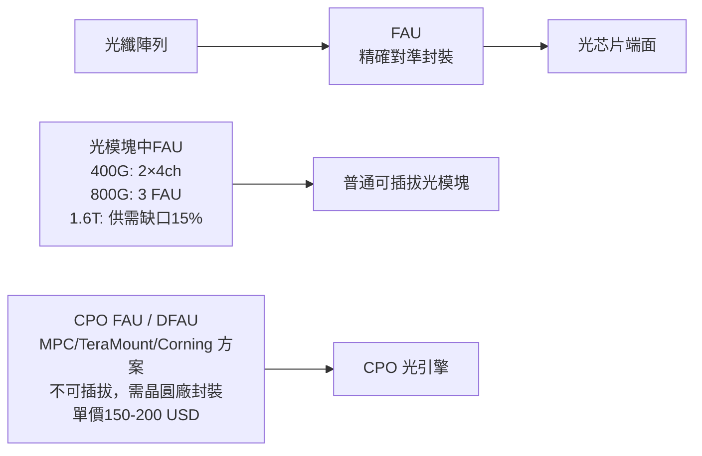

# 技術_FAU

## 定義

FAU（Fiber Attach Unit，光纖接頭）是光模塊與 CPO 光引擎中將光纖精確對準並固定於光芯片端面的精密被動元件，負責光纖到光芯片之間的高精度耦合。在普通可插拔光模塊中，FAU 已是成熟器件；在 CPO 方案中，FAU 面對超高精度（V槽/鍍膜/鏡片）需求，成為 CPO 量產最大卡脖子之一。

DFAU（Discrete FAU）/ CPO FAU 是 CPO 光引擎端使用的 FAU，需要在晶圓廠完成封裝，且精度要求遠高於可插拔光模塊的 FAU（不可插拔，固定式）。

## 圖解

## 技術原理

### FAU 在光模塊中的用量演進

| 速率 | FAU 方案 | 通道數 | 單只 FAU 價格 | 備註 |
|------|---------|--------|------------|------|
| 400G | 2 個 4ch FAU | 2×4 = 8ch | ~120–150 元 | 成熟方案 |
| 800G（DR8）| 3 個 FAU（2×4ch + 1×8ch）| 3×FAU | ~300 元（2025）→ ~200 元（2026E）| 主流 |
| 1.6T CPO | CPO 專用 FAU | 36ch（Spectrum X）| 300–400 元/個 | 有效供給緊缺 |
| 3.2T CPO | 下一代 DFAU | 高芯數 | 500–700 元/個 | 樣品驗證中 |

### CPO FAU 方案（DFAU）

三種主流 DFAU 實現路線：

| 方案 | 廠商 | 特點 |
|------|------|------|
| MPC（Multi-Path Connector）| Senko（獨家）| 連接器本身集成凸面鏡，直接完成擴束；無中間橋接結構 |
| TeraMount | Molex（收購）| 金屬卡接件方案 |
| 玻璃載體方案 | 康寧（Corning）| 玻璃載體與芯片耦合，兩端金屬 PIN 對齊 |

NVIDIA Spectrum X：可插拔式 FAU，單個 OE 對應 36 芯 FAU；需 **32 個 FAU**/台機器。
NVIDIA Quantum X：固定式 FAU，對應 18 芯；僅幾千台規模（2025 計劃未交付）。

## 關鍵參數 / 判斷指標

| 指標 | 意義 | 2026 觀察重點 |
|------|------|-------------|
| 1.6T FAU 供需缺口 | 量產節奏觀察 | 需求 800 萬只 vs 有效供給 ~700 萬只，缺口 **15%+** |
| CPO FAU 認證進度 | NVIDIA/Google 雙驗線 | NVIDIA ORT 已通過（口頭通知）；Google 2026 年 6 月前 2/4 階段通過 |
| V 槽/鍍膜 零部件 | 瓶頸關注點 | 鍍膜外包仍是 2026 主模式；mini 鍍膜線 2027 才量產 |
| CPO FAU 單價 | 上行週期 | 可插拔光模塊 FAU 十幾 USD → CPO FAU 150–200 USD |

## 技術瓶頸 / 風險

- **零部件短缺**：隔離片和透鏡是整體集成光源供應最緊缺的兩個環節；FAU 自身的 V 槽蓋板與鍍膜工藝是卡脖子。
- **不可插拔特性**：CPO FAU 需在晶圓廠封裝，一旦通道故障需整板更換，維護性差。
- **NVIDIA/Google 規格差異**：尺寸不同（工藝和通道數一致），雙驗認證周期延長。
- **1.6T 供需缺口**：2026 年 1.6T FAU 供需缺口率至少 **15%**，極端情形下需求 1,000 萬只（缺口擴大至 30%+）。

## 競爭格局

### Finisar（Coherent）供應體系

| 排名 | 廠商 | 特點 |
|------|------|------|
| 第一 | **天孚通信**（未建頁，中國）| 早期布局、產業鏈最完整 |
| 第二 | **蘅東光**（未建頁，中國）| 海外客戶多年深耕；能生產高芯數 2D 排列 FAU，快速擴產 |
| 第三 | **光庫科技**（未建頁，中國）| 聚焦國內及華為體系 |

Coherent 供應鏈中：蘅東光占 **約 40%** 份額（第二大）。

整合後 FAU 業務：光庫科技（含收購加華微捷 + 蘇州安捷訊）FAU 市場規模將超天孚。安捷訊 2025 年營收接近 8 億元，淨利率 21–22%。

## 關鍵廠商

| 環節 | 廠商 | 角色 |
|------|------|------|
| FAU 供應（全球第一）| 天孚通信（未建頁）| Finisar/Coherent 供應鏈，最完整 |
| FAU 供應（Coherent 40%）| 蘅東光（未建頁）| 高芯數 2D-FAU，擴產快 |
| FAU + TFLN + OCS | 光庫科技（未建頁）| 四業務板塊，TFLN+OCS+FAU 集成廠 |
| MPC 方案（獨家）| Senko（未建頁）| DFAU 連接器方案獨家方案 |
| CPO Shuffle Box | [[COHR.US(coherent)]] | 北美 CPO Shuffle Box（$3,000–5,000）及 FAU 模組 |
| 台灣 FAU / 光纖被動件 | [[3363_上詮（櫃）]] | FAU 台系供應商 |

## 相關技術

- [[技術_CPO]]（CPO 光引擎中 FAU 的角色）
- [[技術_光模塊]]（可插拔光模塊 FAU 用量演進）
- [[技術_光互連]]（LPO/CPO/OCS 全景比較）

## 來源

- [[memo_无源光器件大厂调研_FAU_MMC_acecamptech_20260522]]（FAU 供需缺口、CPO FAU 認證、競爭格局、光纖供應）
- [[memo_光通信大厂调研_TFLN_CPO_OCS_acecamptech_20260417]]（DFAU 方案比較、Spectrum X/Quantum X FAU 規格、MPC/TeraMount/Corning 路線）
- [[memo_光通信大厂调研_CPO出货量_FAU_MPC方案_acecamptech_20260529]]（FAU 單價 150–200 USD、CPO FAU 架構、蘅東光地位）

## 相關頁面

- [[技術_MPO]]
- [[技術_TFLN]]
