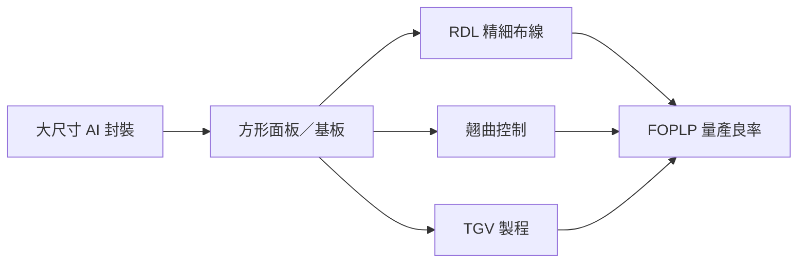

# 技術_FOPLP

## 定義

FOPLP 將扇出型封裝從 12 吋晶圓轉移至較大方形面板或基板，以提高大尺寸 AI 封裝的面積利用率。DIGITIMES 2026-08-21 簡報指出，封裝面積增加會降低晶圓切割效率，方形基板因此具結構性吸引力。

## 圖解

## 技術原理

面板級封裝以重組晶片、模封與 RDL 布線形成扇出結構，再透過切割完成單顆封裝。面積放大後，布線精細度、熱膨脹係數差異造成的翹曲，以及玻璃基板 TGV 的加工與良率，會同時放大製程難度。

## 關鍵參數 / 判斷指標

| 指標 | 觀察意義 |
|---|---|
| 面板尺寸與切割效率 | 決定相對於晶圓級封裝的成本優勢 |
| RDL 線寬／線距 | 影響高 I/O AI 封裝能否導入 |
| 翹曲與 TGV 良率 | 決定大面積面板能否穩定量產 |

## 產業動能

- AI 加速器封裝面積增加，推動方形基板與面板級封裝評估。
- DIGITIMES 認為台廠目前在 FOPLP 發展具有領先位置；Intel 面臨玻璃基板加工障礙，日韓廠則依政府支持或集團整合推進。

## 技術瓶頸 / 風險

- 大面積基板翹曲、熱管理與製程均勻性會降低初期良率。
- TGV 對玻璃基板加工與缺陷控制要求高，可能使導入時程延後。
- 面板設備、材料與封裝規格尚未完全收斂，供應鏈受惠程度仍需以量產客戶與設備訂單驗證。

## 來源

- [[報告_DIGITIMES_AI扇出型面板級封裝_20260822]] — DIGITIMES，下載日 2026-08-21
- [[技術_CoWoS與先進封裝]] — 先進封裝產能與 CoPoS 對照

## 相關頁面

- [[技術_CoWoS與先進封裝]]
