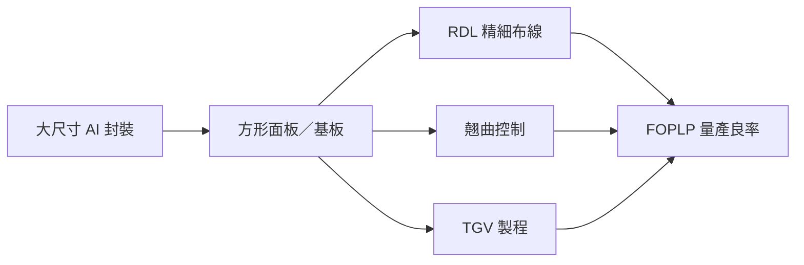

# 技術_FOPLP

## 定義

FOPLP 將扇出型封裝從 12 吋晶圓轉移至較大方形面板或基板，以提高大尺寸 AI 封裝的面積利用率。DIGITIMES 2026-08-21 簡報指出，封裝面積增加會降低晶圓切割效率，方形基板因此具結構性吸引力。

## 圖解

```mermaid
flowchart LR
    A[大尺寸 AI 封裝] --> B[方形面板／基板]
    B --> C[RDL 精細布線]
    B --> D[翹曲控制]
    B --> E[TGV 製程]
    C --> F[FOPLP 量產良率]
    D --> F
    E --> F
```

## 技術原理

面板級封裝以重組晶片、模封與 RDL 布線形成扇出結構，再透過切割完成單顆封裝。面積放大後，布線精細度、熱膨脹係數差異造成的翹曲，以及玻璃基板 TGV 的加工與良率，會同時放大製程難度。

## 關鍵參數 / 判斷指標

| 指標 | 觀察意義 |
|---|---|
| 面板尺寸與切割效率 | 決定相對於晶圓級封裝的成本優勢 |
| RDL 線寬／線距 | 影響高 I/O AI 封裝能否導入 |
| 翹曲與 TGV 良率 | 決定大面積面板能否穩定量產 |

## 產業動能

- AI 加速器封裝面積增加，推動方形基板與面板級封裝評估。
- DIGITIMES 認為台廠目前在 FOPLP 發展具有領先位置；Intel 面臨玻璃基板加工障礙，日韓廠則依政府支持或集團整合推進。

## 技術瓶頸 / 風險

- 大面積基板翹曲、熱管理與製程均勻性會降低初期良率。
- TGV 對玻璃基板加工與缺陷控制要求高，可能使導入時程延後。
- 面板設備、材料與封裝規格尚未完全收斂，供應鏈受惠程度仍需以量產客戶與設備訂單驗證。

## 來源

- [[報告_DIGITIMES_AI扇出型面板級封裝_20260822]] — DIGITIMES，下載日 2026-08-21
- [[技術_CoWoS與先進封裝]] — 先進封裝產能與 CoPoS 對照

## 相關頁面

- [[技術_CoWoS與先進封裝]]

## 2026-09-15 UBS：力成 FOPLP 產能與客戶路徑

- 力成台灣 FOPLP 產能規劃為 2026 年 3K、2027 年再增 3K substrates／月，合計 6K，完整放量目標為 2028 年；面板基板尺寸為 510 × 515 mm。
- 台灣產能多配置給 AMD，先由遊戲機產品切入，再瞄準伺服器 CPU；與 Broadcom 的新加坡 JV 預計 2026Q4 取得核准、2028 年開始量產，力成負責工廠營運。
- CoPoS 潛在競爭與設備供應時程是導入風險；產能、客戶配置與量產日期均屬管理層／券商展望，需以設備安裝、良率與客戶驗證追蹤。

來源：[[報告_UBS_力成_20260915]]（UBS，2026-09-15）。

## 2026-09 元大論壇：CoPoS 時程與面板級設備（LINE 群組 Memo）

- **CoPoS 時程：** 講者稱采鈺 310×310 mm pilot 線 2026 年建置，嘉義 AP7（P4/P5）4Q28–2029 量產；日系供應鏈口徑為 2028 年。台積電於 2025-08-26 申請「TSMC-COPOS」商標。以上為論壇講者整理，非台積電正式時程，信心中低。
- **面積效益：** 600×600 mm 面板約為 300 mm 晶圓面積的 4.6 倍；放大到 700×700 mm 時有效利用率降至約 84%。
- **市場規模：** 講者引用 FOPLP＋玻璃基板市場由 2024 年 6.5 億美元成長至 2030 年 81 億美元（引用機構與 CAGR 原文未清楚標示，信心低）。
- **設備與載具：** [[6937_天虹（市）]] 推面板級封裝設備；[[3680_家登（櫃）]] 稱 600×600 面板級封裝載具已有客戶使用，510×515 載具交貨 Intel 與力成；[[6739_竹陞科技（櫃）]] 取得數個 CoPoS 面板級封裝專案訂單；[[3563_牧德（市）]] FOPLP 檢測機台預計 1Q27。
- 來源：[[活動_元大投資論壇_設備CPO與CoPoS產業Memo_20260909]]、[[活動_天虹6937_元大論壇Memo_20260909]]、[[活動_家登3680_法說與SEMICON_Memo_20260827]]、[[活動_竹陞科技6739_元大論壇Memo_20260909]]、[[活動_牧德3563_法說Memo_20260930]]。
