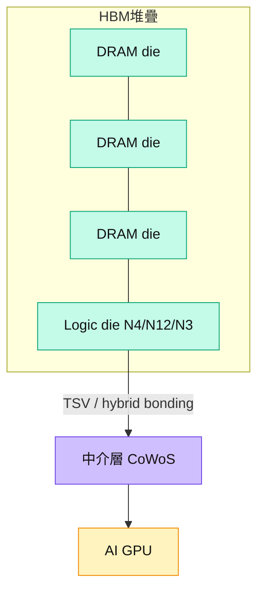

# 技術_HBM高頻寬記憶體

## 定義
HBM（High Bandwidth Memory，高頻寬記憶體）是把多顆 DRAM die 垂直堆疊、透過 TSV（矽穿孔）與底部 logic die 連接的 3D 記憶體，提供 AI GPU/加速器所需的超高頻寬。與標準型 DRAM 的差別在於「以堆疊 + 先進封裝換頻寬」，單位 wafer 產出的 bit 少、消耗產能高。

為什麼現在重要：AI 訓練/推論對記憶體頻寬的需求，使 HBM 成為 DRAM 廠獲利與產能配置的核心。HBM 消耗 wafer 多，DRAM→HBM 的 trade ratio 約 3:1，等於排擠標準型 DRAM 供給、放大整體記憶體循環（見 [[分析_記憶體超級循環2026]]）。HBM 需與 [[技術_CoWoS與先進封裝]] 整合上 GPU 載板。

相關主線：[[供應鏈_記憶體]]、標準型 DRAM、[[技術_CoWoS與先進封裝]]。

## AI 晶片 HBM 採用路線圖（2025–2028）

![[20260521_0807_統一證to群益投信_記憶體技術概論與大廠現況分析_260520_019.png]]
*圖（統一證，2026-05-20）：主要 AI 晶片廠商 HBM 採用進程（品牌、代工夥伴、晶片名稱、製程、HBM 世代、HBM 容量、CoWoS 封裝、季度時間軸 2025-2028）。覆蓋 NVIDIA（H20/H200/GB200/GB300/VR200/VR300/Feynman）、AMD（MI300X～MI500X）、Intel（Gaudi3）、Google（TPU v6e～v8p，MTK/Broadcom）、Amazon（Trainium，Marvell）、Microsoft（Maia，Marvell）、Meta（Athena/Iris/Arke，Broadcom/MTK）、ByteDance（Gen1-3，Broadcom）、OpenAI（Titan1/2，Broadcom）、Apple（Balta）、SoftBank/ARM、Huawei（910B/C/920）。*

## DRAM 製程路線圖（2020–2029）

![[20260521_0807_統一證to群益投信_記憶體技術概論與大廠現況分析_260520_004.png]]
*圖（統一證，2026-05-20）：DRAM 廠商製程推進（Ver. MD-2509-01 Simplified）。Samsung 1a/1b/1c/1d；SK Hynix 1b（2026 量產）→ 1c（2027 EUV，紅框）；Micron 1β（2026）→ 1γ EUV（2027，紅框）；CXMT G3/G4/G5（追趕中）；Nanya 1B（2027，紅框）→ 1C；Winbond 20nm（2026-27）→ 16nm（2028）；JHIOC 25nm→20nm。*

## 圖解

圖說：HBM 由多層 DRAM die 堆疊並接 logic die，經 TSV／hybrid bonding 與 CoWoS 中介層整合到 AI GPU；logic die 製程（N4/N12/N3）是各廠差異化關鍵。

## 技術原理
| 模組 | 功能 | 觀察重點 |
|------|------|----------|
| DRAM die 堆疊 | 提供容量與頻寬（8H/12H/16H） | 堆疊層數、die size；HBM4E 16H 客製化 |
| Logic die（base die） | I/O 與控制，可客製 | 製程世代：三星 N4、Hynix 可能 N12、美光 N3 |
| TSV / Hybrid bonding | die 間垂直連接 | 良率、精度；美光／三星導入 hybrid bonding（BESI） |
| 與 CoWoS 整合 | 上中介層與 GPU 共封裝 | 封裝產能連動 [[技術_CoWoS與先進封裝]] |

與一般 DRAM 的差異：HBM 技術難度高、GM 顯著高於標準型 DRAM；HBM4E 時 trade ratio 更高（24→32GB，content +30%，die size 與 lead time 增加）。

### HBM4 關鍵規格升級

| 指標 | HBM3e | HBM4 | HBM4E（預估）|
|------|-------|------|------------|
| 介面寬度 | 1,024-bit | **2,048-bit（2×）** | 2,048-bit |
| 堆疊層數 | 12-Hi | 12-Hi→**16-Hi** | 16-Hi |
| 頻寬/顆 | ~1.6 TB/s | ~4+ TB/s | ~4.1 TB/s（cHBM 含邏輯）|
| 中介層 CoWoS 層數需求 | 基準 | **+5× 中介層複雜度** | 更高 |
| 功耗 | 基準 | ~**5.6× HBM4E 估** | — |
| Logic die 製程 | DDR PHY 標準 | N4→**客製化 base die** | 邏輯功能可能擴展 |

> **中介層層數需求 5×** 指 HBM4 的 2,048-bit 介面使 CoWoS 中介層 routing 複雜度大幅上升（TSV 數量、RDL 層數均倍增），是 2027 年之後 CoWoS 産能壓力的結構性來源。

### cHBM（Custom HBM / Computational HBM）

**cHBM** 是在 HBM base die 上增加邏輯運算功能（near-memory computing），由 Marvell 等客製 ASIC 廠商主導開發：

- **Marvell cHBM 規格**：base die 採邏輯製程（非純記憶體製程），host PHY 面積節省 **60%**，頻寬 **4.1 TB/s**
- **NVIDIA Feynman 已確認採用 cHBM**（2026-07 報告確認），是 cHBM 首個大型量産客戶
- cHBM 代表 HBM 從「純儲存」走向「儲存 + 運算」的結構性升級，長期改變 AI 晶片的 memory hierarchy

**SK Hynix + TSMC One-Team**：
- SK Hynix 和 TSMC 建立 「One-Team」 深度整合協作，確保 HBM4 和 cHBM 的 base die 製程（TSMC 先進製程）與 DRAM die 的整合良率
- 此模式使 SK Hynix + TSMC 組合佔 NVIDIA Vera Rubin 世代 HBM 供應約 **~70%**

### Rubin Ultra 容量分級更新（廣發，2026-08-14）

廣發海外電子通信月會的供應鏈口徑指 Rubin Ultra 已準備四種 HBM 組態，核心目的為依訓練／推論 workload 分級並控制成本：

| 堆疊 | HBM 世代 | 單顆容量 | 廣發研判用途 |
|------|----------|----------|--------------|
| 8-Hi | HBM4 | 192GB | 推論主流 |
| 8-Hi | HBM4E | 256GB | 推論／較高容量 |
| 12-Hi | HBM4 | 288GB | 高容量選項 |
| 12-Hi | HBM4E | 384GB | 訓練場景 |

同份來源並稱 Meta 客製 AMD MI450 採 8-Hi 144GB，部分非 NVIDIA CSP AI 晶片可能採 4-Hi，顯示「容量分級」可能是整體產業的成本優化方向，而非單一平台事件。

> [!warning] 資訊衝突：Rubin Ultra SKU 是否定案
> - [[報告_MS_AI供應鏈_20260810]]（2026-08-10）：NVIDIA 預計 2026Q3 末前才決定 HBM4／HBM4E 分級 SKU。
> - [[memo_廣發海外電子通信月度電話會議_20260814]]（2026-08-14）：稱 8-Hi 路線已在韓國主要 HBM 供應商完成設計定案，並列出四種可選容量。
> - 狀態：較新 channel check 支持 8-Hi 降配方向，但正式產品規格仍待 NVIDIA／供應商公告；信心中。

## 關鍵參數 / 判斷指標
| 指標 | 意義 | 投資觀察 |
|------|------|----------|
| DRAM→HBM trade ratio | 生產 HBM 排擠標準 DRAM 的倍率 | 約 3:1，HBM4E 更高 → 放大 DRAM 缺口 |
| Logic die 製程 | base die 效能／良率 | N3 難取得者（如 Hynix）競爭力受限 |
| HBM4E 定價 | 次世代 ASP | 大和估 2027 HBM 價格顯著上漲，HBM4 價約前代 2x |
| NVIDIA 供應占比 | 綁定最大買方 | 三星目標 HBM4 供應占比 > 50% |

## 產業動能
- **HBM 市占重排**：[[大和 韓國記憶體產業電話會議摘要]]（2026-07-02）估至 2027 [[005930.KR(samsung)]] 重返第一（~50%）、[[MU.US(micron)]] ~20%，[[000660.KR(sk_hynix)]] 市占由偏高回落。
- **2027 為 HBM 漲價年**：HBM 2025.9 一年一約、2026 價格偏弱，2027.9 改約後大和預期顯著上漲。
- **HBM4E 樣品競賽**：三星 HBM4E 用 1C DRAM + N4 logic die、效能 +20%；Hynix 樣品已出但 logic die 受限；美光可能用 N3（見各公司頁）。
- **Hybrid bonding 導入**：三星、美光已採 hybrid bonding，設備商 BESI 受惠（[[供應鏈_記憶體]]）。
- **容量分級而非單一路線**：Rubin Ultra 可能以 192／256GB 支援主流推論、288／384GB 支援高容量或訓練，單機 HBM content 需按 workload 拆分觀察。

## 概念股 / 族群
| 類型 | 廠商 | 角色 | 觀察點 |
|------|------|------|--------|
| HBM 供應 | [[005930.KR(samsung)]] | HBM4E 1C+N4，目標 NV >50% | 良率、NV 認證 |
| HBM 供應 | [[000660.KR(sk_hynix)]] | 現任龍頭，市占回落 | logic die 製程 N12→N3 |
| HBM 供應 | [[MU.US(micron)]] | HBM4 ~$1b 優預期 | 產能與 N3 base die |
| GPU 客戶 | [[NVDA.US(nvidia)]] | HBM 最大買方 | HBM4/HBM4E 拉貨 |

> [!note] 信心水準
> HBM 市占重排與 HBM4E 規格差異來自大和 2026-07-02 賣方會議與 MS 記憶體報告，屬賣方研判；各廠實際良率／NVIDIA 認證進度仍待公告確認。

## 技術瓶頸 / 風險
- **產能瓶頸**：HBM trade ratio 高，是 DRAM 產能主要瓶頸；擴 capex ≠ 大幅擴產（多用於新技術/製程升級）。
- **Logic die 製程門檻**：先進 base die（N3）取得難度高，落後者競爭力受壓。
- **定價循環**：HBM 一年一約，2026 價格偏弱，短期 rate of change 可能於 4Q26 觸頂。
- **封裝連動**：HBM 需 CoWoS 產能同步，任一環節卡關即限制出貨。

> [!warning] Qualcomm HBC（HBM-in-Compute）替代警訊
> Qualcomm 提出 **HBC（HBM-in-Compute）** 替代架構——以多層堆疊 LPDDR 取代 HBM，宣稱可達 **133 TB/s** 總頻寬，且不需 CoWoS 封裝（直接整合在 SoC 上）。
> - 若 HBC 商業化成功，代表部分 AI 推論晶片可能繞過 HBM + CoWoS 整個價值鏈
> - 目前 HBC 處於概念階段，量産路線和實際性能需驗証
> - 短期影響有限（HBM 已深度整合 NVIDIA AI 訓練平台），但中長期需追蹤
>
> （來源：[[報告_先進封裝技術發展方向_20260722]]，定錨，2026-07-22）

## 相關技術
- [[技術_CoWoS與先進封裝]]
- [[技術_NAND快閃記憶體]]
- [[技術_CCL]]

## 來源
- [[報告_先進封裝技術發展方向_20260722]]（定錨，2026-07-22；HBM4 2048-bit、cHBM Marvell/4.1TB/s、NVIDIA Feynman cHBM、SK Hynix+TSMC One-Team ~70% Vera Rubin、Qualcomm HBC 警訊）
- [[大和 韓國記憶體產業電話會議摘要]] — 大和，2026-07-02
- [[260702_ms_nand-industry]] — 摩根士丹利，2026-07-02
- [[20260521_0807_統一證to群益投信_記憶體技術概論與大廠現況分析_260520]] — 統一證券，2026-05-20（AI晶片HBM採用時間軸；DRAM廠商製程路線圖；HBM3→HBM4容量16→24→36GB；HBM $/Gb 2026-28F）
- [[memo_廣發海外電子通信月度電話會議_20260814]] — 廣發海外電子通信，2026-08-14（Rubin Ultra 四種 HBM4／HBM4E 容量與產業降配趨勢；channel check，信心中）

## 相關頁面

- [[分析_MS_AI供應鏈_HBM降規與Kyber延遲_20260810]]
- [[分析_CXMT_DRAM_IPO分析]]
- [[技術_功率MOSFET]]
- [[供應鏈_記憶體]]
- [[分析_記憶體超級循環2026]]
