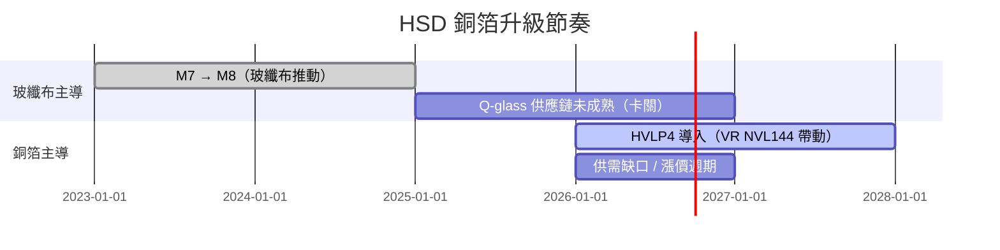

# 技術_HVLP銅箔

## 定義

HVLP（High Very Low Profile）銅箔是高頻高速數位（HSD）應用用的低稜線電解銅箔，是 CCL（覆銅板，Copper Clad Laminate）三大材料之一。CCL = 玻纖布 + 銅箔 + 樹脂，其訊號性能分級（M7／M8／M9）由三材料共同優化決定。AI 伺服器走「無線纜（cableless）」化後，訊號全改走 PCB，CCL 必須升級以補償較長的 PCB 訊號路徑——而這一輪材料升級的重點，已從玻纖布轉向**銅箔（升級到 HVLP4）**。

## 圖解

![[報告_Semianalysis_PCB_20250826_003.png]]
*圖（Doosan）：CCL 材料堆疊——銅箔（導電層）／玻纖布（補強、決定機械強度與尺寸穩定）／樹脂系統（決定耐熱、Dk/Df）／filler 系統。*

![[報告_Semianalysis_PCB_20250826_011.png]]
*圖（Mitsui Kinzoku, SemiAnalysis）：三井金屬 HSD 銅箔路線圖——B-side Rz 粗糙度從 RTF 3.0μm 一路降到 HVLP5 0.4μm；HVLP3/HVLP4（SI-VSP / SI2-VSP）對應 Router/Switch/AI server 的高速需求。*

## 技術原理

- **過去靠玻纖布，未來靠銅箔**：過去兩年 AI 伺服器 CCL 從 M7 升到 M8，主要由玻纖布推動；但玻纖布暫遇瓶頸（下一代石英玻璃 Q-glass 供應鏈尚未商業化）。銅箔尚未到極限（HVLP4 還沒普及），因此 VR NVL144 所需的訊號性能，將以「升級銅箔到 HVLP4」達成，而非大幅升級玻纖布到 Q-glass。
- **稜線（profile）越低越好**：高速訊號走銅箔表面（skin effect），銅箔越平滑（B-side Rz 越低）損耗越低。RTF → HVLP → HVLP2/3/4/5，粗糙度逐級下降。
- **無線纜化驅動**：Trainium 2 是最早全面採 cableless 的 AI 伺服器；Nvidia 從 GB200→GB300 逐步移除 NVSwitch tray 的 flyover cable，VR NVL144／Kyber 更走向訊號全走 PCB（含大型 PCB midplane）。cableless 提升組裝效率但需更高階 CCL 補償訊號。

![[報告_Semianalysis_PCB_20250826_004.png]]
*圖（AWS）：Trainium 2「簡化、無線纜」機箱設計——以 PCB 連接取代 flyover cable，利於自動化組裝。*

![[報告_Semianalysis_PCB_20250826_007.png]]
*圖（SemiAnalysis Estimates）：GB200 與 VR NVL144 概念對比——訊號改由 PCB 板對板連接器與 PCB 路由承載。*

## 關鍵參數 / 判斷指標

| 指標              | 意義                 | 觀察重點                                              |
| --------------- | ------------------ | ------------------------------------------------- |
| B-side Rz（μm）   | 銅箔稜線粗糙度，越低高速損耗越小   | HVLP4 約 0.5μm、HVLP5 約 0.4μm                       |
| 傳輸速率（Gbps/link） | 對應的 HSD 應用層級       | HVLP3/4 對應 Router/Switch/AI server                |
| HVLP 等級         | 決定可達 CCL 等級（M8→M9） | HVLP4 為次世代關鍵材料                                    |
| 毛利              | 高階銅箔含金量            | 估 HVLP4 ASP ~$30/kg、毛利 ~60%；HVLP2 ASP $17、毛利 ~29% |
| 保存限制            | 影響備庫策略             | 銅箔約 2 週氧化，冷藏可延至約 6 個月 → 難長期囤貨                     |

> [!warning] HVLP4 銅箔 2026 供需缺口（SemiAnalysis 估計）
> 單位：噸/月。需求由 Teton 2 PDS、Teton（AWS）與 Nvidia VR NVL144 帶動。
> | | 1Q26 | 2Q26 | 3Q26 | 4Q26 |
> |---|---|---|---|---|
> | 供給合計 | 600 | 600 | 950 | 950 |
> | 需求 | 592 | 1,266 | 1,446 | 1,441 |
> | 差額 | +8 | −666 | −496 | −491 |
> 自 2Q26 起明顯短缺；HVLP2→HVLP4 產能轉換非 1:1（製程較長，約少 40% 產能），恐擠壓低階產能、引發全線漲價。

## 技術瓶頸 / 風險

- **供需缺口與產能轉換限制**：HVLP4 產能難在短期大幅擴張或轉換。
- **前提假設未定案**：HVLP4 短缺論點部分建立在「Nvidia VR NVL144 採 cableless」之上——報告自承該設計**尚未定案**，且 Nvidia 有臨時改設計的紀錄。
- 銅箔氧化保存限制使長期囤貨不可行，供需一旦失衡易快速反映在價格。

## 關鍵廠商

| 環節           | 廠商                          | 角色                                             |
| ------------ | --------------------------- | ---------------------------------------------- |
| 銅箔（HVLP4 主導） | [[5706.JP(mitsui_kinzoku)]] | HVLP（VSP）產能與份額主導；FY25 上修 VSP 銷量、產能 580→850 噸/月 |

銅箔（未建頁）：Co-Tech 銅箔（8358.TW，第二大、積極退出低階轉 HVLP）、Furukawa。玻纖布（未建頁）：Nittobo（3110.JP）、福懋（1815.TW）。高階 CCL（未建頁）：EMC（2383.TW，Trainium 2 用 M8）、TUC（6274.TW）、Doosan（000150.KR）。高層數/HDI PCB 與鑽針（未建頁）：Victory Giants、GCE、WUS、ISU、TTM、Union Tool、Topoint 等。

## 技術演進時程

## 應用場景

- AI 伺服器主運算板（層數由約 20 層升向 30+ 層）
- scale-up switch board、PCB midplane（cableless 設計）

## 相關技術

- [[技術_ABF載板]]、[[技術_玻璃基板]]（先進封裝/基板材料同源鏈）
- [[技術_CPO]]（cableless/光互連節奏互相牽動 PCB 材料需求）

## 供應鏈

→ [[供應鏈_AI伺服器PCB]]

## 來源

- [[報告_Semianalysis_PCB_20250826]]（AI Server PCB Super Cycle; Copper Foil Content Upgrade，2025-08-26）

---

## 供需數據更新（福邦投顧 2026-03-19）

### HVLP4 需求來源分佈

| 需求來源 | 需求量（良率80-90%假設） | 需求量（實際良率50-60%） |
|----------|------------------------|------------------------|
| Nvidia Rubin | 300-400 噸/月 | 接近 1,000 噸/月 |
| Amazon AWS | 800-850 噸/月 | 800-850 噸/月 |
| Meta MTIA | 200 噸/月 | 200 噸/月 |
| AMD MI450 | 100-200 噸/月 | 100-200 噸/月 |
| 800G 交換機 | 400 噸/月 | 400 噸/月 |
| Google Zebrafish/Sunfish | 80 噸/月 | 80 噸/月 |
| 合計（低估版） | 1,400-1,500 噸/月 | — |
| 合計（實際良率版） | — | 2,600-2,700 噸/月 |

> 良率是關鍵變數：Nvidia PCB 實際良率約 50-60%，導致 HVLP4 需求大幅上修。

### HVLP4 供給側

| 時期 | 整體 HVLP 產能 | 實際 HVLP4 產能（考量良率） |
|------|---------------|--------------------------|
| 2025 | 1,200-1,500 噸/月 | 300-400 噸/月 |
| 2026E（擴產後） | — | 1,000-1,100 噸/月 |
| 2027E | — | 1,800-1,900 噸/月 |

具備量產能力的供應商：台銅（Co-Tech）、古河電工、盧森堡（Luxemburg）、金居（8358）、福田（驗證+量產通過）。
**不具備量產能力**：韓系樂天、台系榮科、中系銅冠、中系德福。

### 供需缺口

| 年度 | 供給 | 需求 | 缺口 |
|------|------|------|------|
| 2026E | 1,000-1,100 噸/月 | 2,600-2,700 噸/月 | **約 48%** |
| 2027E | 1,800-1,900 噸/月 | 3,300+ 噸/月（估） | **約 43%** |

資料來源：福邦投顧（2026-03-19）

### HVLP 等級對照與應用場景

| 等級 | 加工費（USD/kg） | 主要客戶 | 典型需求量 |
|------|----------------|----------|-----------|
| HVLP2 | 15 | AWS T2（2024-25）、Google V5/V6 | AWS 300-400 噸/月 |
| HVLP3 | 20-25 | NV GB200、Google V7 | NV 38-40 噸/月 |
| HVLP4 | 25-30 | AWS T2MAX（2026）、Meta M9、NV Rubin、Google V8、AMD MI450 | 2,600-2,700 噸/月（實際） |
| HVLP5 | 35+ | Panasonic M9 | 新興 |

### CCL 等級與銅箔對應

| CCL 等級 | 代表產品 | 銅箔需求 | 玻布需求 | 代表廠商 |
|---------|---------|---------|---------|---------|
| M7 | 舊伺服器 | HVLP2-3 | E-glass | — |
| M8（LK/LK2） | GB300、TPU v7、Trainium3 | HVLP3-4 | Low Dk 2代布 | 台光電、TUC、Doosan |
| M8.5 | ASIC 副板、MTIA v1.5 | HVLP4 | Low Dk 2代布 | 台光電、Doosan |
| M9（K2/K3） | Rubin 正交板、CPX、LPU | HVLP4/5 | Q-glass（石英布） | 台光電 EM-896K3、生益 |
| M9Q | Rubin midplane、LPX | HVLP4 | Q-glass | Panasonic M9Q |

## 各 AI 平台 CCL/銅箔供應格局

### GB200/GB300（Nvidia）

| 板類型 | CCL 材料 | 主要銅箔 |
|--------|---------|---------|
| Compute Tray | 斗山 M8（LDK）+ M4 | HVLP3-4 |
| Switch Tray | 台光電 M8（LDK2）+ M2 | HVLP3-4 |

### VR200（Rubin / Nvidia，2027）

| 板類型 | CCL 材料 | 銅箔 |
|--------|---------|------|
| Compute Tray | 斗山（M8+HVLP4）+ M4 | HVLP4 |
| Switch Tray | M8（K2）生益科技 70%/台光電 30% | HVLP4 |
| 中介板 | M8（K2） | HVLP4 |

## M9 石英布（Q-glass）供應格局

M9 CCL 需要石英布（Q-glass）作為玻布，是下一代關鍵材料：

| 廠商 | 材料名 | 布種 | DK（10GHz） | DF（10GHz） | 備註 |
|------|--------|------|------------|------------|------|
| 台光電 EMC | EM-896K3 | Q布（信越/菲利華/德宏）+ 三代布 | 2.79 | 0.0009 | NV Rubin CPX/LPU 主供 |
| Panasonic | M9Q | Q布（信越/菲力華）+ LK3 | 3.1 | 0.0007 | — |
| TUC | TU-953Q | Q布（信越、菲利華、德宏驗證中） | 3.0 | 0.0007 | — |
| ITEQ | IT999 GSE | Q布（信越、德宏驗證中） | 3.0-3.1 | 0.0007 | — |
| Doosan | DS7409 DYQ | 三代布（AST）+ Q布（泰山/菲利華） | 2.99 | 0.0007 | — |
| 生益科技 | S10GQ | 三代布（AST）+ Q布（信越/泰山/菲利華） | 3.15 | 0.0007 | — |

## 供需分析（Goldman Sachs，2026-05-19）

> GS 的分析以 **HVLP3+（所有高階等級合計）** 為口徑，有別於福邦/SemiAnalysis 的 HVLP4-only 分析。

### HVLP3+ TAM

| 年度 | HVLP3+ TAM（US$mn） | 佔全球 PCB 銅箔市場比例 |
|------|---------------------|----------------------|
| 2025 | 216 | ~3% |
| 2026E | 612 | 9% |
| 2027E | 1,500 | 21% |
| 2028E | 2,400 | 33% |

**CAGR 2025-28E：122%**

### HVLP3+ 供需缺口（GS，考慮 70-80% 良率）

| 指標 | 2025 | 2026E | 2027E | 2028E |
|------|------|-------|-------|-------|
| 需求（tons/月） | 679 | 1,600 | 3,400 | 5,200 |
| 名目產能（tons/月） | 1,057 | ~1,700 | ~3,300 | ~5,000 |
| 有效產能（含 70-80% 良率）（tons/月） | 803 | ~1,300 | ~2,400 | ~3,800 |
| **實際短缺比** | — | **28%** | **39%** | **38%** |

即便三井金屬＋金居（8358）均以 100% 稼動率運作，合計也只能滿足行業需求的 **50-60%**。

### 三井金屬 HVLP3+ 有效產能（GS 估）

| 年度 | 有效產能（tons/月） | 備註 |
|------|------------------|------|
| 2025 | — | 基準 |
| 2026E | 718 | CAGR 35%（2025-28E） |
| 2027E | 870 | |
| 2028E | 1,140 | HVLP1-5 名目合計 1,200 tons（2028-09 目標） |

### HVLP3+ 產品組合趨勢

| 年度 | HVLP3 | HVLP4 | HVLP5 |
|------|-------|-------|-------|
| 2025 | 76% | 24% | 0% |
| 2026E | 57% | 43% | 0% |
| 2027E | 35% | 44% | 21% |
| 2028E | 30% | 46% | 23% |

HVLP5 從 2027 年開始滲透，主要來自 3.2T 交換機需求。

### 金居（8358）HVLP3+ 市占

| 年度 | 2025 | 2026E | 2027E | 2028E |
|------|------|-------|-------|-------|
| 市占 | 5% | 20% | 42% | 53% |

## 漲價週期

| 廠商 | 時間 | 產品 | 漲幅 |
|------|------|------|------|
| 三井金屬 | 2025-10 | 全系列（含HVLP） | USD 2/kg |
| 古河電工 | 2025-09 | 全系列（含HVLP） | +5-10% |
| 古河電工 | 2025-Q4 | 全系列（含HVLP） | USD 2/kg |
| 金居 8358 | 2025-08 | RTF | +5-10% |
| 金居 8358 | 2025-Q4 | HVLP | USD 2/kg |
| 盧森堡 | 2025-Q4 | HVLP3-4 | +10%（約USD 2） |

## 關鍵廠商補充

| 廠商 | 角色 | 備註 |
|------|------|------|
| [[8358_金居（市）]] | HVLP4 第二認證供應商 | 台系最大；GS 估市占 5%→20%→42%→53%（2025-28E）；EPS 4.21→44.77 元 |
| 福田（未建頁） | HVLP4 供應商 | 已驗證+量產通過 |
| 台銅/Co-Tech（未建頁） | HVLP4 供應商 | 台系第一大銅箔廠 |
| 德宏（5475.TW，未建頁） | 石英布（Q-glass）供應商 | 已通過台光電/南亞驗證，2026 年開始庫存儲備 |
| 信越化學（日本，未建頁） | 石英布主供 | Q-glass 主要供應商 |
| 菲力華（中系，未建頁） | 石英布供應 | LPX Rack Q-glass 主供之一 |

## 來源（補充）

- [[報告_福邦_PCB載板產業展望_20260401]]（福邦投顧，2026-03-19；HVLP4 供需缺口 48%/43%、M9 廠商比較、各平台 CCL 格局）
- [[報告_GS_CCL_PCB_20260320]]（Goldman Sachs，2026-03-20；CCL 漲價週期、台廠 CCL 市占）
- [[報告_HSBC_CCL展望2026_27_20260413]]（HSBC，2026-04-13；EMC/TUC/ITEQ 財務更新）
- [[報告_GS_8358金居銅箔新紀元_20260519]]（Goldman Sachs，2026-05-19；HVLP3+ TAM 2025-28E CAGR 122%，供需短缺 28/39/38%，金居市占 5→53%）

## 相關頁面

- [[技術_CCL]]
- [[技術_PCB]]
- [[技術_mSAP]]
