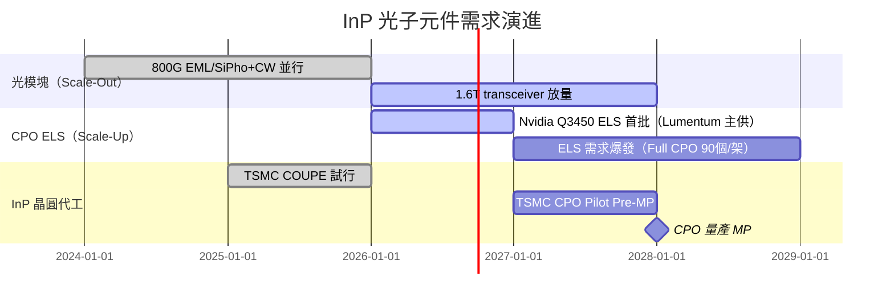

# 技術_InP磷化銦

## 定義

InP（Indium Phosphide，磷化銦）是 III-V 族化合物半導體，其直接帶隙特性使電子躍遷能直接發光，是製作**高速光子主動元件**（雷射、調製器、光偵測器）的核心材料。與矽光子（SiPh）以成熟 CMOS 製程整合波導不同，InP 是光電子主動元件的「最後一道防線」——尤其是高功率 CW DFB 雷射，目前無法被矽光取代。

AI 算力擴張使 CPU/GPU 間的高速傳輸需求暴增：AI 模型每兩年成長 100 倍，算力每兩年提升 3.3 倍，但記憶體頻寬與互連頻寬每兩年僅提升 1.4 倍，導致每兩年需要多部署 70 倍互連。銅纜在高速下衰減急速惡化（212 Gbps 下衰減已逾 20 dB），光互連不可避免。InP 元件是高速光通訊（800G→1.6T transceiver）與 CPO ELS 雷射光源的核心環節，AI CapEx 浪潮直接推升 InP 元件需求。

此頁涵蓋 InP 光子元件（PD、Laser/DFB、EML、PIC）的原理、供應鏈與投資觀察，InP 原材料（銦礦供給）見 [[技術_銦行業]]，CPO 系統整合見 [[技術_CPO]]，供應鏈地圖見 [[供應鏈_CPO]]。

## 圖解

![[報告_金正禾論壇_InP晶圓代工CPO_20260130_009.png]]
圖說：（金正禾論壇，2026-01-30）CPO 前段供應鏈——Design、OE Engine、Laser Supplier、ASIC/xPU、SiPho Foundry 五欄對應不同廠商生態圈；Broadcom 為 IDM 自成一派，NVIDIA 依賴 Lumentum 等外部雷射供應商。

![[報告_金正禾論壇_InP晶圓代工CPO_20260130_014.png]]
圖說：（金正禾論壇，2026-01-30）CPO 系統示意：NVIDIA GPU/ASIC 旁整合矽光子引擎，透過 FAU 光纖耦合連至其他 AI 系統，銅纜限制被光互連突破。

## 技術原理

### InP 主被動元件一覽

| 元件 | 基板 | 應用距離 | 對應波長 | 功耗 | 成本單價 | 主要供應商 |
|------|------|---------|---------|------|---------|----------|
| **PD（光偵測器）** | InP | 近距離 NA | 900–1,550 nm | Low | $1–3 USD | [[AVGO.US(broadcom)]]、Hamamatsu、GCS |
| **Laser/DFB（CW 光源）** | InP | 100m–2km | 1,310 nm（SM）| Medium | $3–5 USD | [[AVGO.US(broadcom)]]、[[COHR.US(coherent)]]、[[LITE.US(lumentum)]]、Sumitomo、Furukawa、Mitsubishi |
| **EML（調製光源）** | InP | 100m–2km | 1,310 or 1,550 nm（SM）| Large | $15–20 USD | [[AVGO.US(broadcom)]]、II-VI（現 [[COHR.US(coherent)]]）、[[LITE.US(lumentum)]]、Sumitomo、Furukawa、Mitsubishi |
| **PIC（多功能 TRx）** | InP | 2km–2,000 km | 1,530–1,690 nm（coherent）| Large | $50–100 USD | [[LITE.US(lumentum)]]、Finisar（現 [[COHR.US(coherent)]]）|

InP 元件功能高度差異化：每種元件對應不同的物理結構、製程步驟與測試條件，不像 TSMC/UMC 的標準化 CMOS 製程可快速調配產能或擴產。這是 InP 長期由 IDM（如 Broadcom 自供 PD）或垂直整合廠主導的根因。

### 3 吋轉 6 吋不是即時的 4 倍供給

晶圓直徑由 3 吋增至 6 吋，面積在幾何上約增為 4 倍，但有效產出還要乘上「實際轉線比例 × 各站良率 × 封裝／分測良率」。[[memo_EML_InP_CW_ELS_NPO_CPO專家觀點_日期不詳]] 指出，6 吋初期要重新摸索 MOCVD、外延均勻性、晶圓應力與升溫後應力釋放；業者通常以少量批次驗證後再逐段增加 10%～20% 轉線比例，因此成熟 3 吋產能不會立即全部被 6 吋替代。

圖說：6 吋晶圓的面積優勢必須逐站轉化成穩定良率；應力、溫循與封裝分測使有效供給不會隨面積一步跳升。

### 800G Transceiver 成本拆解（SiPho vs EML）

| 元件 | SiPho 方案（$）| EML 方案（$）|
|------|--------------|------------|
| DSP（高量） | $30–50 | $30–50 |
| Driver + TIA | $20 | $20 |
| SiPho Chip | $30 | — |
| EML | — | $20 × 8 = **$160** |
| CW Laser（SiPho 外部光源）| $3–5 × 4 = $12–20 | — |
| High Speed PD | $3 × 8 = $24 | $3 × 8 = $24 |
| Others（PCB、lens 等）| $120 | $120 |
| **合計（不含毛利）** | **$260** | **$370** |

EML 方案因每通道各自含調製雷射，BOM 高出約 $110（+42%）；SiPho 方案以外部 CW 光源分時多工，每顆 CW Laser 供 4 個通道，降低光源成本但增加光路設計複雜度。

## 關鍵參數 / 判斷指標

| 指標 | 意義 | 投資觀察 |
|------|------|----------|
| CW DFB 輸出功率（mW） | CPO ELS 能否驅動整條光鏈路 | 目前 Scale-Up CPO ELS 需 ≥100mW @1310nm；未來 200/400mW 或 CWDM 多波長版本進入後，能否供貨決定中系廠商能否切入 |
| EML 成本（$/顆） | 800G/1.6T transceiver BOM 中最大變數 | EML 由 InP IDM 主導；SiPho + CW Laser 若持續降本，EML 占比將下滑 |
| InP 元件良率 | IDM 與純晶圓代工的核心競爭力 | Broadcom 自供 PD 良率優勢；第三方 InP 代工（如 GCS）能否接近 IDM 水準決定外溢訂單空間 |
| 從 IDM 移轉外包比例 | 供應鏈彈性指標 | Broadcom 外包量增加 → 台廠（穩懋等 InP 磊晶）受益 |
| ELS 供應商多樣化 | CPO 系統整合風險 | Lumentum 當前主導；Coherent、中系廠商能否在 100mW 規格認證後切入第二供 |
| 6 吋轉線比例與批次穩定性 | 決定面積優勢能否轉成有效產出 | 追蹤連續批次良率、MOCVD 改裝完成度與 3／6 吋產能並存期，而非只看名目晶圓尺寸 |
| 基板認證／出口資格 | 多來源供應能否真正落地 | Coherent 相關專家訪談稱新供應商多以 6 吋為目標，但看廠、送樣不等於取得北美客戶資格或可出口供貨 |

## 產業動能

- **Scale-Up CPO ELS 成最大需求引擎**：[[技術_CPO]] 頁已記錄 NV 每個 GPU Tray（4 GPU）需 2 個 ELS 模組；全機架 Full CPO 場景下每機架需 90 個 ELS（vs Scale-Out only 的 18 個），InP DFB 雷射需求爆發（來源：[[報告_金正禾論壇_CPO光電共封裝_20260325]]，2026-03-25）。
- **ELS 功率門檻是中系廠商的卡點**：DFB @1310nm 目前最低需 100mW，中系廠商勉強達標；若升至 200mW/DFB 或 400mW/DFB，或引入 CWDM 多波長規格，中系廠商在強度與多波長均勻性上暫時無法跟上（來源：[[報告_金正禾論壇_CPO光電共封裝_20260325]]，2026-03-25）。
- **Coherent（II-VI）德州 InP 廠擴產**：6 吋 InP 廠快速擴產，[[NVDA.US(nvidia)]] 入股 $20 億鎖定 InP 產能（來源：[[research_simpletechtrend_CPO矽光子ECTC2026_20260629]]，2026-06-29）。
- **從獨立元件移轉到垂直整合**：傳統 InP IDM（Broadcom）自供 OE Engine；TSMC COUPE 路線需要外部 InP 雷射供應商，釋放訂單給 Lumentum、Coherent 等——但同時對傳統 CM 廠議價能力形成壓力（來源：[[報告_金正禾論壇_InP晶圓代工CPO_20260130]]，2026-01-30）。
- **TSMC CPO 時程**：2025Q1 Test Vehicle PIC → 2027Q1 Pilot Pre-MP；MP 最快 2026 年底至 2027 年初；至 2028 年進入批量量產（來源：[[報告_金正禾論壇_InP晶圓代工CPO_20260130]]，2026-01-30，講者為業內人士，信心：中）。
- **3→6 吋有效供給爬坡**：[[memo_EML_InP_CW_ELS_NPO_CPO專家觀點_日期不詳]] 認為 [[COHR.US(coherent)]] 6 吋 InP 仍處製程與良率摸索，短期以 3 吋為主；其估計供給壓力可能到 2027Q2 才逐步緩解，但訪談日期與講者身分未提供，信心低。

## 概念股 / 族群

| 類型 | 廠商 | 角色 | 觀察點 |
|------|------|------|--------|
| ELS / InP Laser IDM | [[LITE.US(lumentum)]] | Nvidia 首批 CPO ELS 主供、VCSEL/EEL 整合 | CPO 時程下修影響 2H26 ELS 出貨；長期受益於 ELS 需求爆發 |
| ELS / InP Laser IDM | [[COHR.US(coherent)]] | ELS 第二供、德州 6 吋 InP 擴產、PIC/EML 全線 | NVIDIA $20 億入股確認長期供應地位 |
| InP 磊晶（台灣）| [[3105_穩懋（櫃）]] | InP 磊晶代工（GaAs 為主，InP 待確認）| CPO 時程若 2027 放量，InP 磊晶訂單能否外溢給穩懋 |
| InP 磊晶（台灣）| [[4971_IET-KY（市）]] | InP 磊晶，TSMC COUPE 上游 | 與聯亞光電並列布局 TSMC COUPE 上游 |
| SiPho 代工（搶 InP 場景）| [[2330_台積電（市）]] | COUPE PIC N65：矽光取代 InP 調製器 | TSMC COUPE 推進節奏決定 InP EML 需求能否被 SiPho 局部替代 |

> [!note] 信心水準
> Lumentum/Coherent 的 ELS 供應地位已有多份報告確認（信心高）；穩懋的 InP 外溢訂單及 IET-KY 的 TSMC COUPE 上游地位待法說/供應鏈報告進一步確認（信心低）。

## 技術瓶頸 / 風險

- **InP 非標準化製程是擴產障礙**：InP 主被動元件功能差異極大（PD、DFB、EML、PIC 各自製程），不能像 TSMC CMOS 標準化產能調配；IDM 廠難以快速擴產回應 AI 需求激增，純晶圓代工路線尚未成熟。
- **晶圓尺寸的產能幻覺**：3→6 吋的面積 4 倍只是理論上限；分批轉線、應力釋放、MOCVD recipe 與高功率／高速產品低良率，可能讓有效產出增幅顯著低於面積增幅。
- **ELS 功率規格持續升級**：100mW→200mW→400mW DFB，或 CWDM 多波長（1270/1290/1310/1330/1350nm），每次升級都是新的技術門檻；中系廠商在高強度與多波長均勻性上具系統性落後。
- **SiPh 替代風險（局部）**：矽光子技術成熟後，調製器（MZM/MRM）功能已被 SiPh 取代；剩餘 InP 不可取代的環節主要是高功率 CW DFB 雷射和 PD——但若矽光+混合整合進一步突破，技術壁壘可能收窄。
- **CPO 時程不確定性**：Spectrum 6 CPO（DFAU 良率問題、插損 4.5 dB）導致 2026/2027 ELS 出貨低於預期，詳見 [[技術_CPO]] 衝突 callout。
- **供應商議價能力喪失（系統整合商視角）**：CPO 架構下，ELS 供應商綁定更緊密（CSP 無法像選擇可插拔光模組那樣自由換廠），ELS 廠商議價能力提升，但同時暴露在客戶集中風險。

## InP vs 矽光（SiPh）競合

| 功能 | InP 優勢 | SiPh 優勢 | 現況 |
|------|---------|---------|------|
| CW DFB 雷射（光源）| 直接帶隙，效率高，100mW+ 可行 | 間接帶隙，無法直接發光 | **InP 不可取代** |
| 光偵測器（PD）| 頻寬寬（900–1550nm）| 短波長受限 | InP 仍主導高頻寬應用 |
| 調製器（MZM/MRM）| 小體積 EAM 整合可行 | 成熟 CMOS 整合、低成本 | **SiPh 已局部取代** |
| 波導傳輸 | 低損耗 | 成熟製程整合 | **SiPh 主導** |
| 整合複雜度 | IDM 自垂直整合 | 需外部 InP 雷射 Hybrid bonding | TSMC COUPE = SiPh + InP 混合 |

## 技術演進時程

## 相關技術

- [[技術_CPO]]（InP ELS 是 CPO 光鏈路的核心光源環節）
- [[技術_矽光子（SiPh）]]（InP 與 SiPh 的競合：調製器被取代，雷射不可取代）
- [[技術_光電芯片]]（CPO OE 中 PD/Driver/TIA 配置）
- [[技術_銦行業]]（InP 原材料供給：銦礦、InP 基板）

## 來源

- [[報告_金正禾論壇_InP晶圓代工CPO_20260130]] — 金正禾論壇（產業專家 Terry），2026-01-30
- [[報告_金正禾論壇_CPO光電共封裝_20260325]] — 金正禾論壇，2026-03-25
- [[research_simpletechtrend_CPO矽光子ECTC2026_20260629]] — InP 供應鏈更新，2026-06-29
- [[memo_EML_InP_CW_ELS_NPO_CPO專家觀點_日期不詳]] — Coherent 相關專家訪談，日期不詳（2026-08-30 收錄；3→6 吋製程爬坡、基板認證與 EML／CW 有效供給，信心低）

## 相關頁面

- [[供應鏈_CPO]]
- [[分析_CPO_NPO_XPO與409.6T光互連轉折]]
- [[LITE.US(lumentum)]]
- [[COHR.US(coherent)]]
- [[NVDA.US(nvidia)]]
- [[AVGO.US(broadcom)]]
- [[3105_穩懋（櫃）]]
- [[4971_IET-KY（市）]]
