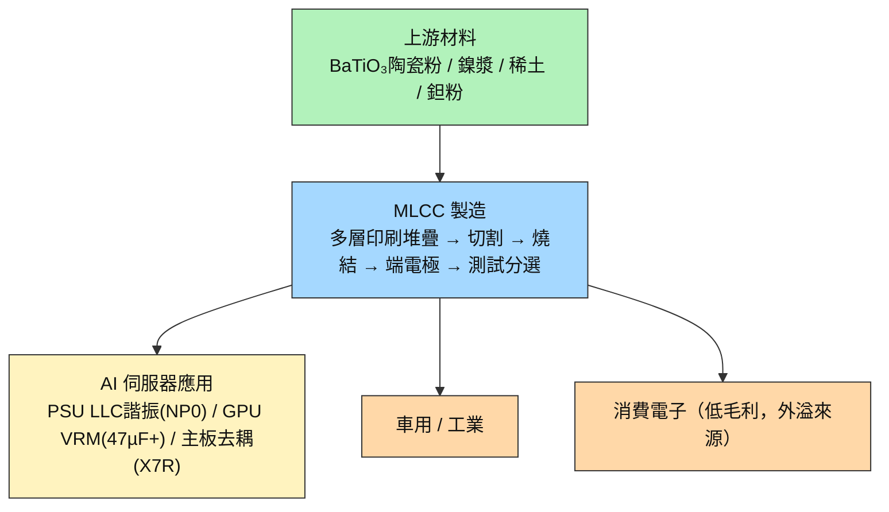

# 技術_MLCC

## 定義

MLCC（Multilayer Ceramic Capacitor，積層陶瓷電容），由數百至上千層陶瓷介電層與金屬電極交替堆疊製成。作為電路中的「局部儲能元件」，負責穩定電壓、濾除雜訊、快速響應瞬態電流。AI 伺服器中每個 GPU/ASIC 核心電壓約 0.8V、電流高達數百安培，任何納秒級的電壓偏移都可能導致晶片失效——MLCC 是防止這種情況的關鍵元件。

**為什麼現在重要**：AI 算力世代升級（GB200 → GB300 → Rubin VR200）帶來雙重需求衝擊——單機架 MLCC 用量從 22,000 顆（HGX Hopper）跳升至 570,000 顆（VR200 NVL72），增幅 ~26x；同時規格從消費級跳升至高壓 NP0/高容 47µF+ 等 AI 專用品。日韓頭部廠（Murata/SEMCO）良率僅 ~50%、設備自製、擴產週期 2 年，供給彈性遠低於需求彈性，形成結構性緊缺至少延續至 2H27（MS 2026-06-22）。與 [[技術_800VDC供電架構]] 共同構成 AI 伺服器「電源側升級」的核心投資主線；詳見 [[供應鏈_被動元件]]。

## 圖解

![[報告_Vastpeak_被動元件產業_20260630_030.png]]
*2025 年全球 MLCC 市占率：Murata 40.8%、SEMCO 22.5%、Taiyo Yuden 11.3%、TDK 6.9%、Yageo 5.4%、其他 13.0%。AI 高容市場集中度更高（Murata 約 70%）。來源：Vastpeak/Morgan Stanley，2026-06-30。*

![[報告_Vastpeak_被動元件產業_20260630_032.png]]
*各 MLCC 材料類別 TCC（溫度係數）曲線：C0G（NP0）幾乎水平（最穩定），X5R/X7R 高溫後衰退，Y5V 大幅衰退。這決定了各類別在 AI PSU（NP0）vs GPU 去耦（X5R/X7R）vs 消費品（Y5V）的應用分佈。來源：Vastpeak，2026-06-30。*

圖說：MLCC 為通用元件，AI 伺服器是本輪利潤最高的應用場景；日韓頭部廠將消費品產能外溢至台廠，是台廠受惠的核心機制。

![[報告_NMR_MLCC_20210115_001.png]]
圖說：MLCC 積層陶瓷電容實物陣列（右側黃/橙色為鉭電容對比）——**產品示意圖，非製程或結構流程圖**，來源：Nomura 2021-01。

![[報告_NMR_MLCC_20210115_005.png]]
圖說：電容類型分類對比（電解質系：鋁電解/鉭電解/薄膜；電介質系：MLCC）——**產品示意圖，非製程或結構流程圖**，來源：Nomura 2021-01。

## 技術原理

| 模組 | 功能 | 觀察重點 |
|------|------|----------|
| 陶瓷介電層（BaTiO₃基） | 儲能媒介；介電常數決定容量上限 | AI 用 47µF+ 需數百至上千層；層數越多，切割精度與燒結良率要求越高 |
| 鎳內電極 | 電荷傳導層，與介電層交錯堆疊 | 電極間距 <1µm；設備精度門檻高，廠商自製多層堆疊機，無法外購 |
| 外部端電極（Ni/Sn） | 與 PCB 焊墊接合，提供電氣連接 | 材質影響 ESR（等效串聯電阻）與耐熱性；AI 伺服器 PSU 對 ESR 要求更嚴 |
| 燒結製程（隧道窯） | 將生坯燒結成緻密陶瓷體，決定電氣特性 | 燒結爐為廠商自製；燒結條件差異直接影響良率——AI 規格良率 ~50% vs 消費品 99.5% |
| 測試分選 | 依容值/耐壓/損耗角分選出貨 | AI 用品規格公差窄，分選不合格率高，是實際有效產能的關鍵卡脖 |

**與一般電解電容的差異**：傳統鋁電解電容用液態電解質，有液態洩漏與壽命短等問題；MLCC 全固態結構可靠性高，但 AI 規格要求的超高層數使良率與設備門檻遠超消費品，形成日韓廠商的護城河。台廠在 AI 用高端品市占低（合計 <10%），受惠主要來自消費品外溢訂單。

## 關鍵參數 / 判斷指標

| 指標 | 意義 | 投資觀察 |
|------|------|----------|
| 高容量（47µF+）合約漲價時程 | AI MLCC 核心規格，Rubin 世代佔比升至 30%+ | 若 2H26 跟進漲價（MS 預估），[[2327_國巨（市）]] / [[3026_禾伸堂（市）]] 毛利直接改善 |
| 雲端 AI 47µF+ 需求（bn 顆） | 2025E 4bn → 2026E 10bn → 2030E 38bn（MS 6/22） | YoY +150% 是 2026 核心需求確認指標；季度出貨量是領先訊號 |
| Murata / SEMCO 產能利用率 | 兩家合計 85% 高端市占，決定外溢訂單規模 | 持續高利用率 → 台廠訂單窗口延長；Murata 2x capacity 提前落地 → 外溢效應縮短 |
| AI 用 MLCC 良率（目前 ~50%） | 良率決定有效產能，是高端 MLCC 最大隱性瓶頸 | 良率提升慢 → 緩解時程延後，對有庫存台廠相對有利 |
| 現貨 vs 合約價差倍數 | 2017-18 超級週期峰值 10-20x；目前 ~6x（部分規格） | 倍數持續擴大 → 缺口未解除；倍數縮小是週期見頂早期訊號 |
| Rubin VR200 量產時程 | VR200 單機架用量是 GB300 的 +78%（570K vs 320K 顆） | 2026H2 樣機 → 2027 量產；提前放量直接拉動 2026 需求曲線 |

## 產業動能

- **AI 伺服器 MLCC 用量世代跳升**：MS 2026-06-22（[[報告_MS_MLCC超級週期_20260622]]）統計，VR200 NVL72 全機架 MLCC 用量 570K 顆（vs GB300 320K 顆，+78%），完整機架對比一般伺服器達 ~290x。47µF+ 高容 MLCC 雲端 AI 需求 2026E 10bn 顆（+150% YoY）。
- **Rubin BOM content 暴增拉動台廠**：[[報告_國票_國巨2327_20260617]] 2026-06-17 分析，VR200 被動元件 BOM 從 GB300 的 USD 1.2-1.5 萬升至 USD 3.5-4.5 萬（+3x），[[2327_國巨（市）]] 作為 Rubin 全方位供應商（MLCC+鉭電容+電感+電阻）受惠。
- **漲價週期啟動確認**：[[報告_廣發HK_MLCC產業_20260615]] 2026-06-15 記錄深圳現貨部分規格 YTD 漲 ~6x；台灣 ODM 低容漲 5-100%，合約客戶漲 20-30% QoQ；預期 2026Q3 高容 105/106 跟進、電阻漲 ~50%。
- **SEMCO 矽電容大單揭示下世代路線**：MS 2026-06-22（[[報告_MS_MLCC超級週期_20260622]]）揭露 SEMCO 與全球科技客戶簽 KRW 1.5 兆矽電容供應協議，2027-28 年貢獻營收；顯示日系廠商已在佈局 ABF 基板嵌入式矽電容，作為傳統 MLCC 的升級路線。
- **專家閉門確認供需缺口**：[[活動_大摩閉門_存儲MLCC_20260612]]（2026-06-12）與 [[活動_MLCC_專家會議_20260623]]（2026-06-23）均指向 2H26-2027 高容 AI MLCC 供需缺口持續，設備自製 + 擴產週期 2 年是核心制約。
- **中系廠商切入中段市場**：[[報告_銀河證券_MLCC深度報告_20260528]] 2026-05-28 指出 CCTC（三環集團）等進入中系 AI 伺服器供應鏈，影響中段市場格局，但高端 AI 品短期仍由日韓主導。
- **AI MLCC 能力高度集中於日韓兩廠**：[[memo_日電貿_MLCC座談_20260708]]（2026-07-08，日電貿）確認 AI 伺服器核心 MLCC 規格（0201 10µF X6T 2.5V / 0402 47µF X6S 2.5V / 0603 100µF X6S 2.5V）僅 Murata + Samsung 有完整供貨能力；Kyocera、Taiyo Yuden 能力次之。電源側高壓品（100V+）：[[3026_禾伸堂（市）]]、[[8042_信昌電（市）]]、風華高科最緊缺，日韓廠商該品類不願回頭擴產；主機板 MLCC：[[2327_國巨（市）]] / 華科現貨稀缺，日系＋Samsung 供應主導，良率瓶頸仍在。
- **2026→2027 AI 需求顆數倍增、容值暴增**：日電貿座談確認 2026→2027 AI 伺服器 MLCC 顆數 +1 倍、容值需求 **+5 倍**；4Q26-1Q27 為台灣客戶 AI 伺服器拉貨高峰（GB300/Rubin 交叉期）；中系 ASIC 客戶（ByteDance/Baidu 等）落後約半年。日系大廠擴產幅度僅 10-20%，遠不足以補足缺口。

## 概念股 / 族群

| 類型 | 廠商 | 角色 | 觀察點 |
|------|------|------|--------|
| 台廠 MLCC 龍頭 | [[2327_國巨（市）]] | 全球 MLCC 第三、電阻第一、鉭電容第一；Rubin 全方位供應商 | 47µF+ 合約漲價時程；目標價 NT$355（MS，2026-06-12） |
| 台廠高壓 NP0 | [[3026_禾伸堂（市）]] | AI PSU LLC 諧振電容（NP0）台廠代表，市占 >60% | 禾伸堂 NP0 獨占性；漲價轉嫁速度 |
| 台廠電感 | [[3357_台慶科（市）]] | GPU VRM TLVR 電感第二大廠 | TLVR 跟漲時程；佔 AI 伺服器 TLVR 需求比重 |
| 日廠龍頭 | 村田製作所（未建頁） | 45% 高端 MLCC 市占；AI server 2x capacity 擴產中 | 擴產時程是台廠訂單外溢的反指標 |
| 韓廠龍頭 | SEMCO（未建頁） | 40% 高端市占；積極佈局矽電容（2027-28） | 矽電容大單能見度；內嵌式技術對傳統 MLCC 的替代速度 |
| 台廠 MLCC 二線 | 華新科（2492，未建頁） | 消費端為主，AI 訂單外溢受惠 | 訂單外溢比重；毛利改善幅度 |
| 台廠高壓電源側 | [[8042_信昌電（市）]] | 電源側 100V+ 高壓 MLCC（LLC 諧振電容等），與禾伸堂並列最緊缺品類 | 供需缺口持續性；台廠主要電源側受惠者 |
| 台廠鋁電解電容 | [[6173_金山電（市）]]、鈺邦（未建頁） | AI 伺服器電源端鋁電解電容台廠代表；日本三大 CON（尼吉康/紅寶石/日本化工）為主導者 | 台廠承接日本廠外溢訂單比重；AI 電源規格升級帶動 ASP 提升 |

> [!note] 信心水準
> **高（已有法說/報告支撐）**：國巨受惠方向（MS TP NT$355 2026-06-12）、禾伸堂 NP0 AI PSU 地位（[[供應鏈_被動元件]]）、台慶科 TLVR 第二大地位。
> **低（待公告確認）**：各廠具體合約漲價幅度與季度時程、台廠個別進入 Rubin 平台的 BOM 佔比。

## 技術瓶頸 / 風險

- **設備自製 = 擴產週期 2 年**：MLCC 多層堆疊機、燒結爐均為廠商 in-house 設備，無法向外採購；景氣好轉後新增產能最快需 24 個月，短期供給無法快速回應需求。
- **良率壁壘鎖死有效產能**：AI 用 47µF+ MLCC 良率 ~50%，實際消耗產能是名目產量的 2x 以上；良率改善需長時間製程優化，形成外部難以複製的隱性護城河，也是緩解缺口最大的變數。
- **產能不可互換**：車用 / 消費品規格（電氣特性、尺寸、耐壓）與 AI 伺服器用完全不同，產線無法快速切換；若消費電子景氣同步回升，將與 AI MLCC 競爭有限日韓產能。
- **日韓雙寡占護城河**：Murata（45%）+ SEMCO（40%）合計 85% 高端市占，台廠訂單本質是「外溢」而非「搶市占」；一旦日韓頭部廠提前完成擴產，外溢訂單可能快速回流，台廠議價空間縮小。
- **矽電容 / 嵌入式 MLCC 替代風險**：SEMCO 主導的 ABF 基板嵌入式矽電容（2027-28 量產）若加速普及，GPU 核心電壓側的部分傳統 MLCC 需求面臨替代壓力（受影響程度 [待查證]）。

## 技術趨勢（◇）

### 內嵌式 MLCC（Embedded MLCC）

下一代 AI 伺服器 ABF 基板將直接整合 MLCC，縮短電流路徑、提升電源完整性。SEMCO 為主要推動者，已公告 2027-28 年向某全球科技客戶提供 KRW 1.5 兆（約 USD 1bn）矽電容供應協議。

### 矽電容（Silicon Capacitor）

SEMCO 以 DRAM 衍生的電容結構在 300mm 晶圓上製造，Fabless 模式（委外晶圓廠+OSAT），主要針對 AI 晶片先進封裝。2027 年開始貢獻營收。

## AI 伺服器 MLCC 用量詳表（參考）

| 平台 | MLCC 用量（顆） | 相對一般伺服器 | 資料來源 |
|------|--------------|-------------|---------|
| 一般伺服器 | 2,000 | 基準 | MS 6/22 |
| HGX Hopper（8x GPU）| 22,000 | 11x | MS 6/22 |
| HGX B300（8x GPU）| 48,000 | 24x | MS 6/22 |
| GB200 NVL72（全機架）| 319,500–337,500 | ~160x | MS 6/22、廣發 6/15 |
| GB300 平台（單台服務器）| 最多 30,000 | — | 財通 6/1（引村田×台灣《經濟日報》）|
| GB300 平台（AI 機架）| 440,000 | ~220x | 財通 6/1（引村田×台灣《經濟日報》）|
| VR200 NVL72（Rubin 全機架）| 570,000–581,000 | ~290x | MS 6/22、廣發 6/15 |
| Vera Rubin NVL144（整機架，全品類）| 860,000–6,480,000 | 430–3240x | 國票投顧 6/11（寬幅含所有子系統）|
| Vera Rack | 494,048 | ~247x | MS 6/22 |
| AWS STX Rack | 326,256 | ~163x | MS 6/22 |
| AWS LPX Rack | 581,024 | ~290x | MS 6/22 |

## BB ratio 與稼動率（截至 2026-06-30）

| 廠商 | 產品 | BB ratio | 稼動率 | 交期 |
|------|------|---------|--------|------|
| 村田 | 高階 MLCC | 1.24 | 90–95% | 22–26 週 |
| SEMCO | MLCC | 1.1 | 85–95% | 20–24 週 |
| 太陽誘電 | MLCC | 1.25 | 85–90% | 18–22 週 |
| TDK | MLCC/電感 | 1.1 | 85–90% | 16–22 週 |
| 國巨 | MLCC/電阻/鉭質電容 | 1.2–1.3 | 80–90% | 12–18 週 |
| 華新科 | MLCC | 1.2 | 80–90% | 12–20 週 |

> 業界共識：交期 ≥90 天（≈13 週）即為漲價基準；目前所有廠商均已超過。村田 2026 訂單 booking 約為 2025 MLCC 產量的 1.7x。來源：Vastpeak，2026-06-30。

## 良率分層（高容 vs 標準品）

| 規格 | 良率 | 廠商 |
|------|------|------|
| 標準 MLCC（低容/消費）| ~95% | 台廠/日廠均可 |
| AI 高容 MLCC（日廠料號）| ~70% | 村田/SEMCO/太陽誘電 |
| AI 高容 MLCC（台廠，國巨）| **~30%** | 國巨高容 |

> 高容良率低是有效產能隱形瓶頸：10μF 電容製程時間 1 小時（300–500 層），47μF AI 伺服器用需 3–4 小時（1,000–1,500 層），設備時間 ×3–4 + 良率 ×0.3–0.7，實際有效產能消耗 AI:標準 = 10:1。

## 稀土出口管制（高容 MLCC 關鍵風險）

高容 MLCC 的核殼（core-shell）結構依賴稀土元素形成均勻外殼（提供絕緣電阻與高溫可靠度）。中日關係惡化導致：

| 稀土元素 | 出口管制現況（截至 2026-06）|
|---------|----------------------|
| 鏑 Dy | 2025 年底起出口量維持 **0** |
| 釔 Y | 2026 年前五個月出口量僅去年全年的 **1.13%** |
| 鈥 Ho | 列入兩用物項，對日出口**須逐案審批** |

> 衝擊主要集中在日韓廠（村田/太陽誘電/SEMCO），因為它們是高容 AI MLCC 主力且自製高階粉體。台廠高容技術較弱，受直接衝擊較小，但若日廠供給受壓，反而可能帶動外溢訂單增加。來源：Vastpeak，2026-06-30。

## 全球市場規模（參考）

| 年度 | 全球 MLCC 市場（USD bn）| YoY | 雲端 AI 47µF+ 需求（bn 顆） |
|------|----------------------|-----|--------------------------|
| 2025E | 14.7 | — | 4 |
| 2026E | ~17 | +16% | ~10（+150%）|
| 2027E | ~20 | +18% | — |
| 2028E | 24.3–30+ | — | — |
| 2030E | — | — | 38 |

- MS 2022-06-22：CAGR 2025-28E 18%（vs 過去 10 年平均 6.5%）
- JPM 2026-06-12（Asian MLCC）：MLCC 行業 TAM 超 $30B（2025-28E CAGR 24%）；OPM 2028E 38%（vs 2018 高峰 36%）

## JPM 亞洲 MLCC 供需（S&D）模型（2026-06-12）

來源：[[報告_JPM_亞洲MLCC產業_S&D供需模型_20260612]]

| 時間 | 供需狀態 | 備註 |
|------|---------|------|
| 2025 | 供過於求 10% | 過渡期 |
| 2026E | 趨緊 | 稼動率衝破 90% |
| 2028E | 短缺 6% | 廠房空間成硬性瓶頸 |

- ASP 漲幅預測 2026-28：+50%+ （類似 2016-18 週期）
- 本輪週期緊張程度略高於 2017-18 週期（大廠 EOL + 首次雲端算力/第一代 EV 拉動）
- AI 伺服器 1005-47µF 組裝良率比一般 MLCC 低 **3-6x**，「名目產能」與「有效產能」差距加速擴大
- 2026-2028 產能增長率受有效損耗（trade loss）影響：衝擊從過去 5 年低個位數% → 未來 3 年雙位數%
- 偏好日/台 vs 韓（估值角度）：JP（村田 > 太陽誘電 > TDK）、TW（國巨）> KR（SEMCO）

## Aletheia Capital 資料中心 MLCC 需求更新（2026-06-16）

來源：[[報告_AletheiaCap_MLCC容量移轉漣漪效應_20260616]]

| 指標 | 數字 | 備註 |
|------|------|------|
| 村田 DC MLCC 成長展望（舊）| 30% CAGR | FY25-30 |
| 村田 DC MLCC 成長展望（新）| **80% CAGR** | 上調：CSP 支出超預期、Vera Rubin 2x、TPU training 需求 |
| 村田 FY26 訂單簿 | FY25 產量 **1.7x** | current order book vs FY25 production |
| 村田考慮產能移轉 | 10-20% 從一般品 → AI/DC | 相當於 JPY100-200bn；= 台灣國巨+華新科 FY25 MLCC 合計 |
| AI MLCC 容量消耗比 | 10:1 vs 一般 MLCC | 因大尺寸/多層/良率低（~70% X6S/X7R）|
| 國巨 B/B ratio | 1.3（2026-06）| 稼動率 75% → 4QFY26 可能衝破 90% |
| 邊際利潤率（村田）| **65%** | 稼動率/銷售額提升對 OP 的 incremental margin |
| OP CAGR（Aletheia 預估）| 村田 50%、太陽誘電 90%（至 FY3/29）| 不含漲價的保守假設 |

## 漲價週期（2025-2026）（參考）

### 漲價路徑

1. **2025Q4**：Murata/SEMCO 首先對 IT MLCC 漲價（消費低容先漲）
2. **2026Q1**：Taiyo Yuden 對消費/車用低容 MLCC 漲 6-13%
3. **2026Q2**：台灣 ODM 低容 MLCC 漲 5-100%（視規格），合約客戶漲 20-30% QoQ
4. **2026Q3（預期）**：高容 105/106 跟進漲價；電阻漲 ~50%（廣發 6/15 預估）
5. **2026H2-2027**：供需缺口持續，進一步漲價

### 現貨 vs 合約價差

2026 深圳現貨（部分規格，0805 27µF）YTD 漲 ~6x；Taiyo Yuden 等廠商合約漲 20-30% QoQ。MS 指出 2017-18 超級週期峰值現貨漲幅達 10-20x，目前漲幅仍遠低於峰值。

### 比較：2018 vs 2026 超級週期

| 特性 | 2017-18 超級週期 | 2025-26 超級週期 |
|------|---------------|---------------|
| 主驅動 | EV 採用 + 5G 智慧機 | AI 伺服器 + AI 推理 |
| 性質 | 量需求（volume）| 規格升級（quality）+ 量需求 |
| 持續性 | 1-2 年 | 結構性，預估 3 年以上 |
| 峰值漲幅 | 現貨 10-20x | 目前 5-10x，遠低於峰值 |
| 供應回應速度 | 較快 | 較慢（高端設備內製、良率低） |

## K 型週期分化（財通，2026-06-01）

> 核心觀點：本輪 MLCC 上行週期呈現「K 型分化」——高端與中低端價格彈性截然不同。

| 分類 | 驅動 | 漲價情況 | 持續性 |
|------|------|---------|------|
| 高端 AI/車規 MLCC | AI 伺服器需求高增 + 產能剛性 + 成本傳導 | Murata 高端品漲 **15-35%** | 持續性強；結構性缺口至少 2H27 |
| 通用消費品 MLCC | 訂單外溢 + 成本傳導 | 溫和修復（台系 5-100%，合約 20-30% QoQ）| 較弱；需求持續性低於 AI/車規 |

表 13（財通）：K 型分化邏輯：

| 因素 | 高端 AI/車規 | 通用消費品 |
|------|------------|---------|
| 需求強度 | 機架用量 8-10x 傳統伺服器；每年 30% 以上增速 | 手機/PC 低個位數增長或下滑 |
| 供給彈性 | 設備自製 + 2 年擴產週期 + 良率限制 | 大陸廠商有一定額外產能 |
| 漲價幅度 | 15-35%（日系）；合約逐季推進 | 5-30%（短期外溢驅動） |
| 持續時間 | 結構性，≥2 年 | 週期性，短暫 |

## 中國 MLCC 市場動態（UBS，2026-05-29）

### 行業估值再評級

MLCC 價值鏈平均 PE 自 2026 年 2 月 28x → 2026 年 5 月底 **59x**，主要反映 AI 伺服器需求能見度大幅提升。

### 中國廠商 TP 上修（UBS，2026-05-28）

| 中國廠商 | 評等 | 新 TP（人民幣）| 舊 TP | 上修 % | 當時股價 | 隱含上漲空間 | 2027E EPS | 2028E EPS |
|---------|------|------------|------|------|--------|------------|---------|---------|
| 三環集團（Three-Circle）| Buy | 159.0 | 108.0 | +47% | 132.11 | +20% | 2.7 | 3.5 |
| 國瓷材料（Sinocera）| Buy | 65.0 | 49.5 | +31% | 52.99 | +23% | 1.0 | 1.2 |
| 浙江洁美（Zhejiang Jiemei）| Buy | 86.0 | 45.9 | +87% | 69.82 | +23% | 1.4 | 1.9 |
| 博謙新材（Boqian）| Neutral | 187.0 | 109.5 | +71% | 182.45 | +2% | 2.9 | 4.1 |

> UBS 以 59x 2027E PE（前值 43x）評估三環，隱含 2027-29E EPS CAGR 28%。三環 MLCC 市場份額 2025→2029E 目標從 3% 提升至 ~10%（全球 100bn RMB 市場）。

### 最新供需觀察（UBS 虛擬會議，2026-05-22）

- 南中國代理商：H2 2026 MLCC 缺口預計更緊；AI 伺服器高容 MLCC 佔用大量產能，波及所有等級缺貨
- 中國庫存水位：約 1 個月（偏低），補庫困難，大陸廠商幾乎滿產
- SEMCO 計劃對代理商漲價 ~20%（like-for-like）；其他廠商取消折扣政策
- 三環集團 Q1 2026 營收 +46% YoY；風華高科 Q1 2026 +19% YoY
- 日韓廠產能向高附加值 AI MLCC 傾斜 → 中低端外溢窗口打開

### 洁美科技（Jiemei）上游材料擴產

- 載帶：滿產，正與客戶協商提價 ~10%
- 離型膜：正協商提價 ~30%；天津/肇慶新產能 H2 2026 量產 → 月產能從 10m sqm → 40m sqm
- 收購 AFiSy Technology（離子束拋光機主要中國製造商）

## AI MLCC 電路位置規格（日電貿座談，2026-07-08）

> 來源：[[memo_日電貿_MLCC座談_20260708]]（日電貿，2026-07-08）

| 電路位置 | 主要規格 | 供應商 | 緊缺程度 | 備註 |
|---------|---------|-------|---------|------|
| 主機板去耦（核心算力） | 0201 10µF X6T 2.5V；0402 47µF X6S 2.5V；0603 100µF X6S 2.5V | Murata（完整）、Samsung（完整）、Kyocera/TYU（次）| ⭐⭐⭐⭐ | 僅日韓兩強有齊全供貨能力；台廠良率顯著低 |
| VPD（垂直供電，ASIC 端） | 1210 10-33nF NP0/C0G 1kV（LLC 諧振）；1206 4.7-10µF X6S/X7R 100V | [[3026_禾伸堂（市）]]（台，NP0 >60% 市占）| ⭐⭐⭐⭐⭐ | VPD 為 ASIC 客戶主要供電架構；LLC 諧振高壓品最緊缺 |
| 電源側高壓（PSU/VRM） | 100V+ 高壓 MLCC（NP0/X7R） | 禾伸堂、[[8042_信昌電（市）]]、風華高科 | ⭐⭐⭐⭐⭐ | 日韓廠不願回頭擴產此品類；台廠供應最受惠 |
| 鋁電解電容（Bulk Cap） | 大容量低 ESR | 日本三大 CON（尼吉康/紅寶石/日本化工）主導；[[6173_金山電（市）]]、鈺邦台廠 | ⭐⭐⭐ | AI 電源端規格升級拉動 ASP；日本廠短缺外溢 |
| 鉭電容（Tantalum Cap） | 鉭固態電解電容（Tantalum Polymer） | [[2327_國巨（市）]]（Vishay 收購後全球第一） | ⭐⭐⭐ | 國巨為全球第一大鉭電容廠，Rubin BOM 受惠；供需偏緊 |

**補充觀察（日電貿分銷商視角）**：
- 日電貿採固定手續費模式；AI MLCC ASP 高 → 即使相同數量成交，手續費絕對值提升 → 整體淨利率改善
- 日電貿 2025-2026 AI 伺服器分銷及海外分銷佔比顯著提升，是 AI 週期主要受惠分銷商

## 相關技術

- [[供應鏈_被動元件]]（MLCC 在 AI 伺服器 BOM 的完整供應鏈位置）
- [[技術_800VDC供電架構]]（800V HVDC 升級拉動高壓 NP0/MLCC 需求）
- [[技術_ABF載板]]（嵌入式 MLCC / 矽電容的下世代載板整合）

## 來源

- [[報告_Vastpeak_被動元件產業_20260630]] — Vastpeak，2026-06-30（BB ratio/稼動率/交期全廠對比、2025 市占率、良率分層、稀土管制現況、TCC 圖解）
- [[報告_MS_MLCC超級週期_20260622]] — Morgan Stanley，2026-06-22（市場規模、供需、廠商分析、SEMCO 矽電容大單）
- [[報告_廣發HK_MLCC產業_20260615]] — 廣發HK，2026-06-15（漲價觀察、VR200 用量、電阻漲價）
- [[報告_GS_MLCC產業_20251015]] — Goldman Sachs，2025-10-15（早期 MLCC 供需緊俏判斷）
- [[報告_JPM_MLCC產業_20260403]] — JPMorgan，2026-04-03（供需結構）
- [[報告_銀河證券_MLCC深度報告_20260528]] — 銀河證券，2026-05-28（中國市場視角）
- [[報告_GS_國巨2327_20251031]] — Goldman Sachs，2025-10-31（國巨 AI 曝險 10-12%）
- [[報告_國票_國巨2327_20260617]] — 國票投顧，2026-06-17（Rubin BOM 暴增分析）
- [[活動_大摩閉門_存儲MLCC_20260612]] — Morgan Stanley 閉門，2026-06-12
- [[活動_MLCC_專家會議_20260623]] — 專家會議，2026-06-23
- [[報告_国信证券_MLCC行業十問十答_20260623]] — 国信证券，2026-06-23
- [[報告_JPM_MLCC供需偏緊_村田6981JP]] — JPMorgan
- [[報告_UBS_中國MLCC產業_20260529]] — UBS，2026-05-29（中國 MLCC 廠商 TP 上修、行業 PE 28x→59x、H2 2026 缺口預期、Jiemei 擴產）
- [[報告_財通證券_MLCC電子行業_20260601]] — 財通證券，2026-06-01（K 型分化、GB300 平台 30k/440k 用量、AI 伺服器 8-10x、中國廠商格局）
- [[memo_日電貿_MLCC座談_20260708]] — 日電貿，2026-07-08（AI MLCC 電路位置規格分層、Murata+Samsung 能力獨佔確認、電源側 VPD 規格、2026→2027 顆數+1倍容值+5倍、4Q26-1Q27 台灣 AI 拉貨峰值、日系擴產 10-20%、鉭電/鋁電解動態、分銷商 ASP 效益）

## 相關頁面

- [[供應鏈_AI伺服器PCB]]
- [[4760_勤凱（市）]]
- [[2327_國巨（市）]]
- [[3026_禾伸堂（市）]]
- [[3357_台慶科（市）]]
- [[供應鏈_被動元件]]
