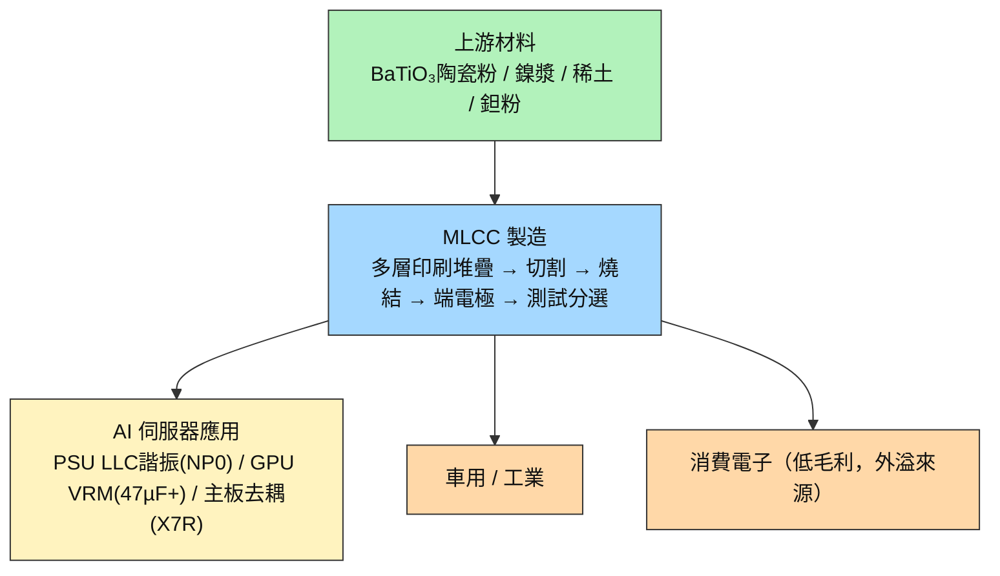

# 技術_MLCC

## 定義

MLCC（Multilayer Ceramic Capacitor，積層陶瓷電容），由數百至上千層陶瓷介電層與金屬電極交替堆疊製成。作為電路中的「局部儲能元件」，負責穩定電壓、濾除雜訊、快速響應瞬態電流。AI 伺服器中每個 GPU/ASIC 核心電壓約 0.8V、電流高達數百安培，任何納秒級的電壓偏移都可能導致晶片失效——MLCC 是防止這種情況的關鍵元件。

**為什麼現在重要**：AI 算力世代升級（GB200 → GB300 → Rubin VR200）帶來雙重需求衝擊——單機架 MLCC 用量從 22,000 顆（HGX Hopper）跳升至 570,000 顆（VR200 NVL72），增幅 ~26x；同時規格從消費級跳升至高壓 NP0/高容 47µF+ 等 AI 專用品。日韓頭部廠（Murata/SEMCO）良率僅 ~50%、設備自製、擴產週期 2 年，供給彈性遠低於需求彈性，形成結構性緊缺至少延續至 2H27（MS 2026-06-22）。與 [[技術_800VDC供電架構]] 共同構成 AI 伺服器「電源側升級」的核心投資主線；詳見 [[供應鏈_被動元件]]。

## 圖解

圖說：MLCC 為通用元件，AI 伺服器是本輪利潤最高的應用場景；日韓頭部廠將消費品產能外溢至台廠，是台廠受惠的核心機制。

![[報告_NMR_MLCC_20210115_001.png]]
圖說：MLCC 積層陶瓷電容實物陣列（右側黃/橙色為鉭電容對比）——**產品示意圖，非製程或結構流程圖**，來源：Nomura 2021-01。

![[報告_NMR_MLCC_20210115_005.png]]
圖說：電容類型分類對比（電解質系：鋁電解/鉭電解/薄膜；電介質系：MLCC）——**產品示意圖，非製程或結構流程圖**，來源：Nomura 2021-01。

## 技術原理

| 模組 | 功能 | 觀察重點 |
|------|------|----------|
| 陶瓷介電層（BaTiO₃基） | 儲能媒介；介電常數決定容量上限 | AI 用 47µF+ 需數百至上千層；層數越多，切割精度與燒結良率要求越高 |
| 鎳內電極 | 電荷傳導層，與介電層交錯堆疊 | 電極間距 <1µm；設備精度門檻高，廠商自製多層堆疊機，無法外購 |
| 外部端電極（Ni/Sn） | 與 PCB 焊墊接合，提供電氣連接 | 材質影響 ESR（等效串聯電阻）與耐熱性；AI 伺服器 PSU 對 ESR 要求更嚴 |
| 燒結製程（隧道窯） | 將生坯燒結成緻密陶瓷體，決定電氣特性 | 燒結爐為廠商自製；燒結條件差異直接影響良率——AI 規格良率 ~50% vs 消費品 99.5% |
| 測試分選 | 依容值/耐壓/損耗角分選出貨 | AI 用品規格公差窄，分選不合格率高，是實際有效產能的關鍵卡脖 |

**與一般電解電容的差異**：傳統鋁電解電容用液態電解質，有液態洩漏與壽命短等問題；MLCC 全固態結構可靠性高，但 AI 規格要求的超高層數使良率與設備門檻遠超消費品，形成日韓廠商的護城河。台廠在 AI 用高端品市占低（合計 <10%），受惠主要來自消費品外溢訂單。

## 關鍵參數 / 判斷指標

| 指標 | 意義 | 投資觀察 |
|------|------|----------|
| 高容量（47µF+）合約漲價時程 | AI MLCC 核心規格，Rubin 世代佔比升至 30%+ | 若 2H26 跟進漲價（MS 預估），[[2327_國巨（市）]] / [[3026_禾伸堂（市）]] 毛利直接改善 |
| 雲端 AI 47µF+ 需求（bn 顆） | 2025E 4bn → 2026E 10bn → 2030E 38bn（MS 6/22） | YoY +150% 是 2026 核心需求確認指標；季度出貨量是領先訊號 |
| Murata / SEMCO 產能利用率 | 兩家合計 85% 高端市占，決定外溢訂單規模 | 持續高利用率 → 台廠訂單窗口延長；Murata 2x capacity 提前落地 → 外溢效應縮短 |
| AI 用 MLCC 良率（目前 ~50%） | 良率決定有效產能，是高端 MLCC 最大隱性瓶頸 | 良率提升慢 → 緩解時程延後，對有庫存台廠相對有利 |
| 現貨 vs 合約價差倍數 | 2017-18 超級週期峰值 10-20x；目前 ~6x（部分規格） | 倍數持續擴大 → 缺口未解除；倍數縮小是週期見頂早期訊號 |
| Rubin VR200 量產時程 | VR200 單機架用量是 GB300 的 +78%（570K vs 320K 顆） | 2026H2 樣機 → 2027 量產；提前放量直接拉動 2026 需求曲線 |

## 產業動能

- **AI 伺服器 MLCC 用量世代跳升**：MS 2026-06-22（[[報告_MS_MLCC超級週期_20260622]]）統計，VR200 NVL72 全機架 MLCC 用量 570K 顆（vs GB300 320K 顆，+78%），完整機架對比一般伺服器達 ~290x。47µF+ 高容 MLCC 雲端 AI 需求 2026E 10bn 顆（+150% YoY）。
- **Rubin BOM content 暴增拉動台廠**：[[報告_國票_國巨2327_20260617]] 2026-06-17 分析，VR200 被動元件 BOM 從 GB300 的 USD 1.2-1.5 萬升至 USD 3.5-4.5 萬（+3x），[[2327_國巨（市）]] 作為 Rubin 全方位供應商（MLCC+鉭電容+電感+電阻）受惠。
- **漲價週期啟動確認**：[[報告_廣發HK_MLCC產業_20260615]] 2026-06-15 記錄深圳現貨部分規格 YTD 漲 ~6x；台灣 ODM 低容漲 5-100%，合約客戶漲 20-30% QoQ；預期 2026Q3 高容 105/106 跟進、電阻漲 ~50%。
- **SEMCO 矽電容大單揭示下世代路線**：MS 2026-06-22（[[報告_MS_MLCC超級週期_20260622]]）揭露 SEMCO 與全球科技客戶簽 KRW 1.5 兆矽電容供應協議，2027-28 年貢獻營收；顯示日系廠商已在佈局 ABF 基板嵌入式矽電容，作為傳統 MLCC 的升級路線。
- **專家閉門確認供需缺口**：[[活動_大摩閉門_存儲MLCC_20260612]]（2026-06-12）與 [[活動_MLCC_專家會議_20260623]]（2026-06-23）均指向 2H26-2027 高容 AI MLCC 供需缺口持續，設備自製 + 擴產週期 2 年是核心制約。
- **中系廠商切入中段市場**：[[報告_銀河證券_MLCC深度報告_20260528]] 2026-05-28 指出 CCTC（三環集團）等進入中系 AI 伺服器供應鏈，影響中段市場格局，但高端 AI 品短期仍由日韓主導。

## 概念股 / 族群

| 類型 | 廠商 | 角色 | 觀察點 |
|------|------|------|--------|
| 台廠 MLCC 龍頭 | [[2327_國巨（市）]] | 全球 MLCC 第三、電阻第一、鉭電容第一；Rubin 全方位供應商 | 47µF+ 合約漲價時程；目標價 NT$355（MS，2026-06-12） |
| 台廠高壓 NP0 | [[3026_禾伸堂（市）]] | AI PSU LLC 諧振電容（NP0）台廠代表，市占 >60% | 禾伸堂 NP0 獨占性；漲價轉嫁速度 |
| 台廠電感 | [[3357_台慶科（市）]] | GPU VRM TLVR 電感第二大廠 | TLVR 跟漲時程；佔 AI 伺服器 TLVR 需求比重 |
| 日廠龍頭 | 村田製作所（未建頁） | 45% 高端 MLCC 市占；AI server 2x capacity 擴產中 | 擴產時程是台廠訂單外溢的反指標 |
| 韓廠龍頭 | SEMCO（未建頁） | 40% 高端市占；積極佈局矽電容（2027-28） | 矽電容大單能見度；內嵌式技術對傳統 MLCC 的替代速度 |
| 台廠 MLCC 二線 | 華新科（2492，未建頁） | 消費端為主，AI 訂單外溢受惠 | 訂單外溢比重；毛利改善幅度 |

> [!note] 信心水準
> **高（已有法說/報告支撐）**：國巨受惠方向（MS TP NT$355 2026-06-12）、禾伸堂 NP0 AI PSU 地位（[[供應鏈_被動元件]]）、台慶科 TLVR 第二大地位。
> **低（待公告確認）**：各廠具體合約漲價幅度與季度時程、台廠個別進入 Rubin 平台的 BOM 佔比。

## 技術瓶頸 / 風險

- **設備自製 = 擴產週期 2 年**：MLCC 多層堆疊機、燒結爐均為廠商 in-house 設備，無法向外採購；景氣好轉後新增產能最快需 24 個月，短期供給無法快速回應需求。
- **良率壁壘鎖死有效產能**：AI 用 47µF+ MLCC 良率 ~50%，實際消耗產能是名目產量的 2x 以上；良率改善需長時間製程優化，形成外部難以複製的隱性護城河，也是緩解缺口最大的變數。
- **產能不可互換**：車用 / 消費品規格（電氣特性、尺寸、耐壓）與 AI 伺服器用完全不同，產線無法快速切換；若消費電子景氣同步回升，將與 AI MLCC 競爭有限日韓產能。
- **日韓雙寡占護城河**：Murata（45%）+ SEMCO（40%）合計 85% 高端市占，台廠訂單本質是「外溢」而非「搶市占」；一旦日韓頭部廠提前完成擴產，外溢訂單可能快速回流，台廠議價空間縮小。
- **矽電容 / 嵌入式 MLCC 替代風險**：SEMCO 主導的 ABF 基板嵌入式矽電容（2027-28 量產）若加速普及，GPU 核心電壓側的部分傳統 MLCC 需求面臨替代壓力（受影響程度 [待查證]）。

## 技術趨勢（◇）

### 內嵌式 MLCC（Embedded MLCC）

下一代 AI 伺服器 ABF 基板將直接整合 MLCC，縮短電流路徑、提升電源完整性。SEMCO 為主要推動者，已公告 2027-28 年向某全球科技客戶提供 KRW 1.5 兆（約 USD 1bn）矽電容供應協議。

### 矽電容（Silicon Capacitor）

SEMCO 以 DRAM 衍生的電容結構在 300mm 晶圓上製造，Fabless 模式（委外晶圓廠+OSAT），主要針對 AI 晶片先進封裝。2027 年開始貢獻營收。

## AI 伺服器 MLCC 用量詳表（參考）

| 平台 | MLCC 用量（顆） | 相對一般伺服器 | 資料來源 |
|------|--------------|-------------|---------|
| 一般伺服器 | 2,000 | 基準 | MS 6/22 |
| HGX Hopper（8x GPU）| 22,000 | 11x | MS 6/22 |
| HGX B300（8x GPU）| 48,000 | 24x | MS 6/22 |
| GB200 NVL72（全機架）| 319,500–337,500 | ~160x | MS 6/22、廣發 6/15 |
| VR200 NVL72（Rubin 全機架）| 570,000–581,000 | ~290x | MS 6/22、廣發 6/15 |
| Vera Rack | 494,048 | ~247x | MS 6/22 |
| AWS STX Rack | 326,256 | ~163x | MS 6/22 |
| AWS LPX Rack | 581,024 | ~290x | MS 6/22 |

## 全球市場規模（參考）

| 年度 | 全球 MLCC 市場（USD bn）| YoY | 雲端 AI 47µF+ 需求（bn 顆） |
|------|----------------------|-----|--------------------------|
| 2025E | 14.7 | — | 4 |
| 2026E | ~17 | +16% | ~10（+150%）|
| 2027E | ~20 | +18% | — |
| 2028E | 24.3 | — | — |
| 2030E | — | — | 38 |

CAGR 2025-28E：18%（vs 過去 10 年平均 6.5%）。資料來源：MS 2026-06-22。

## 漲價週期（2025-2026）（參考）

### 漲價路徑

1. **2025Q4**：Murata/SEMCO 首先對 IT MLCC 漲價（消費低容先漲）
2. **2026Q1**：Taiyo Yuden 對消費/車用低容 MLCC 漲 6-13%
3. **2026Q2**：台灣 ODM 低容 MLCC 漲 5-100%（視規格），合約客戶漲 20-30% QoQ
4. **2026Q3（預期）**：高容 105/106 跟進漲價；電阻漲 ~50%（廣發 6/15 預估）
5. **2026H2-2027**：供需缺口持續，進一步漲價

### 現貨 vs 合約價差

2026 深圳現貨（部分規格，0805 27µF）YTD 漲 ~6x；Taiyo Yuden 等廠商合約漲 20-30% QoQ。MS 指出 2017-18 超級週期峰值現貨漲幅達 10-20x，目前漲幅仍遠低於峰值。

### 比較：2018 vs 2026 超級週期

| 特性 | 2017-18 超級週期 | 2025-26 超級週期 |
|------|---------------|---------------|
| 主驅動 | EV 採用 + 5G 智慧機 | AI 伺服器 + AI 推理 |
| 性質 | 量需求（volume）| 規格升級（quality）+ 量需求 |
| 持續性 | 1-2 年 | 結構性，預估 3 年以上 |
| 峰值漲幅 | 現貨 10-20x | 目前 5-10x，遠低於峰值 |
| 供應回應速度 | 較快 | 較慢（高端設備內製、良率低） |

## 相關技術

- [[供應鏈_被動元件]]（MLCC 在 AI 伺服器 BOM 的完整供應鏈位置）
- [[技術_800VDC供電架構]]（800V HVDC 升級拉動高壓 NP0/MLCC 需求）
- [[技術_ABF載板]]（嵌入式 MLCC / 矽電容的下世代載板整合）

## 來源

- [[報告_MS_MLCC超級週期_20260622]] — Morgan Stanley，2026-06-22（市場規模、供需、廠商分析、SEMCO 矽電容大單）
- [[報告_廣發HK_MLCC產業_20260615]] — 廣發HK，2026-06-15（漲價觀察、VR200 用量、電阻漲價）
- [[報告_GS_MLCC產業_20251015]] — Goldman Sachs，2025-10-15（早期 MLCC 供需緊俏判斷）
- [[報告_JPM_MLCC產業_20260403]] — JPMorgan，2026-04-03（供需結構）
- [[報告_銀河證券_MLCC深度報告_20260528]] — 銀河證券，2026-05-28（中國市場視角）
- [[報告_GS_國巨2327_20251031]] — Goldman Sachs，2025-10-31（國巨 AI 曝險 10-12%）
- [[報告_國票_國巨2327_20260617]] — 國票投顧，2026-06-17（Rubin BOM 暴增分析）
- [[活動_大摩閉門_存儲MLCC_20260612]] — Morgan Stanley 閉門，2026-06-12
- [[活動_MLCC_專家會議_20260623]] — 專家會議，2026-06-23
- [[報告_国信证券_MLCC行業十問十答_20260623]] — 国信证券，2026-06-23
- [[報告_JPM_MLCC供需偏緊_村田6981JP]] — JPMorgan

## 相關頁面

- [[4760_勤凱（市）]]
- [[2327_國巨（市）]]
- [[3026_禾伸堂（市）]]
- [[3357_台慶科（市）]]
- [[供應鏈_被動元件]]
