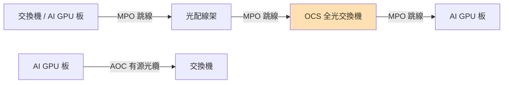

# 技術_MPO

## 定義

**MPO**（Multi-Fiber Push On）是多芯光纖連接器，適用於設備之間短距至長距互聯，是 AI 資料中心光纖配線基礎設施的核心被動器件。MPO 核心是插芯（Ferrule），含多根平行排列的光纖，通過彈簧加壓對準實現低插損連接。

**AOC**（Active Optical Cable）是預裝了固定長度光纖並集成兩端光模塊的一體化產品，主要用於短距離互聯（3–30 米，90% 需求）。MPO 與 AOC 在機柜內短距場景互為競爭關係。

**MMC**（Multi-Mode Connector，或 Senko SN-MT）是新一代連接器，正快速替代 MPO 在 AI 機柜 800G/1.6T 速率下的應用，單連接頭價值是 MPO 的 **4–5 倍**。

## 圖解

## 技術原理

### MPO 芯數演進（隨速率升級）

| 速率 | MPO 芯數 | 備註 |
|------|---------|------|
| 400G（8 通道）| 12 芯（實際用 8，餘 4 備用）| 目前量最大的規格 |
| 800G / 1.6T | 16 芯 | 逐步從 12 芯轉向 16 芯 |
| CPO 交換機中板 | 32 芯（分 2×16）| 未來 CPO 機柜內板連接 |

- 未來 16 芯占比將提升，先達 1:1 比例後以 16 芯為主；24 芯在北美有應用但因換線順序麻煩不會成主流。

### MPO vs AOC

| 特性 | MPO | AOC |
|------|-----|-----|
| 形態 | 連接器 + 光纖跳線 | 整合光模塊 + 固定長度光纜 |
| 維護 | 可任意更換光纖 | 固定長度，不易更換 |
| 適用距離 | 短至長距（配合 OCS）| 3–30 m（短距主力）|
| CSP 採用 | Google TPU 集群（配合 OCS）| Google 2025 年 60 萬條 → 2026 年 100–120 萬條 |
| 趨勢 | AI DC 長期主力（OCS 帶動）| 短期仍增長 |

**Google 為何選 MPO**：TPU 集群光模塊插在板卡上，通過 MPO 連至光配線盒，再通過 OCS 全光交換實現分路；只有 TPU 端需光模塊，其餘部分無需，MPO 方案更省光模塊。

### MMC 取代 MPO 趨勢

- 800G/1.6T/3.2T 交換機柜內 MPO 連接**確定性被 MMC 替代**（或 Senko SN-MT、US Conec MTP/MPO-16）
- 2026 年是 MMC 產品快速放量滲透年
- MMC 連接頭價值 = MPO 的 **4–5 倍**

## 市場規模

| 指標 | 數值 | 備註 |
|------|------|------|
| 全球 MPO 接頭年量 | 數億只 | AI DC 用量約 2–3 億只 |
| 全球 MPO 市場（2024）| ~14.5 億 USD | Future Market Report |
| 全球 MPO 市場（2026E）| ~17 億 USD | QYR 預測 |
| 2028 年趨勢 | 持續增長 | AI DC 需求主導 |

## 關鍵參數 / 判斷指標

| 指標 | 意義 |
|------|------|
| MPO 芯數轉換（12→16）| 觀察 800G/1.6T 滲透速度 |
| MMC 放量（2026）| 高單價替代，提升 ASP |
| Google MPO 采購量 | 判斷 OCS 部署規模 |
| AOC 條數增長 | Google 2025→2026：60→100–120 萬條 |

## 技術瓶頸 / 風險

- **光纖供應緊張**：藤倉預計緊張延續至 2027 Q2；2026 年缺口 15–20%；多模光纖 2026 年預計首超 50% 資料中心佔比。
- **插芯精度要求**：MPO 插芯是核心壁垒（模具設計/製造），一套模具大幾十萬元，存在磨損修模需求。但有插芯能力的廠商轉做總成難度不大。
- **北美供應鏈壁壘**：Meta/AWS/Microsoft/Oracle 等優先選擇康寧/康普/AFL 等美國企業；中國廠商多以代工方式進入（太辰光、仕佳光子）。

## 競爭格局

### 全球 MPO 綜合布線格局

| 廠商 | 地位 | 代工關係 |
|------|------|---------|
| 康寧（Corning）| 北美首位，市占合計 >50% | 太辰光代工部分 |
| 康普（CommScope，安費諾收購）| 北美第二，合計 >50% | 仕佳光子代工 |
| AFL、Senko、Panduit、Molex | 其他重要供應商 | — |

### Google MPO 供應鏈（最開放中國供應商的 CSP）

| 廠商 | 份額 | 角色 |
|------|------|------|
| 太辰光（未建頁，中國）| 60–70% | Google MPO 跳線一供 |
| 仕佳光子（未建頁，中國）| 20–30% | Google MPO 跳線二供 |
| 長芯盛（未建頁，中國）| — | 同時自有品牌＋代工；母公司長飛是 Google 股東 |

中國廠商在插芯供應占全球 **50%+**，但品牌端仍以美國廠商為主。

## 關鍵廠商

| 環節 | 廠商 | 角色 |
|------|------|------|
| 光纖原材料 | 藤倉（未建頁，日本）| 全球 DCI 市占 ~30%；公司份額 35–40% |
| 台灣 FAU / 光纖被動件 | [[3363_上詮（櫃）]] | 光纖被動元件，FAU 台系供應商 |
| 光纖被動元件 | [[6291_沛亨（市）]] | 台系光纖被動元件廠 |
| 台系光纜 | [[6442_光聖（市）]] | 高芯數光纜，Torpedo Cable for Google OCS |

## 相關技術

- [[技術_FAU]]（FAU 是 MPO 結構中的核心對準器件）
- [[技術_光互連]]（MPO 在光互連整體架構中的定位）
- [[技術_CPO]]（CPO 交換機中板使用 32 芯 MPO）
- [[技術_光模塊]]（AOC 含光模塊，與 MPO 競爭）

## NVIDIA CPO 交換機 MPO 規格

NVIDIA Quantum X800-Q3450 InfiniBand CPO 交換機：
- **144 個單模 MPO 端口**（交換芯片到前面板，使用單模光纖）
- **36 個保偏 MPO 端口**（PMF，連接外置激光源 ELS）
- NVIDIA 提出以單模光纖 + 硅光偏振控制替代傳統保偏光纖（降成本方向）

## 來源

- [[memo_光互联学习记录_MPO产业链_CPO设备_acecamptech_20260417]]（MPO 芯數演進、市場規模、插芯格局、國產代工）
- [[memo_光通信调研_MPO_AOC_硅光芯片_acecamptech_20260417]]（MPO vs AOC、Google 採購量、太辰光/仕佳光子地位、多模光纖漲價）
- [[memo_光学习系列_DR_FR_单模多模_WDM_acecamptech_20260412]]（NVIDIA Quantum X800-Q3450 MPO 端口規格；DR/FR 選型依據）
