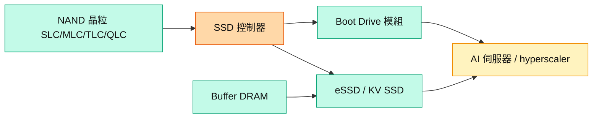

# 技術_NAND快閃記憶體

## 定義
NAND 快閃記憶體是非揮發性儲存的主流介質，以浮閘/電荷儲存 bit，依每 cell 存放位元數分 SLC（1）、MLC（2）、TLC（3）、QLC（4）。與 DRAM 的差別在於非揮發、容量大、速度較慢、單位成本低。

為什麼現在重要：AI 推論（inference）帶動 NAND 需求結構轉變——**KV Cache** 把原本放在昂貴 DRAM 的推論快取，改放到速度較慢但大容量的高效 NAND SSD；伺服器 SSD 由 NVIDIA 帶動。大和與 MS 均指投資人看好 NAND 更勝 DRAM（inference + KV Cache + 供給相對受限）。AI 占 NAND 需求由 2025 的 18% 升至 2027 的 41%（見 [[分析_記憶體超級循環2026]]）。

相關主線：[[供應鏈_記憶體]]、[[技術_HBM高頻寬記憶體]]。

## 3D NAND 製程路線圖（2020–2029）

![[20260521_0807_統一證to群益投信_記憶體技術概論與大廠現況分析_260520_013.png]]
*圖（統一證，2026-05-20）：主要 NAND 廠商製程推進（Ver. MN-2509-01 Simplified）。Samsung V8 236L（2025 量產）→ V9 286L → V10 4xxL；SK Hynix V8 238L → V9 321L；Kioxia/SanDisk BiCS8 218L（2025 量產）→ BiCS9 1yyL → BiCS10 332L → BiCS11 4xxL；Micron G8 232L → G9 276L；YMTC G5 Xtacking4 160L/267L（2026 紅框，加速擴張）；MXIC G1 48L → G2 92L → G3 192L。*

## 圖解

圖說：NAND 晶粒需搭 SSD 控制器（+ buffer DRAM）組成 eSSD／KV SSD 與 boot drive，供 AI 伺服器；控制器是價值與門檻關鍵環節。

## 技術原理
| 模組 | 功能 | 觀察重點 |
|------|------|----------|
| NAND cell（SLC/TLC/QLC） | 儲存位元 | QLC 位元密度較 TLC 高約 33%，改用 QLC 省 wafer |
| SSD 控制器 | 讀寫管理、韌體 | KV Cache 需高效 TLC，controller 至關重要 |
| Buffer DRAM | SSD 快取 | 缺貨時依賴南亞科等供給 |
| Boot Drive 模組 | 系統初始化、OS、log/telemetry | NVIDIA BlueField-3/4 標準化，用量提升 |

與一般消費 SSD 的差異：資料中心 eSSD 需高 IOPS/耐久/一致性；「Super High IOPS」SSD 若量產，估耗用 3x 一般 SSD 產能，進一步收緊供給。

## 關鍵參數 / 判斷指標
| 指標 | 意義 | 投資觀察 |
|------|------|----------|
| TLC vs QLC | 效能 vs 密度 | KV Cache 要高效 TLC；大容量走 QLC eSSD |
| eSSD 每 tray 容量 | AI rack 儲存密度 | ASIC in-rack 8–16TB、外掛 16–64TB |
| 3Q26 eSSD 漲價 | 循環強度 | TLC eSSD +30% QoQ，消費級僅微升 |
| 控制器市占 | 價值卡位 | SIMO 佔 BlueField-3 boot drive 控制器 100% |

## 產業動能
- **KV Cache 帶動 eSSD**：[[大和 韓國記憶體產業電話會議摘要]]（2026-07-02）指 KV SSD 由三星、美光為主，TLC 為關鍵，大容量 QLC eSSD 快速增加。
- **Boot Drive 標準化**：[[260702_ms_nand-industry]]（2026-07-02）指 [[SIMO.US(silicon_motion)]] 佔 BlueField-3 boot drive 控制器 100%；Vera Rubin 標準化後 BlueField-4 加入 [[8299_群聯（櫃）]]、[[2379_瑞昱（市）]]。
- **利基 SLC/MLC 緊俏**：MS 看好 [[2337_旺宏（市）]]（Top Pick，SLC/MLC）、[[2344_華邦電（市）]]（SLC）；3Q 漲 50–60%，enterprise HDD 轉用高密度 SLC。
- **模組廠模式改變**：LTA 使記憶體高檔維持 3–5 年，低成本庫存耗盡後模組廠毛利趨穩（[[分析_記憶體超級循環2026]]）。

## 概念股 / 族群
| 類型 | 廠商 | 角色 | 觀察點 |
|------|------|------|--------|
| NAND 原廠 | [[285A.JP(kioxia)]] | 純 NAND、hybrid bonding | MS 日本 Top Pick |
| NAND 原廠 | [[SNDK.US(sandisk)]] | QLC eSSD、DC 轉型 | datacenter 占比拉升 |
| NAND 原廠 | [[MU.US(micron)]]、[[005930.KR(samsung)]] | KV SSD 主供 | ASP、eSSD 產能 |
| SSD 控制器 | [[SIMO.US(silicon_motion)]] | boot drive/eSSD 控制器 | MonTitan eSSD、BlueField |
| SSD 控制器 | [[8299_群聯（櫃）]] | 模組 + 控制器 | Kioxia dummy die 支援、3Q26 高峰 |
| 利基 NAND | [[2337_旺宏（市）]]、[[2344_華邦電（市）]] | SLC/MLC | 資料中心/HDD 拉貨 |

> [!note] 信心水準
> Boot drive 控制器市占、SLC/MLC 緊俏、eSSD 漲價來自 MS 2026-07-02 產業報告與大和賣方會議，屬賣方研判與 channel check；個別台廠進入特定 NVIDIA 平台、MonTitan 客戶數仍待公司公告確認。台廠控制/利基股（慧榮 SIMO、群聯 8299、旺宏 2337、華邦 2344、瑞昱）本批尚未建個股頁，先整理於 [[供應鏈_記憶體]]。

## 技術瓶頸 / 風險
- **消費級觸頂**：2Q26 漲價後已見實際砍單，消費（手機/PC）pricing 恐近天花板、量能疲弱。
- **供給紀律 / YMTC**：2028 最大變數為長江存儲（YMTC）Fab4/5 擴產；若加速 greenfield，恐轉為過剩。
- **控制器/buffer DRAM 瓶頸**：SSD 需 buffer DRAM，DRAM 缺貨時 SSD 供給受限；controller 為門檻環節。
- **模組廠量能受限**：原廠產能移向 CSP，模組廠 2026–27 量增受抑，須靠組合升級。

## 相關技術
- [[技術_HBM高頻寬記憶體]]
- [[技術_CoWoS與先進封裝]]

## 來源
- [[260702_ms_nand-industry]] — 摩根士丹利，2026-07-02
- [[大和 韓國記憶體產業電話會議摘要]] — 大和，2026-07-02
- [[報告_統一證_記憶體技術概論與大廠現況分析_20260520]] — 統一證券，2026-05-20（3D NAND Roadmap Ver.MN-2509-01；廠商製程節點路線圖）

## 相關頁面
- [[供應鏈_記憶體]]
- [[分析_記憶體超級循環2026]]
