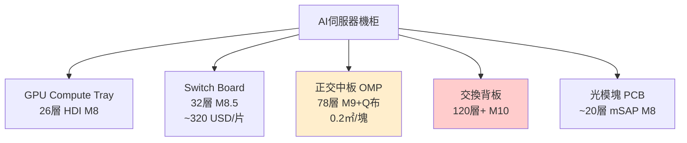

# 技術_PCB

## 定義

PCB（Printed Circuit Board，印刷電路板）是 AI 伺服器中連接各類芯片、模組、連接器的核心基板。AI 伺服器 PCB 與消費電子 PCB 的最大差異在於層數（26 層→120 層+）、材料規格（M6→M9/M10）與精度要求（HDI→mSAP），三者同步升級帶動 PCB 單片價值量大幅提升。

## 圖解

![[報告_Semianalysis_PCB_20250826_003.png]]
圖說：CCL/PCB 四層材料結構示意圖（Filler System / Resin System / Glass Fabric / Copper Foil），來源：SemiAnalysis 2025-08。

![[報告_Semianalysis_PCB_20250826_005.png]]
圖說：AI 伺服器機箱內部 PCB 配置實景（NVL 系統拆解），來源：SemiAnalysis 2025-08。

## 技術原理

### 層數與工藝演進

| 平台 / 板型 | 層數 / 結構 | 工藝 | 材料 | 單價 |
|------------|-----------|------|------|------|
| GPU Compute Tray（GB300/Rubin）| 24–26 層 6 階 HDI | HDI | M7–M8 | — |
| ASIC PCB（Google/AWS/Meta）| 28–34 層 | 高多層 | M7–M8 | — |
| Rubin OAM（VR200）| 26 層（7+12+7）| HDI | M8 | ~1,280 USD/片 |
| Google TPU7 | 22 層 | 高多層 | M7 | — |
| Google TPU8 | 40 層 | 高多層 | M8+ | — |
| AMD MI450 | 40 層 | 高多層 | M7 | — |
| Ultra Rubin OAM | 52 層（8+36+8）| mSAP | M9 | — |
| Google V7a | 44 層（16+2+26）| mSAP（2026-11 轉）| M8 | — |
| LPU 正交中板 | 78 層 | 高多層 | M9+Q布 | 1-3 萬 USD/柜 |
| 交換背板（下一代）| 120 層+ | 高多層 | M10+Q布+PTFE | — |
| 1.6T 光模塊 PCB | ~20 層 | mSAP | M8+HVLP4，20µm L/S | — |
| 800G 光模塊 PCB | ~20 層 | HDI | M6+HVLP3 | — |
| cowop PCB（Ultra Rubin，預計 2027）| — | CoWoP | — | — |

### 材料升級路徑

M6 → M7 → M8 → M8.5 → M9 → M9Q → M10（預計 2028 年）

M9 是當前世代關鍵分水嶺：Nvidia 2026 年率先採用，初期滲透率 <10%，2027 年預計提升至 70–80%。M9 單位面積售價是 M8 的 1.5–2 倍，PCB 價值量增幅 1.3–1.5 倍。

### Nvidia PCB 供應格局（2026）

| 廠商 | 2025 份額 | 2026 份額 | 備註 |
|------|----------|----------|------|
| 勝宏科技（中）| 60–70% | ~50% | 仍最大，但份額稀釋 |
| 景旺電子（中）| 20% | 20–30% | 正交背板進展快 |
| 方正科技（中）| 10% | ~10% | 維持 |
| 臻鼎（台）+ 深南（中）| 10%（合計）| 各 ~10% | 新進入者 |

### mSAP 工藝

mSAP（Modified Semi-Additive Process）適用於 20µm 以下線寬/間距的精細線路，是 1.6T 光模塊 PCB 和 Ultra Rubin OAM 的核心工藝。1.6T 光模塊 PCB 約 70% 採 mSAP，詳見 [[技術_mSAP]]。

### 正交背板

正交背板是 AI 超算機柜中連接 LPU 計算板與交換芯片的超高層數 PCB，機柜內成本占比最大。78 層良率目前約 50%。詳見 [[技術_正交背板]]。

## 關鍵參數 / 判斷指標

| 指標 | 意義 | 觀察重點 |
|------|------|---------|
| 層數 | PCB 複雜度代理指標 | 26→52→78→120 層對應不同良率與單價 |
| 材料規格（M7/M8/M9）| 決定 Dk/Df | M9 滲透率：2026 <10% → 2027 70–80% |
| mSAP 採用比例 | 1.6T PCB 核心 | 1.6T 約 70% 採 mSAP |
| PCB 價值量/㎡ | 定價能力 | 隨層數與工藝升級大幅提升（GPU 板→cowop→超高層背板）|
| 正交背板良率 | 量產可行性 | 目前 ~50%，需大幅提升 |

## 技術瓶頸 / 風險

- **M9 加工難度**：鑽針壽命從 3,000 次降至 200–300 次（用量增 10×）；CO₂ 激光不適用（導致分層），需皮秒超快激光
- **mSAP 設備瓶頸**：關鍵設備已排到 2027 年交付
- **正交背板良率低**：目前約 50%，限制量產節奏
- **M10 PCB 驗證中**：英偉達指定勝宏/深南/金像/滬電四家打板，2026 年 6 月初完板、8–9 月出完整測試結果，完全量產至少到 **2027 年底**；M9 良率 <70%，M10 更低
- **供需反轉時點**：AI PCB 供需緊缺至 **2026 年全年 + 2027 年上半年**；產能過剩最早 2027 年下半年–2028 年

## 關鍵廠商

| 環節 | 廠商 | 角色 |
|------|------|------|
| 1.6T mSAP PCB（台灣）| [[3037_欣興（市）]] | 1.6T 光模塊 mSAP PCB 全球最大份額，台灣領先 |
| AI GPU PCB（台灣）| [[4958_臻鼎（市）]] | Rubin 新進入者，2026 份額 ~10% |
| CCL 材料（台灣）| [[2383_台光電（市）]] | M9 CCL 唯一 Nvidia NPR；VR200 OAM 獨家 |
| CCL 材料（台灣）| [[6274_台燿（市）]] | 台系 CCL 第二，M7–M8 |
| 鑽針（台灣）| [[8021_尖點（市）]] | PCB 鑽針龍頭，M9 用量大增 |
| 石英布（中國）| 菲利華（中國，未建頁）| 中國唯一量產 Q布 廠商 |
| 激光設備（中國）| 大族數控（中國，未建頁）| CO₂ 市占 20–30%，皮秒超快領先 3–5 年 |
| 正交背板 78L+（中國）| 東山精密（中國，002384.SZ，未建頁）| 通過 M8/M9 認證，**2026 年下半年**小批量出貨 Nvidia GB200/Rubin 正交背板 |
| PCB 背鑽設備（台灣）| [[3167_大量科技（市）]] | CCD 背鑽機 + TM4 量測機捆綁方案，業界唯一 ±2 mil 量產能力 |

## 應用場景

- AI 伺服器計算板（GPU/CPU/ASIC Compute Tray）
- Switch Board（交換板）
- 正交中板 / 交換背板
- 1.6T / 800G 光模塊 PCB

## 相關技術

- [[技術_CCL]]（PCB 核心原材料，M7/M8/M9 等級）
- [[技術_Q布]]（石英布，M9/M10 PCB 必用，限制 CO₂ 激光）
- [[技術_mSAP]]（1.6T 光模塊 PCB 和 Ultra Rubin 核心工藝）
- [[技術_正交背板]]（AI 機柜核心超高層 PCB）
- [[技術_HVLP銅箔]]（M8/M9 PCB 配套銅箔）
- [[技術_ABF載板]]（PCB 上層的 IC 封裝載板）
- [[技術_背鑽]]（224G+ Stub Effect 去除，背鑽設備需求）

## 供應鏈

→ [[供應鏈_AI伺服器PCB]]

## 關鍵製造設備

### 鑽孔設備（Q布/M9 帶動皮秒超快激光需求）

- Q布硬度遠高於傳統玻纖布，機械鑽孔鑽針用量 5×（1,000 孔→200 孔即需換）
- M9/Q布 要求孔徑 75µm 以下：**CO₂ 熱加工導致分層，皮秒超快激光是唯一可行方案**
- 一條服務器 PCB 量產線：需 **2–3 台皮秒設備**（vs 原 1 台 CO₂，台數接近翻倍）
- 2026 年 Q3 正式量產，Q4 進入爬坡高峰；2027–2028 行業景氣高峰

主要設備廠商：

| 廠商 | 定位 | 皮秒單價 |
|------|------|---------|
| 大族數控（大族激光 51% 子公司）| 中國 CO₂ 市占 20–30%；皮秒領先競爭對手 **3–5 年** | — |
| 英諾激光 | M9 材料已完成打樣驗證；2026 Q2–Q3 量產 | — |

詳見 [[技術_PCB鑽孔設備]]。

### 背鑽製程與 Stub Effect（高速訊號完整性需求）

PCB 壓合後通孔（Through-hole Via）貫穿全板，但訊號往往只在特定層間傳遞，未使用的孔段殘存銅壁即為**殘樁（Stub）**。訊號速率超過 224Gbps 後，殘樁在高頻下如微型天線，引發訊號反射與阻抗不連續（**Stub Effect**），造成嚴重訊號失真，傳統通孔結構無法滿足。

**背鑽（Back Drilling）**是解決方案：在全板電鍍與線路製作完成後，使用比原通孔略大的鑽頭從板背二次鑽入，將多餘殘銅徹底去除，同時不傷及目標導通層。核心難點在**精準控深**：壓合膠片受熱漲縮使板厚非固定值，必須先透過 CCD 量測 X/Y 漲縮靶位、TM 系統光測 Z 軸實際深度後再鑽孔。

| 訊號速率需求 | 製程要求 | 控深精度 |
|------------|---------|---------|
| 56G SerDes | 傳統機械鑽孔可行 | — |
| 112G SerDes | 背鑽開始普及 | D+6 |
| **224G SerDes / 1.6T 光模塊** | CCD 高階背鑽成必要 | **D+4（±2 mil）**，CPK > 1.67 |

- NVIDIA Rubin 要求 edge gap 從 50μm 降至 **25μm**，光模塊成型機也需導入 CCD
- 孔洞密度到臨界點後，通孔製程也開始導入 CCD（通孔台數 > 背鑽台數），TAM 大幅擴增
- 能做到 ±2 mil 的設備廠商：[[3167_大量科技（市）]]（CCD + TM4 捆綁）與 Schmoll（德，未建頁）

詳見 [[技術_背鑽]]。

## 來源

- [[memo_PCB_CCL调研_GB200_300_Rubin_M9_acecamptech_20260519]]
- [[memo_PCB覆铜板调研_北美芯片平台_Q布_acecamptech_20260511]]
- [[memo_PCB市场调研_VR200_UltraRubin_OAM_mSAP_acecamptech_20260518]]
- [[memo_PCB龙头专家_ABF_BT载板_正交背板_acecamptech_20260519]]
- [[memo_PCB调研_Rubin_正交背板_M8PTFE_acecamptech_20260518]]
- [[memo_CCL规格升级_M9_Q布_Rubin_BackPlane_acecamptech_20260410]]
- [[memo_CCL龙头调研_高端CCL供需紧缺至2027_M10_acecamptech_20260518]]（M10 四家打板測試時程、M9/M10 良率）
- [[memo_AI_PCB与光模块一体化驱动_2026业绩爆发_acecamptech_20260610]]（東山精密正交背板、AI PCB 供需展望 2027H2）
- [[memo_PCB激光钻孔设备_大族_英诺_acecamptech_20260511]]（四類鑽孔設備分類、大族數控/英諾激光規格）
- [[memo_PCB钻孔设备竞争格局_大族激光_石英布_acecamptech_20260514]]（大族 2025 年營收、Q布影響、行業景氣節奏）
- [[memo_PCB多層板製程_20260524]]（多層板製程全流程、Stub Effect 原理、背鑽製程說明）
- [[memo_大量科技背鑽CCD_TM4_20260524]]（CCD 背鑽機需求、TM4 量測、大量科技競爭地位）

## 相關頁面

- [[技術_矽微粉]]
- [[技術_背鑽]]
