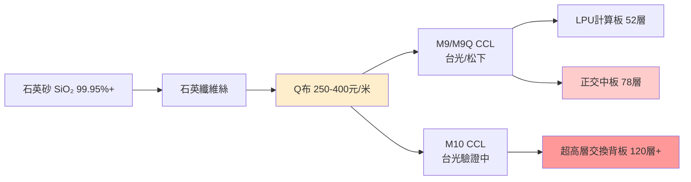

# 技術_Q布

## 定義

Q布（石英布，Quartz Fiber Cloth）是以高純石英玻璃纖維（SiO₂ ≥99.95%）織成的電子布，是 AI 伺服器 M9/M10 等級 **PCB CCL** 的核心基材。屬於電子布的第三代（第一代 E-glass → 第二代 T-glass/Low CTE（ABF 載板 CCL）→ 第三代 Q-glass/石英布（高端 PCB CCL））。與 T-glass 相比，CTE 低一個數量級，但價格是 T-glass 的 3–5 倍、良率更低、脆性更大；未來 3–5 年內 T-glass 仍為 ABF 載板 CCL 主流，Q布與 T-glass 在 Rubin 平台中混合使用。

## 圖解

## 技術原理

### 三代電子布比較

| 特性 | 第一代：E-glass（普通布）| 第二代：T-glass（低 CTE，ABF CCL 用）| 第三代：Q-glass（石英布，PCB CCL 用）|
|------|------------------|------------------|-------------|
| 主要用途 | 消費電子 PCB CCL | **ABF 載板 CCL**（Resonac 為 CCL 廠）| **高端 PCB CCL M9/M10** |
| CTE | 高 | 中低 | **極低**（比 T-glass 低一個數量級）|
| Dk（@1 GHz）| ~6.0 | ~5.0 | ~3.5–4.0（更低）|
| Df（@1 GHz）| ~0.002–0.004 | — | ~0.001（更低）|
| 售價（2026-03）| 2–4 元/米 | **150–160 元/米**（2020年僅30元，漲5倍）| **250–400 元/米**（T-glass 的 3–5 倍）|
| 機械鑽孔鑽針壽命 | ~1,000 孔/支 | — | **~200 孔/支**（下降 80%）|
| 適用激光類型 | CO₂、UV、皮秒均可 | — | **只能用皮秒/飛秒超快激光** |
| 良率 | 正常 | 正常 | **較低、脆性大** |
| 目前庫存 | 充足 | 緊缺（Low CTE 月需求 30萬米，供應上限 10萬米）| **僅幾萬米**（幾乎全用於送樣驗證）|
| 主要供應商 | 多家 | 日東紡 Nittobo（主導，~90%）| 日東紡（Nvidia 唯一認證）、菲利華（中國）|

### 為何 AI 算力板需要 Q布

AI 伺服器訊號速率升級（400G→800G→1.6T→3.2T）要求 PCB 介質 Dk/Df 持續降低。普通 E-glass 在 M8 以上已接近極限，正交背板（78 層/120 層+）、LPU 計算板（52 層）所需的 M9/M10 CCL 必須使用 Q布作為介質基材。

### 激光鑽孔限制（核心投資含義）

Q布硬度極高，CO₂ 紅外激光（10.6µm）熱加工會導致 Q布/M9 基材分層，因此：

- **75µm 以下盲孔（Blind Via）= 皮秒超快激光唯一可行**
- 貫通孔（Through Hole）仍需機械鑽孔，但鑽針磨損加速 5 倍（200 孔即更換）
- 一條 AI 伺服器 PCB 量產線需 **2–3 台皮秒設備替代原先 1 台 CO₂**（台數接近翻倍）
- 激光鑽孔設備訂單已排到 2027 年交付

## 關鍵參數 / 判斷指標

| 指標 | 數值 | 意義 |
|------|------|------|
| 售價 | 250–400 元/米（國內）；國外高 20–30% | 相較 E-glass 貴 100 倍以上，供需緊時溢價大 |
| 目前可囤積量 | 僅幾萬米 | 幾乎都用於送樣驗證，幾無商業庫存 |
| Nvidia 認證供應商 | 僅日東紡（Nittobo）| 供應高度集中，替代需 1–2 年 |
| 機械鑽針壽命 | ~200 孔（vs E-glass 1,000 孔）| 鑽針耗材用量大增 |

## 技術瓶頸 / 風險

- **供應極度集中**：全球僅日本信越、旭化成（多供航天）、菲利華（中國）具備量產能力；Nvidia 認證目前只有日東紡
- **認證周期長**：通過 Nvidia 認證需 1–2 年，進入壁壘極高
- **激光設備瓶頸**：皮秒超快激光鑽孔機需求激增，供應商設備訂單排到 2027 年
- **囤積難度高**：商業庫存幾乎不存在，無法提前備貨平抑波動

## 供應格局

| 供應商 | 狀態 | 備註 |
|--------|------|------|
| 日東紡 Nittobo（日本）| **Nvidia 唯一認證供應商** | 現有 ~1,000 萬米/年；2026Q4 新廠達 ~3,000 萬米（3 倍）|
| 日本信越 （日本）| 量產 | 主要供航天，AI 供量有限 |
| 旭化成（日本）| 量產 | 大部分供航天 |
| 菲利華（中國，未建頁）| **中國唯一量產認證廠** | 2026Q3 新增 ~1,000 萬米年產能 |
| 泰山玻纖（中國）| 測試中，進展相對快 | — |
| 中材科技（中國）| 尚不具備量產能力 | — |
| 國際復材、巨石、莱特光電 | 測試中 | — |

## 應用場景

- AI 伺服器 M9/M9Q/M10 CCL 的核心基材
- LPU 計算板（52 層，M9+Q布）
- 正交中板（78 層，M9+Q布）
- 超高層交換背板（120 層+，M10+Q布+PTFE）
- Ultra Rubin OAM（52 層）

## 相關技術

- [[技術_CCL]]（Q布為 M9/M10 CCL 必要基材）
- [[技術_PCB]]（Q布 PCB 對激光鑽孔工藝要求極高）
- [[技術_正交背板]]（正交背板必須使用 M9+Q布 或 M8+PTFE 材料體系）

## 來源

- [[memo_PCB覆铜板调研_北美芯片平台_Q布_acecamptech_20260511]]
- [[memo_PCB调研_Rubin_正交背板_M8PTFE_acecamptech_20260518]]
- [[memo_CCL规格升级_M9_Q布_Rubin_BackPlane_acecamptech_20260410]]
- [[memo_PCB激光钻孔设备_大族_英诺_acecamptech_20260511]]
- [[memo_PCB钻孔设备竞争格局_大族激光_石英布_acecamptech_20260514]]
- [[memo_日系CCL电子布采购_Nittobo_acecamptech_20260609]]
- [[memo_日本CCL龙头产品及供应链分析_acecamptech_20260427]]（三代電子布比較、T-glass vs Q-glass 定位）
- [[memo_CCL大厂调研_旭化成台玻泰山_电子布供需_acecamptech_20260511]]（Low CTE T-glass 供需：月需求 10→30 萬米，供應上限 10 萬米）

## 相關頁面

- [[技術_PCB鑽孔設備]]
