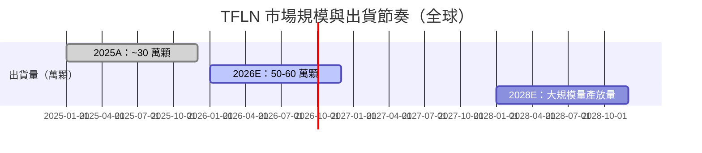

# 技術_TFLN

## 定義

TFLN（Thin-Film Lithium Niobate，薄膜鈮酸鋰）是一種基於薄鈮酸鋰薄膜的電光調製器芯片，利用鈮酸鋰材料優異的電光效應，實現高速低功耗的光訊號調製。在 1.6T CPO 光引擎中，TFLN 調製器是核心光子器件，取代傳統 InP 調製器方案。

TFLN 的核心優勢：低半波電壓（Vπ < 1V）、超高頻寬（>100 GHz）、低插損（< 3dB）。相較 EML（電吸收調製雷射），TFLN 調製器不需要 CW 雷射整合，配合外部 CW 光源使用，適合硅光 CPO 方案。

## 圖解



## 技術原理

### TFLN 在 CPO 中的角色

```
CW Laser（外置光源）→ TFLN 調製器（電光轉換）→ 光引擎（PIC）→ 光纖 → 交換芯片
```

TFLN 芯片是 CPO 光引擎的核心：將來自 CW 雷射的連續波光，依電訊號進行高速調製後送入光傳輸路徑。

### 出貨量追蹤（全球，各廠商調研）

| 年份 | 全球 TFLN 調製器出貨（萬顆）| 主要客戶 |
|------|------------------------|---------|
| 2025A | ~30 | 旭創 ~20、新易盛 ~5–6、博通 ~5–6 |
| 2026E | 50–60 | 旭創 ~40、新易盛 ~10、博通 ~10 |
| 2028E | 大規模放量（全球 CPO 爆發後）| — |

### TFLN 芯片定價（2026 年，人民幣）

| 速率 | 售價/顆 | 2028 降幅預期 |
|------|--------|-------------|
| 1.6T DR8 TFLN 調製器 | 800–1,200 元 | 降幅 10–15% |
| 3.2T 工程樣品 | 2,500–3,500 元 | 降幅 20–30% |
| CPO 專用 FAU（1.6T）| 300–400 元/個 | — |
| CPO 專用 FAU（3.2T）| 500–700 元/個 | — |

### 全球 1.6T 光模塊市場

- 2026 年全球 800G 光模塊需求：**~4,000 萬只**
- 2026 年全球 1.6T 光模塊出貨：**1,400–2,000 萬只**（所有技術路線合計）
- 其中 1.6T CPO 滲透率：2025 年 10–15% → 2026 年 >20%，出貨量 **300–400 萬只**

## 關鍵參數 / 判斷指標

| 指標 | 值 | 觀察重點 |
|------|----|----|
| 半波電壓（Vπ）| < 1 V | 越低越好，決定驅動電路複雜度 |
| 電光頻寬 | > 100 GHz | 決定是否支持 200G/lane |
| 晶圓尺寸 | 6 英寸主流，8 英寸能力已具備 | 大尺寸 = 降成本關鍵 |
| 2026 全球出貨 | 50–60 萬顆 | 觀察各廠商爬坡速度 |

## 技術瓶頸 / 風險

- **上游原料壟斷**：日本住友電工掌握高純度 Nb₂O₅ 原料（與巴西 CBMM 戰略合作），鈮酸鋰晶體純度 6N 級；日本信越為另一主要供應商。中國管控稀有材料後，住友擴產計劃停止。
- **晶片製造複雜**：200G EML 認證周期長（制程複雜、可靠性問題多）；CW 芯片認證門檻相對低。
- **3.2T 技術挑戰**：3.2T 時代以硅光（SiPh）為主，400G EML 製造難度極高、供應量有限；TFLN 3.2T 樣品仍在驗證。
- **CPO 滲透速度**：CPO 整體量產時間點預計 2028 年，2026–2027 以 NPO 為主過渡。
- **HyperLight（美）**：哈佛/MIT 背景，比中國同類產品貴約 50%，高端 CPO 市場有競爭。

## 產業格局

### 上游（鈮酸鋰原料與晶體）

| 環節 | 廠商 | 地位 |
|------|------|------|
| 高純度 Nb₂O₅ | 日本住友電工（未建頁）| 與巴西 CBMM 戰略合作，壟斷 6N 晶體 |
| 晶體 | 日本信越（未建頁）| 重要供應商 |
| 中國晶體 | 天通股份（未建頁）| 中國市占率高 |

### 中游（薄膜製造與調製器芯片）

| 廠商                 | 特點                | 地位                                 |
| ------------------ | ----------------- | ---------------------------------- |
| 晶正電子（未建頁，中國）       | 華為參股；薄膜廠商         | 國內薄膜龍頭                             |
| 光庫科技（未建頁，中國）       | 6 英寸大規模量產，具備 8 英寸 | 源自 Lumentum 米蘭產線（2019 收購），2024 年投產 |
| 鈮奧光電（未建頁，中國）       | 6 英寸大規模量產，具備 8 英寸 | 與光庫並列中國第一梯隊                        |
| HyperLight（未建頁，美國） | 哈佛/MIT 背景         | 比中國產品貴 ~50%                        |

### 下游（TFLN 芯片主要客戶）

| 客戶 | 2025 用量 | 2026 用量 | 備註 |
|------|---------|---------|------|
| 中際旭創（未建頁）| ~20 萬顆 | ~40 萬顆 | 最大客戶 |
| 新易盛（未建頁）| ~5–6 萬顆 | ~10 萬顆 | — |
| 博通 | ~5–6 萬顆 | ~10 萬顆 | CPO 驗證用 |

## 相關技術

- [[技術_CPO]]（TFLN 是 CPO 光引擎核心調製器）
- [[技術_光電芯片]]（TFLN 與 EML/SiPh 的競爭與定位）
- [[技術_FAU]]（TFLN CPO 配套 FAU 需求）
- [[技術_光模塊]]（TFLN 芯片用於 1.6T 光模塊）

## Nokia Bell Labs TFLN CPO 傳輸器（ECTC 2026）

Nokia Bell Labs（與 UC Davis 合作）在 ECTC 2026 發表首個 flip-chip 異質整合的 TFLN MZ 調製器 + 商用開集極驅動 IC：

| 指標 | 值 |
|------|----|
| Vπ·L（電壓半波長積）| **2.3 V·cm** |
| 調製器 EO 頻寬 | >50 GHz |
| 整合後系統 EO 頻寬 | **>45 GHz**（驅動器限制）|
| 驅動器熱點溫度 | ~68°C（無強制冷卻）|
| 驅動器到終端電阻距離 | 5 mm |

**概念驗證意義**：「TFLN PIC 當作電互連中介層」——驅動器 flip-chip 貼在 TFLN PIC 上，兩者距離僅 5 mm，比傳統 PCB 走線縮短 10 倍以上，是 CPO 傳輸器的新封裝正規化。

**限制**：耦合損耗 ~8 dB/facet（無 SSC），是商業化前需填補的缺口。

詳見 [[Nokia Bell Labs（未）]]

### 調變器路線比較（四線並進，ECTC 2026 後最新格局）

> 見 [[MRVL.US(marvell)]] Polariton 收購段落，規則 #14 變化點。

| 路線 | 代表廠商 | EO 頻寬 | 技術成熟度 |
|------|---------|---------|----------|
| Si MZM/MRM | 多數 SiPh 廠 | 50–60 GHz | 量產主流 |
| **TFLN** | Nokia Bell Labs / 光庫科技 / 鈮奧光電 | >50 GHz | 爬坡中（50–60 萬顆/年）|
| Plasmonics（SPP）| [[MRVL.US(marvell)]] / [[Polariton（未）]] | ~1 THz | 早期（Marvell 收購整合中）|
| EML（III-V）| [[Mitsubishi Electric（未）]] | 89 GHz | 量產（傳統光模塊），CPO 版驗證中 |

## 來源

- [[memo_光通信大厂调研_TFLN_CPO_OCS_acecamptech_20260417]]（光庫科技訪談；TFLN 出貨量/定價/競爭格局/上游供應）
- [[research_simpletechtrend_CPO矽光子ECTC2026_20260629]]（Nokia Bell Labs TFLN CPO 傳輸器 ECTC 2026；調變器四路線格局更新，2026-06-29）

## 相關頁面

- [[Sumitomo Electric（未）]]
- [[技術_OCI]]
- [[技術_光互連]]
- [[技術_矽光子（SiPh）]]
