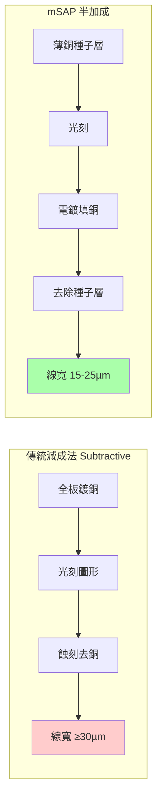
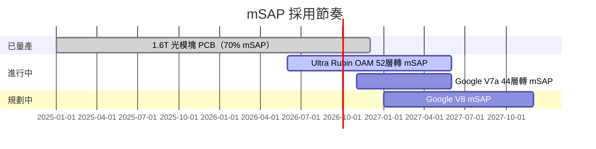

# 技術_mSAP

## 定義

mSAP（Modified Semi-Additive Process，改良半加成工藝）是一種 PCB 精細線路製造工藝，可實現 20µm 以下的線寬/間距，是 1.6T 光模塊 PCB 和次世代 AI 伺服器 Ultra Rubin OAM 的核心工藝。傳統減成法受限於蝕刻精度，在 30µm 以下線寬困難；mSAP 以電鍍方式生長銅線路，精度大幅提升。

## 圖解

## 技術原理

### mSAP vs 傳統 HDI 對比

| 特性 | 傳統 HDI（減成法）| mSAP |
|------|-----------------|------|
| 線寬/間距 | 30–75µm | **15–25µm** |
| 銅箔要求 | 一般銅箔 | **HVLP4 超低輪廓銅箔**（M8 板）|
| 加工難度 | 低 | 高（需專用精密設備）|
| 設備交期 | 正常 | **已排到 2027 年** |
| 主要用途 | GPU 計算板（26 層）| **1.6T 光模塊 PCB、Ultra Rubin OAM** |

### 主要應用場景與規格

| 應用 | 層數 / 結構 | 材料 | 採用時點 |
|------|-----------|------|---------|
| 1.6T 光模塊 PCB | ~20 層 | M8 + HVLP4，20µm L/S | **已大規模量產（70% 採 mSAP）**|
| 800G 光模塊 PCB | ~20 層 | M6 + HVLP3 | 少用（速率不夠快）|
| Ultra Rubin OAM | 52 層（8+36+8）| M9 | 滬電預計占主要份額，2027 放量 |
| Google V7a | 44 層（16+2+26）| M8 | 預計 2026-11 轉向 |
| Google V8 | — | M8+ | 預計 2027 年初/中量產 |

## 關鍵參數 / 判斷指標

| 指標 | 數值 | 意義 |
|------|------|------|
| 線寬/間距 | **20µm**（1.6T）| 對應 1.6T+ 光速率的信號完整性要求 |
| 1.6T mSAP 採用率 | **~70%** | 市場需求側驗證 |
| 1.6T PCB 漲幅 | 208 元 → 420 元（+100%）| 工藝溢價顯著，供不應求 |
| 800G PCB 漲幅 | 76 元 → 140 元（+84%）| mSAP 少用，漲幅相對小 |
| mSAP 設備交期 | **已排到 2027 年** | 最主要供應瓶頸 |

## 技術瓶頸 / 風險

- **設備瓶頸**：mSAP 關鍵設備已排到 2027 年交付，直接限制 2026–2027 年產能爬坡
- **良率要求高**：精細線路對材料和工藝控制要求極高
- **材料協同**：需 HVLP4 銅箔配合，銅箔供應緊張也制約產能
- **認證周期**：通過客戶認證需時，新進入者有較長爬坡期

## 供應格局

| 廠商 | 市場 | mSAP 能力 | 備註 |
|------|------|----------|------|
| [[3037_欣興（市）]] | 全球 | **領先** | 1.6T 光模塊 PCB 全球最大份額；台灣領先 |
| Ibiden（日本，未建頁）| 全球 | 領先 | 全球主要供應商之一 |
| 滬電股份（中國，未建頁）| 大陸 | **技術領先** | Ultra Rubin OAM 預計主要份額，耕耘最深 |
| 鵬鼎控股（中國，未建頁）| 大陸 | 技術領先 | 1.6T PCB 市場月交付量 20–25%，只向旭創交付 |
| 深南電路（中國，未建頁）| 大陸 | 技術領先 | — |
| 景旺電子（中國，未建頁）| 大陸 | 第一梯隊 | — |
| 勝宏科技（中國，未建頁）| 大陸 | 仍在摸索 | — |
| TTM（美，未建頁）| 全球 | **無 mSAP 能力** | 重要競爭限制 |

## 技術演進時程

## 應用場景

- **1.6T 光模塊 PCB**（最大市場，70% 採用率）
- Ultra Rubin OAM（52 層，2027 放量）
- Google V7a / V8 計算板（44 層，2026Q4 轉向）
- 未來高速 AI 伺服器計算板

## 相關技術

- [[技術_PCB]]（mSAP 是 PCB 製造的精細工藝）
- [[技術_CCL]]（mSAP 需 M8+ CCL + HVLP4 銅箔）
- [[技術_HVLP銅箔]]（HVLP4 是 mSAP 的必要配套銅箔）
- [[技術_光模塊]]（1.6T 光模塊 PCB 是 mSAP 最大應用場景）

## 來源

- [[memo_PCB覆铜板调研_北美芯片平台_Q布_acecamptech_20260511]]
- [[memo_PCB市场调研_VR200_UltraRubin_OAM_mSAP_acecamptech_20260518]]
- [[memo_PCB调研_Rubin_正交背板_M8PTFE_acecamptech_20260518]]

## 相關頁面

- [[技術_PCB鑽孔設備]]
- [[技術_正交背板]]
