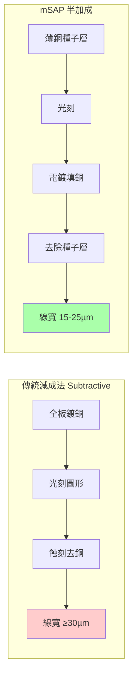
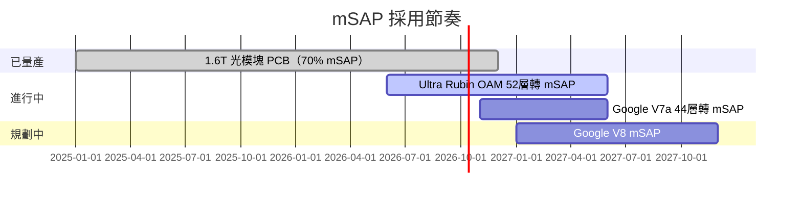

# 技術_mSAP

## 定義

mSAP（Modified Semi-Additive Process，改良半加成工藝）是一種 PCB 精細線路製造工藝，可實現 20µm 以下的線寬/間距，是 1.6T 光模塊 PCB 和次世代 AI 伺服器 Ultra Rubin OAM 的核心工藝。傳統減成法受限於蝕刻精度，在 30µm 以下線寬困難；mSAP 以電鍍方式生長銅線路，精度大幅提升。

## 圖解

![[報告_Semianalysis_PCB_20250826_003.png]]
*圖（Semianalysis/Doosan，2025-08）：CCL（覆銅板）材料堆疊截面——COPPER FOIL（導電層）/ FILLER SYSTEM（填充，控制絕緣穩定性）/ RESIN SYSTEM（樹脂，決定耐熱、低 CTE、低 Dk/Df）/ GLASS FABRIC（玻纖布補強）。mSAP 工藝在此材料上以薄銅種子層（<1µm）替代傳統厚銅箔，透過電鍍選擇性生長銅線，再快速蝕刻僅移除種子層而非大面積銅，實現線寬 15–25µm——是 1.6T 光模塊高密度 PCB 和 AI 伺服器 OAM 的製程基礎。*

```mermaid
flowchart LR
    subgraph 傳統減成法 Subtractive
        A1[全板鍍銅] --> B1[光刻圖形] --> C1[蝕刻去銅]
        C1 --> D1[線寬 ≥30µm]
    end
    subgraph mSAP 半加成
        A2[薄銅種子層] --> B2[光刻] --> C2[電鍍填銅]
        C2 --> D2[去除種子層] --> E2[線寬 15-25µm]
    end
    style E2 fill:#aaffaa
    style D1 fill:#ffcccc
```

## 技術原理

### mSAP vs 傳統 HDI 對比

| 特性 | 傳統 HDI（減成法）| mSAP |
|------|-----------------|------|
| 線寬/間距 | 30–75µm | **15–25µm** |
| 銅箔要求 | 一般銅箔 | **HVLP4 超低輪廓銅箔**（M8 板）|
| 加工難度 | 低 | 高（需專用精密設備）|
| 設備交期 | 正常 | **已排到 2027 年** |
| 主要用途 | GPU 計算板（26 層）| **1.6T 光模塊 PCB、Ultra Rubin OAM** |

### 主要應用場景與規格

| 應用 | 層數 / 結構 | 材料 | 採用時點 |
|------|-----------|------|---------|
| 1.6T 光模塊 PCB | ~20 層 | M8 + HVLP4，20µm L/S | **已大規模量產（70% 採 mSAP）**|
| 800G 光模塊 PCB | ~20 層 | M6 + HVLP3 | 少用（速率不夠快）|
| Ultra Rubin OAM | 52 層（8+36+8）| M9 | 滬電預計占主要份額，2027 放量 |
| Google V7a | 44 層（16+2+26）| M8 | 預計 2026-11 轉向 |
| Google V8 | — | M8+ | 預計 2027 年初/中量產 |

## 關鍵參數 / 判斷指標

| 指標 | 數值 | 意義 |
|------|------|------|
| 線寬/間距 | **20µm**（1.6T）| 對應 1.6T+ 光速率的信號完整性要求 |
| 1.6T mSAP 採用率 | **~70%** | 市場需求側驗證 |
| 1.6T PCB 漲幅 | 208 元 → 420 元（+100%）| 工藝溢價顯著，供不應求 |
| 800G PCB 漲幅 | 76 元 → 140 元（+84%）| mSAP 少用，漲幅相對小 |
| mSAP 設備交期 | **已排到 2027 年** | 最主要供應瓶頸 |

## 技術瓶頸 / 風險

- **設備瓶頸**：mSAP 關鍵設備已排到 2027 年交付，直接限制 2026–2027 年產能爬坡
- **良率要求高**：精細線路對材料和工藝控制要求極高
- **材料協同**：需 HVLP4 銅箔配合，銅箔供應緊張也制約產能
- **認證周期**：通過客戶認證需時，新進入者有較長爬坡期

## 供應格局

| 廠商 | 市場 | mSAP 能力 | 備註 |
|------|------|----------|------|
| [[3037_欣興（市）]] | 全球 | **領先** | 1.6T 光模塊 PCB 全球最大份額；台灣領先 |
| Ibiden（日本，未建頁）| 全球 | 領先 | 全球主要供應商之一 |
| 滬電股份（中國，未建頁）| 大陸 | **技術領先** | Ultra Rubin OAM 預計主要份額，耕耘最深 |
| 鵬鼎控股（中國，未建頁）| 大陸 | 技術領先 | 1.6T PCB 市場月交付量 20–25%，只向旭創交付 |
| 深南電路（中國，未建頁）| 大陸 | 技術領先 | — |
| 景旺電子（中國，未建頁）| 大陸 | 第一梯隊 | — |
| 勝宏科技（中國，未建頁）| 大陸 | 仍在摸索 | — |
| TTM（美，未建頁）| 全球 | **無 mSAP 能力** | 重要競爭限制 |

## 技術演進時程

```mermaid
gantt
    title mSAP 採用節奏
    dateFormat YYYY-MM
    section 已量產
    1.6T 光模塊 PCB（70% mSAP）:done, 2025-01, 2026-12
    section 進行中
    Ultra Rubin OAM 52層轉 mSAP :active, 2026-06, 2027-06
    Google V7a 44層轉 mSAP     :2026-11, 2027-06
    section 規劃中
    Google V8 mSAP              :2027-01, 2027-12
```

## 應用場景

- **1.6T 光模塊 PCB**（最大市場，70% 採用率）
- Ultra Rubin OAM（52 層，2027 放量）
- Google V7a / V8 計算板（44 層，2026Q4 轉向）
- 未來高速 AI 伺服器計算板

## 相關技術

- [[技術_PCB]]（mSAP 是 PCB 製造的精細工藝）
- [[技術_CCL]]（mSAP 需 M8+ CCL + HVLP4 銅箔）
- [[技術_HVLP銅箔]]（HVLP4 是 mSAP 的必要配套銅箔）
- [[技術_光模塊]]（1.6T 光模塊 PCB 是 mSAP 最大應用場景）

## 2026-08-28 光模組 PCB：報價與合格產出的差異

興森視角紀要描述 800G／1.6T 的高精細 PCB，以下是匿名訪談 estimate／中低信心，非市場統一報價。

| 口徑 | 800G | 1.6T | 比較限制 |
|---|---|---|---|
| 每平方米 PCB | 約人民幣 5 萬元 | 約人民幣 6–8 萬元 | 材料、層數、良率及加工內容可能不同 |
| 單片板價 | 約 US$12 | 約 US$25 | 原文用「晶片」稱呼；按 PCB 訪談語境理解，並非半導體晶片售價 |
| 每生產 panel 排板 | 約 180 片 | 約 120–130 片 | panel 規格未完整揭露，不能跨公司換算產能 |
| 每 panel 金額 | 約人民幣 1.5 萬元 | 約人民幣 2 萬元 | 原文近似估算，不用單片價與匯率反推確定值 |

mSAP 以薄銅／種子層配合選擇性電鍍與底銅蝕除建立細線；高價值在於密度、可靠度與合格產出。速率提升若增加板面或減少排板數，產值與產能利用率會改變，單看售價不能推算毛利。

紀要提到 M35 產品可能為 12／14／16 層，而其他來源的 1.6T 約 20 層屬不同設計，不能視為全產業降層。以約 40% 稼動率作損益兩平的說法是特定廠商經驗，需確認成本結構；不設定為 mSAP 通用門檻。CPO 送樣／選商說法及客戶名稱均作渠道資訊，未升級為正式認證。

另有 H 公司埋入式電容（原文 ECP）合作接近量產的渠道說法；ECP 屬板內被動功能整合，與 mSAP 細線製程是不同維度。此為 rumor／中低信心，不視為 NVIDIA 專案，也不由此推定正式量產收入。

來源：[[memo_AceCamp_興森mSAP與客戶驗證_20260828_70566408]]（2026-08-28）；辨識、價格與客戶驗證詳見 [[分析_20260828-29專家紀要公司辨識與供給瓶頸]]。

## 2026-09-01 鑽孔設備渠道觀察：細孔能力與設備交期

匿名訪談受訪主體依產品組合與規格高度對應德國 Schmoll；其將 mSAP／高階 HDI 的主要孔徑區間放在 80µm 以下，並把機械鑽、CO2 雷射、UV 雷射與皮秒／飛秒超快雷射視為依孔徑、材料與效率分工，而非互相完全替代。

| 製程觀察 | 訪談說法 | 可追蹤的驗證點 |
|---|---|---|
| 微孔加工 | 50–80µm 為常見區間；極限可下探至約 35µm | 實際孔徑、孔壁品質、殘銅與良率，而非單看雷射型別 |
| mSAP 專用機械鑽 | 轉速約 30–33 萬轉，精度要求約 ±15µm | 主軸冷卻、稼動率與交機後客戶良率 |
| 高階設備供給 | 三菱／Schmoll 交期偏長，可能為國產替代留下窗口 | 交期、驗收與合格產出；替代不等於已獲高階認證 |
| 需求推估 | 2027 年雷射鑽孔設備需求被估為 2,500–3,000 台 | 這是單一匿名渠道模型，應與 PCB 廠 CAPEX、設備商接單及出貨交叉驗證 |

訪談亦提及 1.6T 光模組板、正交背板與高層 HDI 可能提高鑽孔和壓合設備密度；設備採購、客戶名單、產能和價格均非公司確認資訊。來源：[[memo_AceCamp_Schmoll_PCB鑽孔設備與mSAP_20260901]]（AceCamp Tech 匿名專家訪談，2026-09-01；討論主體辨識中高信心，營運數字低至中信心）。

## 來源

- [[memo_PCB覆铜板调研_北美芯片平台_Q布_acecamptech_20260511]]
- [[memo_PCB市场调研_VR200_UltraRubin_OAM_mSAP_acecamptech_20260518]]
- [[memo_PCB调研_Rubin_正交背板_M8PTFE_acecamptech_20260518]]
- [[memo_AceCamp_Schmoll_PCB鑽孔設備與mSAP_20260901]] — AceCamp Tech 匿名專家訪談，2026-09-01

## 相關頁面

- [[供應鏈_AI伺服器PCB]]
- [[技術_矽微粉]]
- [[技術_PCB鑽孔設備]]
- [[技術_正交背板]]
