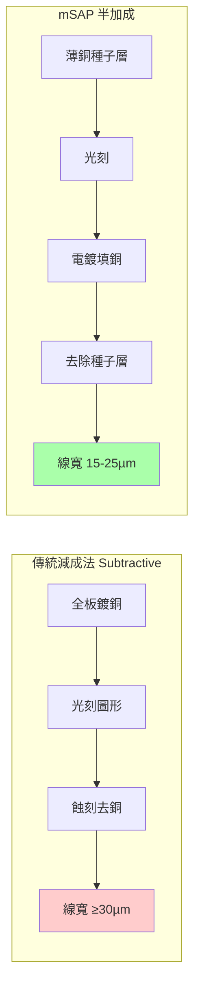
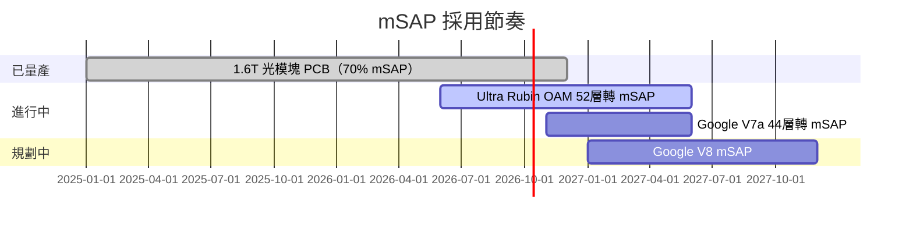
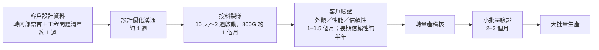

# 技術_mSAP

## 定義

mSAP（Modified Semi-Additive Process，改良半加成工藝）是一種 PCB 精細線路製造工藝，可實現 20µm 以下的線寬/間距，是 1.6T 光模塊 PCB 和次世代 AI 伺服器 Ultra Rubin OAM 的核心工藝。傳統減成法受限於蝕刻精度，在 30µm 以下線寬困難；mSAP 以電鍍方式生長銅線路，精度大幅提升。

## 圖解

![[報告_Semianalysis_PCB_20250826_003.png]]
*圖（Semianalysis/Doosan，2025-08）：CCL（覆銅板）材料堆疊截面——COPPER FOIL（導電層）/ FILLER SYSTEM（填充，控制絕緣穩定性）/ RESIN SYSTEM（樹脂，決定耐熱、低 CTE、低 Dk/Df）/ GLASS FABRIC（玻纖布補強）。mSAP 工藝在此材料上以薄銅種子層（<1µm）替代傳統厚銅箔，透過電鍍選擇性生長銅線，再快速蝕刻僅移除種子層而非大面積銅，實現線寬 15–25µm——是 1.6T 光模塊高密度 PCB 和 AI 伺服器 OAM 的製程基礎。*

```mermaid
flowchart LR
    subgraph 傳統減成法 Subtractive
        A1[全板鍍銅] --> B1[光刻圖形] --> C1[蝕刻去銅]
        C1 --> D1[線寬 ≥30µm]
    end
    subgraph mSAP 半加成
        A2[薄銅種子層] --> B2[光刻] --> C2[電鍍填銅]
        C2 --> D2[去除種子層] --> E2[線寬 15-25µm]
    end
    style E2 fill:#aaffaa
    style D1 fill:#ffcccc
```

## 技術原理

### mSAP vs 傳統 HDI 對比

| 特性 | 傳統 HDI（減成法）| mSAP |
|------|-----------------|------|
| 線寬/間距 | 30–75µm | **15–25µm** |
| 銅箔要求 | 一般銅箔 | **HVLP4 超低輪廓銅箔**（M8 板）|
| 加工難度 | 低 | 高（需專用精密設備）|
| 設備交期 | 正常 | **已排到 2027 年** |
| 主要用途 | GPU 計算板（26 層）| **1.6T 光模塊 PCB、Ultra Rubin OAM** |

### 主要應用場景與規格

| 應用 | 層數 / 結構 | 材料 | 採用時點 |
|------|-----------|------|---------|
| 1.6T 光模塊 PCB | ~20 層 | M8 + HVLP4，20µm L/S | **已大規模量產（70% 採 mSAP）**|
| 800G 光模塊 PCB | ~20 層 | M6 + HVLP3 | 少用（速率不夠快）|
| Ultra Rubin OAM | 52 層（8+36+8）| M9 | 滬電預計占主要份額，2027 放量 |
| Google V7a | 44 層（16+2+26）| M8 | 預計 2026-11 轉向 |
| Google V8 | — | M8+ | 預計 2027 年初/中量產 |

## 關鍵參數 / 判斷指標

| 指標 | 數值 | 意義 |
|------|------|------|
| 線寬/間距 | **20µm**（1.6T）| 對應 1.6T+ 光速率的信號完整性要求 |
| 1.6T mSAP 採用率 | **~70%** | 市場需求側驗證 |
| 1.6T PCB 漲幅 | 208 元 → 420 元（+100%）| 工藝溢價顯著，供不應求 |
| 800G PCB 漲幅 | 76 元 → 140 元（+84%）| mSAP 少用，漲幅相對小 |
| mSAP 設備交期 | **已排到 2027 年** | 最主要供應瓶頸 |

## 技術瓶頸 / 風險

- **設備瓶頸**：mSAP 關鍵設備已排到 2027 年交付，直接限制 2026–2027 年產能爬坡
- **良率要求高**：精細線路對材料和工藝控制要求極高
- **材料協同**：需 HVLP4 銅箔配合，銅箔供應緊張也制約產能
- **認證周期**：通過客戶認證需時，新進入者有較長爬坡期

## 供應格局

| 廠商 | 市場 | mSAP 能力 | 備註 |
|------|------|----------|------|
| [[3037_欣興（市）]] | 全球 | **領先** | 1.6T 光模塊 PCB 全球最大份額；台灣領先 |
| Ibiden（日本，未建頁）| 全球 | 領先 | 全球主要供應商之一 |
| 滬電股份（中國，未建頁）| 大陸 | **技術領先** | Ultra Rubin OAM 預計主要份額，耕耘最深 |
| 鵬鼎控股（中國，未建頁）| 大陸 | 技術領先 | 1.6T PCB 市場月交付量 20–25%，只向旭創交付 |
| 深南電路（中國，未建頁）| 大陸 | 技術領先 | — |
| 景旺電子（中國，未建頁）| 大陸 | 第一梯隊 | — |
| 勝宏科技（中國，未建頁）| 大陸 | 仍在摸索 | — |
| TTM（美，未建頁）| 全球 | **無 mSAP 能力** | 重要競爭限制 |

## 技術演進時程

```mermaid
gantt
    title mSAP 採用節奏
    dateFormat YYYY-MM
    section 已量產
    1.6T 光模塊 PCB（70% mSAP）:done, 2025-01, 2026-12
    section 進行中
    Ultra Rubin OAM 52層轉 mSAP :active, 2026-06, 2027-06
    Google V7a 44層轉 mSAP     :2026-11, 2027-06
    section 規劃中
    Google V8 mSAP              :2027-01, 2027-12
```

## 應用場景

- **1.6T 光模塊 PCB**（最大市場，70% 採用率）
- Ultra Rubin OAM（52 層，2027 放量）
- Google V7a / V8 計算板（44 層，2026Q4 轉向）
- 未來高速 AI 伺服器計算板

## 相關技術

- [[技術_PCB]]（mSAP 是 PCB 製造的精細工藝）
- [[技術_CCL]]（mSAP 需 M8+ CCL + HVLP4 銅箔）
- [[技術_HVLP銅箔]]（HVLP4 是 mSAP 的必要配套銅箔）
- [[技術_光模塊]]（1.6T 光模塊 PCB 是 mSAP 最大應用場景）

## 2026-08-28 光模組 PCB：報價與合格產出的差異

興森視角紀要描述 800G／1.6T 的高精細 PCB，以下是匿名訪談 estimate／中低信心，非市場統一報價。

| 口徑 | 800G | 1.6T | 比較限制 |
|---|---|---|---|
| 每平方米 PCB | 約人民幣 5 萬元 | 約人民幣 6–8 萬元 | 材料、層數、良率及加工內容可能不同 |
| 單片板價 | 約 US$12 | 約 US$25 | 原文用「晶片」稱呼；按 PCB 訪談語境理解，並非半導體晶片售價 |
| 每生產 panel 排板 | 約 180 片 | 約 120–130 片 | panel 規格未完整揭露，不能跨公司換算產能 |
| 每 panel 金額 | 約人民幣 1.5 萬元 | 約人民幣 2 萬元 | 原文近似估算，不用單片價與匯率反推確定值 |

mSAP 以薄銅／種子層配合選擇性電鍍與底銅蝕除建立細線；高價值在於密度、可靠度與合格產出。速率提升若增加板面或減少排板數，產值與產能利用率會改變，單看售價不能推算毛利。

紀要提到 M35 產品可能為 12／14／16 層，而其他來源的 1.6T 約 20 層屬不同設計，不能視為全產業降層。以約 40% 稼動率作損益兩平的說法是特定廠商經驗，需確認成本結構；不設定為 mSAP 通用門檻。CPO 送樣／選商說法及客戶名稱均作渠道資訊，未升級為正式認證。

另有 H 公司埋入式電容（原文 ECP）合作接近量產的渠道說法；ECP 屬板內被動功能整合，與 mSAP 細線製程是不同維度。此為 rumor／中低信心，不視為 NVIDIA 專案，也不由此推定正式量產收入。

來源：[[memo_AceCamp_興森mSAP與客戶驗證_20260828_70566408]]（2026-08-28）；辨識、價格與客戶驗證詳見 [[分析_20260828-29專家紀要公司辨識與供給瓶頸]]。

## 2026-09-01 鑽孔設備渠道觀察：細孔能力與設備交期

匿名訪談受訪主體依產品組合與規格高度對應德國 Schmoll；其將 mSAP／高階 HDI 的主要孔徑區間放在 80µm 以下，並把機械鑽、CO2 雷射、UV 雷射與皮秒／飛秒超快雷射視為依孔徑、材料與效率分工，而非互相完全替代。

| 製程觀察 | 訪談說法 | 可追蹤的驗證點 |
|---|---|---|
| 微孔加工 | 50–80µm 為常見區間；極限可下探至約 35µm | 實際孔徑、孔壁品質、殘銅與良率，而非單看雷射型別 |
| mSAP 專用機械鑽 | 轉速約 30–33 萬轉，精度要求約 ±15µm | 主軸冷卻、稼動率與交機後客戶良率 |
| 高階設備供給 | 三菱／Schmoll 交期偏長，可能為國產替代留下窗口 | 交期、驗收與合格產出；替代不等於已獲高階認證 |
| 需求推估 | 2027 年雷射鑽孔設備需求被估為 2,500–3,000 台 | 這是單一匿名渠道模型，應與 PCB 廠 CAPEX、設備商接單及出貨交叉驗證 |

訪談亦提及 1.6T 光模組板、正交背板與高層 HDI 可能提高鑽孔和壓合設備密度；設備採購、客戶名單、產能和價格均非公司確認資訊。來源：[[memo_AceCamp_Schmoll_PCB鑽孔設備與mSAP_20260901]]（AceCamp Tech 匿名專家訪談，2026-09-01；討論主體辨識中高信心，營運數字低至中信心）。

## 2026-09-30 光模組 PCB 廠視角：認證、良率與產能

匿名「PCB 大廠調研 3」依贛州（龍南）廠區 mSAP 擴產、2026 年光模組 PCB 批量供貨與營收規模，判讀討論主體為紅板科技（603459.SH，中高信心；依使用者指示不建中國公司頁）。以下數字均為訪談口徑，非公司公告。

### 製程分工與產品結構

| 路徑 | 適用速率 | 訪談重點 |
|---|---|---|
| Tenting（蓋孔減成） | 200G／400G／800G | 200G、400G 良率 85%–90%；交期 2–3 週 |
| mSAP | 800G／1.6T | mSAP 出貨中 800G 占 60%、1.6T 占 40%；800G mSAP 約占光模組 PCB 收入 60% |
| SAP（ABF 載板） | CPO、部分 3.2T／NPO | 無載體銅、直接在 ABF 化學沉銅，線路約 10µm；需新廠房、更高潔淨度、曝光與化銅／電鍍設備，客戶多要求獨立產線 |

| 指標 | 800G | 1.6T | 3.2T 可插拔（研發） |
|---|---|---|---|
| 交期 | Tenting 3.5–4 週；mSAP 6 週 | mSAP 8 週 | — |
| 良率 | 國內客戶較高；海外客戶 75%–80% | 70%–75% | 預期再降 |
| 單價（人民幣／顆） | 70–150 | 150–300 | — |
| 線寬／線距 | — | 20／20µm | 18／18 或 15／15µm，層數再加 2–4 層 |

```mermaid
flowchart LR
    A["客戶設計資料<br/>轉內部語言＋工程問題清單<br/>約 1 週"] --> B["設計優化溝通<br/>約 1 週"]
    B --> C["投料製樣<br/>10 天～2 週啟動，800G 約 1 個月"]
    C --> D["客戶驗證<br/>外觀／性能／信賴性<br/>1–1.5 個月；長期信賴性約半年"]
    D --> E["轉量產稽核"]
    E --> F["小批量驗證<br/>2–3 個月"]
    F --> G["大批量生產"]
```

圖說：訪談描述的光模組 PCB 認證流程；缺貨時最快約半年進量產，常規從接洽到量產需一年以上。

### 關鍵瓶頸

- **材料**：800G／1.6T mSAP 核心材料由頭部客戶指定，以 [[000150.KR(doosan)]] 為主、[[2383_台光電（市）]] 為輔；M7 以上材料採購期逾 4.5 個月。PCB 廠以中長期保量協議加約 6 個月安全庫存因應，並配合客戶驗證生益、南亞新材、華正新材及 [[1303_南亞（市）]] 作備援。
- **微孔可靠度**：1.6T 雷射孔多，盲孔微裂是主要失效；頭部廠指定 [[6503.JP(mitsubishi electric)]] 或維亞機械第六代雷射鑽孔機，再以等離子除膠、盲孔全檢、熱循環、二次電測與熱應力測試控管。維亞在 35–45µm 小盲孔主要用於 FCBGA，PCB 端尚未普及。
- **Cavity／盲槽**：目前主要是 [[AAOI.US(applied optoelectronics)]] 與 [[COHR.US(coherent)]] 要求開蓋工藝；新易盛、旭創多在設計初期避開。盲槽底部分裸基材、大銅接地與含打線金手指三類，後者最難。
- **矽光與 NPO**：矽光 PCB 需兼顧高速、供電與應力，孔徑更小、線路更密，常設盲槽或通槽；NPO 需 M8／M8+ 材料、維持鎳鈀金表面處理，並更嚴格控制翹曲與平坦度。
- **擴產門檻**：年產值人民幣 50 億元的 mSAP 線至少投資 20 億元、含設備至少兩年；具 mSAP 經驗者約半年達產，否則至少一年。新進者設備可能要到 2028Q4 後才投產，1.6T 供應鏈名單約在 2026 年底至 2027Q2 前定案。

| 產能口徑 | 訪談內容 | 限制 |
|---|---|---|
| 現有／規劃 mSAP 線 | 6 條運轉，另 8 條規劃（6 條在贛州新廠），2028Q1 設備就緒後共 14 條 | 公司公告的贛州 mSAP 項目建設期 48 個月、2027-01 起，與 2028Q1 就緒需交叉確認 |
| 單線日產能 | 30 米銅缸約 1,200 panel；50 米約 2,000 panel | 依設計而變 |
| 1.6T 月產能 | 2028 年新增產能全轉 16 層 1.6T 板，約 12KK／月 | 「KK」單位與 panel／顆換算未說明，不用於推估市占 |
| 稼動率 | 90% 以上，設備滿載 | 單一時點自述 |

> [!warning] 層數與價格口徑衝突
> - 本頁既有來源：1.6T 光模組 PCB 約 20 層；1.6T PCB 由 208 元漲至 420 元、800G 由 76 元漲至 140 元。
> - [[memo_AceCamp_興森mSAP與客戶驗證_20260828_70566408]]（2026-08-28）：800G 單片約 US$12、1.6T 約 US$25。
> - [[memo_AceCamp_紅板科技光模組PCB與mSAP_20260930]]（2026-09-30）：800G、1.6T 多為 14 或 16 層；mSAP 800G 約人民幣 70–150 元、1.6T 約 150–300 元。
> - 狀態：設計、客戶、海內外與計價時點不同，三者並列，不合併成單一 ASP；價格趨勢則一致指向 2027H2 前堅挺。

**價格走勢（訪談）**：2026 至 2027H2 光模組 PCB 價格堅挺，1.6T 可能續漲；800G 隨更多廠商通過認證趨穩。2028Q2 後頭部產能釋放、國產材料導入，2028Q3 起 800G 與部分成熟 1.6T 可能降價。PCB 占光模組成本不到 5%，因此頭部客戶排序為品質穩定＝技術能力 > 交付 > 價格。

**CPO 的分化**：若光模組改走 CPO，基板轉為 ABF 載板與 SAP 製程；同時具 mSAP 與 SAP 的廠商（訪談舉深南、興森、鵬鼎，後者見 [[4958_臻鼎（市）]]）受惠，只有 mSAP 者承壓。

來源：[[memo_AceCamp_紅板科技光模組PCB與mSAP_20260930]]（AceCamp Tech，2026-09-30；公司辨識中高信心，營運數字低信心）；辨識與反證見 [[分析_20260929-30專家紀要受訪公司辨識與供給驗證]]。

## 來源

- [[memo_AceCamp_紅板科技光模組PCB與mSAP_20260930]] — AceCamp Tech 匿名 PCB 專家訪談，2026-09-30
- [[memo_PCB覆铜板调研_北美芯片平台_Q布_acecamptech_20260511]]
- [[memo_PCB市场调研_VR200_UltraRubin_OAM_mSAP_acecamptech_20260518]]
- [[memo_PCB调研_Rubin_正交背板_M8PTFE_acecamptech_20260518]]
- [[memo_AceCamp_Schmoll_PCB鑽孔設備與mSAP_20260901]] — AceCamp Tech 匿名專家訪談，2026-09-01

## 相關頁面

- [[分析_20260901專家紀要受訪公司辨識與驗證框架]]
- [[供應鏈_AI伺服器PCB]]
- [[技術_矽微粉]]
- [[技術_PCB鑽孔設備]]
- [[技術_正交背板]]
- [[供應鏈_AI光互聯]]
- [[分析_20260929-30專家紀要受訪公司辨識與供給驗證]]
- [[COHR.US(coherent)]]
- [[AAOI.US(applied optoelectronics)]]
- [[000150.KR(doosan)]]
- [[2383_台光電（市）]]
- [[6503.JP(mitsubishi electric)]]
- [[1303_南亞（市）]]
- [[時程_2026-2027高速互連與分散式算力]]
