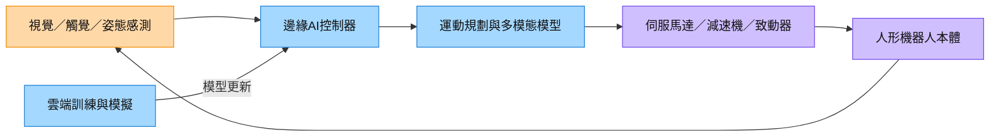

# 技術_人形機器人

## 定義

人形機器人是以接近人類身體結構與工作環境為目標的機器人平台，通常包含視覺／觸覺感測、即時控制、運動規劃、馬達驅動與電池系統。它與傳統固定式工業機器人的差異，在於需要在非結構化環境中感知、決策與移動。

AI 浪潮使人形機器人從單純自動化設備轉向 Physical AI：模型在雲端訓練，機器人在邊緣執行低延遲推論與控制。這會同時拉動運算晶片、記憶體、感測器、伺服馬達、減速機與電源管理需求，但商業化仍受可靠度、成本與安全認證限制。

## 圖解

圖說：人形機器人以感測器形成閉迴路，邊緣控制器在本地完成即時推論，雲端則負責模型訓練與更新。

## 技術原理

| 模組 | 功能 | 觀察重點 |
|---|---|---|
| 感測器 | 感知視覺、姿態、力與環境 | 感測融合、延遲、可靠度 |
| AI 控制器 | 執行視覺模型、策略與運動規劃 | NPU／GPU 算力、記憶體頻寬、功耗 |
| 致動器 | 將決策轉換為關節運動 | 扭矩密度、效率、壽命與噪音 |
| 電源系統 | 支援移動與峰值負載 | 電池能量密度、熱管理、安全 |

相較固定式工業機器人，人形平台需要在感測不完整、地面與障礙物變動的環境中維持穩定控制，因此對邊緣推論、感測融合與故障安全的要求更高。

## 關鍵參數 / 判斷指標

| 指標 | 意義 | 投資觀察 |
|---|---|---|
| 每瓦算力 | 電池限制下的即時推論能力 | 有利邊緣 AI SoC、記憶體與電源管理供應商 |
| 扭矩密度 | 致動器在重量限制下的輸出 | 影響關節模組價值與整機效率 |
| 續航時間 | 單次充電可工作時間 | 決定商用部署與電池需求 |
| MTBF／安全認證 | 長時間運作與人機協作可靠度 | 認證與量產良率比單次 demo 更重要 |

## 產業動能

- **Physical AI 成為半導體新需求**：[[人形機器人浪潮襲來，多元算立處理器發展方興未艾_DIGITIMES]]（DIGITIMES，2026-08-21）將人形機器人列為 2027 年半導體需求的潛在新動能。
- **雲端到邊緣的分工**：[[從雲端到邊緣AI_台系晶片設計產業動態解析_DIGITIMES]]（DIGITIMES，2026-08-21）指出邊緣推論與台系 IC 設計業者的營收成長仍需觀察量產落地。
- **Optimus 工程化驗證**：[[國金證券20260823-電腦產業研究：Optimus可望迎量產加速時刻]]（國金證券，2026-08-23）整理，Fremont 首代 Optimus 產線仍在安裝，初期產品將優先用於 Academy 的資料採集與功能開發；這是產線／訓練同步推進的訊號，不等於已對外大規模交付。
- **商業化由展示轉向量產指標**：同份報告認為後續應追蹤量產良率、產品均價、毛利率、客戶結構、復購率與場景複製能力，而非只以 demo 或出貨量判斷。

## 概念股 / 族群

| 類型 | 廠商 | 角色 | 觀察點 |
|---|---|---|---|
| 光學 | [[3019_亞光（市）]] | 機器人鏡頭 | 送樣轉量產與毛利率 |
| 邊緣運算 | [[技術_邊緣AI]] | 本地推論平台 | 算力、功耗與軟體整合 |

> [!note] 信心水準
> 產業方向與技術需求有 DIGITIMES 研究支撐；個別公司進入特定人形機器人平台、訂單與量產時程仍待公告或客戶驗證。

## 技術瓶頸 / 風險

- **可靠度與安全**：人機協作需要可驗證的故障安全與長時間穩定運作。
- **成本與量產**：致動器、減速機、電池與高階運算模組的成本仍高。
- **資料與模型泛化**：真實場景資料不足可能造成模型在非預期環境失效。
- **量產節奏與供應鏈重置**：Optimus 涉及大量新零件與測試流程；產線爬坡、認證或設計更動均可能使零組件份額與放量時點延後。

## 相關技術

- [[技術_邊緣AI]]
- [[技術_GPU_Backstop]]

## 來源

- [[人形機器人浪潮襲來，多元算立處理器發展方興未艾_DIGITIMES]] — DIGITIMES，2026-08-21
- [[從雲端到邊緣AI_台系晶片設計產業動態解析_DIGITIMES]] — DIGITIMES，2026-08-21
- [[國金證券20260823-電腦產業研究：Optimus可望迎量產加速時刻]] — 國金證券，2026-08-23
- [[國金證券20260823-機器人產業研究：特斯拉柏林工廠啟動機器人測試，世界機器人大會成功]] — 國金證券，2026-08-23

## 相關頁面

- [[3019_亞光（市）]]
- [[時程_2026記憶體與AI催化劑]]
