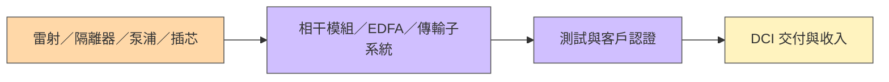

# 技術_光模塊

## 定義

光模組（Optical Transceiver）是在光纖網路中將電訊號與光訊號相互轉換的封裝元件，是 AI 資料中心通訊的核心設施。隨 AI 算力叢集規模擴大，光模組需求增速系統性高於 GPU：從 Hopper 到 Blackwell 再到 Rubin，GPU 與光模組數量比從 1:3 升至 1:5；scale-up 網路頻寬是 scale-out 的 10 倍以上，光模組需求在架構迭代中被系統性放大。

400G 及以下增長已有限，增量幾乎全部來自 800G、1.6T 和未來 3.2T，高階替代低階的結構性遷移不可逆。

## 圖解

![[AI驅動光通訊產業前進-20260119_004.png]]
*圖（群益投顧，2026-01）：光模組爆炸圖——TRx-Case（外殼）＋ ESA（電路次模組，14 道製程）＋ BOSA（光學次模組，16 道製程）。BOSA 展開為 Discrete BOSA 零件：Laser Diode（光源）→ 45° Filter → Filter Housing → Isolator → Spacer → Receptacle（光纖連接），接收端為 PIN + TIA ROSA。共晶焊接（die bonding）與光纖耦合（fiber alignment）是整線價值量最高的兩道製程。*

![[2026-02-03-2455.TW-Yuanta Research-光通訊產業 - AI席捲未來 光收發模組負傳輸重任-120122560_009.png]]
*圖（元大投顧，2026-02）：全球光模組市場規模（400G–1.6T），2021–2030 年 CAGR 23.6%，至 2030 年超 300 億美元。Non-AI 市場（淺藍）成長有限；AI 資料中心需求（深藍）從 2024 年快速放大，高速率（800G→1.6T→3.2T）替代低速率是不可逆的結構性遷移。*

## 技術原理

### 光模組生產三大設備環節

完整一條光模組產線台數比例：**1 台共晶（貼片）+ 3 台固晶 + 16–20 台耦合**，貼片、耦合、測試三類設備合計佔整線價值量約 90%。

| 設備環節 | 台數比例 | 精度需求 | 說明 |
|---------|---------|---------|------|
| 共晶（貼片）| 1 | 一般 | 晶片共晶焊接到基板 |
| 固晶 | 3 | 中等 | 固定晶片位置 |
| **耦合**（核心瓶頸）| **16–20** | 普通光模組 3–5 µm；CPO <0.3 µm | 台數最多；精度要求隨世代提升約 10 倍 |
| 測試 | 多台 | — | 驗證光電性能（Keysight 主導）|

**速率升級拉長耦合時間**：800G 耦合約 4 分鐘/支，1.6T 可能延至 5–6 分鐘；同等出貨量所需設備台數增加 25–50%，再疊加設備單價提升，實際設備投資額增幅可達出貨量增幅的 **2–3 倍**。

### COC 在封裝流程中的位置

COC（Chip on Carrier）是晶片採購後、光學耦合前的晶片次模組：先把 Laser／PD 等裸晶粒貼至 carrier，再完成 Wire Bond 與初步光電測試，之後才加入透鏡、隔離器、FAU 等光學件。詳見 [[技術_COC光模組封裝]]。因此訪談所稱「COC 分裝」應理解為 die attach＋電性互連等前段封裝，而不是單純的採購或最終模組組裝。

### 全流程直通率與 1.6T 良率爬坡

[[memo_Coherent毛利率_1.6T良率_OCS_DFAU專家觀點_日期不詳]] 將光模組直通率定義為從晶片採購到最終測試合格的累積良率：晶片採購 → COC 分裝 → 透鏡耦合 → 隔離器／透鏡組裝 → 外部光學件 → 終測。總直通率是各站良率相乘，而不是最後一站的單站良率；多個九成上下的單站良率相乘後，整體可能只剩七成左右。

| 製程 | 主要損耗 | 返修性／觀察點 |
|------|----------|----------------|
| COC 貼片與打線 | 位置偏差、接合與高速寄生效應 | 部分可重工；前段不良若晚發現會浪費後段工時 |
| 透鏡／光纖耦合 | 插損、角度與通道一致性 | 本次訪談指為 1.6T 最大瓶頸；可重耦合但多次失敗會報廢 |
| 光學件組裝 | 隔離器、透鏡與外部元件公差累積 | 通道增加後公差堆疊更明顯 |
| 高速終測 | 溫漂、眼圖與多通道性能變化 | 1.6T 比 800G 複雜，測試覆蓋率影響出貨良率 |

專家估計 1.6T 初期直通率約 40%～50%，隨量產學習依序升至 50%～60%、60%～70%、70%～80%，穩態可能達 80%～90%；除中際旭創外，其他廠商現階段可能落後 10～15 個百分點。這些數字是日期不詳的 channel estimate，不能視為全產業統一良率或特定公司的正式揭露。

### 設備需求三重乘數

| 乘數 | 說明 |
|------|------|
| 新增產能 | AI 資料中心持續擴張，絕對需求量增加 |
| 精度升級→台數增加 | 1.6T 耦合時間更長，同等出貨需更多台 |
| 單台設備價值量提升 | CPO 耦合機約 $500 萬 USD，是普通耦合機數倍 |

有分析師測算 2026 年光模組新增設備投資約 **200–300 億元**（基於 800G 出貨 6,000 萬支 + 1.6T 出貨 2,000 萬支），若自動化滲透率同步提升，數字仍可能偏保守。

## 關鍵參數 / 判斷指標

| 指標 | 普通光模組 | CPO 耦合 |
|------|----------|---------|
| 耦合精度 | 3–5 µm | < 0.3 µm |
| 技術難度差距 | 基準 | 約 10× |
| 設備單價（耦合機）| 相對低 | ~$500 萬 USD（ficonTEC）|
| 國產化率 | 較高（競爭激烈）| 極低（ficonTEC 壟斷）|
| 耦合時間（800G/1.6T）| 4 min / 5–6 min | — |
| 1.6T 累積直通率 | 初期約 40%～50%，穩態目標 80%～90% | 專家估計；需用季度出貨、返修率與終測良率驗證 |

## 技術瓶頸 / 風險

### 國產替代分化（核心非共識）

普通光模組設備與 CPO 設備**不能用同一框架定價**：

| 類別 | 國產化狀況 | 代表廠商 |
|------|----------|---------|
| 自動化組裝 | 較高 | 多家國產廠 |
| 普通光模組耦合（3–5 µm）| 較高，競爭紅海化 | 普莱信、猎奇等 |
| 測試儀器 | 難攻（Keysight 壟斷 85%+）| Keysight（未建頁）|
| **CPO 耦合（<0.3 µm）** | **極難攻（ficonTEC 壟斷）**| ficonTEC；科瑞技術驗證中 |

### 東南亞產能遷移是結構性機遇

- 中國出口美國光模組減少，轉中轉泰國路徑大幅增加
- 泰國工廠勞力禀賦不足，被迫導入自動化設備：美國本土工廠設備回本周期 **3–4 個月** vs 中國約 **1 年**
- 此機遇為結構性，不隨貿易政策鬆動消失——泰國的勞動力禀賦不會改變

## 關鍵廠商

| 環節 | 廠商 | 角色 |
|------|------|------|
| 光模組製造 | [[LITE.US(lumentum)]] | 高速光模組、EML，NVIDIA 首批 CPO ELS 主供 |
| 光模組製造 | [[COHR.US(coherent)]] | 前 Finisar，光模組主要海外製造商之一 |
| 光模組製造 | [[AAOI.US(applied optoelectronics)]] | 高速光模組，美國本土廠 |
| 光模組製造 | [[索爾思光電（未）]] | 800G／1.6T EML 光模組；2026-09 小量生產與客戶交付為匿名專家口徑 |
| CPO 耦合設備（主供）| ficonTEC（德國，未上市）| 實質壟斷 CPO 耦合設備，見 [[技術_CPO]] |
| CPO 耦合設備（驗證中）| 科瑞技術（中國，未建頁）| 2026-01 進博通產線，良率 60%，目標 80% |
| 測試設備 | Keysight（美，未建頁）| 光模組測試儀器，市占 85%+，難以國產替代 |
| FAU / 光纖被動件 | [[3363_上詮（櫃）]] | 光纖被動元件、FAU 相關 |
| 交換器 ASIC（設備需求方）| [[AVGO.US(broadcom)]] | 2026 系統性增加 CPO 耦合設備投資，2027 目標出貨 3–5 萬支 |

## 出貨量追蹤（各廠商調研）

| 年份 | 800G 出貨（萬只）| 1.6T 出貨（萬只）| 備註 |
|------|--------------|--------------|------|
| 2025A | 2,000（超計劃 1,800）| 180 | 1.6T 下半年開始（NV 6月、Google 10月）|
| 2026E | 4,200（NCNR PO）| 2,500 需求 / 2,000 出貨 | 設備瓶頸限制出貨 |
| 2027E | 5,500（800G 峰值）| 7,500 需求 / 6,000 出貨 | 1.6T 大概率超越 800G |

2025 年 800G 市占：**中際旭創 36%**（720 萬只）、Coherent ~22%（430 萬只）、新易盛 ~20%（400 萬只）。

### 各 CSP 光模組配比（GPU/XPU : 光模組）

| CSP | 比例 | 平台 |
|-----|------|------|
| 英偉達 Scale-out | 1:5（B300）| Blackwell |
| AWS | 1:6 | Trainium 3 |
| Meta | >1:8 | — |
| 谷歌 Scale-out | 1:2.5–1:3（另有 scale-up 增量）| — |

### AMD Helios 需求（新增 2026 年）

AMD Helios 平台（MI455 GPU + Venice CPU + Pensando 800G AI 網卡）**光模組配比 1:12**（vs B300 的 1:4），帶來極大額外需求：

- MI455 單卡對應 3 個 800G 網卡（B300 僅 1 個），帶寬需求 3 倍
- 2027 年 AMD GPU 出貨量預估 **150–250 萬顆**（較 2026 年 +80–150%）
- 若 2027 年 AMD 出貨 200 萬顆，800G 光模組上限：**2,400 萬只**
- AMD 市占 10% 情境：800 萬只 800G + 800 萬只 1.6T（等效 800G 2,400 萬只）

大額訂單：OpenAI 6GW AMD GPU（首批 1GW，2026 下半年）；Oracle 2026 Q3 開始 5 萬塊。

### 核心瓶頸（2026 年已轉移）

> 產能不再是主要瓶頸。核心瓶頸：**上游核心物料供應**。

緊缺排序：EML > 矽光晶片（SiPh）> CW 雷射器 > 隔離器（法拉第旋轉片）> DSP

| 器件 | 瓶頸 | 備註 |
|------|------|------|
| EML | 最緊缺 | 200G EML 認證周期長、供應量有限 |
| SiPh 晶片 | 緊缺 | Tower Semiconductor 占全球 70%，2027 擴產 5× |
| CW Laser | 緊缺 | Lumentum 領先；高功率 CW 2026 快速放量 |
| DSP | 相對緩和 | Marvell + Broadcom 合計 >85%，台積電產能受限 |

### 各廠商能力邊界

| 廠商 | 1.6T 出貨狀況 |
|------|------------|
| 中際旭創 | 2025：140 萬只（絕大多數），英偉達 40% + 谷歌 70% |
| Coherent | 2025：30 萬只；英偉達 25%、谷歌 25% |
| 新易盛 | NPO 清晰，已向 Meta 送樣；光迅（母公司）3.2T 樣品率先 |
| Lumentum | 英偉達 1.6T 15%；谷歌 15%；OCS + 光引擎核心 |

Meta 批量 1.6T：最早 **2026 年 Q4**。AWS 1.6T：**2027 年 H2**（配合 Trainium 4）。

## 應用場景

- AI 資料中心 scale-out 後端網路（800G/1.6T 乙太網）
- Scale-up 縱向高頻寬互連（搭配 [[技術_CPO]]）
- 前端 DWDM 長距傳輸
- AMD Helios / 推論側集群（高光模組配比場景）

## 相關技術

- [[技術_CPO]]（光引擎直接封裝，取代傳統可插拔光模組；設備精度門檻另文詳述）
- [[技術_光互連]]（光互連技術演進全景：可插拔→LPO→CPO→OCS）

## 相關技術（補充）

- [[技術_FAU]]（1.6T 光模組 FAU 供需缺口 15%+）
- [[技術_光電芯片]]（EML/CW/PD/TIA 光電晶片緊缺排序）
- [[技術_COC光模組封裝]]（裸晶粒貼片、打線、測試到光學耦合前的中間次模組）
- [[技術_TFLN]]（1.6T CPO 光模組 TFLN 調製器）
- [[技術_MPO]]（AOC 與光模組的競爭關係）

## 1.6T 元年（W26 2026 更新，規則 #14）

| 指標 | 值 |
|------|----| 
| 2026 全球 1.6T 出貨 | **~850K 支**（+280% YoY）—「**1.6T 元年**」確立 |
| GB300 NVL72 機櫃 | **~55K 台**（+129% YoY）|

### 光通訊三雄 beat & drop（W26 2026，規則 #14 — 財務升級）

| 廠商 | 財報結果 | 股價反應 |
|------|---------|---------|
| [[COHR.US(coherent)]] | FY3Q26 營收 USD 1.806B，+21% YoY，beat | **-9%** |
| [[LITE.US(lumentum)]] | FY26 Q3 beat | **-8%** |
| [[AAOI.US(applied optoelectronics)]] | 財報 beat | **-13%** |

> **解讀**：三雄同期均 beat，但股價全數下跌，顯示 AI 光互連採購溢價已充分計入，市場缺乏新催化劑驅動進一步重估。[[MU.US(micron)]] 同期（FY26 Q3）：數據中心 GM 87%、AI 兩業務合計 USD 25B、GM 80%+，屬正面財務升級。

資料來源：[[research_simpletechtrend_CPO矽光子ECTC2026_20260629]]

## 2026-08-29 DCI：相干模組、光放大與傳輸子系統

DCI（Data Center Interconnect）連接資料中心。相干接收利用本地光源與 DSP 恢復振幅／相位資訊，適用較長距離；EDFA（摻鉺光纖放大器）以泵浦激發摻鉺介質直接放大光訊號。傳輸子系統／板卡則整合電訊號匯聚、轉換、監控或再生功能，具體功能依設計不同，與單純光放大器不能互換。

光隔離器利用法拉第旋轉等機制抑制反向光；旋光片、窄線寬可調諧雷射、泵浦與插芯／光纖的材料品質、精度及可靠度會影響相干／放大產品交付。德科立視角訪談稱這些物料造成在製品堆積；此為特定供應商 rumor／中低信心，不等於全產業瓶頸排序。

| DCI／長距離產品 | 匿名 ASP 估計（美元） | 限制 |
|---|---|---|
| 400G | 400–500 | 距離與規格不同於一般短距資料中心模組 |
| 800G | 600–800 | DSP 供應、雷射與光學物料須分別確認 |
| 1.6T | 1,200–1,300 | 個別產品／專案價格，不作全市場均價 |

圖說：DCI 供應瓶頸到交付的觀察架構；三種產品是不同功能分類，並非每一款均使用所有列示材料。

半年營收約人民幣 5.45 億元、產出約 7 億元與在製品約 2.5 億元屬不同量度；不能相減後當成同期間未認列收入。相干模組、光學元件與系統的收入占比也有不同分母。Coherent／Cisco 的接洽、樣品及客戶目標只能作驗證線索，不能提前認定批量訂單。

來源：[[memo_AceCamp_德科立DCI與物料瓶頸_20260829_70566441]]（2026-08-29）；公司辨識、需求與驗證階段見 [[分析_20260828-29專家紀要公司辨識與供給瓶頸]]。

## 2026-09-01 DCI 與 Coherent-Lite：供給約束先於需求兌現

另一份匿名訪談的營運描述（收購 Infinera、歐洲電信設備業務與北美 DCI 佈局）高度對應 Nokia。其認為 CSP 的 DCI 採購需求仍強，但 2026 年標案可能因 InP 元件、雷射、EDFA 泵浦與 WSS 等上游限制而延後交付；這是渠道觀察，並非 Nokia、Ciena、Cisco 或 CSP 的正式交期指引。

**Coherent-Lite** 是針對約 2–40 公里資料中心互連的簡化相干模組構想，以較簡化 DSP 降低功耗、時延與成本。該訪談將 Google OCS 場景、2027 年上半年規格完成、2027 年下半年小量部署與 2028 年後放量列為情境；實際標準、供應商資格、ASP 與採用規模均待平台商、模組商和設備商揭露確認。

來源：[[memo_AceCamp_Nokia_DCI與CoherentLite_20260901]]（AceCamp Tech 匿名專家訪談，2026-09-01；Nokia 討論主體辨識高信心，市場份額、交期、價格與時程低至中信心）。

## 來源

- [[memo_光模块及CPO设备学习总结_acecamptech_20260416]]（設備三重乘數、東南亞遷移、國產替代分化、ficonTEC 壟斷格局）
- [[memo_1.6T_800G光模块出货更新_NPO_CPO_acecamptech_20260507]]（2025/2026/2027 出貨量追蹤、各 CSP 份額、核心瓶頸轉移、天孚通信轉型）
- [[memo_AMD爆发_光模块需求超预期_acecamptech_20260519]]（AMD Helios 1:12 配比、2027 年 AMD 需求測算）
- [[memo_光模块龙头_光芯片产能_Meta_AWS_acecamptech_20260503]]（AWS/谷歌訂單進展、EML 供應格局、InP 基板格局）
- [[research_simpletechtrend_CPO矽光子ECTC2026_20260629]]（1.6T 元年 850K +280%；GB300 55K +129%；光通訊三雄 beat & drop；Micron FY26 Q3 升級，2026-06-29）
- [[research_COC_Chip_on_Carrier_20260830]]（MACOM／NTT 官方 CoC 產品定義與應用，2026-08-30 擷取）
- [[memo_Coherent毛利率_1.6T良率_OCS_DFAU專家觀點_日期不詳]]（晶片採購至終測的直通率、1.6T 耦合瓶頸與良率爬坡；日期不詳，2026-08-30 收錄，信心低）
- [[memo_索爾思光電專家會議_日期不詳]]（使用者提供；2026-09 1.6T EML 小量生產、客戶驗證與出貨口徑，會議日期未提供）
- [[memo_AceCamp_Nokia_DCI與CoherentLite_20260901]] — AceCamp Tech 匿名專家訪談，2026-09-01

## 相關頁面

- [[分析_20260901專家紀要受訪公司辨識與驗證框架]]
- [[分析_2026Q3先進封裝與光互連供給瓶頸]]
- [[分析_光通訊產業2026]]
- [[分子尼奧（私）]]
- [[2379_瑞昱（市）]]
- [[7907_源傑科技（興）]]
- [[技術_mSAP]]
- [[技術_矽光子（SiPh）]]
- [[分析_Coherent毛利率與1.6T良率爬坡]]
- [[分析_索爾思光電800G與1.6T出貨追蹤]]
