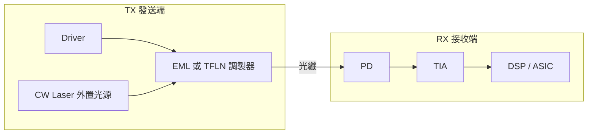

# 技術_光電芯片

## 定義

光電芯片（Photonic / Optoelectronic Chip）是光模塊與 CPO 系統的核心有源器件，負責完成光/電訊號的轉換、調製、放大與傳輸。主要包括：

- **PD**（Photodetector，光探測器）：接收光訊號→電訊號
- **Driver**（驅動芯片）：電訊號放大，驅動調製器
- **TIA**（Trans-Impedance Amplifier，跨阻放大器）：PD 輸出電流→電壓，配合 ADC 前端使用
- **EML**（Electro-absorption Modulated Laser）：電吸收調製雷射，整合雷射與調製器
- **CW Laser**（連續波雷射）：硅光模塊外部光源
- **DSP**（Digital Signal Processor）：數位訊號處理，用於 LPO/傳統光模塊

## 圖解



## 技術原理

### 供需緊張程度排序（2026 年，最緊到最寬鬆）

```
200G PD（缺口 60–70%）> Driver > TIA（相對緩和）> DSP（最寬鬆）
```

### PD（光探測器）

**200G PD 是 2026 年最緊缺的光電芯片**：

| 項目 | 數值 |
|------|------|
| 缺口率 | 60–70%（2026 年） |
| 單顆售價 | 2–3 USD（vs 100G PD 的 0.6–0.8 USD） |
| 晶圓尺寸 | 主要 4 英寸 InP |
| 單顆 Die 面積 | ~350 × 350 µm |
| 每片 4" 晶圓產出 | 4–5 萬顆 |
| 能交付比例 | 訂單的 60%+ |
| 2026 出貨 | >2,000 萬只 |
| 2027 出貨 | 5,000–6,000 萬只 |

量產廠商（全球，2026 年僅有）：**Macom** 和 **博通**。

**材料瓶頸**：受限於上游 InP（磷化銦）晶圓基板；主要採購日本住友，同時導入通美（AXT）。InP 基板漲幅 20–30%（剛過去季度已調整）。

800G 和 1.6T 光模塊的 PD 用量皆為 8 顆（Die size 基本一致）。

### TIA（跨阻放大器）

| 項目 | 數值 |
|------|------|
| 全球唯一量產 200G TIA 廠商（2026 年）| **Marvell** |
| 其他廠商 | Macom（2026 年底 / 2027 Q1），Semtech（差不多）|
| 單顆售價（2026）| 30–40 USD |
| 2027 預期價格 | 20–30 USD（降幅 ~30%）|
| 製程代工廠 | GlobalFoundries、ST（歐洲）、Tower，產能無瓶頸 |
| 每個模塊 | 2 顆 TIA |

### Driver（驅動芯片）

- LPO 1.6T 限制：800G LPO Driver EQ 均衡能力 8–10 dB，1.6T LPO 需要 20 dB，**現有技術無法實現**→ 1.6T LPO 量產至少兩年後。
- CPO 中 Driver 角色：
  - TSMC + NVIDIA microled CPO：無需獨立 Driver 和 TIA（全部 TSMC 內部完成）
  - 博通 CPO 方案（硅光）：仍需 Driver 和 TIA，預計 2027 下半年 / 後年量產

### DSP（數字訊號處理器）

- 頭部 Broadcom 和 Marvell DSP 已被北美客戶鎖定（合計 >85%）
- 第三大供應商 MaxLinear：已開始與騰訊/字節/阿里接洽（在三星流片，供應相對保障）

### CPO 中的光電芯片格局

| CPO 方案 | 調製器 | Driver/TIA | 特點 |
|---------|--------|-----------|------|
| TSMC + NVIDIA（microled）| TSMC 內部 microled | 無需獨立 Driver/TIA | 台積電 SoIC-X 混合鍵合 |
| 博通 CPO（硅光）| SiPh PIC | 需要 Driver + TIA | 2027 H2 量產 |
| 通用 CPO 光引擎 | TFLN 調製器 + CW | Driver（EIC）+ TIA | 64 組/系統 |

一個 CPO 系統（3.2T/6.4T 光引擎）：**64 個 Driver + 64 個 TIA**（32 通道，每光引擎各 4 顆，一 CPO ASIC 搭配 16 個光引擎）。CPO 中 Driver/TIA die size 比光模塊更小，單通道成本約可插拔模塊的 **50%**。

## 關鍵參數 / 判斷指標

| 指標 | 意義 | 2026–27 觀察重點 |
|------|------|----------------|
| 200G PD 交付率 | 光模塊出貨限制 | 缺口 60–70%，主要 Macom/博通 |
| InP 基板漲幅 | 成本傳導 | 20–30% 漲幅，PD 可能跟漲 |
| TIA 量產家數 | 競爭格局 | 2026 Marvell 獨家 → 2027 年三家 |
| Driver EQ 能力 | 1.6T LPO 可行性 | 現有技術 8–10 dB，需求 20 dB |
| CW Laser 供給 | SiPh 光模塊瓶頸 | Lumentum 領先，Tower 擴 5× |

## 技術瓶頸 / 風險

- **200G PD 缺口 60–70%**：InP 晶圓基板供應受限；日本住友原供主力（中國管控稀有材料後擴產停止）；AXT 份額提升中；雲南鍺業旗下公司約半產能被海思鎖定。
- **硅光芯片**：Tower Semiconductor 占全球 60–70%；GlobalFoundries 成本較高（更適合 CPO/OIO）；2027 年 Tower 擴產 5×後供應才能緩解。
- **EML 最緊缺**：全球緊缺排序：EML > SiPh > CW > 隔離器（法拉第旋轉片）。
- **1.6T LPO 時程**：1.6T LPO 仍在實驗室，距量產至少 2 年（Driver EQ 瓶頸）。

## 關鍵廠商

| 器件 | 廠商 | 角色 |
|------|------|------|
| 200G PD（量產）| Macom（未建頁，美）| 全球僅兩家量產 200G PD 之一 |
| 200G PD（量產）| 博通 / Broadcom | 另一家量產，但自用優先 |
| InP 磊晶（PD）| [[4971_IET-KY（市）]] | 全球 InP/GaSb MBE 磊晶代工；供 Coherent 德州廠 |
| InP 磊晶（PD/LD）| [[2455_全新（市）]] | MOCVD；800G PD 市占 ~80%；CW Laser 2026 Q3-4 量產 |
| TIA（2026 唯一量產）| Marvell（未建頁）| Marvell 200G TIA 量產，DSP 頭部 |
| Driver + TIA（Google）| Macom（未建頁）| Google 輕相干模塊 Driver+TIA 供應 |
| SiPh 代工（全球 60–70%）| Tower Semiconductor（未建頁）| 硅光芯片最大代工廠 |
| EML 供應（主力）| [[LITE.US(lumentum)]] | 200G EML、CW Laser 領先，高功率 CW 龍頭 |
| EML + InP 供應 | [[COHR.US(coherent)]] | EML + 旋光片（與索爾思互助協議）|
| CW Laser（高功率）| Source Photonics（未建頁）| DFB+SOA 方案，EML+CW 雙線 |
| InP 磊晶（LD/PD）| [[3081_LandMark光電（市）]] | CW Laser + InP 垂直整合 |

## 應用場景

- 800G/1.6T 可插拔光模塊（PD + TIA + Driver + EML/CW）
- CPO 光引擎（TFLN + Driver + TIA 或 TSMC microled）
- LPO 光模塊（無 DSP，Driver EQ 加強）
- Google 輕相干模塊（旭創/Coherent/Lumentum 三供）

## 相關技術

- [[技術_TFLN]]（TFLN 調製器，與 EML 競爭定位）
- [[技術_CPO]]（CPO 中光電芯片格局）
- [[技術_光模塊]]（光電芯片在光模塊中的應用）
- [[技術_銦行業]]（InP 基板的銦供應鏈）

## 來源

- [[memo_光电芯片调研_200G_PD_InP_Driver_TIA_acecamptech_20260522]]（200G PD 緊缺程度/定價/格局；TIA Marvell 獨家現狀；LPO 1.6T 瓶頸；CPO 光電芯片配置；Google 輕相干三供）
- [[memo_光模块龙头_光芯片产能_Meta_AWS_acecamptech_20260503]]（EML/CW 產能格局；Meta/AWS 訂單進展；InP 基板格局）
- [[memo_光通信调研_MPO_AOC_硅光芯片_acecamptech_20260417]]（SiPh 代工格局；全球光模塊短缺排序）

## 相關頁面

- [[技術_光互連]]
