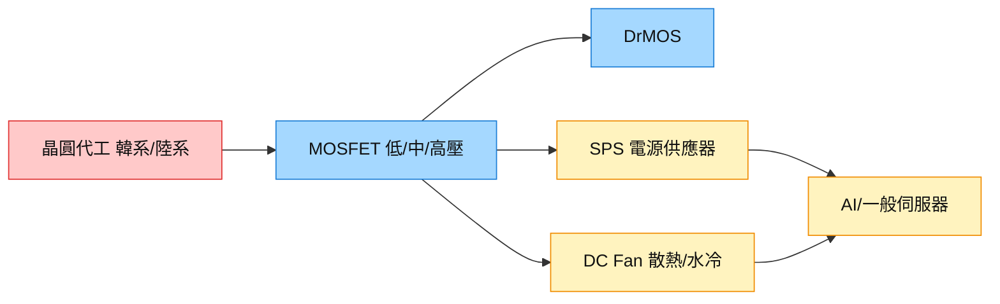

# 技術_功率MOSFET

## 定義
功率 MOSFET 是電源轉換與電源管理的核心開關元件，依耐壓分**低壓（約 <40V）／中壓（約 40–200V，含 80V）／高壓（>200V）**，並延伸出整合式 DrMOS（driver + MOSFET）與 IGBT。與訊號級 MOS 的差別在於處理大電流／高電壓、講究導通電阻（Rds(on)）、切換損耗與散熱。

為什麼現在重要：AI 伺服器供電（SPS、DC Fan 散熱、DrMOS）推升 MOS 用量，IDM 大廠在中壓（80V）MOS 供應短缺，訂單外溢到 [[8261_富鼎（市）]] 等設計廠；同時晶圓代工漲價 + 貴金屬（銅／銀／金線）成本上行，是毛利關鍵變數。

相關主線：[[供應鏈_AI伺服器散熱]]、[[8261_富鼎（市）]]。

## 圖解

圖說：功率 MOS 由外部晶圓代工投片，做成低/中/高壓料號與 DrMOS，供 SPS 電源與 DC Fan 散熱，最終進 AI/一般伺服器；代工與貴金屬成本是毛利槓桿。

## 技術原理
| 模組 | 功能 | 觀察重點 |
|------|------|----------|
| 低壓 MOS | 低電壓開關、Computing/消費 | 與 PC/NB 需求連動 |
| 中壓 MOS（80V） | SPS、AI 伺服器供電 | IDM 大廠缺貨外溢，替代機會 |
| 高壓 MOS | 電源、工業 | 韓系代工支援，占比回升 |
| DrMOS | driver + MOS 整合供電 | 隨平台改版（2Q26 第二版） |

與一般 MOS 的差異：功率 MOS 講究 Rds(on)、耐壓、切換損耗與封裝散熱；封裝大量用銅、每顆必用銀，貴金屬價格直接影響成本。

## 關鍵參數 / 判斷指標
| 指標 | 意義 | 投資觀察 |
|------|------|----------|
| 耐壓（Vds） | 低/中/高壓分類 | 80V 中壓需求 > 龍頭產能，缺貨外溢 |
| Rds(on) | 導通損耗 | 影響電源效率與競爭力 |
| 晶圓代工報價 | 成本 | 已有代工調漲 MOS 價，約半數代工廠啟動漲價 |
| 貴金屬成本 | 銅/銀/金線 | 全球性上漲，須與客戶協商調價 |

## 產業動能
- **AI 伺服器 MOS 缺貨外溢**：[[報告_富邦_8261富鼎中高壓MOS_20260226]]（2026-02-26）指 IDM 大廠中壓 MOS 供應短缺，SPS 大廠尋求 [[8261_富鼎（市）]] 中壓料號替代。
- **DC Fan 散熱轉水冷**：[[報告_國泰_8261富鼎CallMemo_20260415]]（2026-04-15）指風扇 2026-01 營收年增 111%；水冷用風扇數較少，用量隨伺服器設計變動。
- **成本上行漲價**：晶圓代工漲價 + 貴金屬上漲，廠商部分品項調漲、以新產品改善組合維持毛利。

## 概念股 / 族群
| 類型        | 廠商              | 角色               | 觀察點             |
| --------- | --------------- | ---------------- | --------------- |
| 功率 MOS 設計 | [[8261_富鼎（市）]]  | 低/中/高壓 MOS、DrMOS | 中高壓佈局、DC Fan 放量 |
| 電源系統      | [[2308_台達電（市）]] | SPS/伺服器電源        | MOS 用量與供電架構     |

> [!note] 信心水準
> 中壓 MOS 缺貨外溢與漲價趨勢來自富邦/國泰 2026 Q1–Q2 富鼎報告與法說，屬公司說法與賣方研判；IDM 大廠（如安森美、英飛凌）之具體轉單量仍待供應鏈進一步確認。

## 技術瓶頸 / 風險
- **代工產能受限**：80V 中壓需求超龍頭產能，晶圓廠因需求延續性不確定不願大幅擴產。
- **成本轉嫁**：貴金屬與代工漲價能否順利轉嫁客戶，影響毛利。
- **需求連動 PC**：Computing（PC/NB/PSU）約占 65% 業務，與 DRAM/CPU 供應連動，記憶體排擠下市場估下滑逾 20%。

## 相關技術
- [[技術_HBM高頻寬記憶體]]（記憶體排擠 PC 需求的連動）

## 來源
- [[報告_富邦_8261富鼎中高壓MOS_20260226]] — 富邦投顧，2026-02-26
- [[報告_富邦_8261富鼎_20260416]] — 富邦投顧，2026-04-16
- [[報告_合庫_8261富鼎_20260416]] — 合庫投顧，2026-04-16
- [[報告_國泰_8261富鼎CallMemo_20260415]] — 國泰證期研究部，2026-04-15

## 相關頁面
- [[8261_富鼎（市）]]
- [[供應鏈_AI伺服器散熱]]
