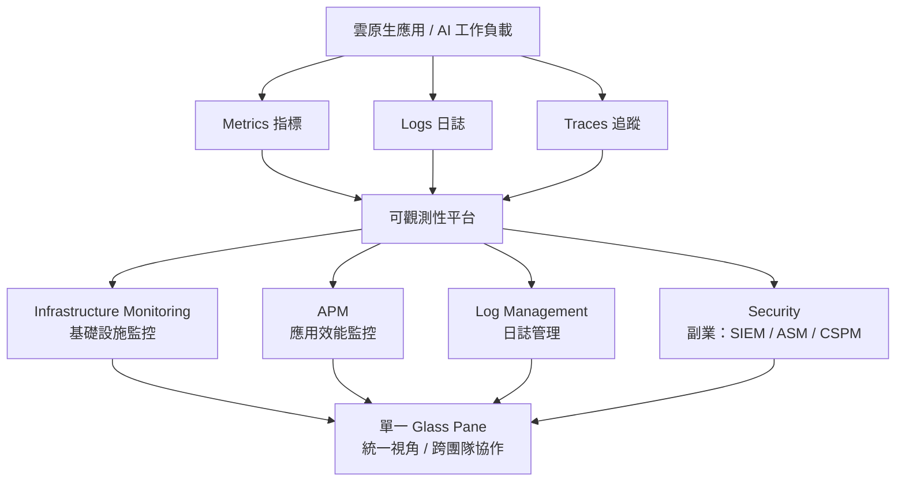
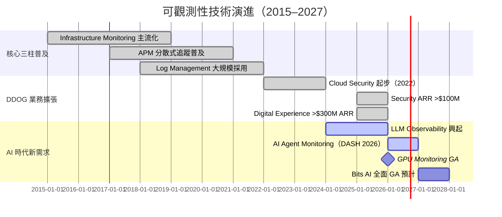

# 技術_可觀測性

## 定義

可觀測性（Observability）是指透過系統對外輸出的資料（Metrics、Logs、Traces）來推斷系統內部狀態的能力。對現代分散式雲原生架構而言，可觀測性已從「有益於」演進為「必備的」基礎設施能力——尤其是進入 AI Agent 時代後，非確定性的 AI 工作流讓傳統監控方式完全不夠用。

可觀測性不同於傳統監控（Monitoring）：監控是告訴你「出問題了」，可觀測性是讓你能查出「為什麼出問題」。

---

## 圖解：可觀測性三柱架構

---

## 技術原理：三柱說明

### 第一柱：Infrastructure Monitoring（基礎設施監控）

監控雲端主機、容器、Kubernetes 叢集、網路設備與資料庫的即時狀態。輸入來源為 **Metrics**（數值型時序資料，如 CPU 使用率、記憶體、網路吞吐量）。

核心概念：
- **Tagging**：對每個資源打上 tag（環境、服務、版本、Region），讓監控資料可以切片比對
- **Host-based 計費**：多數 Infra 監控產品依監控的主機數或 container 數計費，雲端規模擴張直接帶動消費
- **Auto-discovery**：自動發現新部署的容器或服務並納入監控，零人工干預

### 第二柱：APM（Application Performance Monitoring，應用效能監控）

追蹤應用程式中每個請求從進入到結束的完整路徑。輸入來源為 **Traces**（分散式追蹤：記錄一個請求跨越多個服務的每一段耗時與狀態）。

核心概念：
- **Distributed Tracing**：一個請求在微服務架構中可能跨越 10-50 個服務，APM 自動將這些 Span 串成 Trace，讓開發者一眼看出瓶頸在哪
- **Service Map**：自動生成服務依賴關係圖
- **Error Tracking**：自動聚合、去重並標示錯誤，優先呈現影響最大的問題
- **AI Agent 時代特殊性**：AI Agent 是非確定性的，每次執行路徑不同，Trace 記錄「Agent 決定了什麼、呼叫了哪些工具、順序如何」成為不可或缺的稽核與除錯手段（Morgan Stanley 2026-01 特別強調）

### 第三柱：Log Management（日誌管理）

大規模收集、索引、搜尋與分析應用程式和基礎設施產生的日誌（文字格式的事件記錄）。

核心概念：
- **Log Volume 計費**：依攝入與儲存的日誌量計費，AI 時代 agent 活動大量增加 log 產生量
- **Flex Logs**：DDOG 2024-2025 推出的彈性日誌方案，讓客戶選擇較低成本的長期儲存層
- **BYOC Logs**（Build Your Own Cloud）：DDOG 2026 在 DASH 推出，讓客戶在自己的基礎設施內執行 Log 處理，同時保留 DDOG 平台整合（對有資料主權需求的客戶重要）
- **Federated Logs（Preview）**：從 Log Explorer 直接查詢外部資料存儲，無需移動資料

---

## 延伸：Cloud Security（DDOG 副業，不另建技術頁）

可觀測性平台天然擁有最完整的系統上下文（context），因此從可觀測性擴展到資安是邏輯上的自然延伸。DDOG 的資安業務利用已有的 Metrics + Logs + Traces 資料，疊加資安分析層：

| 產品類別 | 全名 | 功能 |
|---|---|---|
| SIEM | Security Information & Event Management | 日誌 + 事件集中分析，威脅偵測與告警 |
| ASM | Application Security Management | 應用程式層攻擊偵測（SQL injection、XSS 等） |
| CSPM | Cloud Security Posture Management | 雲端組態合規性檢查（錯誤配置偵測） |
| CWPP | Cloud Workload Protection Platform | 執行時期容器 / VM 威脅保護 |

DDOG 資安業務特點：
- 2025Q3 Security ARR 超過 $100M（+mid-50% YoY），客戶 7,500+（佔總客戶 24%）
- 優勢在於「與可觀測性資料的整合」，可跨 Infra + App + Security 關聯分析
- 劣勢在於相較純資安廠商（PANW、CrowdStrike）缺乏深度的端點防護能力
- DDOG DASH 2026：新增 AI Guard（AI Agent 安全防護）、Bits Security Analyst（自主資安調查）、Bits Threat Hunting（假設驅動威脅獵查）

---

## 關鍵參數 / 判斷指標

| 指標 | 意義 | 觀察重點 |
|---|---|---|
| NRR（Net Revenue Retention） | 現有客戶年度消費成長率 | DDOG 維持 high-110% 至 low-120%，反映平台黏性與擴張 |
| 多產品使用比例 | 使用 2+ / 4+ / 6+ 產品的客戶比例 | 驗證「platform consolidation」效應，越高越難替換 |
| >$100K ARR 客戶數 | 大型客戶增長 | DDOG 1Q26：4,550 個（+21% YoY） |
| AI Native 客戶 ARR | 新成長引擎 | OpenAI ARR ~$330M（MS 估計），佔 ~10% 總收入 |
| Security ARR 成長率 | 副業發展速度 | 中高 50% YoY（2025Q3） |

---

## 技術瓶頸 / 風險

**1. AI Native 客戶集中風險**
OpenAI 佔 DDOG 約 10% 營收。AI native 客戶技術資源雄厚，有能力自建監控（in-house observability）。不過 Truist（2026-06）指出自建代價遠超購買，且工程資源應聚焦在核心差異化能力上，而非維護 telemetry 堆疊。

**2. 超大雲廠商（Hyperscaler）的捆綁競爭**
AWS CloudWatch、Google Cloud Monitoring、Azure Monitor 均提供原生監控工具，且可隨雲端服務捆綁提供。對中小客戶有一定威脅，但大型企業多雲環境需要跨雲統一視角，反而利好 DDOG。

**3. AI 時代的新競爭者**
AI native startups 可能針對 AI 工作負載開發更輕量、更低價的觀測性工具，從底層搶奪下一世代客戶的心智占有率（Morgan Stanley 2026-01 列為主要風險之一）。

**4. 資安市場競爭加劇**
PANW 併購 Chronosphere（2025Q4）後，同時具備 Observability + Security 能力，與 DDOG 的「Security + Observability 整合」定位高度重疊，是最直接的潛在市占率威脅。

---

## AI 時代：可觀測性為何從「nice-to-have」變成「must-have」

傳統軟體執行「預先定義的邏輯」，行為可預測。AI Agent 則「自行決定下一步」，行為不確定，且常見「cascading failure」（一個環節出錯引發連鎖崩潰）。

這讓可觀測性的重要性產生質的轉變（Morgan Stanley 2026-01 分析）：

1. **稽核需求**：哪個 agent 發起了什麼動作？存取了哪些資料？修改了什麼？
2. **政策執行**：設計的 guardrail 有被遵守嗎？
3. **異常偵測**：工具呼叫模式是否異常？資料存取是否有外洩跡象？
4. **成本控制**：Token 使用量、API 呼叫次數、資料擷取量的即時監控

傳統企業 APM 覆蓋率約 20-30% 的應用程式；Truist 估計 AI 應用的 APM 覆蓋率將趨近 90-100%，因為「把控制權交給 AI Agent」需要更高的透明度要求。

---

## 關鍵廠商

| 環節 | 廠商 | 角色 | 頁面狀態 |
|---|---|---|---|
| 主要平台廠商（可觀測性） | [[DDOG.US(datadog)]] | 市占率成長最快，平台整合能力最強 | ✅ 已建頁 |
| 競品（可觀測性） | Dynatrace（DT） | 企業級老牌 Observability，正轉型 | 未建頁 |
| 競品（可觀測性） | New Relic | 已私有化，消費模型競品 | 未建頁 |
| 競品（可觀測性 + 資安） | Palo Alto Networks / Chronosphere | 2025Q4 PANW 併購 Chronosphere，直攻融合市場 | 未建頁 |
| 競品（資安） | CrowdStrike（CRWD） | 端點安全為主，雲端安全重疊 | 未建頁 |
| 競品（雲端資安） | Wiz | CSPM 市場領導者，雲端資安 | 未建頁 |
| 雲端平台 | AWS / GCP / Azure | 原生監控工具（CloudWatch / GCM / Azure Monitor），同時也是最大分銷夥伴 | 未建頁 |

---

## 技術演進時程

---

## 應用場景

- **雲原生 SaaS 公司**：DevOps / SRE 團隊使用 APM + Logs + Infra 做全棧監控
- **金融科技**：高合規要求，需要完整稽核日誌與即時異常偵測
- **電商**：流量突增時的容量規劃與效能保證（Black Friday 場景）
- **AI 訓練 / 推論**：GPU 叢集健康監控、LLM 呼叫成本追蹤、Agent 行為稽核
- **大型企業 IT 整合**：替換多個點工具，統一平台降低 TCO

---

## 相關技術

- [[技術_可觀測性]] — 本頁
- 參考：OpenTelemetry（開源遙測標準，DDOG 重要整合夥伴）
- 參考：eBPF（Linux 核心級監控技術，DDOG 在 Infrastructure Monitoring 的底層能力之一）

---

## 來源

- [[報告_BNP_DDOG季末IR電話會議_20250314]] — BNP Paribas，2025-03-14
- [[報告_MS_DDOG升評OW_20260112]] — Morgan Stanley，2026-01-12（AI Agent + Observability 論述主要來源）
- [[報告_Macquarie_DDOG_DASH2026產品發表_20260610]] — Macquarie，2026-06-10（DASH 2026 產品列表）
- [[報告_Truist_DDOG升評Buy_20260615]] — Truist Securities，2026-06-15（Non-AI-Native 驅動因素分析）
