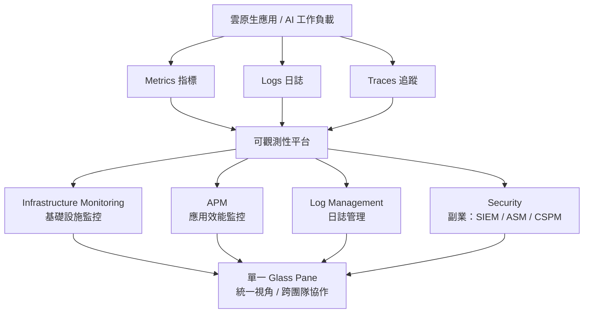
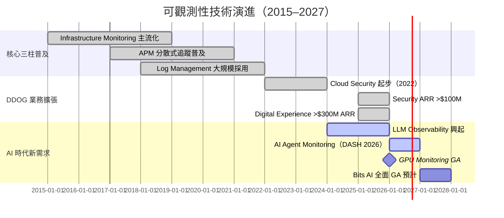

# 技術_可觀測性

## 定義

可觀測性（Observability）是指透過系統對外輸出的資料（Metrics、Logs、Traces）來推斷系統內部狀態的能力。對現代分散式雲原生架構而言，可觀測性已從「有益於」演進為「必備的」基礎設施能力——尤其是進入 AI Agent 時代後，非確定性的 AI 工作流讓傳統監控方式完全不夠用。

可觀測性不同於傳統監控（Monitoring）：監控是告訴你「出問題了」，可觀測性是讓你能查出「為什麼出問題」。

---

## 圖解：可觀測性三柱架構

---

## 技術原理：三柱說明

### 第一柱：Infrastructure Monitoring（基礎設施監控）

監控雲端主機、容器、Kubernetes 叢集、網路設備與資料庫的即時狀態。輸入來源為 **Metrics**（數值型時序資料，如 CPU 使用率、記憶體、網路吞吐量）。

核心概念：
- **Tagging**：對每個資源打上 tag（環境、服務、版本、Region），讓監控資料可以切片比對
- **Host-based 計費**：多數 Infra 監控產品依監控的主機數或 container 數計費，雲端規模擴張直接帶動消費
- **Auto-discovery**：自動發現新部署的容器或服務並納入監控，零人工干預

### 第二柱：APM（Application Performance Monitoring，應用效能監控）

追蹤應用程式中每個請求從進入到結束的完整路徑。輸入來源為 **Traces**（分散式追蹤：記錄一個請求跨越多個服務的每一段耗時與狀態）。

核心概念：
- **Distributed Tracing**：一個請求在微服務架構中可能跨越 10-50 個服務，APM 自動將這些 Span 串成 Trace，讓開發者一眼看出瓶頸在哪
- **Service Map**：自動生成服務依賴關係圖
- **Error Tracking**：自動聚合、去重並標示錯誤，優先呈現影響最大的問題
- **AI Agent 時代特殊性**：AI Agent 是非確定性的，每次執行路徑不同，Trace 記錄「Agent 決定了什麼、呼叫了哪些工具、順序如何」成為不可或缺的稽核與除錯手段（Morgan Stanley 2026-01 特別強調）

### 第三柱：Log Management（日誌管理）

大規模收集、索引、搜尋與分析應用程式和基礎設施產生的日誌（文字格式的事件記錄）。

核心概念：
- **Log Volume 計費**：依攝入與儲存的日誌量計費，AI 時代 agent 活動大量增加 log 產生量
- **Flex Logs**：DDOG 2024-2025 推出的彈性日誌方案，讓客戶選擇較低成本的長期儲存層
- **BYOC Logs**（Build Your Own Cloud）：DDOG 2026 在 DASH 推出，讓客戶在自己的基礎設施內執行 Log 處理，同時保留 DDOG 平台整合（對有資料主權需求的客戶重要）
- **Federated Logs（Preview）**：從 Log Explorer 直接查詢外部資料存儲，無需移動資料

---

## 延伸：Cloud Security（DDOG 副業，不另建技術頁）

可觀測性平台天然擁有最完整的系統上下文（context），因此從可觀測性擴展到資安是邏輯上的自然延伸。DDOG 的資安業務利用已有的 Metrics + Logs + Traces 資料，疊加資安分析層：

| 產品類別 | 全名 | 功能 |
|---|---|---|
| SIEM | Security Information & Event Management | 日誌 + 事件集中分析，威脅偵測與告警 |
| ASM | Application Security Management | 應用程式層攻擊偵測（SQL injection、XSS 等） |
| CSPM | Cloud Security Posture Management | 雲端組態合規性檢查（錯誤配置偵測） |
| CWPP | Cloud Workload Protection Platform | 執行時期容器 / VM 威脅保護 |

DDOG 資安業務特點：
- 2025Q3 Security ARR 超過 $100M（+mid-50% YoY），客戶 7,500+（佔總客戶 24%）
- 優勢在於「與可觀測性資料的整合」，可跨 Infra + App + Security 關聯分析
- 劣勢在於相較純資安廠商（PANW、CrowdStrike）缺乏深度的端點防護能力
- DDOG DASH 2026：新增 AI Guard（AI Agent 安全防護）、Bits Security Analyst（自主資安調查）、Bits Threat Hunting（假設驅動威脅獵查）

---

## 關鍵參數 / 判斷指標

| 指標 | 意義 | 觀察重點 |
|---|---|---|
| NRR（Net Revenue Retention） | 現有客戶年度消費成長率 | DDOG 維持 high-110% 至 low-120%，反映平台黏性與擴張 |
| 多產品使用比例 | 使用 2+ / 4+ / 6+ 產品的客戶比例 | 驗證「platform consolidation」效應，越高越難替換 |
| >$100K ARR 客戶數 | 大型客戶增長 | DDOG 1Q26：4,550 個（+21% YoY） |
| AI Native 客戶 ARR | 新成長引擎 | OpenAI ARR ~$330M（MS 估計），佔 ~10% 總收入 |
| Security ARR 成長率 | 副業發展速度 | 中高 50% YoY（2025Q3） |

---

## 技術瓶頸 / 風險

**1. AI Native 客戶集中風險**
OpenAI 佔 DDOG 約 10% 營收。AI native 客戶技術資源雄厚，有能力自建監控（in-house observability）。不過 Truist（2026-06）指出自建代價遠超購買，且工程資源應聚焦在核心差異化能力上，而非維護 telemetry 堆疊。

**2. 超大雲廠商（Hyperscaler）的捆綁競爭**
AWS CloudWatch、Google Cloud Monitoring、Azure Monitor 均提供原生監控工具，且可隨雲端服務捆綁提供。對中小客戶有一定威脅，但大型企業多雲環境需要跨雲統一視角，反而利好 DDOG。

**3. AI 時代的新競爭者**
AI native startups 可能針對 AI 工作負載開發更輕量、更低價的觀測性工具，從底層搶奪下一世代客戶的心智占有率（Morgan Stanley 2026-01 列為主要風險之一）。

**4. 資安市場競爭加劇**
PANW 併購 Chronosphere（2025Q4）後，同時具備 Observability + Security 能力，與 DDOG 的「Security + Observability 整合」定位高度重疊，是最直接的潛在市占率威脅。

---

## AI 時代：可觀測性為何從「nice-to-have」變成「must-have」

傳統軟體執行「預先定義的邏輯」，行為可預測。AI Agent 則「自行決定下一步」，行為不確定，且常見「cascading failure」（一個環節出錯引發連鎖崩潰）。

這讓可觀測性的重要性產生質的轉變（Morgan Stanley 2026-01 分析）：

1. **稽核需求**：哪個 agent 發起了什麼動作？存取了哪些資料？修改了什麼？
2. **政策執行**：設計的 guardrail 有被遵守嗎？
3. **異常偵測**：工具呼叫模式是否異常？資料存取是否有外洩跡象？
4. **成本控制**：Token 使用量、API 呼叫次數、資料擷取量的即時監控

傳統企業 APM 覆蓋率約 20-30% 的應用程式；Truist 估計 AI 應用的 APM 覆蓋率將趨近 90-100%，因為「把控制權交給 AI Agent」需要更高的透明度要求。

---

## 關鍵廠商

| 環節 | 廠商 | 角色 | 頁面狀態 |
|---|---|---|---|
| 主要平台廠商（可觀測性） | [[DDOG.US(datadog)]] | 市占率成長最快，平台整合能力最強 | ✅ 已建頁 |
| 競品（可觀測性） | [[DT.US(dynatrace)]] | 企業級老牌 Observability，Davis AI 根因分析；Gartner CC 2025 SRE/AI Engineering 兩情境第一 | ✅ 已建頁 |
| 競品（可觀測性） | New Relic | 已私有化，消費模型競品 | 未建頁 |
| 競品（可觀測性 + 資安） | [[PANW.US(palo alto networks)]] / Chronosphere | 2025Q4 PANW 併購 Chronosphere，直攻融合市場 | ✅ 已建頁 |
| 競品（資安） | [[CRWD.US(crowdstrike)]] | 端點安全為主，雲端安全重疊 | ✅ 已建頁 |
| 競品（雲端資安） | Wiz | CSPM 市場領導者，雲端資安 | 未建頁 |
| 雲端平台 | AWS / GCP / Azure | 原生監控工具（CloudWatch / GCM / Azure Monitor），同時也是最大分銷夥伴 | 未建頁 |

---

## 技術演進時程

---

## 應用場景

- **雲原生 SaaS 公司**：DevOps / SRE 團隊使用 APM + Logs + Infra 做全棧監控
- **金融科技**：高合規要求，需要完整稽核日誌與即時異常偵測
- **電商**：流量突增時的容量規劃與效能保證（Black Friday 場景）
- **AI 訓練 / 推論**：GPU 叢集健康監控、LLM 呼叫成本追蹤、Agent 行為稽核
- **大型企業 IT 整合**：替換多個點工具，統一平台降低 TCO

---

## 相關技術

- [[技術_可觀測性]] — 本頁
- 參考：OpenTelemetry（開源遙測標準，DDOG 重要整合夥伴）
- 參考：eBPF（Linux 核心級監控技術，DDOG 在 Infrastructure Monitoring 的底層能力之一）

---

## AI Observability（AI 可觀測性）

> Gartner Innovation Insight（2026-05-26，ID G00845549）正式定義 AI Observability 為獨立研究子領域：

**定義**：AI Observability 是在 AI 系統的所有層面收集、分析並行動遙測信號的實踐，用於監控行為、診斷失敗並驅動持續改進。它將傳統 IT 可觀測性擴展至處理 AI 系統的非確定性本質——行為從模型、資料管道、檢索系統和代理工作流的互動中湧現。

**AI 可觀測性五大堆疊層次（Gartner 框架）：**

| 層次 | 監控重點 | 傳統工具是否足夠 |
|---|---|---|
| Infrastructure Layer | GPU 記憶體、算力使用率、推論爆衝 | 部分（需動態閾值） |
| Model Layer | 輸出分佈漂移、準確率衰減、幻覺 | ❌（需專用工具） |
| Engineering Tools Layer | RAG 管道、LangChain 健康、資料管道 | ❌（需 trace-level 工具） |
| Application & Interface Layer | 護欄觸發頻率、Token 消費、使用者回饋 | 部分（疊加 DEM） |
| Business Outcome Layer | 偏見減少、ROI 指標、法規稽核軌跡 | ❌（AI 專屬） |

**Agentic AI 的特殊挑戰**：AI Agent 執行多步推理鏈（multistep reasoning chain），錯誤會在鏈中複合傳播。必須有全鏈 trace-level 可見度才能歸因和補救。

**市場現況（Gartner 2026-05）**：AI Observability 市場快速成長但仍不成熟，建議：優先採用 OpenTelemetry 等開放標準，避免廠商鎖定；逐步從 Application/Inference 層向上擴展覆蓋。

**Gartner 代表供應商（2026-05）**：Arize AI、Fiddler AI、CoreWeave（Weights & Biases）、LangSmith、Dynatrace、**Datadog（DDOG）**

---

## Gartner Critical Capabilities：可觀測性平台廠商評比

> **Gartner Critical Capabilities for Observability Platforms（2025-07-08，ID G00822673）**  
> 評比 20 家廠商，8 大能力維度，6 種使用情境（SRE / Platform Operations / Software Engineering / Business Insights / Cost Optimization / AI Engineering）。評分 1–5，5 為滿分。

**DDOG 關鍵結論**：在 8 大能力維度中 Interoperability（互通性）得分最高（4.4/5，全 20 廠商之冠），且適合所有 6 種使用情境（Suitable）。

### SRE 使用情境廠商評分

![[Critical_Capabilitie_822673_ndx_001.png]]
*Gartner（2025-07-08）：SRE Use Case — Dynatrace (4.30) 小幅領先 Datadog (4.27)，Grafana Labs (4.14) 第三；其後 Chronosphere、Elastic、New Relic 等。*

### AI Engineering 使用情境廠商評分

![[Critical_Capabilitie_822673_ndx_006.png]]
*Gartner（2025-07-08）：AI Engineering Use Case — Dynatrace (4.29)、Datadog (4.24)、Coralogix (4.18)；SRE 與 AI Engineering 排序高度一致，DDOG 始終前二。*

### 競爭格局小結

| 廠商 | SRE | AI Engineering | 亮點能力 |
|---|---|---|---|
| Dynatrace（DT） | 4.30（#1） | 4.29（#1） | Generate Actionable Insights、User Experience 最高 |
| **Datadog（DDOG）** | **4.27（#2）** | **4.24（#2）** | **Interoperability 最高（4.4/5）、生態整合廣度** |
| Grafana Labs | 4.14（#3） | 3.96（#4） | 開源生態，成本低 |
| Coralogix | 3.65 | 4.18（#3） | AI Engineering 場景表現突出 |

> Dynatrace 在傳統洞察力（AI/ML 決策）與使用者體驗維度略勝；DDOG 的優勢在於生態整合廣度（Interoperability 滿分最高）與 AI 工程場景持續第二，兩者均被 Gartner 認定適用全部 6 種使用情境。

---

## DEM（Digital Experience Monitoring，數位體驗監控）

> **Gartner Magic Quadrant for Digital Experience Monitoring（2025-10-27，ID G00823799）**
> DEM = 從**使用者視角**（真實使用者、模擬交易、或連 API 的 digital agent）量測應用的可用性、效能與體驗品質，與可觀測性平台「看系統內部」互補。核心功能：RUM（真實使用者監控）、STM（合成交易監控）、Session Replay、使用者旅程分析。

### Magic Quadrant 廠商格局（As of September 2025）

![[Magic_Quadrant_for_D_823799_ndx_001.png]]
*Gartner MQ DEM（2025-10-27）：四 Leaders = Datadog（Leaders 中 Ability to Execute 最高）、Dynatrace（Completeness of Vision 最右）、New Relic、Catchpoint。Visionaries：Splunk（Cisco）、Riverbed、IBM（Instana）、ITRS、Conviva；Niche：ManageEngine、SolarWinds、ip-label、Checkly、Blue Triangle。Challengers 象限無人。*

### DDOG 在 DEM 的 Strengths / Cautions（Gartner 原文摘要）

| 面向 | 內容 |
|---|---|
| Strength：RUM 定價 | 新「without limits」模型將 session 攝入與索引解耦，可動態保留高價值 session、丟棄低價值者，取代舊用量計價 |
| Strength：產品分析 | RUM + funnel + pathways + session replay + heatmaps，把 DEM 延伸到產品採用/行為分析 |
| Strength：AI 洞察 | AI 引擎自動 baseline 前後端行為、關聯事件並輸出白話摘要 |
| Caution：僅 SaaS | 無 self-hosted 選項，嚴格資料主權/合規場景受限（對照：IBM Instana / Splunk 支援 air-gapped） |
| Caution：IPM 弱 | Internet Performance Monitoring 依賴人工分析（vs Catchpoint 的自動化 AI 路徑分析） |

> 註：Datadog 近期併購 Quickwit（日誌搜尋最佳化）、Metaplane（data observability）、Eppo（feature flag / 實驗），MQ 原文點名為 DEM/平台能力補強。Dynatrace 在 DEM 的優勢為 config-as-code（Monaco CLI）與多層 PII 遮罩合規。

---

## 遙測管線（Telemetry / Observability Pipelines）

> **Gartner Market Guide for Telemetry Pipelines（2025-09-02，ID G00798131）+ Market Overview for Observability Pipelines（2026-04-03，ID G00852515）**
> 遙測管線 = 集中收集、攝入、轉換、豐富（enrich）、過濾並路由 MELT（Metrics/Events/Logs/Traces）遙測的中間層，坐在遙測來源與分析平台（觀測性平台 / SIEM / 冷儲存）之間。**首要驅動力是成本**：分析平台按攝入量計價，先過濾再送可大幅降費。

### 架構與市場分工

![[Market_Guide_for_Tel_798131_ndx_001.png]]
*Gartner（2025-09-02）：遙測管線示意——SaaS/應用/公雲/虛擬化/基礎設施產生的 Logs/Metrics/Traces 經 Transform→Enrich→Reduce 後，路由至 Log analytics、觀測性平台、冷儲存、資安遙測管線等多目的地，底層連遙測 data lake。*

![[Market_Guide_for_Tel_798131_ndx_002.png]]
*Gartner（2025-09-02）：市場分裂為三塊——① 第三方通用遙測管線（OpTel+SecTel，如 Cribl）、② 觀測性平台內建管線能力（OpTel，如 Datadog Observability Pipelines）、③ 資安專用遙測管線（SecTel → SIEM）。*

### 關鍵預測與市場數據

| 指標 | 數字 | 來源 |
|---|---|---|
| 2027 年經管線處理的 log 遙測占比 | 40%（2024 年 <20%） | Market Guide 2025-09 |
| 2029 年採用管線架構的組織占比 | >60%（2026 年約 20-25%） | Market Overview 2026-04 |
| 大型企業遙測管理年支出 | 可超過 $10M | Market Guide 2025-09 |
| 市場起點 | 2018 年前不存在，2025 年約 6-10 家專職廠商 | Market Guide 2025-09 |

### 代表廠商（Gartner 2025-09）

| 廠商 | 產品 | 備註 |
|---|---|---|
| [[DDOG.US(datadog)]] | Observability Pipelines（基於開源 Vector） | 觀測性平台內建路線代表 |
| Cribl | Stream | 第三方管線領導者 |
| Chronosphere（Calyptia） | Telemetry Pipeline | 已隨 Chronosphere 併入 PANW 體系 |
| Edge Delta / Mezmo / Bindplane / Honeycomb / Observo AI 等 | — | 專職管線廠商 |

**投資視角**：管線是「觀測性成本失控」的解方，也是廠商鎖定攻防點——第三方管線（Cribl）讓客戶把資料自由路由到低成本目的地、削弱平台議價力；DDOG 以內建 Pipelines + Flex Logs / Federated Logs / BYOC Logs 反制，把成本敏感客戶留在自家平台（對照 Evercore DASH 2026 評析：這些發布直接回應 PANW-Chronosphere 的 PB 級處理賣點）。

---

## 自主維運（Autonomous Operations）——Gartner First Take 觀點

> **Gartner First Take: Datadog Moves Observability Platforms Toward Autonomous Operations（2026-06-10，ID G00858398）**

- DASH 2026 的 Bits Detection / Memories / Remediation 組成「Autonomous Ops Loop」，呼應市場對平台從「預定義監控」走向「主動修復」的需求
- **Guardrails 是信任分水嶺**：給 AI agent 生產環境寫入權限前，必須有明確核准工作流、rollback 程序；Gartner 建議把這些控制列為「不可談判的採購標準」
- **SRE 角色轉型**：從執行 runbook 的 responder 轉為監督/稽核 agent 的 governor、資料策展人與政策制定者——Gartner 認為多數 I&O 團隊「完全沒準備好」
- **信任脈絡是瓶頸**：agent 不能只靠原始遙測；需要歷史 postmortem、組態變更等人類維運脈絡（機器可讀 runbook / memory store），否則會依賴 LLM 通用假設做出危險的 troubleshooting 決策
- **鎖定風險**：Gartner 提醒多家廠商都支援自主閉環，採購時應至少比較一個替代平台，以緩解平台黏性與鎖定

---

## Data Observability（資料可觀測性）

> **Gartner Market Guide for Data Observability Tools（2026-02-23，ID G00839851）**  
> 此為**資料管道**的可觀測性，監控對象是「資料本身的健康與品質」，與前述系統/應用可觀測性（DDOG 核心業務）為**不同市場**，但有工具重疊。

### 定義與五大觀測類別

![[Market_Guide_for_Dat_839851_ndx_002.png]]
*Gartner（2026-02-23）：Data Observability 五大觀測類別——Data content（資料內容品質）/ Data flow and pipeline（流程健康）/ Infrastructure and compute（算力資源）/ User, usage and utilization（使用者行為）/ Financial allocation（成本分配）。*

**市場規模（2024）**：$346.4M，年成長率 20.8%。代表廠商 16 家（含 Atlan、Monte Carlo、Soda、Validio、dbt Labs、Acceldata 等），DDOG 亦被列入。

### DDOG 在 Data Observability 的定位

DDOG 涵蓋五大類別全部，但切入方式是「以基礎設施可觀測性資料延伸至資料管道監控」，不同於純資料品質廠商（Monte Carlo、Soda）的以「資料表/欄位品質」為主：

| 能力 | DDOG 覆蓋方式 |
|---|---|
| Data content（品質） | Log + Trace 間接反映資料異常 |
| Data flow & pipeline | APM / Infra 延伸涵蓋 Kafka、Kinesis、Airflow |
| Infrastructure & compute | Database Monitoring（查詢效能、slow query） |
| User, usage & utilization | 使用者行為追蹤，結合 Digital Experience |
| Financial allocation | 資料處理成本監控，GPU / compute cost 可視化 |

> DDOG 在 Data Observability 屬「基礎設施優先切入」的進入者，並非核心資料品質廠商。Gartner 列入 Market Guide 代表認可其覆蓋廣度，不代表競爭地位等同純資料可觀測性專廠。

---

## 來源

- [[報告_BMO_資安可觀測性_20260612]] — BMO，資安可觀測性（DDOG AI 感知領導者、DASH 2026 評析、TP $220→$260），2026-06-12
- [[報告_BNP_DDOG季末IR電話會議_20250314]] — BNP Paribas，2025-03-14
- [[報告_MS_DDOG升評OW_20260112]] — Morgan Stanley，2026-01-12（AI Agent + Observability 論述主要來源）
- [[報告_Macquarie_DDOG_DASH2026產品發表_20260610]] — Macquarie，2026-06-10（DASH 2026 產品列表）
- [[報告_Truist_DDOG升評Buy_20260615]] — Truist Securities，2026-06-15（Non-AI-Native 驅動因素分析）
- [[Innovation_Insight__845549_ndx|Gartner_AI可觀測性_Innovation_Insight_20260526]] — Gartner，AI Observability 市場定義，2026-05-26
- [[Critical_Capabilitie_822673_ndx|Gartner_Critical_Capabilities_Observability_20250708]] — Gartner，Observability Platforms Critical Capabilities，廠商評比（20家），2025-07-08
- [[Market_Guide_for_Dat_839851_ndx|Gartner_Market_Guide_DataObservability_20260223]] — Gartner，Data Observability Tools Market Guide，鄰近市場定義，2026-02-23
- [[Magic_Quadrant_for_D_823799_ndx|Gartner_MagicQuadrant_DEM_20251027]] — Gartner，Magic Quadrant for Digital Experience Monitoring（14 家廠商），2025-10-27
- [[Market_Guide_for_Tel_798131_ndx|Gartner_MarketGuide_TelemetryPipelines_20250902]] — Gartner，Telemetry Pipelines 市場指南（初次覆蓋），2025-09-02
- [[Market_Overview_for__852515_ndx|Gartner_MarketOverview_ObservabilityPipelines_20260403]] — Gartner，Observability Pipelines 市場概觀，2026-04-03
- [[First_Take_Datadog__858398_ndx|Gartner_FirstTake_DDOG自主維運_20260610]] — Gartner，First Take：Autonomous Ops Loop 評析，2026-06-10
- [[報告_Barclays_DDOG更新_20260312]] — Barclays，NY Bus Tour（MCP Server / 遙測消費動能），2026-03-12

## 相關頁面

- [[分析_DevSecOps_AI安全衝擊]]
