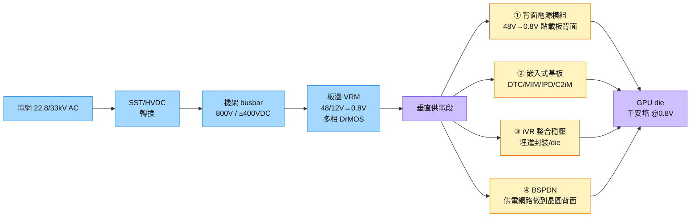

# 技術_垂直供電VPD

## 定義

垂直供電（VPD，Vertical Power Delivery）是將 AI 晶片電源模組從「die 四周橫向引入」改為「die 正下方垂直上傳」的封裝架構革命。AI 加速器核心電流已達**千安培級**（sub-1V × 1000W+），傳統橫向從板邊 VRM 拉電流橫穿載板數十 mm，I²R 損耗與 PDN 阻抗嚴重惡化，且佔用 beachfront 空間與訊號互連競爭。

VPD 把整個電源路徑「立起來」：電源模組放 die 正下方（載板背面），路徑從 cm 縮到 mm，損耗降一個數量級，並釋放板邊 beachfront 給訊號走線——這是 AI 晶片訊號互連從平面走向垂直的同一條故事線的電力版本。

## 圖解

圖說：VPD 的四條實作路線由外到內遞進——背面模組是最快落地的方案，BSPDN 是製程級終局；矽電容在每一層都是去耦核心。

## 技術原理

| 路線 | 內容 | 狀態 | 代表公司/產品 |
|------|------|------|--------------|
| ① 背面電源模組 | 48V→0.8V 兩級轉換模組貼載板背面，正對 die 投影區 | Rubin 世代導入中 | [[2308_台達電（市）]]、2301_光寶科（市）、6282_康舒（市） |
| ② 嵌入式基板 | 電容/電感/功率晶片埋入載板（C2iM、DTC、MIM、ALF/xQFN）縮短最後一哩 | 量産爬坡中 | [[6920_恆勁科技（市）]]（C2iM/ALF 已量産） |
| ③ IVR 整合穩壓 | 穩壓器整合進封裝/die（Intel 路線）；48V 直達封裝 | 部分產品化 | [[6531_愛普（市）]]（SiCap iVR） |
| ④ BSPDN 背面供電 | 供電網路做到晶圓背面——訊號正面、電力背面徹底分家 | 2026-27 量産 | Intel PowerVia（18A 已量産）、TSMC A16 SPR（2026H2）、Samsung SF2Z（2027） |

**與訊號互連的同構性：** 訊號互連在「水平→垂直」演化（2.5D→3D），供電也走一模一樣的路——從板邊橫進，變成從背面直上。兩者搶的是同一個資源：die 下方與周邊的立體空間。封裝設計正式從 2D 平面配置變成 3D 體積配置。

## 關鍵參數 / 判斷指標

| 指標 | 意義 | 投資觀察 |
|------|------|----------|
| EMIB-T 橋內 TSV 壓降改善 | -68~80%（ECTC 2026 量化） | 橋不只傳訊號也傳電，TSV 供電走廊是 VPD 關鍵節點 |
| EMIB-T MIM 電容 PDN 阻抗 | -82%（ECTC 2026） | [[技術_矽電容]] 需求的技術根源 |
| A16 SPR 量産時程 | TSMC 2026H2 量産目標 | BSPDN 納入量産製程即可觀測到遷移速度 |
| 矽力/杰華特 Rubin BOM 相數佔比 | 多相 DrMOS 在 Rubin 設計中的份額 | 板邊 VRM 能否守住 vs 背面模組加速侵蝕 |
| 恆勁 C2iM 認證進度 | 嵌入式基板方案進入量産的信號 | 台灣廠唯一已量産 C2iM 者 |

## 產業動能

- **千安培時代來臨：** Hopper→Blackwell→GB300→Rubin 核心電流逐代升至千安培級，VRM 相數爆量，橫向供電物理上撐不住。來源：[[報告_先進封裝技術發展方向_20260722]]，2026-07-22
- **NVIDIA Rubin 同步推 800VDC：** 供電鏈從機房（SST/HVDC）到封裝內（VPD）整條重構，[[2308_台達電（市）]] Computex 2026 展示 800VDC 列間電源系統為機房端標的。
- **EMIB-T 垂直供電工程：** Intel EMIB-T 橋內 TSV（壓降 -68~80%）+ MIM 電容（PDN 阻抗 -82%）本質是 VPD 工程延伸進封裝橋。

## 概念股 / 族群

| 類型 | 廠商 | 角色 | 觀察點 |
|------|------|------|--------|
| 電源模組系統 | [[2308_台達電（市）]] | SST/800VDC/±400VDC 電源櫃 + 板上模組 | 機房端 + 封裝端雙重受惠 |
| 電源模組系統 | 2301_光寶科（市） 6282_康舒（市） | 板上電源模組 | 穩定出貨 |
| 嵌入式基板/功率封裝 | [[6920_恆勁科技（市）]] | C2iM/ALF/xQFN 已量産；厚銅柱 + molding 載板可埋晶片與被動元件 | VPD 最直接台股結構受惠 |
| 矽電容/iVR | [[6531_愛普（市）]] | SiCap 整合 iVR；2-3 家 CSP 驗証中 | 放量週期 2-3 年 |
| 矽電容代工 | [[6770_力積電（市）]] | DRAM 溝槽式矽電容；Intel EMIB 認證 | 2026/27/28E 佔營收 3%/5%/9% |
| DrMOS/多相 DCDC | 矽力-KY (6415)（已入多代 NVIDIA 參考設計）| Vcore VRM | 下一波漲價方向（專家調研 2026-05） |
| 測試 | [[2360_致茂（市）]] | 電源測試 | SLT/power/metrology/CPO 四引擎 |

> [!note] 信心水準
> 台達電/光寶/康舒電源模組已量産出貨（高信心）。恆勁 C2iM/ALF 已量産（高信心）。矽力 Rubin 設計入選已有多代參考設計記錄（高信心）。愛普 CSP 驗証進行中（中信心）。BSPDN TSMC A16 SPR 量産時程為官方路線圖（高信心）。

## 技術瓶頸 / 風險

- **架構翻新是雙面刃：** 板邊 VRM BOM 若快速縮減，多相 DrMOS 用量可能下滑；追 DrMOS 同時要追嵌入式/C2iM 受惠者。
- **±400VDC 先行風險：** 800VDC 最終架構尚未定案，±400VDC 可能先行——機房改建成本與標準化進度是瓶頸。
- **BSPDN 製程整合複雜：** BSPDN 屬前段製程，良率要求等同先進製程，OSAT 難直接切入，利台積電。

## 相關技術

- [[技術_矽電容]]（VPD 每一層都依賴矽電容去耦）
- [[技術_CoWoS與先進封裝]]（EMIB-T 橋內 TSV 供電是 VPD 的封裝層實作）
- [[技術_800VDC供電架構]]（機房端 HVDC/SST 是 VPD 的上游）
- [[技術_ABF載板]]（C2iM/嵌入式電容以載板為載體）

## 來源

- [[報告_先進封裝技術發展方向_20260722]] — 定錨產業筆記講座，2026-07-22

## 相關頁面

- [[6415_矽力-KY（市）]]
