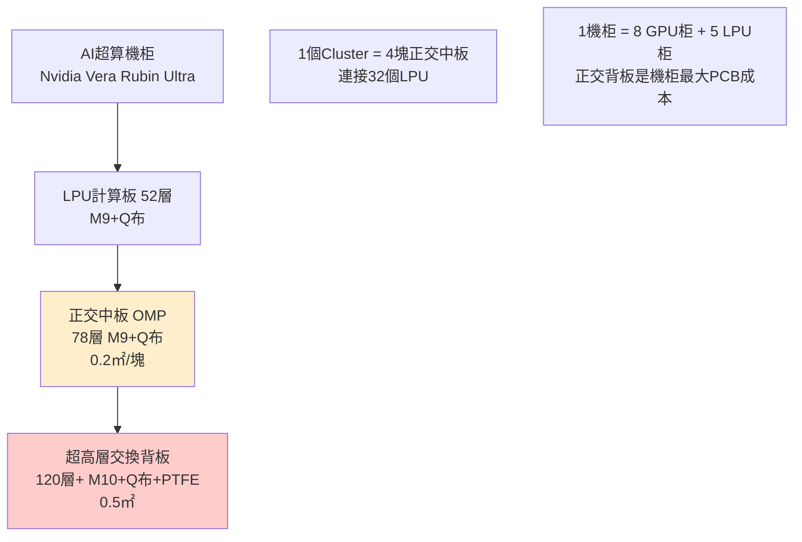
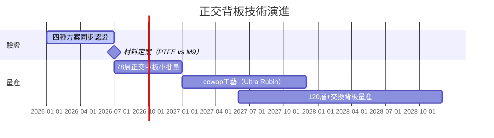

# 技術_正交背板

## 定義

正交背板（Orthogonal Backplane / Orthogonal Middle Plane）是 AI 超算機柜中連接多個計算板（LPU/GPU）與交換芯片的超高層數 PCB。「正交」指訊號層布線方向互相垂直以降低串擾。正交背板是機柜內 PCB **成本占比最大**的單件，也是目前 AI 伺服器 PCB 技術難度最高的品項，當前良率約 50%，仍在驗證中。

## 圖解

![[報告_Semianalysis_PCB_20250826_008.png]]
*圖（SemiAnalysis，2025-08）：Vera Rubin NVL72 主板架構截面——Rubin GPU compute tray 與 Vera CPU tray 以 paladin board-to-board connectors（正交連接器）垂直插入 Power Distribution Inner Busbar；CX-9 NIC 與 BlueField-3 DPU 側掛，液冷管路（cold water inlet / hot water outlet）貫穿機柜。正交背板（OMP/Orthogonal Middle Plane）正是各 tray 垂直插接的「中間平面」，背板上高密度連接器孔位間距決定 120 層+ PCB 鑽孔精度需求（盲孔 <30µm）與設計複雜度（正交布線消串擾）。*

![[報告_Semianalysis_PCB_20250826_004.png]]
*圖（SemiAnalysis，2025-08）：AWS Trainium2 伺服器「Simplified, cable-less chassis design」——Nitro Cards 與 Trainium2 Accelerators 直插 Rear Power Module Slot，無線纜束線。無纜化正是正交背板方案的終極目標：所有 compute card 透過背板連接器互連，消除傳統線纜引起的阻抗不連續性與散熱空間浪費，是 AI Scale-up 機柜走向高密度、高可靠的關鍵方向。*

## 技術原理

### 正交背板種類對比

| 板型                             | 層數         | 材料                         | 面積 / 塊 | 估計售價                                        | 功能              |
| ------------------------------ | ---------- | -------------------------- | ------ | ------------------------------------------- | --------------- |
| LPU 正交中板（OMP）                  | **78 層**   | M9+Q布                      | ~0.2 ㎡ | 1–3 萬 USD/柜（18 片 OAM + 9 片 Switch Board 一柜） | 連接 32 個 LPU 計算板 |
| 超高層交換背板                        | **120 層+** | 90% 碳氫（M10）+ Q布 + 10% PTFE | ~0.5 ㎡ | —                                           | 集成 12 顆交換芯片     |
| cowop PCB（Ultra Rubin，預計 2027） | —          | —                          | —      | —                                           | 下一代封裝工藝 CoWoP   |

### 材料方案選擇（2026 決策中）

四種規格同時驗證（26×3 / 26×4 各有 M8+PTFE 和純 M9），預計 **2026 年 7 月底最終定案**：

| 方案 | 材料成本/㎡ | 良率 | 預判 |
|------|-----------|------|------|
| M8+PTFE 混合 | 低於純 M9 | **較高** | **多位專家預判採用概率更高** |
| 純 M9 | 較高 | 目前約 50% | 台光主推，但成本高、良率低 |

> [!warning] 材料方案對 CCL 廠影響
> 若採 M8+PTFE 方案，台光電 M9 在正交背板的份額將顯著低於預期；若採純 M9，台光為最大受益者。最終定案時間：2026 年 7 月底，是近期重要催化劑。

### 超高層 PCB 技術現狀

| 層數等級 | 狀態 | 代表 |
|---------|------|------|
| 78 層 | 量產中 | 滬電（技術最深）、深南 |
| 110–140 層 | 目前 PCB 廠穩定上限 | — |
| 120 層+ | 樣機存在，量產待驗證 | 深南（128 層 0.5㎡ 樣機）|
| 168 層 | 技術可行，無量產先例 | — |

### cowop（CoWoP）工藝

CoWoP（Chip on Wafer on PCB）是 Rubin Ultra 考慮採用的正交背板新工藝。供應商在送樣中：李鼎、鵬鼎、勝宏、深南、興森，其中**鵬鼎和勝宏進度略快**。預計 2027 年量產。

## 關鍵參數 / 判斷指標

| 指標 | 數值 | 意義 |
|------|------|------|
| 當前 78 層良率 | **~50%** | 量產瓶頸，需大幅提升 |
| 材料方案定案時間 | **2026 年 7 月底** | 近期最重要催化劑 |
| OMP 售價（78 層）| 1–3 萬 USD/柜 | 機柜最大 PCB 成本 |
| 深南 128 層樣機尺寸 | 0.5㎡ | 代表當前可生產最高端 |

## 技術瓶頸 / 風險

- **良率極低**：目前正交背板良率約 50%，遠低於傳統 PCB，量產必須大幅提升
- **材料方案未定**：PTFE vs M9 的選擇影響 CCL 廠份額，2026 年 7 月才定案
- **超高層工藝**：120 層+ PCB 量產無先例，深南 128 層樣機是唯一參考點
- **設備與壓合挑戰**：超高多層 PCB 壓合、鑽孔設備均為瓶頸

## 技術演進時程

## 關鍵廠商

| 環節             | 廠商              | 角色                    |
| -------------- | --------------- | --------------------- |
| 78 層 OMP（中國）   | 滬電股份（中國，未建頁）    | 技術最深，78 層中板領先         |
| 高多層（中國）        | 深南電路（中國，未建頁）    | 128 層 0.5㎡ 樣機；高多層積累深  |
| M10 CCL 驗證（台灣） | [[2383_台光電（市）]] | 120 層交換背板 M10 主要驗證供應商 |
| cowop PCB（進展快） | 鵬鼎/勝宏（中國，未建頁）   | cowop 送樣進度略快          |
| 正交背板（台灣）       | [[4958_臻鼎（市）]]  | 送樣中，興森也在送樣            |
| 正交背板（中國國內最快）   | 景旺電子（中國，未建頁）    | 國內正交背板進展最快            |
| 正交背板（國外最快）     | JDT（未建頁）        | 國外進展最快                |

## 應用場景

- Nvidia Vera Rubin / Ultra Rubin AI 機柜（LPU 背板 78 層）
- 下一代 AI 機柜（120 層+ 交換背板）
- 未來 Feynman 平台

## 相關技術

- [[技術_PCB]]（正交背板是 PCB 技術的頂端形態）
- [[技術_CCL]]（M9/PTFE 材料方案是正交背板核心決策）
- [[技術_Q布]]（78 層/120 層+ 必須使用 M9+Q布 材料體系）
- [[技術_mSAP]]（Ultra Rubin OAM 同時用 mSAP 工藝）

## 來源

- [[memo_PCB_CCL调研_GB200_300_Rubin_M9_acecamptech_20260519]]
- [[memo_PCB调研_Rubin_正交背板_M8PTFE_acecamptech_20260518]]
- [[memo_CCL规格升级_M9_Q布_Rubin_BackPlane_acecamptech_20260410]]
- [[memo_PCB龙头专家_ABF_BT载板_正交背板_acecamptech_20260519]]
- [[memo_PCB市场调研_VR200_UltraRubin_OAM_mSAP_acecamptech_20260518]]
