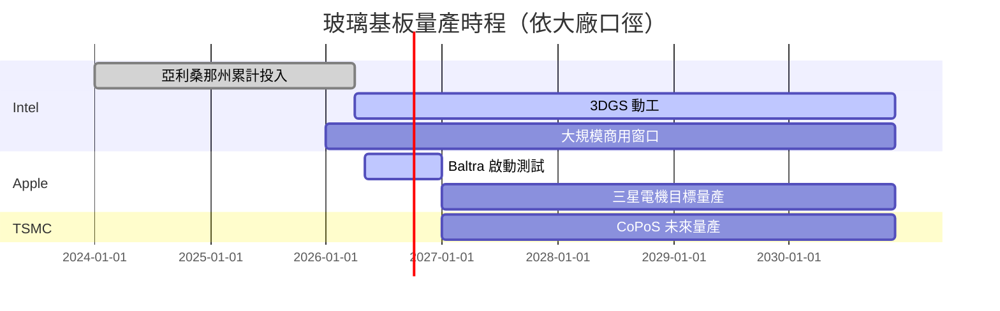

# 技術_玻璃基板

## 定義
玻璃基板（Glass Substrate）是以玻璃為基材的封裝載板技術。相對於有機 [[技術_ABF載板]]，玻璃基板具有 **CTE 接近矽、低介電損耗、適合大尺寸面板**等優勢，被視為下一世代封裝載板的替代候選，可用於替代 ABF 載板與矽中介層。應用領域涵蓋先進封裝、CPO 光電共封裝、6G 射頻等。

主要資料來源：[[報告_其他_玻璃基板_20260511]]（國金證券「玻璃基板行業深度」，2026-05-11；分析師李陽 S1130524120003）。

Morgan Stanley（2026-07-26）補充，顯示器供應鏈廠商正透過 TGV 與鍍銅製程切入玻璃核心基板；Lens Tech 與 Intel 合作案的試產目標為 2026 年底、較具意義的出貨可能落在 2H27，屬券商查核與估計。報告同時指出，真正瓶頸偏向高密度／高精度的製程控制與良率，而非單純設備能力。

## 圖解

![[報告_其他_玻璃基板_20260511_005.png]]
> CoWoS / HBM 主力客戶包攬產能：NVIDIA、Google、AMD、Amazon 共占 90%/92%（國金引 Epoch AI 2025）。玻璃基板的需求動能來自 AI 算力產能不足、TSMC 推動封裝方案迭代。

![[260726_ms_glass-in-advanced-packaging_001.png]]
> Morgan Stanley（2026-07-26）對玻璃核心基板進度的判斷：TGV／鍍銅已由顯示器供應鏈廠商積極切入，但量產價值取決於高密度製程控制與良率改善。


## 技術原理

### 三段製程

1. **原片**：採用**無鹼硼矽玻璃**（不同於建築玻璃），要求 CTE 接近矽、低介電損耗。全球供應集中於美國、日本，主要玩家為康寧、旭硝子、電氣硝子、肖特
2. **TGV 通孔**（Through Glass Via）：主流方法為**雷射誘導蝕刻 LIDE**，涉及雷射設備與蝕刻液（蝕刻液需與玻璃配方配套定制）
3. **孔內填充**：包含金屬化、電鍍、RDL 布線。核心難點在於**無空洞、無縫隙的銅填充**

### TSV vs TGV
- TSV = Through Silicon Via，傳統矽中介層技術（CoWoS 採用）
- TGV = Through Glass Via，玻璃基板替代方案（CoPoS / 3DGS 採用）
- TGV 替代 TSV 後，材料端增量主要在**上游玻璃原片**與**加工輔材**

### TGV Via 三種形態（SKC US10903157）

| 類型 | 幾何特徵 | 說明 |
|------|----------|------|
| 圓柱型（Cylindrical） | CV1 ≈ CV2，最小徑 CV3 在開口端 | 上下孔徑相近 |
| 截錐型（Truncated Pyramidal） | CV1 ≠ CV2，CV3 = 較小開口端 | 雷射蝕刻常見形態 |
| 桶型（Barrel） | CV3 位於 CV1/CV2 之間，CV3 < max(CV1, CV2) | 雙面蝕刻交會點縮頸 |

### 玻璃-金屬附著（決定銅填充可靠性）

電鍍銅與玻璃面天然附著力低，需二擇一或組合：
- **乾法（sputtering）**：Ti/Cr/Ni seed layer，錨定效應
- **濕法（primer）**：胺基官能基化合物 + 奈米顆粒（平均粒徑 ≤ 150 nm）；MEC Inc. CZ 系列為代表
- 附著強度標準：剝離 ≥ 3 N/cm、鍵合 ≥ 4.5 N/cm；ASTM D3359 ≥ 4B

## 關鍵參數 / 判斷指標

| 指標 | 意義 | 觀察重點 |
|------|------|----------|
| CTE 匹配度 | 與矽片熱膨脹係數差異 | 玻璃 CTE 接近矽，優於有機 ABF |
| 介電損耗 | 高頻訊號性能 | 玻璃低於矽基，適合高頻 / 6G |
| 翹曲（warpage） | 大尺寸面板良率 | 玻璃比有機載板穩定 |
| 表面粗糙度 Ra | 精細線路前提 | ≤ 10 angstroms（SKC US10903157）；低 Ra 使精線成形更穩定，有機 ABF 無法達到 |
| 精細線路線寬/間距 | 單位面積訊號密度 | < 4 μm；最小可達 1–2.3 μm（SKC 實證）；矽 interposer 典型 2–5 μm；有機 ABF > 8 μm |
| 玻璃基板厚度 | 整體封裝高度 | 100–500 μm（典型）；整體封裝基板 120–2,000 μm |
| 面板尺寸 → 利用率 | 單次產出量 | 310×310mm 利用率 45→81%（vs 圓晶圓）；可擴展至 515×510mm、750×620mm |
| 單次產出量 | 量產經濟性 | 相當於 12 吋晶圓 4-8 倍 |
| LIDE 設備產能 | 量產瓶頸 | 雷射設備供應 |
| 銅填充良率 | 製程瓶頸 | 無空洞填充技術門檻 |

## 玻璃載板金屬化製程設備（六大步驟）

> 來源：TPCA/金屬工業研究發展中心（[[報告_呂紹旭_玻璃載板FOPLP_20260508]]，2026-05）

| 步驟 | 製程 | 主要技術挑戰 | 全球主要設備供應商 |
|------|------|-------------|------------------|
| 1 | **TGV 雷射改質** | 玻璃脆性 → 微裂痕；孔徑 <30μm 熱影響區控制嚴格；波長選擇與實時功率調整 | DISCO（日）、Orbotech（以）、MKS（美）、[[GLW.US(corning)]]（美）、三星電子（韓） |
| 2 | **蝕刻通孔** | 玻璃化學惰性高；蝕刻速率難穩定；側蝕 / 孔徑不均 | MEC Company Ltd.（日）、RENA（德）、Manz（德） |
| 3 | **AOI 光學檢查** | 玻璃高透明性 → 影像對比不足；需 3D 成像 + AI 演算法 | Camtek（以）、Orbotech（以）、SCREEN（日）、Mycronic（美） |
| 4 | **種子層鍍膜（PVD）** | 玻璃非導電性 → 金屬附著力不足；鍍膜厚度控制數十奈米 | Evatec（瑞士）、Applied Materials（美）、ULVAC（日） |
| 5 | **電鍍銅** | TGV 深寬比高 → 電流陰影效應；孔內空洞（void） | MacDermid Alpha（美）、UYEMURA（日）、MKS Atotech（德） |
| 6 | **研磨** | 表面平坦化，玻璃高硬度 | Applied Materials（美）、DISCO（日）、Okamoto（日） |

目前全球設備供應高度集中於美日德以，台灣設備廠（雷射加工、蝕刻、AOI、PVD、電鍍、研磨各環節均有廠商投入）仍處初期探索，缺乏系統性試量產驗證平台。

## 技術瓶頸 / 風險

- **原片供應集中**：康寧（美）、AGC / NEG（日）、肖特（德）四家集中供應，國產替代空間大
- **TGV 良率**：雷射誘導蝕刻參數 + 蝕刻液配方需與玻璃配方配套；<30μm 孔徑的熱影響區控制為核心難題
- **銅填充無空洞**：技術門檻高；深寬比高 TGV 對電鍍均勻性要求極高
- **量產時程不確定**：[[INTC.US(intel)]]、[[AAPL.US(apple)]]、[[2330_台積電（市）]] 各家時程口徑不同
- **供應鏈設備集中**：六大製程設備仍依賴國際大廠（見上方製程表），後進者進入門檻高

> [!warning] 量產時程並列（國金證券，2026-05-11，[[報告_其他_玻璃基板_20260511]]；TPCA，2026-05，[[報告_呂紹旭_玻璃載板FOPLP_20260508]]）
> 三家大廠玻璃基板量產時程口徑不同：
>
> - **[[INTC.US(intel)]]**：累計 >10 億美元投入亞利桑那州；2026-01 展示 Clearwater Forest（首款玻璃核心基板 Server CPU）；2026-04 3DGS 動工，年產 ~7 萬基板；**2026-2030 大規模商用窗口**
> - **[[AAPL.US(apple)]]**：Baltra AI server 晶片啟動玻璃基板測試；三星電機供 T-glass；**三星電機目標 2027 後量產**（非 Apple 出貨時點）
> - **[[2330_台積電（市）]]**：2026Q1 法說提 CoPoS，「**未來幾年內量產**」
>
> 三家時程窗口不同，反映玻璃基板**仍處於早期量產推進階段**（maturity: early）。

**TPCA/金屬中心（2026-05）產業共識時程：**
- **2027 年起**：部分高階應用小量導入
- **2028 年起**：AI/HPC 高階晶片封裝開始導入
- **2030 年後**：逐步放量，IC 載板市占率目標 **10-15%**



## 關鍵廠商

### 顯示器供應鏈切入進度（Morgan Stanley，2026-07-26）

| 廠商 | 路線 | 時程／狀態 | 信心水準 |
|---|---|---|---|
| Lens Tech（300433.SZ，未建頁） | 與 Intel 合作玻璃核心＋TGV | 2026 年底試產線；2H27 可能較具意義出貨 | 中 |
| Innoux（3481.TW，未建頁） | 與 TSMC／Ibiden 玻璃核心專案 | 2028H2–2029 量產（報告查核） | 中低 |
| BOE（000725.SZ，未建頁） | 玻璃核心 ABF 全流程 | 2027 建置產能、2028 量產條件式規劃 | 中低 |
| AUO（2049.TW，未建頁） | LEO 天線／Micro LED 光模組玻璃 | 尚無明確量產時程 | 低 |

> [!warning] 關係邊界
> 上表的合作對象、量產時程與出貨判斷均來自 Morgan Stanley 查核／推估；本次不視為已確認訂單或公司正式指引。

### 上游玻璃原片（國際巨頭）

| 環節 | 廠商 | 角色 |
|------|------|------|
| 玻璃原片 | [[GLW.US(corning)]] Corning（美國） | 國際巨頭；GLASSBRIDGE 光纖連接器（ECTC 2026） |
| 玻璃原片 | 旭硝子 AGC（日本，未建頁） | 國際巨頭 |
| 玻璃原片 | 電氣硝子 NEG（日本，未建頁） | 國際巨頭 |
| 玻璃原片 | 肖特 Schott AG（德國，未建頁） | 國際巨頭 |
| 玻璃基板封裝 | SKC Co., Ltd.（韓國 KRX:011790，未建頁） | 2019 年即申請玻璃基板封裝 core 層美國專利（US10903157，2021 授權）；玻璃基板業務後獨立為子公司 Absolics Inc. |

### 上游玻璃原片 / 加工（中國 A 股潛在受惠，純文字列出）

> 以下廠商為國金證券 2026-05-11 報告點名的中國 A 股潛在受惠標的，**本次 ingest 不主動建公司頁**，留待後續 ingest 該主題的補充資料時再評估建頁。

- **凱盛科技**（A 股，未建頁）：顯示材料國產龍頭，TGV 通孔玻璃技術儲備充足。顯示材料 2025 營收 46.3 億人民幣（+31.4% YoY），客戶含京東方、三星、LGD、亞馬遜；應用材料含球形二氧化矽、鈦酸鋇（MLCC）等
- **旗濱集團**（A 股，未建頁）：浮法玻璃 / 光伏玻璃龍頭（產能均位列行業前三）。2025-08 與某「國內著名自主晶片科技公司」合作研發晶片封裝玻璃
- **戈碧迦**（A 股，未建頁）：特種玻璃材料。玻璃基板已向多家國內半導體廠商送樣（用於 TGV 封裝）；玻璃載板已通過多家半導體廠商驗證（含 2.5D/3D 先進封裝）；參股 TGV 公司熠鐸科技
- **沃格光電**（A 股，未建頁）：玻璃精加工。掌握 TGV 全製程（薄化、鍍膜、TGV 微孔、電鍍、多層線路）；TGV 微孔孔徑最小 5μm、深徑比 100:1；已建首條年產 10 萬平米 TVG 產線；1.6T 光模塊玻璃基載板小批量送樣；成都沃格 8.6 代線預計 2026 量產，月產能 2.4 萬片

### 中段製程（中國 A 股，純文字列出）

- **天承科技**（A 股，未建頁）：TGV 填孔電鍍液國產替代核心供應商；客戶含京東方、三疊紀、玻芯成；對標英特格、摩西湖、杜邦、樂思化學、石原、巴斯夫等國際廠商
- **江化微**（A 股，未建頁）：半導體用湿電子化學品；TGV 蝕刻相關產品含氫氟酸、氟化銨、矽腐蝕液、清洗劑
- **德邦科技**（A 股，未建頁）：玻璃基板封裝用光固化膠、晶圓劃片膜（已應用於 CIS 晶片玻璃基板封裝）

### 玻璃基板量產推手

| 環節 | 廠商 | 角色 |
|------|------|------|
| 自製玻璃基板 | [[INTC.US(intel)]] | 亞利桑那州 3DGS 量產線、Clearwater Forest 首款產品 |
| TGV 製程供應 | 三星電機 Samsung Electro-Mechanics（未建頁） | T-glass 供 Apple Baltra |
| CoPoS 平台 | [[2330_台積電（市）]] | 對外服務模式 |

### 下游 / 終端

| 環節 | 廠商 | 角色 |
|------|------|------|
| 玻璃基板 Server CPU | [[INTC.US(intel)]] | Xeon 6+ Clearwater Forest（自家用） |
| AI server 晶片 | [[AAPL.US(apple)]] | Baltra（自家用） |
| AI GPU 未來路線 | [[NVDA.US(nvidia)]] | 是否轉用待觀察，本次來源未直接點到 |

## 應用場景

1. **先進封裝**：在 TSMC CoPoS 方案中替代矽中介層，將圓形面板替換為更大尺寸矩形玻璃面板。以 310×310mm 為例，面積利用率可由 45% 提升至 81%；擴展至 515×510mm、750×620mm 仍保持同等水平，單次產出相當於 12 吋晶圓 4-8 倍

2. **CPO 光電共封裝**：替代矽集光電整合。矽的高介電常數與損耗正切在高頻應用會帶來較大損耗。玻璃低介電損耗 + 接近矽的 CTE 表現出更好的熱穩定性，提升電氣性能、降低寄生效應

3. **6G 射頻**：玻璃基板降低高頻傳輸損耗、提升器件 Q 值。長電科技 TGV 射頻 IPD 工藝驗證的 3D 電感在 Q 值等關鍵指標上較同等電感值平面結構提升接近 50%

## ECTC 2026 玻璃基板更新（定錨 + SimpleTechTrend）

### AMAT TGV 失效機制（ECTC 2026）

Applied Materials（AMAT）在 ECTC 2026 揭示 TGV 的根本失效機制：

- **失效原因**：銅電鍍後在 recess（凹陷）處的熱脹應力集中→介面起裂（Cu CTE 17 vs 玻璃 3.5 ppm/°C，溫差 200°C 以上）
- **解方**：低 CTE + 低楊氏模量的 liner 材料（在 TSV 壁面形成緩衝層）
- **效果**：應力降低 **-60%**，TGV 可靠性顯著提升

此機制與 TSV（矽）的失效模式不同——玻璃的低模量反而使應力集中在金屬-玻璃介面更嚴重。

（來源：[[報告_先進封裝技術發展方向_20260722]]，定錨，2026-07-22）

### Intel 大面積玻璃面板展示（ECTC 2026）

Intel 於 ECTC 2026 展示 **510×515mm 24 層玻璃面板**——目前業界公開的最大尺寸 / 最多層數玻璃封裝基板。

- 代表 Intel 3DGS 技術路線已具備大面板多層製程能力
- 但商業量産仍在探索：3DGS 亞利桑那廠年産能 ~7 萬基板（2026 年），針對 Intel 自家 Xeon 6+ Clearwater Forest 使用

### Absolics 量産狀態

**Absolics Inc.**（SKC 子公司）是目前全球**唯一具備量産設施並正在小量生産**的玻璃基板廠商，位於喬治亞州米爾利奇維爾（Milledgeville）。

- 小量生産中，尚未達到商業規模量産
- 持有 SKC US10903157（2021 授權）等核心玻璃基板封裝 Core 層專利
- 代表玻璃基板最早的商業落地時點，但規模化路徑仍不確定

### TSMC CoPoS 玻璃芯 + 群創 + Ibiden 共同開發（JPCA 2026）

TSMC CoPoS 玻璃芯基板共同開發陣列在 JPCA 2026 浮現（來源：群益証券/JPMorgan 雙方獨立確認）：
- **TSMC**：提供 CoPoS 封裝製程與設計規範
- **群創光電（3481）**：玻璃原片加工（TGV 通孔製程，顯示廠跨入封裝基板）
- **Ibiden（IBIE JP）**：ABF 載板龍頭，負責下層有機基板整合

此三方合作代表 TSMC 在 CoPoS 玻璃基板路線上已找到本土化供應鏈方案，是 2027 試産目標的基礎。

> [!warning] 2030 前量産困難
> 即便 TSMC CoPoS 試産計畫 2027 年進行，玻璃基板的全面規模量産面臨以下挑戰：
> - TGV 銅填充無空洞良率尚未穩定
> - 大面板（310×310mm→500×500mm）翹曲控制仍是未解難題
> - Absolics 是唯一量産廠且規模極小
> - AMAT TGV 失效機制（應力集中）需額外 liner 製程增加成本
>
> 業界共識：**2030 年前玻璃基板難以大量量産**，更可能的時程是 2031-2033 年。

## ECTC 2026 玻璃基板光電整合（SimpleTechTrend，2026-06）

ECTC 2026 多篇論文確認玻璃基板進入「光電合一中介層」時代：

### 東北大學 TGV 銅填充（MCEP+HIP）

| 指標 | 值 |
|------|----|
| 製程 | MCEP（低溫熱壓）+ HIP（熱等靜壓）|
| 孔內無空洞 | ✓（zero-void）|
| 銅晶粒尺寸 | >45 µm（高導電性）|
| 楊氏模量 | <60 GPa（比銅低 30%，緩衝 CTE 應力）|

### GF × Corning GLASSBRIDGE 可拆光纖連接器（ECTC 2026）

[[GFS.US(globalfoundries)]] 與 [[GLW.US(corning)]] 合作：
- TE 插入損耗：**1.44 dB/facet**；TM：1.75 dB/facet；PDL ~0.3 dB
- 功率承受：>280 mW
- MT 相容可拆設計；Z-stop + 光刻基準完全被動對準
- SiN SSC 同時匹配 9 µm 模場並抑制非線性吸收

### Intel V-groove 玻璃耦合器（ECTC 2026）

[[INTC.US(intel)]]：450 次熱循環（-40 → +125°C），插入損耗 <0.7 dB，完全被動對準，與 3DGS 玻璃平台同製程。

### Mitsubishi Electric Glass-IP + RDL + EML（ECTC 2026）

[[Mitsubishi Electric（未）]]：玻璃中介層同時處理電（TGV）、光（EML 覆晶）、熱（玻璃熱隔離），89 GHz 3-dB BW，106.25 Gbaud PAM4，TDECQ 2.37 dB。

### Sumitomo Electric + FICT 準直鏡（ECTC 2026）

[[Sumitomo Electric（未）]]：off-axis 拋物面準直鏡，3 µm → 32 µm 擴束，3 µm 對位誤差僅 0.2 dB 損耗，FC 模組耦合 -2.30 dB。

資料來源：[[research_simpletechtrend_CPO矽光子ECTC2026_20260629]]

## TGV 專家講座重點（2026-07-22）

來源：[[活動_TGV先進封裝技術講座_20260722]]（TGV 先進封裝技術研討講座，2026-07-22）

### 量產時程（講師視角，較保守）

| 技術路線 | 業界樂觀估 | 講師保守估 |
|---------|----------|----------|
| CoPoS（面板級先進封裝，首波） | 2028 量產 | **2029-2030 大量量産**（工程樣品 2027） |
| Glass Interposer（玻璃中介層） | 2028-2030 | **2030-2032** |

> 講師觀點：CoPoS 2028 量産是台積電官方目標，但從材料 + 設備 + 良率多角度看，**大量量産最快 2029-2030**；Glass Interposer 則須再往後推 2 年。

### 關鍵製程參數

- **玻璃厚度甜蜜點**：**500µm**（平衡強度 vs 加工性）。>700µm 難蝕刻、<300µm 翹曲嚴重
- **蝕刻液選擇**：鹼性蝕刻（**KOH / NaOH**）優於 HF；理由：穩定性高（HF 反應速率難控制）、選擇性好、環境友善，適合量産環境
- **切割（Dicing）**：TGV 製程中**風險最高步驟**——切割應力易在 TGV 孔周邊引發裂紋擴展，是良率損耗最大的節點；兩段式切割（粗 → 精）可有效降低殘留應力

### 良率挑戰：微裂紋偵測

- 玻璃切割後的微裂紋（micro-crack）光學檢測困難（玻璃高透明性）
- **超聲波成像**是潛力偵測方法，但尚無商業化設備進入量産流程
- 目前僅能在失效後追溯，無法做到全量在線 100% 偵測

### 廠商策略差異

| 廠商 | 策略 | 講師觀點 |
|------|------|---------|
| [[3037_欣興（市）]] Unimicron | 保守，先觀望 | 認為市場定義不夠清晰，寧可等客戶拉貨再投資；無意領先 |
| 群創光電（3481） Chi Mei | 積極切入 | 顯示廠出身的玻璃搬運、切割、製程管理能力是優勢；有機會在 TGV 前段加工取得領先 |
| Kyocera（京瓷） | 以陶瓷基板替代 | 指出陶瓷（LTCC）亦有 CTE 接近矽、低損耗特性，可與玻璃基板競爭部分應用場景 |

### 製程瓶頸共識

1. TGV 銅填充良率（無空洞）：尚未穩定，是量産最核心瓶頸
2. 大面板翹曲控制（≥310mm）：材料 CTE 控制仍是未解難題
3. 切割裂紋：最易造成批量失效，製程窗口狹窄

## 元皓投資講座（2026-08-01）— 林奕盛

來源：[[活動_玻璃先進封裝_元皓投資Transcript_20260801]]（元皓投資半導體封裝專家講座，講者：林奕盛，TGV/FOCoS 十多年實務經驗，2026-08-01）

### 為什麼玻璃能取代有機 ABF / 矽中介層

| 問題 | 有機 ABF | 矽中介層 | 玻璃 |
|------|---------|---------|------|
| CTE | 高、大面積翹曲嚴重 | 接近矽，良好 | 接近矽，良好 |
| 表面平整度 | 崎嶇（filler 殘留）→ 訊號延遲 | 平整 | 平整 |
| Dk/Df（訊號損耗） | 高（崎嶇如土壤）| 高（矽介電損耗）| 低（如水泥渠道）|
| 尺寸擴展性 | 較容易但翹曲 | 受限 12 吋晶圓利用率 | 可做 310×310→510×515 以上面板 |
| 線寬極限 | ABF filler 約 5µm → 無法做 <3µm 線路 | — | PSPI 搭配可做至 1-2µm |

**矽晶圓不能用的根本原因**：12 吋晶圓圓形利用率有限；以 H100 為例，12 吋晶圓可搭 28 顆晶片，510×515 面板可搭 105 顆，面積效率差 3.75x。

**ABF + 玻璃 + PSPI 三層搭配的必要性**：ABF filler 最小約 5µm，若強行做 1-3µm 細線路，filler 殘留會造成短路；因此細線路層必須用 PSPI（photosensitive polymer）做，粗層用 ABF，核心用玻璃，三者互補。

### TSMC Corpus 結構（台積電 CoPoS 玻璃核心）

```
群創（Chi Mei）
  └─ 玻璃原片 + 表面酸洗 + 雷射改質（TGV 通孔成形）
       ↓
Ibiden
  └─ ABF 增層（上下雙層 build-up，客戶可選單邊）
       ↓
→ 合稱「玻璃核心載板」交付台積電
       ↓
台積電
  └─ PSPI 增層（細線路層，層數視需求）+ 晶片 bonding + compound 固化 + 切割
       ↓
  成品：Corpus（TSMC CoPoS package）
```

**群創選定的原因**：具備最長的玻璃 handling 經驗 + 面板廠大面積製程能力（TGV 良率最佳），700×700 尺寸 FOCoS 已量產（TEP 技術）。

### TGV 核心製程流程（林奕盛版）

1. 玻璃原片表面酸洗（清潔）
2. 雷射改質（Laser Modification）→ 玻璃材質局部改變
3. 酸洗蝕刻成形（KOH/NaOH 鹼性蝕刻，選擇比 100+，16 小時穩定）
4. PVD seed layer（Sputter Ti + Cu，提供電場感應基底）
5. 電鍍填孔（Electroplating，控制 void 關鍵步驟）
6. CMP 研磨平坦化
7. 堆疊 ABF build-up 層（交由 Ibiden）
8. 交付台積電 → PSPI 細線路層 + 晶片 bonding + compound 固化 + 切割

### 五大技術難點（林奕盛列舉）

| # | 難點 | 說明 |
|---|------|------|
| 1 | 散熱 | 玻璃導熱性差，熱管理永遠是挑戰 |
| 2 | Cu-玻璃 CTE 不匹配 | 銅 CTE 17 vs 玻璃 ~3.5 ppm/°C；電鍍填孔後玻璃邊緣可能產生 microcrack |
| 3 | 鈍化層附著 | 玻璃惰性表面無法直接與銅附著，需額外處理 |
| 4 | 玻璃脆性 | 切割、翻轉等機械應力易造成碎裂 |
| 5 | TGV 良率 | 幾萬孔中部分出現盲孔；電鍍未控制好產生 void（空洞） |

### 改善方案

| 議題 | 改善方案 | 機制 |
|------|---------|------|
| Cu-玻璃附著 | **Ti（鈦）緩衝層** | Ti 的 CTE 介於玻璃與銅之間，作為過渡層防止分層；PVD 效果最佳，化學法成本低適合初期驗證 |
| 蝕刻穩定性 | **KOH/NaOH 鹼性蝕刻** | 選擇比 100+、16 小時穩定；安全性優於 HF；業界已轉向此方向 |
| 切割良率 | **兩段式切割 + Bessel Beam 雷射** | 需一次切穿高分子/金屬/玻璃三種材料且零缺陷；兩段式降低殘留應力；Bessel beam 減少熱影響區 |
| 缺陷檢測 | **超音波成像** | Microcrack 為主要良率殺手；光學方法因玻璃透明性不足；超音波可能偵測次表面缺陷 |

### 時程估計（林奕盛個人觀點，較保守）

| 階段 | 時程 | 說明 |
|------|------|------|
| 材料設備驗證 | 2026 | 目前進行中 |
| CoPoS（FOPLP，第一代）量產 | 2028 年可能 | 台積電官方目標，講師認為可能性較有機會（若供應鏈配合） |
| Glass Interposer 成熟 | 2030-2032 | 較市場共識保守；難點更多 |
| Glass Core Substrate | 2030 以後 | 時程類似或略晚於 Interposer |

> [!note] 與上一場 TGV 講座（2026-07-22）的時程對比
> 2026-07-22 講座：CoPoS 2029-2030（大量量産）、Glass Interposer 2030-2032。
> 2026-08-01 林奕盛：CoPoS 2028 可能量産（較樂觀一些），Glass Interposer 2030-2032。
> 兩者在 Glass Interposer 時程上一致，但 CoPoS 估計略有分歧（1-2 年差異），反映技術難點判讀不同。

## 相關技術
- [[技術_ABF載板]]（中期被替代候選）
- CoWoP（不需基板方案，本次未建頁）
- [[技術_矽光子（SiPh）]]（玻璃基板上 SiPh 整合）
- [[技術_聚合物波導]]（玻璃基板上聚合物波導整合）

## 供應鏈
→ [[供應鏈_先進封裝載板]]

## 來源

## 本次 ingest 更新（Morgan Stanley，2026-08-14）

- [[3481_群創（市）]] 的玻璃核心基板 PoC 已完成並進入更多驗證；Morgan Stanley 將最早量產時間放在 2028 年，屬券商判斷與公司專案進度，不能視為已確認量產。

- [[260726_ms_glass-in-advanced-packaging]] — Morgan Stanley，2026-07-26；顯示器供應鏈玻璃核心基板合作、TGV／鍍銅進度與良率瓶頸

- [[報告_其他_玻璃基板_20260511]] — 國金證券（李陽 S1130524120003），2026-05-11
- [[報告_呂紹旭_玻璃載板FOPLP_20260508]] — TPCA/金屬工業研究發展中心（呂紹旭），2026-05-08；涵蓋全球 IC 載板市占、玻璃載板製程六大設備步驟、台灣廠商數據（注：pages 24-68 未完整解析）
- [[research_simpletechtrend_CPO矽光子ECTC2026_20260629]] — SimpleTechTrend，2026-06-29
- [[專利_US10903157_SKC_玻璃基板CoreLayer_20210126]] — SKC Co., Ltd. / USPTO，2021-01-26
- [[活動_TGV先進封裝技術講座_20260722]] — TGV 先進封裝技術研討講座，2026-07-22；講師視角：CoPoS 2029-30 量産（保守估）、Glass Interposer 2030-32、500µm 厚度甜蜜點、KOH/NaOH 鹼性蝕刻、切割為最高風險步驟、群創玻璃搬運優勢、京瓷陶瓷替代路線
- [[活動_玻璃先進封裝_元皓投資Transcript_20260801]] — 元皓投資，2026-08-01；講師林奕盛（TGV/FOCoS 十多年實務）；TSMC Corpus 三方供應鏈（群創+Ibiden+TSMC）、ABF+玻璃+PSPI 三層搭配邏輯、五大技術難點、Ti buffer layer / KOH 蝕刻 / Bessel beam 切割等改善方案；時程：2026 驗證→2028 CoPoS FOPLP→2030-2032 Glass Interposer

## 景碩載板廠觀點（2026-07-30）

[[3189_景碩（市）]]將玻璃相關路線拆成四種不同用途，避免把「玻璃基板」視為單一技術：

| 路線 | 玻璃角色 | 景碩觀察時程／成熟度 | 主要瓶頸 |
|------|----------|----------------------|----------|
| CoPoS | 暫時 carrier，封裝後移除 | 約 2029，最先發生 | 結構相對單純，不涉及 TGV |
| Glass core | 取代有機載板 core layer | 約 2030 起少量產品嘗試 | 鑽孔、鍍銅、microcrack、易碎 |
| Glass interposer | 取代 silicon interposer | 更晚，晶圓代工短期不主推 | 生態與可靠度驗證 |
| Glass substrate | 玻璃直接作完整載板 | 最晚，可能先限 low-pin-count PMIC | ITO／厚銅、機械強度與良率 |

載板廠歡迎 Glass core，因可降低對玻纖布依賴並提高單位產值；但景碩同時研發陶瓷核心，原因是陶瓷剛性較高、可緩解玻璃易碎與楊氏係數不足，代價是供應鏈與客戶熟悉度較低。此為公司／產業訪談觀點，屬中信心，需等待量產 SKU 驗證。

來源：[[活動_景碩法說電話會議_20260730]]（2026-07-30）
## 相關頁面

- [[分析_晶片尺寸擴大與面板級封裝2026]]
- [[分析_先進封裝與RDL]]
- [[4768_英特磊（市）]]
- [[技術_CoWoS與先進封裝]]
- [[Dai Nippon Printing（未）]]
- [[供應鏈_AI伺服器PCB]]
- [[技術_CPO]]
- [[技術_HVLP銅箔]]
- [[技術_混合鍵合]]
- [[3037_欣興（市）]]
- [[8046_南電（市）]]
- [[GFS.US(globalfoundries)]]
- [[GLW.US(corning)]]
- [[INTC.US(intel)]]
## Morgan Stanley 2026-08 更新

- [[260818_ms_inx]] 與 [[260820_ms_2h-aug-panel-px]] 將玻璃核心基板定位為仍待技術、良率與供應鏈突破的早期方案；Innolux 的相關機會尚未形成可確認的量產貢獻。
- 投資判斷：應追蹤樣品／驗證、翹曲與良率、合作夥伴及量產時間，不宜把研究情境寫成訂單或確定量產。
