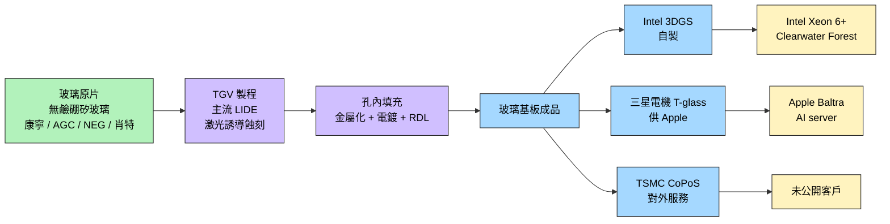
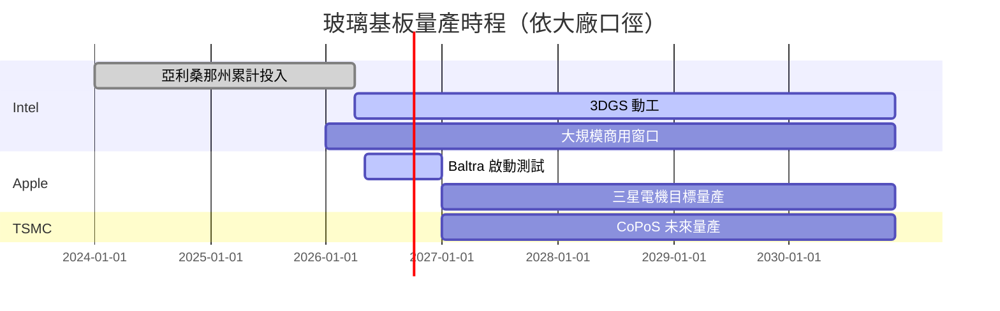

# 技術_玻璃基板

## 定義
玻璃基板（Glass Substrate）是以玻璃為基材的封裝載板技術。相對於有機 [[技術_ABF載板]]，玻璃基板具有 **CTE 接近矽、低介電損耗、適合大尺寸面板**等優勢，被視為下一世代封裝載板的替代候選，可用於替代 ABF 載板與矽中介層。應用領域涵蓋先進封裝、CPO 光電共封裝、6G 射頻等。

主要資料來源：[[報告_其他_玻璃基板_20260511]]（國金證券「玻璃基板行業深度」，2026-05-11；分析師李陽 S1130524120003）。

## 圖解

![[報告_其他_玻璃基板_20260511_005.png]]
> CoWoS / HBM 主力客戶包攬產能：NVIDIA、Google、AMD、Amazon 共占 90%/92%（國金引 Epoch AI 2025）。玻璃基板的需求動能來自 AI 算力產能不足、TSMC 推動封裝方案迭代。

## 技術原理

### 三段製程

1. **原片**：採用**無鹼硼矽玻璃**（不同於建築玻璃），要求 CTE 接近矽、低介電損耗。全球供應集中於美國、日本，主要玩家為康寧、旭硝子、電氣硝子、肖特
2. **TGV 通孔**（Through Glass Via）：主流方法為**激光誘導蝕刻 LIDE**，涉及激光設備與蝕刻液（蝕刻液需與玻璃配方配套定制）
3. **孔內填充**：包含金屬化、電鍍、RDL 布線。核心難點在於**無空洞、無縫隙的銅填充**

### TSV vs TGV
- TSV = Through Silicon Via，傳統矽中介層技術（CoWoS 採用）
- TGV = Through Glass Via，玻璃基板替代方案（CoPoS / 3DGS 採用）
- TGV 替代 TSV 後，材料端增量主要在**上游玻璃原片**與**加工輔材**

### TGV Via 三種形態（SKC US10903157）

| 類型 | 幾何特徵 | 說明 |
|------|----------|------|
| 圓柱型（Cylindrical） | CV1 ≈ CV2，最小徑 CV3 在開口端 | 上下孔徑相近 |
| 截錐型（Truncated Pyramidal） | CV1 ≠ CV2，CV3 = 較小開口端 | 雷射蝕刻常見形態 |
| 桶型（Barrel） | CV3 位於 CV1/CV2 之間，CV3 < max(CV1, CV2) | 雙面蝕刻交會點縮頸 |

### 玻璃-金屬附著（決定銅填充可靠性）

電鍍銅與玻璃面天然附著力低，需二擇一或組合：
- **乾法（sputtering）**：Ti/Cr/Ni seed layer，錨定效應
- **濕法（primer）**：胺基官能基化合物 + 奈米顆粒（平均粒徑 ≤ 150 nm）；MEC Inc. CZ 系列為代表
- 附著強度標準：剝離 ≥ 3 N/cm、鍵合 ≥ 4.5 N/cm；ASTM D3359 ≥ 4B

## 關鍵參數 / 判斷指標

| 指標 | 意義 | 觀察重點 |
|------|------|----------|
| CTE 匹配度 | 與矽片熱膨脹係數差異 | 玻璃 CTE 接近矽，優於有機 ABF |
| 介電損耗 | 高頻訊號性能 | 玻璃低於矽基，適合高頻 / 6G |
| 翹曲（warpage） | 大尺寸面板良率 | 玻璃比有機載板穩定 |
| 表面粗糙度 Ra | 精細線路前提 | ≤ 10 angstroms（SKC US10903157）；低 Ra 使精線成形更穩定，有機 ABF 無法達到 |
| 精細線路線寬/間距 | 單位面積訊號密度 | < 4 μm；最小可達 1–2.3 μm（SKC 實證）；矽 interposer 典型 2–5 μm；有機 ABF > 8 μm |
| 玻璃基板厚度 | 整體封裝高度 | 100–500 μm（典型）；整體封裝基板 120–2,000 μm |
| 面板尺寸 → 利用率 | 單次產出量 | 310×310mm 利用率 45→81%（vs 圓晶圓）；可擴展至 515×510mm、750×620mm |
| 單次產出量 | 量產經濟性 | 相當於 12 吋晶圓 4-8 倍 |
| LIDE 設備產能 | 量產瓶頸 | 激光設備供應 |
| 銅填充良率 | 製程瓶頸 | 無空洞填充技術門檻 |

## 技術瓶頸 / 風險

- **原片供應集中**：康寧（美）、AGC / NEG（日）、肖特（德）四家集中供應，國產替代空間大
- **TGV 良率**：激光誘導蝕刻參數 + 蝕刻液配方需與玻璃配方配套
- **銅填充無空洞**：技術門檻高
- **量產時程不確定**：[[INTC.US(intel)]]、[[AAPL.US(apple)]]、[[2330_台積電（市）]] 各家時程口徑不同

> [!warning] 量產時程並列（國金證券，2026-05-11，[[報告_其他_玻璃基板_20260511]]）
> 三家大廠玻璃基板量產時程口徑不同：
>
> - **[[INTC.US(intel)]]**：累計 >10 億美元投入亞利桑那州；2026-01 展示 Clearwater Forest（首款玻璃核心基板 Server CPU）；2026-04 3DGS 動工，年產 ~7 萬基板；**2026-2030 大規模商用窗口**
> - **[[AAPL.US(apple)]]**：Baltra AI server 晶片啟動玻璃基板測試；三星電機供 T-glass；**三星電機目標 2027 後量產**（非 Apple 出貨時點）
> - **[[2330_台積電（市）]]**：2026Q1 法說提 CoPoS，「**未來幾年內量產**」
>
> 三家時程窗口不同，反映玻璃基板**仍處於早期量產推進階段**（maturity: early）。

## 關鍵廠商

### 上游玻璃原片（國際巨頭）

| 環節 | 廠商 | 角色 |
|------|------|------|
| 玻璃原片 | [[GLW.US(corning)]] Corning（美國） | 國際巨頭；GLASSBRIDGE 光纖連接器（ECTC 2026） |
| 玻璃原片 | 旭硝子 AGC（日本，未建頁） | 國際巨頭 |
| 玻璃原片 | 電氣硝子 NEG（日本，未建頁） | 國際巨頭 |
| 玻璃原片 | 肖特 Schott AG（德國，未建頁） | 國際巨頭 |
| 玻璃基板封裝 | SKC Co., Ltd.（韓國 KRX:011790，未建頁） | 2019 年即申請玻璃基板封裝 core 層美國專利（US10903157，2021 授權）；玻璃基板業務後獨立為子公司 Absolics Inc. |

### 上游玻璃原片 / 加工（中國 A 股潛在受惠，純文字列出）

> 以下廠商為國金證券 2026-05-11 報告點名的中國 A 股潛在受惠標的，**本次 ingest 不主動建公司頁**，留待後續 ingest 該主題的補充資料時再評估建頁。

- **凱盛科技**（A 股，未建頁）：顯示材料國產龍頭，TGV 通孔玻璃技術儲備充足。顯示材料 2025 營收 46.3 億人民幣（+31.4% YoY），客戶含京東方、三星、LGD、亞馬遜；應用材料含球形二氧化矽、鈦酸鋇（MLCC）等
- **旗濱集團**（A 股，未建頁）：浮法玻璃 / 光伏玻璃龍頭（產能均位列行業前三）。2025-08 與某「國內著名自主芯片科技公司」合作研發芯片封裝玻璃
- **戈碧迦**（A 股，未建頁）：特種玻璃材料。玻璃基板已向多家國內半導體廠商送樣（用於 TGV 封裝）；玻璃載板已通過多家半導體廠商驗證（含 2.5D/3D 先進封裝）；參股 TGV 公司熠鐸科技
- **沃格光電**（A 股，未建頁）：玻璃精加工。掌握 TGV 全製程（薄化、鍍膜、TGV 微孔、電鍍、多層線路）；TGV 微孔孔徑最小 5μm、深徑比 100:1；已建首條年產 10 萬平米 TVG 產線；1.6T 光模塊玻璃基載板小批量送樣；成都沃格 8.6 代線預計 2026 量產，月產能 2.4 萬片

### 中段製程（中國 A 股，純文字列出）

- **天承科技**（A 股，未建頁）：TGV 填孔電鍍液國產替代核心供應商；客戶含京東方、三疊紀、玻芯成；對標英特格、摩西湖、杜邦、樂思化學、石原、巴斯夫等國際廠商
- **江化微**（A 股，未建頁）：半導體用湿電子化學品；TGV 蝕刻相關產品含氫氟酸、氟化銨、矽腐蝕液、清洗劑
- **德邦科技**（A 股，未建頁）：玻璃基板封裝用光固化膠、晶圓劃片膜（已應用於 CIS 芯片玻璃基板封裝）

### 玻璃基板量產推手

| 環節 | 廠商 | 角色 |
|------|------|------|
| 自製玻璃基板 | [[INTC.US(intel)]] | 亞利桑那州 3DGS 量產線、Clearwater Forest 首款產品 |
| TGV 製程供應 | 三星電機 Samsung Electro-Mechanics（未建頁） | T-glass 供 Apple Baltra |
| CoPoS 平台 | [[2330_台積電（市）]] | 對外服務模式 |

### 下游 / 終端

| 環節 | 廠商 | 角色 |
|------|------|------|
| 玻璃基板 Server CPU | [[INTC.US(intel)]] | Xeon 6+ Clearwater Forest（自家用） |
| AI server 晶片 | [[AAPL.US(apple)]] | Baltra（自家用） |
| AI GPU 未來路線 | [[NVDA.US(nvidia)]] | 是否轉用待觀察，本次來源未直接點到 |

## 應用場景

1. **先進封裝**：在 TSMC CoPoS 方案中替代矽中介層，將圓形面板替換為更大尺寸矩形玻璃面板。以 310×310mm 為例，面積利用率可由 45% 提升至 81%；擴展至 515×510mm、750×620mm 仍保持同等水平，單次產出相當於 12 吋晶圓 4-8 倍

2. **CPO 光電共封裝**：替代矽集光電集成。矽的高介電常數與損耗正切在高頻應用會帶來較大損耗。玻璃低介電損耗 + 接近矽的 CTE 表現出更好的熱穩定性，提升電氣性能、降低寄生效應

3. **6G 射頻**：玻璃基板降低高頻傳輸損耗、提升器件 Q 值。長電科技 TGV 射頻 IPD 工藝驗證的 3D 電感在 Q 值等關鍵指標上較同等電感值平面結構提升接近 50%

## ECTC 2026 玻璃基板光電整合（2026 新增）

ECTC 2026 多篇論文確認玻璃基板進入「光電合一中介層」時代：

### 東北大學 TGV 銅填充（MCEP+HIP）

| 指標 | 值 |
|------|----|
| 製程 | MCEP（低溫熱壓）+ HIP（熱等靜壓）|
| 孔內無空洞 | ✓（zero-void）|
| 銅晶粒尺寸 | >45 µm（高導電性）|
| 楊氏模量 | <60 GPa（比銅低 30%，緩衝 CTE 應力）|

### GF × Corning GLASSBRIDGE 可拆光纖連接器（ECTC 2026）

[[GFS.US(globalfoundries)]] 與 [[GLW.US(corning)]] 合作：
- TE 插入損耗：**1.44 dB/facet**；TM：1.75 dB/facet；PDL ~0.3 dB
- 功率承受：>280 mW
- MT 相容可拆設計；Z-stop + 光刻基準完全被動對準
- SiN SSC 同時匹配 9 µm 模場並抑制非線性吸收

### Intel V-groove 玻璃耦合器（ECTC 2026）

[[INTC.US(intel)]]：450 次熱循環（-40 → +125°C），插入損耗 <0.7 dB，完全被動對準，與 3DGS 玻璃平台同製程。

### Mitsubishi Electric Glass-IP + RDL + EML（ECTC 2026）

[[Mitsubishi Electric（未）]]：玻璃中介層同時處理電（TGV）、光（EML 覆晶）、熱（玻璃熱隔離），89 GHz 3-dB BW，106.25 Gbaud PAM4，TDECQ 2.37 dB。

### Sumitomo Electric + FICT 準直鏡（ECTC 2026）

[[Sumitomo Electric（未）]]：off-axis 拋物面準直鏡，3 µm → 32 µm 擴束，3 µm 對位誤差僅 0.2 dB 損耗，FC 模組耦合 -2.30 dB。

資料來源：[[research_simpletechtrend_CPO矽光子ECTC2026_20260629]]

## 相關技術
- [[技術_ABF載板]]（中期被替代候選）
- CoWoP（不需基板方案，本次未建頁）
- [[技術_矽光子（SiPh）]]（玻璃基板上 SiPh 整合）
- [[技術_聚合物波導]]（玻璃基板上聚合物波導整合）

## 供應鏈
→ [[供應鏈_先進封裝載板]]

## 來源

- [[報告_其他_玻璃基板_20260511]] — 國金證券（李陽 S1130524120003），2026-05-11
- [[research_simpletechtrend_CPO矽光子ECTC2026_20260629]] — SimpleTechTrend，2026-06-29
- [[專利_US10903157_SKC_玻璃基板CoreLayer_20210126]] — SKC Co., Ltd. / USPTO，2021-01-26

## 相關頁面

- [[技術_CoWoS與先進封裝]]
- [[Dai Nippon Printing（未）]]
- [[供應鏈_AI伺服器PCB]]
- [[技術_CPO]]
- [[技術_HVLP銅箔]]
- [[技術_混合鍵合]]
- [[3037_欣興（市）]]
- [[8046_南電（市）]]
- [[GFS.US(globalfoundries)]]
- [[GLW.US(corning)]]
- [[INTC.US(intel)]]
