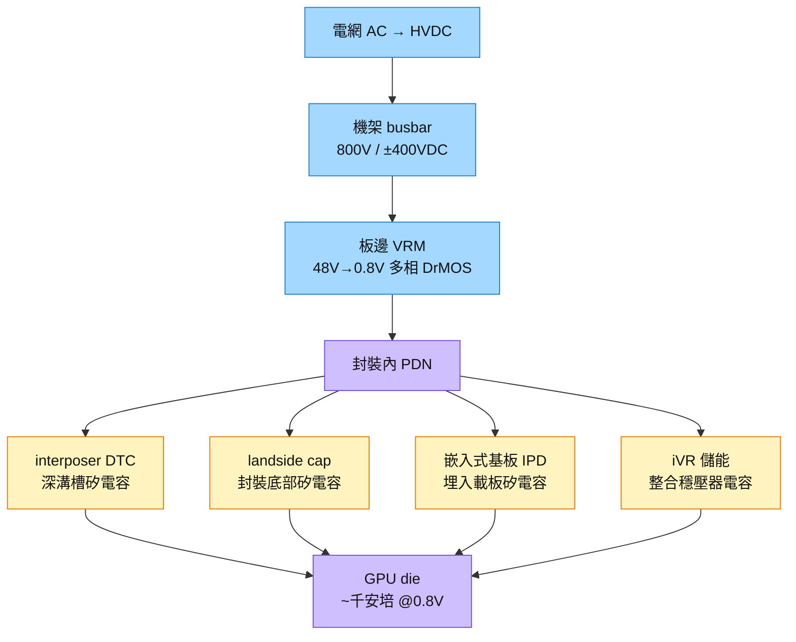

# 技術_矽電容

## 電 RAM 的系統定位（國金證券，2026-06-28）

矽電容位於封裝內，提供亞奈秒級瞬態去耦；可與板級 MLCC／MLPC、電源模組鋁電解電容、機櫃側超級／薄膜電容形成分層能量緩衝。把此架構類比為記憶體階層是產業研究觀點，非單一產品規格或客戶訂單。

來源：[[報告_國金證券_電RAM與功率半導體漲價潮_20260628]]，延伸分析：[[分析_電RAM與功率半導體漲價潮]]。

## 定義

矽電容（SiCap，Silicon Capacitor）是以矽半導體製程製造的高密度電容元件，運用深溝槽（Deep Trench）或堆疊（Stacked）結構，在相同面積下達到傳統陶瓷電容（MLCC）無法比擬的電容密度——高出傳統邏輯廠數百倍。AI 晶片封裝進入千安培、sub-1V 時代後，矽電容成為**垂直供電（VPD）架構的隱形地基**：去耦電容必須貼進封裝內才能滿足 PDN 阻抗預算，而矽電容是唯一能在封裝空間內提供足夠電荷密度的解。

矽電容重要性已超越傳統被動元件框架——Morgan Stanley（2026-07-20）將其列入「記憶體創新六向量」之一的獨立 TAM 分項，HBM 外創新 TAM 2030 base ~$23bn、bull ~$41bn，矽電容從利基被動元件升格為獨立成長曲線。

## 圖解

圖說：矽電容分佈在供電路徑的最末段（封裝內），DTC 在中介層、landside cap 在封裝底、IPD 埋在載板，構成「去耦電容三層防線」，把高頻瞬態電流在 die 最近處吸收。

## 技術原理

| 模組 | 功能 | 觀察重點 |
|------|------|----------|
| 深溝槽 DTC | 利用 DRAM 溝槽技術，在矽面積內垂直堆疊電容層 | 力積電以 DRAM 製程轉做，密度碾壓傳統邏輯廠 |
| Stacked / MIM 電容 | Metal-Insulator-Metal 多層結構，用於 EMIB-T 橋內 | Intel EMIB-T 橋內 MIM 電容，PDN 阻抗 -82% |
| 封裝位置分類 | DTC（中介層）/ landside（封裝底）/ IPD（載板埋入）/ iVR 儲能 | 位置決定高頻去耦效果；越靠近 die 效果越好 |
| 製程來源 | 舊 DRAM 製程產線改做矽電容，legacy 產能重新評價 | 成熟記憶體廠轉型 AI 封裝被動元件新出路 |

**為什麼普通 MLCC 不夠用：** AI 晶片千安培 × sub-1V = PDN 阻抗預算極小，板上 MLCC 距核心 ~cm 級，迴路電感過大，無法應對 GHz 頻率的瞬態電流；矽電容貼進封裝內，路徑縮至 mm 以內，才能壓制高頻電壓漣波。

## 關鍵參數 / 判斷指標

| 指標 | 意義 | 投資觀察 |
|------|------|----------|
| PDN 阻抗改善幅度 | EMIB-T 橋內 MIM 電容 PDN 阻抗 -82% | 阻抗改善越大，代工/設計端議價能力越高 |
| 電容密度 vs 傳統 | 力積電深溝槽密度「數百倍」於傳統邏輯廠 | 製程壁壘高，後進者短期難追 |
| non-TSMC 缺口 | MS 估 2026/27/28 缺口 57%/16%/11% | 結構性短缺持續至 2028，定價權穩固 |
| 長約化程度 | 供給寡占 → 客戶鎖 2027-28 產能；SEMCO 傳 W1.5 兆長約 | 長約客戶黏著度 = 高確定性營收 |
| 後段産能（切割/捲帶）| 單片 9 萬多顆，切割/挑揀/捲帶是真瓶頸，設備交期 8-10 月 | 後段設備稀缺性被低估，是隱形漲價點 |

## 產業動能

- **VPD 架構拉動：** AI 晶片電流逼近千安培，PDN 阻抗預算極度收緊，[[技術_垂直供電VPD]] 把電源模組移到 die 正下方——去耦電容必須同步跟進封裝內，矽電容是唯一能在封裝空間塞進足夠電容量的解。來源：[[報告_先進封裝技術發展方向_20260722]]，2026-07-22
- **EMIB-T 綁定：** Intel EMIB-T 橋內 MIM 電容是 PDN 阻抗改善核心（-82%）；[[6770_力積電（市）]] 已完成 Intel EMIB 認證，董座稱「EMIB 無其矽電容不成」。來源：同上，2026-07-22
- **MS 框架升級：** Morgan Stanley（2026-07-20）把 SiCap 列入記憶體創新六向量獨立分項，2030 TAM base ~$23bn、bull ~$41bn。
- **SEMCO 長約訊號：** 傳三星電機 W1.5 兆矽電容長約，可能供下一代 Google TPU 的 EMIB-T，代表 CSP 已視矽電容為不可或缺基礎件。

## 概念股 / 族群

| 類型 | 廠商 | 角色 | 觀察點 |
|------|------|------|--------|
| 設計 | [[6531_愛普（市）]] | S-SiCap/LSC/IPD 整合 iVR | 2-3 家 CSP 驗證中；放量週期 2-3 年；量轉時點是關鍵 |
| 代工 | [[6770_力積電（市）]] | DRAM 溝槽式矽電容 | EMIB 認證出貨；2026/27/28E 佔營收 3%/5%/9%；8-10k wfpm 備產 |
| 後段封測 | 微矽電子（8162）| 切割/挑揀/捲帶 | 後段設備交期 8-10 月，真實産能瓶頸 |
| 潛在第二來源 | [[2344_華邦電子（市）]]（MS 點名）| 成熟 DRAM 製程可轉做 | 力積電滿載下的外溢選項；尚無確認 |
| 國際競爭 | SEMCO（三星電機）| 設計 + 製造 | 可能鎖定 CSP EMIB-T 長約；台廠需分監控 |

> [!note] 信心水準
> 力積電 EMIB 認證出貨、愛普 CSP 驗證進行中，均有法說/報告支撐（高信心）。SEMCO 長約傳聞與華邦電轉做矽電容尚待公司公告或法說確認（中信心）。MS TAM $23-41bn 為分析師估算（中信心）。

## 技術瓶頸 / 風險

- **各平台規格不共用：** 不同 CSP/GPU 平台使用不同矽電容規格，台廠 SiCap 不一定適配 SEMCO 合約所服務的平台。
- **封裝內 IPD 認證週期長：** CSP 平台認證 2-3 年，一旦未入選即失去窗口。
- **後段切割/捲帶是被低估的瓶頸：** 前段矽電容生産擴速快，後段設備（切割/挑揀）交期 8-10 月，出貨節奏可能被後段卡死。
- **HVDC 800V 架構取捨：** 若直達封裝的 iVR 快速普及，板邊 VRM BOM 可能縮減，但矽電容需求量反而更大（封裝內去耦需求放大）——算法不確定。

## 相關技術

- [[技術_垂直供電VPD]]（矽電容是 VPD 架構的去耦核心）
- [[技術_CoWoS與先進封裝]]（DTC 在中介層、EMIB-T 橋內 MIM 電容）
- [[技術_混合鍵合]]（前段製程潔淨度要求也影響矽電容整合）
- [[技術_ABF載板]]（IPD 埋入基板是矽電容另一部署位置）

## 來源

- [[報告_先進封裝技術發展方向_20260722]] — 定錨產業筆記講座，2026-07-22
