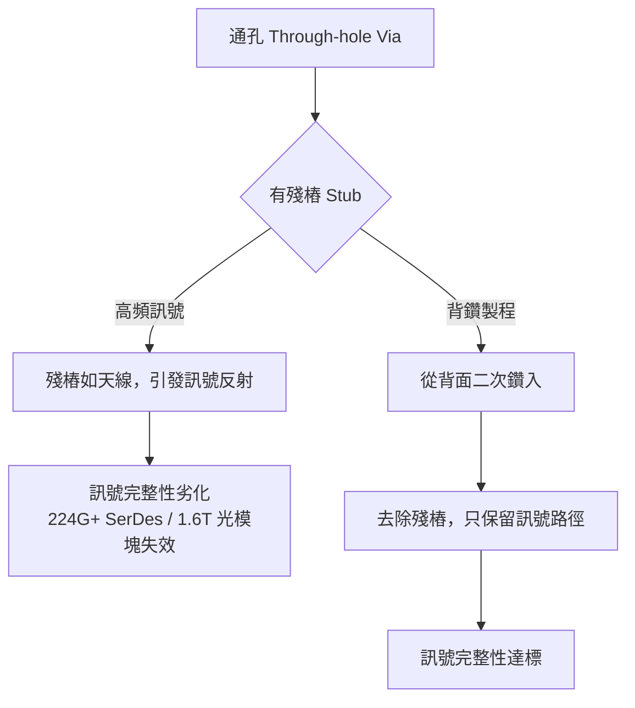
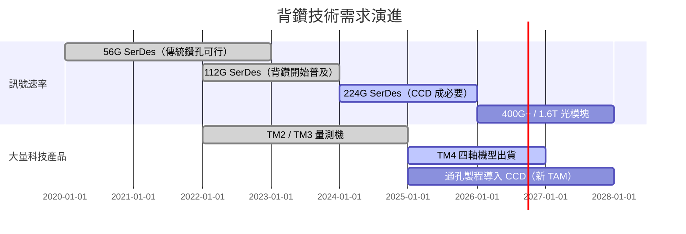

# 技術_背鑽

## 定義

背鑽（Back Drilling）是 PCB 製造中的精密二次鑽孔製程，目的是從電路板背面鑽除通孔（Through-hole Via）中不參與訊號傳輸的多餘導電殘樁（Stub），以消除高頻下的訊號反射與干擾。

## 圖解

## 技術原理

通孔在 PCB 壓合後貫穿全板，但訊號往往只在特定層間傳遞。未使用的孔段殘存銅壁（Stub）在高頻下行為如微型天線，引發反射（Signal Reflection）與阻抗不連續。

**背鑽流程：**

1. 全板電鍍與線路製作完成後，使用比原通孔直徑略大的鑽頭從板材背面二次鑽入
2. 關鍵技術在**精準控深**：鑽除所有殘餘銅壁，同時不傷及目標導通層
3. 深度量測回饋：PCB 壓合因膠片受熱漲縮，板厚非固定值；必須先量測內層實際位置再鑽孔（非純靠座標）

**CCD 視覺量測（X/Y 軸）：**
CCD 攝影機量測板面實際漲縮位置，校正 X/Y 軸靶位，確保鑽頭對準正確孔位。

**TM 深度量測（Z 軸）：**
Thickness Metrology 系統光學量測內層孔洞深度，即時回饋至鑽孔系統做深度控制。TM4 為四軸世代，1 台可支援 8 台背鑽機。

## 關鍵參數

| 參數 | 說明 | 觀察指標 |
|------|------|---------|
| Stub Length | 殘留銅厚，越短越好 | 趨近 0 mil 為最高規格 |
| 控深精度 | D+4（±2 mil）為 Rubin 世代要求 | D+6 為傳統標準，不足 Rubin |
| CPK | 製程能力指數，需 > 1.67 | 量產良率指標 |
| Edge Gap | 光模塊邊緣間距，NVIDIA 要求從 50μm 降至 25μm | 驅動 CCD 導入光模塊 |

## 技術驅動因素

**AI 伺服器（224G SerDes）：**
訊號速率突破 224Gbps 後，殘樁效應制約訊號品質。高頻下殘樁相當於微型天線，造成嚴重失真，必須背鑽。

**光模塊（1.6T）：**
同樣面臨 Stub Effect，且 NVIDIA 要求 Edge Gap 從 50μm 降至 25μm，驅動光模塊成型機也需要導入 CCD 精度量測。

**通孔製程也需 CCD（新趨勢）：**
孔洞密度到臨界點後，高階 PCB 在通孔製程就要開始導入 CCD（原先只有背鑽機才用）。通孔台數 > 背鑽台數，TAM 因此大幅擴增。

## 競爭格局

| 廠商 | 方案 | 精度 | 備註 |
|------|------|------|------|
| [[3167_大量科技（市）]] | CCD（光測）+ TM4（光測 Z 軸）| ±2 mil，0 mil stub | 台灣，自製控制器 |
| Schmoll（德）| CCD 光測 | 高階但 ±1 mil 難說 | 歐洲唯一競爭者 |
| 大族（中）| 電訊號量測 | 精度受限 | 中國大廠，電測劣於光測 |

> [!info] 技術壁壘
> 能做到 ±2 mil 的玩家非常少。大量科技是業界唯一能量產殘留銅厚趨近 0 mil 的廠商，具備多國專利保護。

## 應用場景

- AI 伺服器高速板（224G/400G SerDes，如 NVIDIA Rubin、GB300）
- 光模塊板（1.6T，需 edge gap < 25μm）
- 高階 HDI 多層板（高頻高速訊號走線）
- 未來：ASIC 通孔製程（TAM 擴增中）

## 關鍵廠商

| 環節 | 廠商 | 角色 |
|------|------|------|
| PCB 背鑽設備（台灣） | [[3167_大量科技（市）]] | CCD 背鑽機 + TM4 整合方案 |
| PCB 背鑽設備（歐洲） | Schmoll（未） | 高階競爭者 |

## 技術演進時程

## 相關技術

- [[技術_PCB]]（背鑽在 AI 伺服器 PCB 製造流程中的位置）
- [[技術_PCB鑽孔設備]]（CO₂ / 皮秒激光鑽孔設備，與背鑽並列的鑽孔技術分類）
- [[技術_PCB]]
- 技術_HDI

## 供應鏈

→ 相關公司見 [[3167_大量科技（市）]]

→ 法說分析見 [[分析_大量與聯鈞_2Q26法說_20260818]]

## 來源
- [[memo_大量科技背鑽CCD_TM4_20260524]]
- [[memo_大量聯鈞_2Q26法說_20260818]]（大量 2Q26 法說整理：月產能、高階 CCD／TM4 ASP 與 CPO／1.6T 應用，2026-08-18）
- [[memo_PCB多層板製程_20260524]]
- Dcard 法說整理 2026-03-13
- 數位時代專訪 2026-01-15
