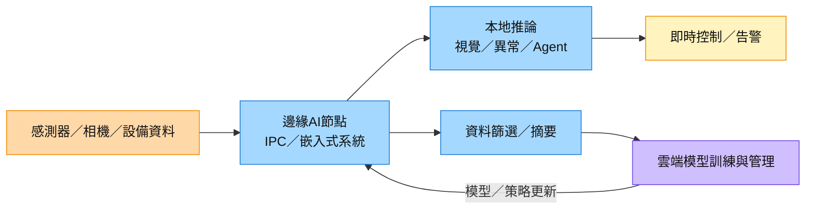

# 技術_邊緣AI

## 定義

邊緣 AI（Edge AI）是在資料產生地附近的裝置、閘道器或工業電腦執行 AI 推論，而非將所有原始資料送回雲端。它與傳統邊緣運算的差異，在於本地節點不只做資料擷取與規則控制，還需執行神經網路、視覺辨識、生成式模型或 agentic workflow。

2026 年的重要性來自模型壓縮、NPU／GPU 模組成熟，以及工廠、醫療、交通和半導體設備對低延遲、資料隱私與離線運作的需求。[[2395_研華（市）]] 管理層預期邊緣 AI 營收占比由 1H26 的 22.5% 升至 2026 年底 30%，顯示它已由概念驗證轉向多垂直市場部署。

邊緣 AI 與雲端 AI 並非替代關係：雲端負責大型模型訓練、集中管理與跨站點分析；邊緣節點負責即時推論、資料篩選與現場控制。硬體需求會連到工業電腦、嵌入式板卡、記憶體、儲存、網路與電源管理。

## 圖解

圖說：邊緣節點在現場完成低延遲推論與控制，只把篩選後資料送上雲端；雲端再回傳模型與策略更新。本次美林報告抽取圖片均為訂單、財務或估值圖，沒有能解釋技術原理的來源圖，因此以 Mermaid 補位。

## 技術原理

| 模組 | 功能 | 觀察重點 |
|------|------|----------|
| 感測與資料擷取 | 接收影像、聲音、設備訊號與環境資料 | 介面種類、時間同步、資料品質 |
| 邊緣運算平台 | IPC、嵌入式板卡或工業閘道器承載工作負載 | CPU／GPU／NPU 算力、功耗、耐候性 |
| 推論執行環境 | 執行視覺、預測維護、生成式或 agentic 模型 | 模型格式、量化、延遲與記憶體需求 |
| 裝置管理 | 遠端部署模型、監控設備、OTA 更新 | 大量節點管理、安全與版本一致性 |
| 雲邊協同 | 雲端訓練與管理、邊緣即時推論 | 頻寬成本、資料治理、模型漂移 |

與一般雲端 AI 不同，邊緣 AI 必須在有限功耗、記憶體與散熱條件下維持即時性，並承受長生命週期、工業環境與多種 I/O。競爭門檻不只在算力，也包含機構設計、可靠度、軟體相容性及垂直應用整合。

## 關鍵參數 / 判斷指標

| 指標 | 意義 | 投資觀察 |
|------|------|----------|
| 推論延遲 | 從資料輸入到控制輸出的時間 | 低延遲應用提高高階運算模組與本地加速器價值 |
| 每瓦算力 | 功耗限制下的有效 AI 性能 | 有利具備散熱、電源與嵌入式整合能力的廠商 |
| 記憶體容量／頻寬 | 決定可部署模型規模與並行度 | 記憶體缺料或漲價會壓縮硬體毛利與交貨量 |
| B/B ratio | 訂單相對出貨的領先指標 | [[2395_研華（市）]] 2Q26／7 月為 1.44x／1.64x，顯示需求能見度提高 |
| Design wins 轉量產率 | 概念驗證轉為營收的效率 | 比單純案件數更能驗證工業 AI 是否進入規模部署 |
| 邊緣 AI 營收占比 | AI 功能滲透程度 | 占比提高通常改善產品 ASP，但需觀察毛利是否被零組件成本抵銷 |

## 產業動能

- **2Q26 營收先行驗證**：[[報告_美林_研華_20260717]]（2026-07-17）記錄 [[2395_研華（市）]] 2Q26 初步營收 NT$26.1bn、QoQ +28%、YoY +46%，高於公司指引，當時 B/B ratio 維持高於 1。
- **工業 AI 訂單增加**：[[報告_美林_研華_20260807]]（2026-08-07）指出，[[2395_研華（市）]] 1H26 取得 123 個 design wins，估計年化營收潛力 US$444mn。
- **邊緣 AI 滲透加速**：[[2395_研華（市）]] 預期相關營收占比由 1H26 的 22.5% 升至 2026 年底 30%，應用涵蓋 AIDC、半導體設備、醫療與自動化。
- **訂單與產能同步走強**：美林 2026-08-07 報告顯示 2026-07 B/B ratio 1.64x，3Q26 台灣／昆山產能利用率估 105–110%。
- **軟硬體一體機商業化**：[[報告_中信_研華_20260806]]（2026-08-06）指出，[[2395_研華（市）]] 以 WEDA 平台與 IWS 整合 server、AI Agent 基礎軟體及產業 Domain Skill；目前仍在初期導入，未來 1–2 年營收貢獻有限。

## 概念股 / 族群

| 類型 | 廠商 | 角色 | 觀察點 |
|------|------|------|--------|
| 工業電腦／平台 | [[2395_研華（市）]] | IPC、嵌入式板卡、邊緣 AI 解決方案 | Design wins 轉營收、2026 年底占比 30% 目標 |

> [!note] 信心水準
> 研華的訂單、B/B ratio 與邊緣 AI 占比目標有公司管理層及美林報告支撐，信心中高；個別 design win 的客戶、量產時程與毛利貢獻尚未具名揭露，仍需後續法說驗證。

## 技術瓶頸 / 風險

- **零組件供應與成本**：PCB、SSD／DDR4、CPU、PMIC 缺料或漲價可能延後出貨並壓縮毛利。
- **部署碎片化**：不同垂直市場的 I/O、作業系統、模型與認證差異大，限制標準化規模效益。
- **資安與裝置管理**：大量分散節點增加 OTA、憑證、模型竄改與供應鏈攻擊風險。
- **雲端回流／架構分流**：若網路成本下降或雲端延遲足以滿足應用，部分工作負載可能回到集中式雲端。
- **Design win 轉換風險**：案件數不等同量產營收，終端資本支出放緩可能延後部署。

## 相關技術

- [[技術_GPU_Backstop]]
- [[技術_NAND快閃記憶體]]

## 來源

- [[報告_美林_研華_20260717]] — 美林證券，2026-07-17
- [[報告_美林_研華_20260807]] — 美林證券，2026-08-07
- [[報告_中信_研華_20260806]] — 中信投顧，2026-08-06

## 相關頁面

- [[2395_研華（市）]]
- [[時程_2026記憶體與AI催化劑]]

### 本次 ingest 更新（DIGITIMES，2026-08-21）

- DIGITIMES 將 AI 需求由雲端延伸到 Edge AI、Agentic AI 與 Physical AI；台系 IC 設計業者 2026 年合計營收估年增約 10%，但個別公司仍需以量產與營收驗證。
- 產業研究整理指出 3Q26 創意與世芯可能進入 Turnkey 量產階段，毛利率可能受成本結構影響；這是研究估計，不是公司已確認的財測。
- [[技術_人形機器人]] 是 Edge AI 的新應用分支，關鍵觀察從單點算力延伸到功耗、感測融合、模型部署與安全認證。

來源：[[從雲端到邊緣AI_台系晶片設計產業動態解析_DIGITIMES]]（DIGITIMES，2026-08-21）。
