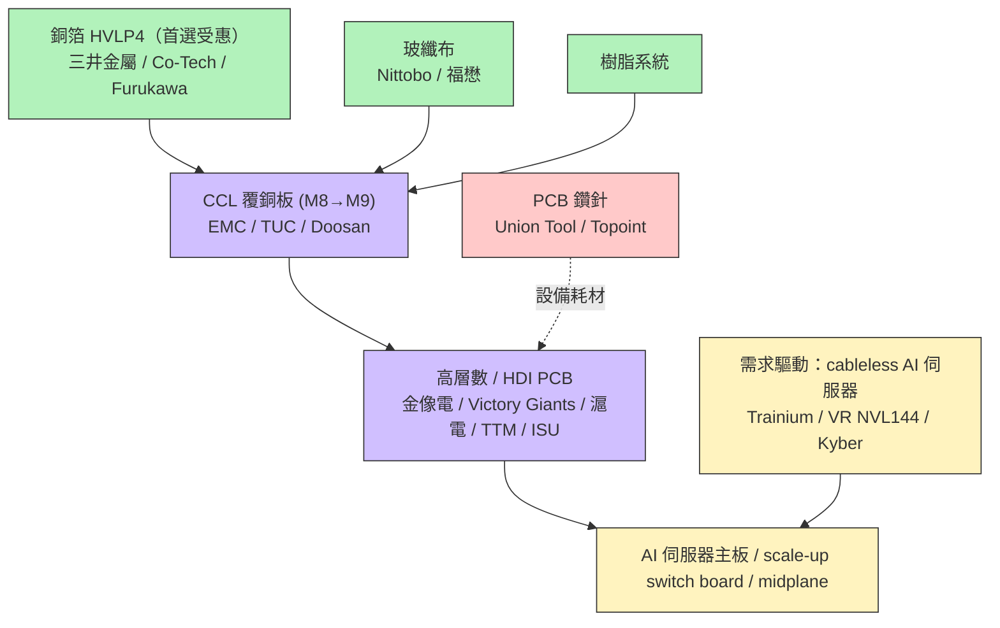

# 供應鏈_AI伺服器PCB

## 供應鏈主軸

> AI 伺服器 PCB「超級循環」供應鏈——由量（層數、板數）與質（材料升級）雙驅動。本輪材料升級焦點從玻纖布轉向**銅箔（HVLP4）**。受惠順序（SemiAnalysis）：銅箔 > 玻纖布 > CCL > PCB > 鑽針。

## 供應鏈結構圖

## 各環節廠商

### 銅箔 Copper Foil（首選受惠）
| 廠商 | 地位 | 備註 |
|------|------|------|
| [[5706.JP(mitsui_kinzoku)]] | 主導 | HVLP（VSP）份額第一；FY25 上修銷量、產能 580→850 噸/月 |

銅箔（未建頁）：Co-Tech 銅箔（8358.TW，第二大、最積極退出低階轉 HVLP4）、Furukawa（古河）。

### 玻纖布 Glass Fiber Cloth
未建頁：Nittobo（3110.JP，首選）、福懋 Fulltech（1815.TW）。下一代 Q-glass（石英玻璃）供應鏈尚未商業化，是本輪改由銅箔升級的主因。

### CCL 覆銅板
未建頁：EMC（2383.TW，Trainium 2 用最高階 M8）、TUC（6274.TW）、Doosan（000150.KR）。CCL = 玻纖布＋銅箔＋樹脂，訊號性能分級 M7/M8/M9。

### 高層數 / HDI PCB
未建頁：Victory Giants（300476.CH）、金像電 GCE（2368.TW）、滬電 WUS（002463.CH）、ISU（007660.KR）、TTM、FHT、Lincstech（GBM）、Dynamic。AI 伺服器主運算板層數由約 20 層升向 30+ 層。

### PCB 鑽針 Drill
未建頁：Union Tool（6278.JP）、Topoint（8021.TW）。

## 競爭格局

- **銅箔是本輪最強受惠環節**：過去靠玻纖布推動 M7→M8，玻纖布暫遇瓶頸（Q-glass 未成熟），下一棒由銅箔 HVLP4 接手。
- **HVLP4 供需吃緊**：產能轉換非 1:1（HVLP2→HVLP4 約少 40% 產能），銅箔氧化保存限制（約 2 週）使長期囤貨不可行，供需失衡易反映在價格（詳見 [[技術_HVLP銅箔]] 供需表）。
- **整條 PCB stack 受惠**：cableless 化使板內容（層數、scale-up switch board、PCB midplane）全面增加。

## 觀察重點（投資視角）

1. **HVLP4 供需缺口**：2Q26 起明顯短缺，三井金屬、Co-Tech 為主要受惠者。
2. **前提依賴**：短缺論點部分建立在「Nvidia VR NVL144 採 cableless」——該設計尚未定案（[[技術_HVLP銅箔]] 已標註）。
3. 高階銅箔毛利高（HVLP4 估 ~60%），漲價週期下彈性大。
4. 與 CPO/光互連節奏互相牽動：cableless 推進帶動 PCB 材料，光互連替代部分銅互連則牽動需求結構。

## 相關頁面

- [[1326_台化（市）]]
- [[6505_台塑化（市）]]
- [[分析_2026H2 PCB缺料與AI供應鏈]]
- [[SMCI.US(supermicro)]]
- [[2324_仁寶（市）]]
- [[8210_勤誠（市）]]
- [[2317_鴻海（市）]]
- [[4938_和碩（市）]]
- [[6669_緯穎（市）]]
- [[000150.KR(doosan)]]
- [[2313_華通（市）]]
- [[2467_志聖（市）]]
- [[3563_牧德（市）]]
- [[3706_燿華（市）]]
- [[4906_正文（市）]]
- [[5274_信驊（市）]]
- [[6640_均華精密（市）]]
- [[6658_聯策（市）]]
- [[供應鏈_AI伺服器散熱]]
- [[供應鏈_被動元件]]
- [[1303_南亞（市）]]
- [[1802_台玻（市）]]
- [[1815_富喬（市）]]
- [[2327_國巨（市）]]
- [[2368_金像電（市）]]
- [[2383_台光電（市）]]
- [[3044_健鼎（市）]]
- [[4760_勤凱（市）]]
- [[4958_臻鼎（市）]]
- [[5475_德宏（市）]]
- [[6213_聯茂（市）]]
- [[6274_台燿（市）]]
- [[8021_尖點（市）]]
- [[8358_金居（市）]]
- [[AVGO.US(broadcom)]]
- [[技術_CCL]]
- [[技術_MLCC]]
- [[技術_PCB]]
- [[技術_PCB鑽孔設備]]
- 技術：[[技術_HVLP銅箔]]、[[技術_ABF載板]]、[[技術_玻璃基板]]
- 對照供應鏈：[[供應鏈_先進封裝載板]]、[[供應鏈_CPO]]

## 來源

- [[報告_Semianalysis_PCB_20250826]]（AI Server PCB Super Cycle; Copper Foil Content Upgrade，2025-08-26）

---

## CCL 漲價週期更新（2026）

### 漲價確認（跨券商一致）

| 時段 | CCL 等級 | 漲幅 | 來源 |
|------|---------|------|------|
| 2026 Q1 | M6 以下（低階） | +10-15% | HSBC 4/13、GS 3/20 |
| 2026 Q2 | M6 以下（低階） | +15-20% | HSBC 4/13 |
| 2026 Q2 起 | M7 以上（高階） | +10-15% | HSBC 4/13 |
| 2026 H2 | 全面 | 再次漲價（magnitude comparable） | GS 4/18 |
| 2026 H2-2027 | ABF 載板 | 季度性漲價 | Citi 4/22（投資人預期） |

### 漲價傳導順序

T-glass 缺料 → Low Dk 玻布缺料 → 石英布（Q-glass）缺料
↓
CCL 漲價（M7+ 漲幅向下擠壓 M6 以下資源，帶動全線漲）
↓
PCB 漲價（2026 H1 全面約 +10%，H2 繼續）
↓
ABF 載板漲價（2026 Q2 起季度性漲價週期）

### 玻纖布漲價（福邦預估）

| 布種 | 2025 | 2026F |
|------|------|-------|
| E-glass 厚（7628系列） | +15% | 累計至2月+15%，距歷史高價尚有50% |
| E-glass 薄（10系列） | +30% | 累計至2月+20%；預估全年+100-120% |
| Low DK | +20-30% | 預估全年至少+20-30% |
| Low DK2 | +20-30% | 預估全年至少+20-30% |
| T-glass | +20-30% | 累計至2月+20%；預估全年+30-40% |

## 各環節廠商更新

### CCL 覆銅板（新增外資詳細評等）

| 廠商 | 代號 | 主力等級 | 2026E EPS | 2027E EPS | TP | 評等 | 來源 |
|------|------|---------|-----------|-----------|-----|------|------|
| 台光電 EMC | 2383.TW | M8-M9 | NT$（原始數值待核對）-90 | NT$（原始數值待核對）-182 | NT$1,020-4,470 | Buy | GS/HSBC |
| 台燿 TUC | 6274.TW | M7-M8 | NT$（原始數值待核對）-31 | NT$（原始數值待核對）-66 | NT$1,020-1,165 | Buy | GS/HSBC |
| 聯茂 ITEQ | 6213.TW | M6-M7 | NT$（原始數值待核對）.5-7.2 | NT$（原始數值待核對）.6-11.8 | NT$（原始數值待核對）-236 | Sell/Hold | GS/HSBC |
| Doosan | 000150.KR | M8 | — | — | — | — | 福邦 |
| 生益科技 | 600183.CH | M8-M9 | — | — | — | — | 福邦 |

> 台光電 1Q26 營收 NT$（原始數值待核對）.7 億（YoY +52.5%），大幅超越 HSBC 預期 8%、consensus 4%。

### 高層數/HDI PCB（新增台廠詳細資料）

| 廠商 | 代號 | 主要產品 | 2026E EPS | 2027E EPS | TP | 評等 | 來源 |
|------|------|---------|-----------|-----------|-----|------|------|
| 金像電 GCE | 2368.TW | AI ASIC/Switch PCB | NT$（原始數值待核對）-43 | NT$（原始數值待核對）-78 | NT$1,380-1,500 | Buy | Citi/GS |
| 健鼎 Tripod | 3044.TW | CPU/Memory PCB | NT$（原始數值待核對）.4 | NT$（原始數值待核對）.5 | NT$（原始數值待核對） | Buy | Citi |
| 臻鼎 ZDT | 4958.TW | FPCB+PCB+ABF基板 | NT$（原始數值待核對）-14 | NT$（原始數值待核對）-30 | NT$（原始數值待核對）-338 | Sell/Buy | Citi/GS |
| 定穎 DY | 3715.TW | AI伺服器 HLC | — | — | — | — | 福邦 |
| 勝宏科技 | — | AI伺服器 HLC | — | — | — | — | 福邦 |
| WUS/滬電 | 002463.CH | AI伺服器 HLC | — | — | — | — | 福邦 |
| ISU Petasys | 007660.KR | AI伺服器 HLC | — | — | — | — | 福邦 |

> 金像電 1Q26 Citi 預估：營收 NT$（原始數值待核對）.4 億（YoY +60%）、毛利率 35.1%，均超預期。

### PCB 鑽針（補充）

| 廠商 | 代號 | 產能（萬支/月） | 高階佔比 | 主要客戶 |
|------|------|-------------|---------|---------|
| 尖點（Topoint） | 8021.TW | 3,500（計畫擴至 4,500+） | >50% | 金像電、ISU、勝宏、TTM、滬電 |
| 鼎泰高科 | — | 1.2 億支 | >40% | 深南、景旺、勝宏、健鼎、生益、定穎 |
| 中鎢高新（金洲） | — | 8,000 | >50% | 勝宏、深南、高技、生益 |
| 佑能 | — | 3,500 | >60% | 日本、台灣市場、載板廠 |

> 關鍵：高階 PCB（M8-M9 材料）每換一個等級，鑽針壽命大幅縮短——M6-M7 材料下主針 600-800 次，M8 下降至 400-500 次，M9 僅剩 100-200 次。鑽針需求量是過往 6 倍以上。

### 東南亞產能建置

| 廠商 | 地點 | 主要客戶 | 規格 | 量產時程 |
|------|------|---------|------|---------|
| 金像電 | 泰國 | Amazon/Meta | HLC | A區 2026H2 |
| 定穎 | 泰國 | Nvidia/Google/AMD/Tesla | HLC+HDI | 2025-2026 |
| 勝宏 | 泰國+越南 | Nvidia | HLC+HDI | 2025-2026 |
| 健鼎 | 越南 | Tesla、Dell | HLC | 26H1+ |
| TTM | 馬來西亞 | Nvidia | HLC | 一期 2B USD/年 |
| ISU | 馬來西亞+新加坡 | Google | HLC | 2025-2026 |
| 華通 | 泰國 | ORCL/交換機 | HLC+HDI | 2025-2026 |

## 競爭格局更新

### 投資人偏好排序（Citi 4/22 香港路演回饋）

ABF載板 = CCL > PCB

投資人對 ABF 載板和 CCL 信心最高（季度性漲價週期預期 2Q26-4Q27），PCB 則有供過於求疑慮（Tier 2/3 廠商宣稱從 2H26 進入 AI 供應鏈）。

### PCB 供過於求風險觀察

Citi 觀點：2027 年 PCB 產業可能面臨生產中斷風險（CCL 缺料 → PCB 暫時產能過剩），優先選高階 Tier 1 廠（金像電、健鼎），避開低階擴產東南亞的 Tier 2/3 廠。

GS 觀點：看好 HDI 升級趨勢——AI PCB 規格從 3+N+3 HDI（26L MLB 混合）升級至 2H27-2028 的 6+N+6/9+N+9 HDI（30L+ MLB 混合），帶動高端 HDI 設備需求，Tier 2 MLB 廠中有 HDI 能力者受益。

## 觀察重點更新

1. CCL 漲價節奏：2026 H2 是否如 GS/HSBC 預期再次漲價，台光電/台燿毛利率是否持續擴張
2. HVLP4 缺口：2Q26 起明顯短缺（福邦 48% 缺口預估），金居/台銅/古河受惠
3. PCB 東南亞產能爬坡：良率是否如預期，影響 Tier 1 廠客戶維繫
4. Rubin/TPU v8 時程：福邦預估 26H2 樣機、2027 放量，是 ABF 載板/CCL M9 的關鍵催化劑
5. 鑽針供需：主要板廠擴產速度高於鑽針廠擴產，尖點等高階鑽針廠供不應求至 2027

## 2026-08 月度驗證：Rubin／TPU 與材料缺口

廣發海外電子通信月會提供一組較新的需求與供給估算，均屬賣方 channel check：

| 指標 | 2026E | 2027E | 投資含義 |
|------|-------|-------|----------|
| AI 伺服器 PCB 市場 | 約 US$13bn | 約 US$30bn | 市場規模接近翻倍，量與規格同步升級 |
| NVIDIA Vera Rubin 出貨 | 2H26 約 10k | 約 80k | 單板價值由 GB200 約 US$400 升至 Rubin 約 US$750 |
| Google TPU v8t／v8i | 4Q26 放量 | 約 12 萬台 | 單板 PCB 價值約 US$800–1,000 |
| HVLP4 銅箔供給／缺口 | 年底產能約 1,200 噸／月、缺口約 400 噸／月 | 產能約 2,500 噸／月、缺口約 700 噸／月 | 缺口可能延續至 2027 年底 |

- E-glass 年供給約 33–36 億米，2026 缺口約 15%；來源估 2027 缺口仍有 13–14%。
- [[2383_台光電（市）]]被指在 NVIDIA midplane／LPU 具領先份額，並計畫 2027 年中停產 M6 以下產品；公司與客戶份額均屬 channel check，信心中。
- [[8358_金居（市）]]聚焦 HVLP3／4 與 RG 系列，廣發稱其已與台光電簽 LTA 並切入 Google Rubin／AWS 鏈；供應商地位待公司或客戶公告驗證。

> [!note] 信心水準
> 市場規模、平台出貨、客戶份額與銅箔缺口均為 [[memo_廣發海外電子通信月度電話會議_20260814]] 的 estimate／channel check，不視為公司公告；應以月營收、產品組合、價格與實際認證交叉驗證。

## 來源（補充）

- [[報告_HSBC_CCL展望2026_27_20260413]]（HSBC，2026-04-13；EMC/TUC/ITEQ 漲價分析）
- [[報告_Citi_PCB_CCL_20260422]]（Citi，2026-04-22；GCE/Tripod/ZDT 評等、香港路演回饋）
- [[報告_GS_CCL_PCB_20260320]]（Goldman Sachs，2026-03-20；CCL/PCB 漲價確認）
- [[報告_GS_台灣CCL_PCB_20260418]]（Goldman Sachs，2026-04-18；全面上調 TP、HDI 升級趨勢）
- [[報告_福邦_PCB載板產業展望_20260401]]（福邦投顧，2026-03-19；鑽針/銅箔/玻布完整供需）
- [[memo_廣發海外電子通信月度電話會議_20260814]]（廣發海外電子通信，2026-08-14；Rubin／TPU PCB 價值、E-glass／HVLP4 缺口與台光電／金居供應鏈）

## 2026-08-22 矽微粉補充

[[AI PCB上游通膨黑馬：矽微粉 - 20260628]] 將高純度、亞微米球形矽微粉列為 M9/M10 CCL 的關鍵填料；AI PCB 規格升級使材料端同時出現用量增加、單價提升與認證壁壘。此判斷屬券商產業研究，個別廠商的客戶導入仍待驗證。

| 環節 | 用途 | 觀察廠商 | 技術拉動 |
|---|---|---|---|
| 矽微粉 | CCL 樹脂填料、降低熱膨脹 | 聯瑞新材、凌瑋科技、雅克科技、國瓷材料（中國標的，未建立頁） | [[技術_矽微粉]]、[[技術_CCL]] |
| 高階 CCL | M9/M10 低損耗板材 | [[2383_台光電（市）]]、[[6274_台燿（市）]] | [[技術_CCL]] |
| 高層數 PCB | AI 伺服器主板、背板 | [[2368_金像電（市）]]、[[3044_健鼎（市）]] | [[技術_PCB]]、[[技術_mSAP]] |

觀察重點：上游材料的漲價彈性較早反映，但中游板廠要等 2026Q3 AI PCB 訂單集中釋放後才有較明確的獲利驗證；若 M9/M10 認證延後或 AI 資本支出放緩，材料與板廠均可能低於預期。

## 來源（2026-08-22 補充）

- [[AI PCB上游通膨黑馬：矽微粉 - 20260628]]（國金證券，2026-06-28；矽微粉、M9/M10 與 AI PCB 供需）

## 2026-08 本批更新

- [[2026H2 PCB產業報告-AI不止，缺料不息202607]]（福邦投顧，2026-07）將材料端缺料擴展至玻纖布、石英布、HVLP 銅箔、CCL 與 ABF；報告建議關注臻鼎、南電、欣興、景碩、德宏、尖點、台玻、富喬、台光電、台燿與聯茂，均屬研究觀察而非訂單確認。
- [[260811_gs_GCE]]（Goldman Sachs，2026-08-11）估金像電 Trainium3 3Q26 份額逾 70%，並看好泰國產能與 TPU 供應鏈份額提升；ASIC HDI 良率仍是瓶頸。
- [[260811_ml_dynamic]]（BofA，2026-08-11）指出定穎投控 CCL 成本壓力與泰國／黃石擴產節奏；AI PCB 2027–2028 年需求成長需配合毛利率修復驗證。
- [[260729_ml_TUC]]（BofA，2026-07-29）估 TUC 2028／2029 年總產能 5.3M／5.75M 張，供應擴張可支持 M8 CCL 與 800G／1.6T 光模組需求。

## 本批公司鏈補充

## 2026-08-24 銀河證券更新

[[報告_銀河證券_PCB_CCL_AI深度_20260812]] 指出，Rubin 平台將 Switch Tray 升至 M8U、Midplane 與 CX9／CPX 導入 M9（Q-glass＋HVLP4），Rubin 正交 Midplane 為 44 層；單台伺服器 PCB 價值較前代提升逾兩倍，屬券商引用 TrendForce／產業資料的估計。AI 伺服器 PCB 2024–2029 CAGR 估 18.7%，AI 相關 HDI 估 29.6%，18 層以上多層板估 33.8%，均高於 PCB 產業平均。

| 環節 | 新增觀察 | 投資含義 |
|---|---|---|
| 高層數／HDI PCB | Rubin、Google TPU v7、AWS Trainium3 共同推動高層數、低 Dk 與低粗糙度銅箔 | [[2368_金像電（市）]]、[[3037_欣興（市）]]、[[2313_華通（市）]] 等需追蹤平台份額與良率 |
| CCL | M8U／M9 與 HVLP4、Q-glass 同步升級，材料價格與供給成為瓶頸 | [[2383_台光電（市）]]、[[6274_台燿（市）]]、[[3715_定穎投控（市）]] 受惠程度取決於認證與轉嫁 |
| 上游材料 | 銅箔、電子布、樹脂價格上行，形成 CCL 量價齊升但也壓縮下游毛利的雙面效果 | 需區分材料漲價受惠與 PCB 廠成本傳導能力 |

來源：[[報告_銀河證券_PCB_CCL_AI深度_20260812]]（中國銀河證券，2026-08-12）。

## 2026-08-27 Rubin Ultra NVL576 補充

[[報告_SemiAnalysis_RubinUltraNVL576_20260810]] 指出 Tachyon HPM PCB 由 26 層升至 30 層、材料維持不變；NVL576 的 Portia expandable switch tray 則是 NPO／CPO 兩種不同 PCB／光互連配置。背板架構在 expandable 與 non-expandable 版本間可共用，PHD2 connector 升級至 PHD3，DP 數量維持不變。上述為研究模型，需待 NVIDIA 與板材／PCB 供應鏈正式規格確認。

| 觀察項目 | 變化 | 投資含義 |
|---|---|---|
| Tachyon HPM | PCB 26→30 層，材料不變 | 高層數板製程、良率與認證重要性上升 |
| Portia expandable | NPO／CPO 版本 PCB 複雜度不同 | NPO 先上市情境下，socket、光耦合與測試需求先行 |
| Rack backplane | PHD2→PHD3、DP 數量不變，兩版本可共用 | 連接器升級但平台共用可降低供應鏈切換成本 |

來源：[[報告_SemiAnalysis_RubinUltraNVL576_20260810]]（SemiAnalysis，2026-08-10）。

| 環節 | 公司 | 觀察 |
|---|---|---|
| 高階 CCL | [[6274_台燿（市）]] | M8 產能與 2028–2029 擴產，漲價轉嫁與利用率為關鍵 |
| ABF／BT 載板 | [[8046_南電（市）]] | NT$46.8bn 擴產，最早 2028H2 放量（Citi 判斷） |
| AI PCB | [[2368_金像電（市）]]、[[3715_定穎投控（市）]] | Trainium3／TPU 份額與泰國產能爬坡 |
## 本次 ingest 相關公司
- [[6134_萬旭（櫃）]]
- [[6414_樺漢（市）]]
- [[6584_南俊國際（市）]]
- [[CRWV.US(coreweave)]]
- [[分析_2026-08_AI網通與硬體報告更新]]
## 2026-08-23 報告更新

- [[260805_gs_PCB-CCL]] 將 AI PCB／CCL TAM、層數升級與 ASIC／GPU 多平台需求上修；[[260811_citi_GCE-tripod]] 則補充 CCL 成本可由 PCB 廠於 3Q26 向客戶轉嫁的觀察。
- [[260807_ms_GCE]]、[[260811_ms_GCE]]、[[260812_gs_ZDT]] 補入 Trainium3、HDI、HLC、泰國／蘇州／淮安擴產與 2H26–2H27 節奏；供應商份額與量產時程均標為 estimate／待驗證。
