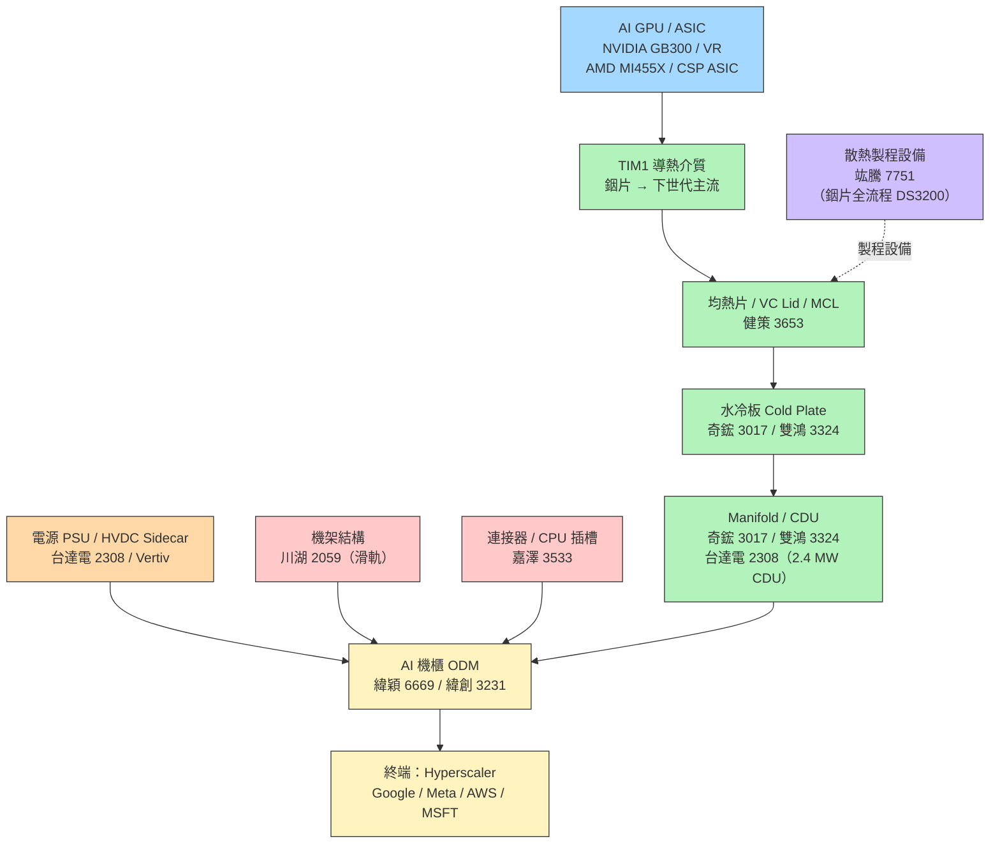

# 供應鏈_AI伺服器散熱

## 供應鏈主軸

> AI 機櫃熱功耗正突破 200 kW 臨界點（GB300 NVL72 ~130 kW → Vera Rubin ~200 kW+），驅動資料中心全面轉向液冷，並拉動每一個散熱環節的 ASP 與需求量同步升級。本頁涵蓋晶片端均熱片、液冷水冷板/CDU、電源 PSU/HVDC、機架機構件，以及 ODM 系統整合。

## 供應鏈結構圖

## 各環節廠商

### 上游材料（晶片端）

| 材料 | 說明 | 廠商（未建頁） |
|------|------|---------------|
| 銦片（Indium）| VR 世代 TIM1 主流，導熱率 80 W/m-K，高延展性；TDP 2,000W+ 後散熱膏/石墨烯不敷使用 | Indium Corp.（美）、China Indium（中）|
| 銅片 | 均熱片本體材料 | 銅材廠 |
| 鍍金製程 | VR 均熱片需鍍金以相容銦片 TIM1 | 電鍍代工廠 |

### 均熱片 / VC Lid / MCL（晶片封裝散熱）

| 廠商 | 地位 | 備註 |
|------|------|------|
| [[3653_健策（市）]] | 全球均熱片龍頭 | GB300 ASP +50%、VR ASP +100%（兩件式 + 銦片 + 鍍金）；MCL 單價 >200 USD，Computex 2026 首次展示 |

均熱片（未建頁）：國際對手主要為日系廠商，但健策在台系封裝廠（TSMC 供應鏈管理論壇卓越獎）切換成本高，護城河深。

**ASP 升級路徑（健策）**

| 世代 | 結構 | TIM1 | ASP vs 前代 | 導入時程 |
|------|------|------|-------------|---------|
| Blackwell GB300 | 一件式升級平整性 | 散熱膏 | +50% | 2025Q4 完成 |
| Vera Rubin VR200 | 兩件式 + 鍍金 | 銦片 | +100% | 2026Q1 小量→Q2 放量 |
| Rubin Ultra / Feynman | MCL（微流道蓋板）| 液冷整合 | >200 USD/顆 | 2027–2028 潛在 |

### 散熱製程設備（封裝製程）

| 廠商 | 地位 | 備註 |
|------|------|------|
| [[7751_竑騰（市）]] | 銦片製程設備唯一台廠 | DS3200 系列（噴塗→植片→壓合→AOI）；大尺寸壓合（100×100mm / 120×150mm）；楠梓廠鄰近[[3711_日月光投控（市）]] |

製程設備路徑：CoWoS 尺寸升級 80×80mm → 100×100mm（Rubin）→ 120×150mm（Rubin Ultra）帶動客戶持續換機；銦片製程 2H26 起批量滲透，每台 DS3200 約 1,500 萬台幣，客單價高。

### 水冷板 Cold Plate（液冷元件）

| 廠商 | 地位 | 備註 |
|------|------|------|
| [[3017_奇鋐（市）]] | 台灣散熱模組第一 | CDU + 水冷板 + 冷排一站式；鴻海/廣達/緯穎/英業達等 ODM 全覆蓋 |
| [[3324_雙鴻（市）]] | 台灣前二大 | 月產能 30 萬片水冷板；Rubin CPX QD 用量 6+2 → 10+2 大增；泰國二廠 2026H1 開出 |

水冷板技術分化：Rubin CPX（~1,200W × 8 顆）需雙面設計水冷板，雙鴻自設計 QD（分歧管），奇鋐同步布局 CPO 液冷方案（光引擎精確溫控）。

### CDU 冷卻液分配單元（機架級液冷）

| 廠商 | 地位 | 備註 |
|------|------|------|
| [[3017_奇鋐（市）]] | 主要供應商 | GB300、VR、MI、ASIC 機櫃液冷 CDU 均有布局 |
| [[3324_雙鴻（市）]] | 次要供應商 | CDU 月產能 500–1,000 台；Computex 2026 展示 Water-to-Water In-Row CDU 2 MW（可支援 10+ IT 機櫃）|
| [[2308_台達電（市）]] | 電源兼液冷 | Computex 2026 展示 2.4 MW CDU 方案，業界容量最大；兼顧電源與散熱整合 |

CDU（未建頁）：美系 Vertiv（CDU + 液冷一體化）、Schneider Electric；台灣 Acer ITS、台達電為主要 OEM。

### 電源 PSU / HVDC Sidecar（機架供電）

| 廠商 | 地位 | 備註 |
|------|------|------|
| [[2308_台達電（市）]] | 台廠電源龍頭 | 800V HVDC 解決方案最完整；GB300 Sidecar 主供之一；2026F EPS +93% YoY |
| [[VRT.US(vertiv)]] | 電源機櫃全球領導 | Power rack / grey-space 方案（PSU + PDU 移出白空間）；對 800V vs 400V 架構中性受惠 |

電源（未建頁）：光寶科 2301（power rack 轉型）、Legrand、Schneider、ABB、Hammond Power（grey-space 競爭）。800V HVDC 架構雖有時程延後，但 sidecar / power rack 轉型與架構選擇解耦，電源廠受惠不受波及。

**功耗升級路徑**

| 機架 | 熱功耗 | 電源架構 |
|------|--------|---------|
| DGX H100 | ~10 kW / 機架 | 標準 12V |
| GB200 NVL72 | ~130 kW / 機架 | 48V → Sidecar 480V |
| VR NVL72 | ~200 kW+ / 機架 | Sidecar 800V HVDC（延後中） |
| 未來世代 | 300 kW+ | 全面 HVDC |

**HVDC 市場規模量化（CTBC 2025-08 估算）**

- HVDC sidecar 非量產 ASP：~US$61 萬（BOM：PDU / PSU / BBU + 水冷部件）
- VR144 平台 HVDC 機架需求：2,000 台；VR576：13,100 台
- 整體兩代合計市場規模：~NT$2,573 億
- 目前具備 HVDC sidecar 製造能力廠商全球僅 2–3 家（台達電為其一）
- 台達電預估出貨：2026F 100 台（小量）、2027F 2,500 台（具規模）
- 採用門檻低於 In-row CDU：無需更動資料中心基礎設施，僅需 480V/415VAC 升壓至 800V，適合 GB300 開始的漸進式滲透

### 機架結構 / 滑軌（機構件）

| 廠商 | 地位 | 備註 |
|------|------|------|
| [[2059_川湖（市）]] | 全球伺服器滑軌龍頭 | NVL72 單組機櫃需 70+ 種滑軌品項；2026-05 YoY +172%；AMD Helios 滑軌已完成認證 |

滑軌（未建頁）：King Slide 市占遙遙領先，品項複雜度形成壁壘，ASP 隨機架大型化（4U → 8U → NVL72 機櫃）逐代提升。

### 連接器 / CPU 插槽（電氣介面）

| 廠商 | 地位 | 備註 |
|------|------|------|
| [[3533_嘉澤（市）]] | AI 伺服器插槽龍頭 | CPU LGA 插槽 + GPU 電源連接器；AMD Helios（緯穎 ODM）唯一插槽供應商；Vera CPU 代理型 AI 插槽 ASP 更高 |

連接器（未建頁）：Amphenol（APH，高速訊號連接器）、Molex（機架電源）。

### AI 機櫃 ODM（系統整合）

| 廠商 | 地位 | 備註 |
|------|------|------|
| [[6669_緯穎（市）]] | T1 雲端 AI ODM | 直供 CSP（Google/Meta/MSFT/Amazon）；AMD Helios 唯一完整展示 ODM；Spectrum-X 光互連合作（Ayar Labs + 創意）|
| [[3231_緯創（市）]] | T2 AI 伺服器 ODM | 母公司持股緯穎；2026E 營收 3.1 兆元（+51.9%）；AMD GPU 第二大客戶 2H26 上線 |

ODM（未建頁）：廣達（2382）、鴻海（2317）、英業達 為台灣其他主要 AI 伺服器 ODM。

## 競爭格局

### 功耗跳級驅動全面液冷

AI 機櫃熱功耗突破 120 kW 後，氣冷散熱無法有效應對，**液冷成為不可逆的轉換方向**。現有供應鏈格局：
- 奇鋐 vs 雙鴻：台灣散熱模組雙雄，奇鋐一站式（CDU+水冷板+冷排），雙鴻以水冷板規模（30萬片/月）取勝；兩者並非替代關係，大多數 ODM 多家備料。
- CDU 市場：奇鋐、雙鴻、台達電三方分食，功率等級差異明顯（雙鴻 2 MW、台達 2.4 MW），超大功率機架向台達電傾斜。

### MCL 威脅 vs 機會的矛盾

市場對**微流道蓋板（MCL）**存在兩種解讀：
- **機會**：MCL 整合均熱片與水冷板，健策若成功導入 ASP 超過 200 USD（vs 現行均熱片 ~30–50 USD），估值大幅重估。
- **威脅**：MCL 可能讓傳統水冷板（奇鋐/雙鴻主力）需求下降——若 MCL 由健策直接提供，Manifold/CDU 之上的部分水冷板訂單可能轉移。

中信（雙鴻報告）評估：MCL 量產門檻仍高，2026 年水冷板仍為主流；最快 Rubin Ultra（2027）或 Feynman（2028）世代才可能放量。竑騰（DS3200 銦片製程機）是 MCL 製程的直接受惠者，定位反而因 MCL 受惠。

### HVDC 800V 時程延後

800V HVDC 架構實際滲透慢於預期：
- 對台達電、Vertiv 屬**中性**——sidecar/power rack 轉型不論 400V 或 800V 都在進行；
- 對 WBG 寬能隙半導體廠（Wolfspeed、Navitas）屬**負面**；
- Vertiv 因大型 UPS 業務壽命被延長而定位尤佳（詳見 [[技術_800VDC供電架構]]）。

### AMD Helios 帶來「第二軸」受惠

2026Q4 AMD Helios 機櫃量產是本輪供應鏈的新增長點，**健策 + 嘉澤 + 緯穎**形成 Helios 三位一體供應鏈：
- 健策均熱片（AMD ASIC 均熱片）
- 嘉澤 CPU/GPU 插槽（Helios 唯一插槽供應商）
- 緯穎（唯一完整展示 Helios 的 ODM）

川湖 Helios 滑軌同步完成認證。AMD Helios 規模預估 6,000–10,000 台（2027），相較 GB300 NVL72 55,000 台是新增量而非替代。

## 觀察重點（投資視角）

1. **VR 量產節奏**（最重要）：VR NVL72 規模放量是水冷板/CDU/均熱片/滑軌/電源全線 ASP 提升的觸發點；機櫃 ASP ~700 萬 USD（vs GB300 ~400 萬 USD），供應鏈含金量同步升級。
2. **MCL 導入時程**：健策 MCL 進入封裝廠驗證，若 Rubin Ultra（2027）確定導入，健策 2027E EPS 空間大——同時是雙鴻/奇鋐水冷板的潛在衝擊項目。
3. **銦片供應鏈建立**：VR 均熱片需銦片 TIM1，竑騰 DS3200 需批量滲透；銦片為新材料，供應鏈認證進度是 VR 量產速度的隱性制約。
4. **AMD Helios 出貨量**：2026Q4 正式量產後的實際台數——影響川湖/嘉澤/健策的 AMD 軸成長貢獻。
5. **HVDC 800V 實際滲透時程**：若 2027 才大規模落地，短期對台達電影響中性；若加速，台達電 800V 解決方案的競爭優勢正式兌現。
6. **奇鋐 vs 雙鴻 CPO 液冷方案**：CPO 光引擎散熱是新戰場（精確溫控需求），2027 CPO 放量後奇鋐（已進入驗證）可能搶先。

## 相關頁面

- [[2059_川湖（市）]]
- [[2308_台達電（市）]]
- [[3017_奇鋐（市）]]
- [[3231_緯創（市）]]
- [[3324_雙鴻（市）]]
- [[3533_嘉澤（市）]]
- [[3653_健策（市）]]
- [[3711_日月光投控（市）]]
- [[6515_穎崴（市）]]
- [[6510_精測（市）]]
- [[6669_緯穎（市）]]
- [[7751_竑騰（市）]]
- [[NVDA.US(nvidia)]]
- [[VRT.US(vertiv)]]
- 技術：[[技術_800VDC供電架構]]、[[技術_CPO]]
- 對照供應鏈：[[供應鏈_先進封裝載板]]、[[供應鏈_CPO]]、[[供應鏈_AI伺服器PCB]]

## 來源

- [[凱基-電子硬體產業-20260616]]（凱基投顧，Computex 2026 電子硬體產業月報，2026-06-16；奇鋐/雙鴻/台達電/緯穎/嘉澤/川湖月營收與 TP）
- [[報告_國泰_健策3653_20260206]]（國泰證期，2026-02-06；健策 VR 均熱片 ASP 升級路徑、MCL 技術）
- [[報告_中信_竑騰7751_20260223]]（中信投顧，2026-02-23；竑騰銦片製程設備、CoWoS 大尺寸升級）
- [[報告_中信_雙鴻3324_20250917]]（中信投顧，2025-09-17；雙鴻水冷板月產能、CDU、泰國二廠）
- [[報告_中信_緯創3231_20251113]]（中信投顧，2025-11-13；緯創 T2 ODM 轉型、緯穎貢獻）
- [[報告_Semianalysis_CPOand800VDC_20260609]]（SemiAnalysis，2026-06-09；800VDC 延後、Vertiv/台達電定位）
- [[台達電(2308,UG,B)-CTBC250801]]（中信投顧，2025-08-01；HVDC 市場規模量化、sidecar BOM 拆解、VR144/VR576 需求預估）
