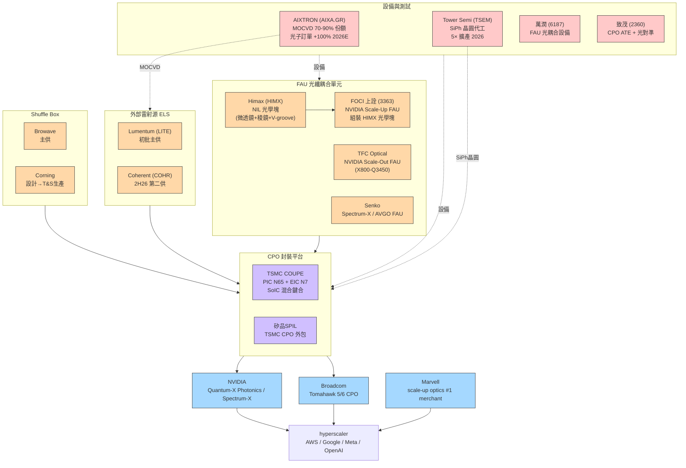

# 供應鏈_AI光互聯

AI 光互聯泛指資料中心 GPU 叢集的光學連接層，包含 Scale-out（跨機架）與 Scale-up（機架內 GPU 間）兩大維度。Scale-up 的 CPO 化是本供應鏈最大的 TAM 成長驅動力；Scale-out 的光模塊升級（800G→1.6T→3.2T）是近期主要獲利來源。

## 2026-08-11 網通升速更新

Goldman Sachs 2026-08-11 仍將 800G／1.6T 升速與 AI networking 視為主要需求驅動；Morgan Stanley 2026-08-05 由 Celestica read-across 指出 1.6T 已開始初始出貨，並預期 2027 年持續成長。這支持 [[2345_智邦（市）]] 等大型交換器 ODM 的供應商集中優勢，但元件供應緊張仍是短期限制。[[260811_gs_optical-networking]] [[260805_ms_accton]]

```mermaid
flowchart LR
    CSP[AI CSP / 資料中心] --> S800[800G 交換器]
    CSP --> S16[1.6T 交換器]
    S800 --> CPO[CPO / NPO 過渡]
    S16 --> CPO
    CPO --> LITE[[LITE.US(lumentum)]]
    S800 --> ACCTON[[2345_智邦（市）]]
```

## 投資論述全景

從 Citrini（2026-03）的架構：「瓶頸逐層上移」——
1. **第一波**（已驗證）：可插拔光模塊（COHR / LITE / Innolight），TAM $10B+ 並持續成長
2. **第二波**（現況）：上游材料設備（SiPh 代工 TSEM、MOCVD 設備 AIXTRON、SOI/InP 基板、NIL 微光學 HIMX）
3. **第三波**（2027-28）：CPO Scale-up（TSMC COUPE 封裝、FOCI FAU、ELS 供應鏈）

## GS TAM 模型（2026-04-17）

Goldman Sachs「The next mega trend in AI infrastructure」預測 AI 光互聯 TAM 9× 升級：

### 機架美元含量升級路徑

| 機型 | 出貨期 | Scale-up | Scale-out | 網路成本/架 |
|------|-------|---------|---------|----------|
| GB300 NVL72 | 2H25-2026 | 銅纜 | 光模塊 1.6T | $315K |
| Vera Rubin NVL72 | 2H26-2027 | 銅纜 | 光模塊 1.6T | $489K |
| Vera Rubin NVL72（25% CPO） | 2H26-2027 | 銅纜 | CPO TOR + 光模塊 | $504K |
| Rubin Ultra NVL144（29% CPO） | 2H27-2028 | PCB 中板 | CPO TOR + 光模塊 | $1,113K |
| **Rubin Ultra NVL576**（29% CPO） | 2H27-2028 | 銅纜 + CPO | CPO TOR + 光模塊 | **$1,169K/架**（8架合計 ~$9.4M） |

> GB300 48K racks → TAM **$15B**；Rubin Ultra 132K racks（16.5K computing units）→ TAM **$154B**（Scale-up 佔 69%，CPO 佔 59%）

### CPO TAM 逐年（高端 Spec B）

| 年度 | CPO TAM | Optical Engine & FAU | ELS | Fiber + Shuffle |
|------|---------|---------------------|-----|----------------|
| 2026E | **$1.0B** | $0.9B | $0.1B | ~$0.05B |
| 2027E | **$24.8B** | $16.3B | $2.8B | $5.8B |
| 2028E | **$70.9B** | $43.9B | $8.0B | $19.1B |

> 低端（Spec A）：2026 $0 / 2027 $3.6B / 2028 $12.1B——差距在 CPO scale-out 滲透率假設（5-29% vs 0-27%）。

## 供應鏈全圖



## 關鍵廠商一覽

| 環節 | 廠商 | 核心角色 | 上市地 |
|------|------|---------|-------|
| **CPO 封裝（COUPE）** | [[2330_台積電（市）]] | PIC N65 + EIC N7；SoIC 混合鍵合 | TW |
| **ELS 主供** | [[LITE.US(lumentum)]] | NVIDIA CPO 初批主供；AIXTRON MOCVD 下游 | US |
| **ELS 第二供** | [[COHR.US(coherent)]] | 2H26 進入；德州 InP 廠；NVIDIA $20B 入股 | US |
| **FAU 光學塊 NIL** | HIMX.US(himax)（2379.TW） | NIL 奈米壓印製程；微透鏡 + 稜鏡 + V-groove；TSMC COUPE 供應鏈 | US/TW |
| **FAU 組裝（Scale-Up）** | [[3363_上詮（櫃）]]（FOCI） | 組裝 HIMX 光學塊為 FAU；NVIDIA Scale-Up 主供 | TW |
| **FAU 主供（Scale-Out）** | TFC Optical（300394.SH） | X800-Q3450 主供；亦供 ELS 模組 | CN |
| **FAU（Spectrum-X / AVGO）** | Senko（9069.JP） | SEAT 可拆 FAU；Spectrum-X / Tomahawk6 | JP |
| **Shuffle Box** | Browave（3. 深交所） | NVIDIA COUPE shuffle 主供 | CN |
| **MOCVD 設備** | AIXTRON（AIXA.GR） | 70-90% 市場份額；光子訂單 2026E >+100% | DE |
| **SiPh 代工** | [[TSEM.US(tower semiconductor)]] | SiPh 5× 擴產；$1.3B 2027 合約；3.2T 路線圖 | US/IL |
| **OSAT（Nvidia Rubin-rack）** | [[3711_日月光投控（市）]] | Rubin-rack CPO 核心 OSAT | TW |
| **FAU 光耦合設備** | [[6187_萬潤（市）]] | FAU 貼合 + 光耦合機台；CPO 3Q26 首現業績 | TW |
| **CPO ATE + 光對準** | [[2360_致茂（市）]] | Insertion 3 ATE + 光對準；Insertion 4 FT/SLT | TW |
| **SiPh 材料（SOI）** | Soitec（SOI.FP） | SOI 晶圓；Nomura Buy TP €250 | FR |
| **矽晶圓（BPD/SiPh）** | [[6488_環球晶（櫃）]] | BPD/SiPh SOI 12"需求受益；LTA 重啟 | TW |

## Nomura 大中華半導體復興選股（2026-05-20）

Nomura 在「Greater China Semi Renaissance」Anchor Report 中提出的光互聯相關材料選股：

| 公司 | 評等 | TP | 邏輯 |
|------|------|----|----|
| Soitec（SOI FP） | Buy | €250 | SOI 晶圓供應 SiPh 代工；SiPh CAGR >30% 2026-30F |
| Besi（BESI NA） | Buy | €340 | 先進封裝設備；Hybrid bonding for CPO |
| 環球晶（6488 TW） | Buy | NT$850（後升 NT$1,200） | BPD/SiPh 帶動 12" 需求 |

## Citrini 重點選股（2026-03-12）

| 公司 | 論點 | 關鍵數字 |
|------|------|---------|
| **HIMX US** | CPO FAU 光學塊隱形龍頭；NIL 製程競爭壁壘；Apple 智慧眼鏡第二催化 | 2026 年非驅動業務約 20% 營收 → 2028F ~50%；CPO 早期量產 annualized $100M+ |
| **AIXA GR** | MOCVD 壟斷；轉型從 SiC EV → 光子 AI；GaN 800V 第二催化 | 光子業務 2025 ~€120M → 2026F >+100% YoY，預計成最大業務 |
| **TSEM US** | SiPh 代工 5× 擴產；已建頁詳見 [[TSEM.US(tower semiconductor)]] | 2027F 收入 $1.6-1.9B；$1.3B 合約在手 |

## GlassBridge 監控（Corning，2026-06-24）

> [!warning] 長期 FAU 顛覆風險
> Corning 正式發表 GlassBridge fiber-to-PIC 連接器平台，繞過傳統 FAU 直接將光纖耦合 PIC。
> - 短期（1-2年）影響極有限，技術商業落地時程不確定
> - 中長期若量產，對 TFC / FOCI / Senko 等傳統 FAU 廠商構成結構性挑戰
> - 監控點：Corning 2026-27 技術驗證進度、客戶採用情況

## 時間軸

| 時間 | 事件 | 重要性 |
|------|------|--------|
| 2026-06-24 | Corning GlassBridge fiber-to-PIC 正式發表（首爾研討會） | ⭐⭐ |
| 2026-06-15 | MS bus tour：MRVL scale-up optics #1 目標；ALAB NPO 2027 / CPO 2028+ | ⭐⭐⭐ |
| 2026-04-17 | GS「The next mega trend」：TAM $15B→$154B；CPO 2028 $70.9B（高端） | ⭐⭐⭐ |
| 2026-03-12 | Citrini：HIMX / AIXTRON 光子供應鏈深度研究；HIMX 2026 小量出貨 | ⭐⭐⭐ |
| 2026-03（GTC） | NVIDIA 發表 Vera Rubin + Feynman CPO 路線圖；$2B 入股 LITE + $2B 入股 COHR | ⭐⭐⭐ |
| 2026-02 | AIXTRON FY26 管理層指引：光子訂單 >+100% YoY，GaN 800V 加速 | ⭐⭐ |
| 2026-01 | Marvell 完成 Celestial AI 收購（EAM CPO Scale-up） | ⭐⭐⭐ |

## 相關頁面

- [[3702_大聯大（市）]]
- [[4966_譜瑞-KY（櫃）]]
- [[6526_達發（市）]]
- [[5803.JP(fujikura)]]
- [[7907_源傑科技（興）]]
- [[技術_CPO]]
- [[技術_矽光子（SiPh）]]
- [[供應鏈_CPO]]
- [[供應鏈_光測試設備]]
- [[TSEM.US(tower semiconductor)]]
- [[LITE.US(lumentum)]]
- [[COHR.US(coherent)]]
- [[3363_上詮（櫃）]]
- [[6488_環球晶（櫃）]]
- HIMX.US(himax)

## 來源

- [[Optical Networking 260417 GS AI scale out scale up]]（Goldman Sachs，2026-04-17；TAM $15B→$154B；CPO TAM 逐年；BoM breakdown；Scale-up 佔 69%）
- [[Optical Networking 260312 Citrini AI connectivity optics]]（Citrini Research，2026-03-12；HIMX NIL 光學塊、FOCI 組裝、AIXTRON MOCVD；光子供應鏈深度分析）
- [[AI optical GlassBridge Fiber-to-PIC implications 260629 MS]]（Morgan Stanley，2026-06-28；GlassBridge 風險評估）
- [[Semiconductors 260615 MS public company bus tour ALAB MRVL INTC]]（Morgan Stanley，2026-06-15；MRVL / ALAB 光互連策略更新）
- [[報告_Nomura_環球晶_大中華半導體_20260520]]（Nomura，2026-05-20；大中華半導體復興；光互聯相關材料選股）
- [[CRWV.US(coreweave)]]
- [[分析_2026-08_AI網通與硬體報告更新]]
## 2026-08-20 更新

- [[260820_GS_WNC 啟碁(6285)]] 補充啟碁在高速網通與 AI networking 的觀察；800G 以上規格的驗證、出貨與客戶集中度仍需追蹤。
- [[260820_MS_MPI 旺矽(6223)]] 將 CPO 測試設備與探針卡列為長期成長方向，但短期 EPS 下修反映營收落地速度風險。
- [[260820_BroadcomAVGO_JPM_FY26_AI營收上看560億美元,_TPU設計贏單藍圖不變（非完整報告）]] 對 Broadcom AI ASIC／TPU 設計贏單提供方向性補充；因來源不完整，信心水準：中低。
## 本次 ingest 更新（2026-08-22）

- DIGITIMES 新報告指出，矽光子晶片業者的競爭焦點逐步由單點元件移向光電整合與平台協作；這是產業策略觀察，尚不等於個別公司訂單確認。
- 來源：[[矽光子晶片業者的競合策略 - DIGITIMES]]。

## 2026-08-23 新增來源觀察

- 小馬光學演講將光互連路線整理為 Pluggable → LPO → XPO → NPO → CPO，並把 FAU／coupling、矽光子與玻璃平台列為量產關鍵；屬產業演講觀點，非個別公司訂單。
- AMD Helios 的 800G Volcano NIC、Scale-up／Scale-out 混合網路，與 Google TPU／Axion 全棧擴張，支持 AI 光互聯需求延續；產品路線與券商 read-across 仍需以客戶部署驗證。

![[2026-08-04-AI 時代光纖到晶片的新賽局-群益證劵-83_006.png]]

圖說：來源演講展示電子伺服器走向光子電子整合伺服器，對應 AI 資料中心降低互連距離、功耗與佈線密度的供應鏈方向。

來源：[[2026-08-04-AI 時代光纖到晶片的新賽局-群益證劵-83]]、[[事件分析_AMD Advancing AI Day_20260727]]、[[260723_ms_google-results-implication]]。

## 2026-08-23 申萬宏源光電整合補充

### 2026-08-27 NVIDIA 供應鏈與光互聯延伸

- [[260827_citi_nvda-implication]] 指出 AI factory 的瓶頸已由晶片擴大至 rack integration、電力與實體資料中心容量，光元件、網通、液冷與電力管理因此成為同一部署週期的延伸受惠環節。
- [[260827_ms_NVDA-implication]] 估 NVIDIA 2027 年 CoWoS-L 消耗約 910k wafers、年增約 40%；光互聯需求仍與 Rubin rack 出貨、HBM／先進封裝與整機同步，屬券商 estimate，信心：中。

- [[報告_申万宏源_光通信光電集成深度_20260630]] 將 AI 光互聯的價值量上移歸納為三條路線：EML 向矽光子 PIC 遷移、單通道速率提升，以及 CPO／NPO 的光電整合；2027 年 400G 以上光模組／光引擎需求 1.55 億支、TAM 超過 700 億美元為券商估計，信心中。
- 供應鏈觀察由交換晶片／SerDes 鏈主（[[AVGO.US(broadcom)]]、[[MRVL.US(marvell)]]）延伸至 CW 光源（[[LITE.US(lumentum)]]、[[COHR.US(coherent)]]、[[7907_源傑科技（興）]]）及光電封裝（[[3450_聯鈞（市）]]）；個別客戶份額仍須驗證。

## 2026-08-27 Rubin Ultra NVL576 架構補充

[[報告_SemiAnalysis_RubinUltraNVL576_20260810]] 描述 NVL576 將 expandable scale-up switch 增至每架 72 顆 ASIC，並在 NPO／CPO 兩種方案間並行開發；報告判斷 NPO 因 socketed form factor 成熟度較高，較可能先上市。這使短期光互聯觀察重點由「CPO 是否立即量產」轉為「NPO 是否先承接跨機櫃 scale-up」，但來源仍註明 Rubin Ultra 規格尚在變動。

| 路線 | NVL576 角色 | 近期觀察 |
|---|---|---|
| NPO | socketed optical module，較可能先上市 | 光模組、FAU、PCB socket 與測試驗證 |
| CPO | 每顆 switch ASIC 配 4 個不可更換 optical engine | attach 良率、維修性與量產時程 |

來源：[[報告_SemiAnalysis_RubinUltraNVL576_20260810]]（SemiAnalysis，2026-08-10）。

## 2026-08-27 Lumentum 券商交叉驗證

五份 2026-08-11～12 券商報告共同確認近期主線仍是 800G／1.6T、EML／CW／pump laser 與 OCS；差異集中在 NPO／CPO 時程與毛利 mix。Jefferies、Barclays、BNP Paribas 與 JPMorgan 對 NPO／ELS 的增量機會較正面，TD Cowen 則提醒 CW 擴產與中國 InP 供給可能帶來週期性供過於求。

| 環節 | 觀察公司 | 本批來源結論 | 信心 |
|---|---|---|---|
| EML／CW／pump laser | [[LITE.US(lumentum)]]、[[COHR.US(coherent)]] | EML 需求仍超過供給 30% 以上；pump laser 未來數季可能增至約 4 倍，但 CW／InP 擴產需防供給反轉 | 中 |
| 800G／1.6T transceiver | [[LITE.US(lumentum)]] | 800G 出貨創高、1.6T 已開始出貨，FY27 Q1 起加速；1.6T 可能提高 CW／矽光子占比 | 中高 |
| OCS | [[LITE.US(lumentum)]]、[[GOOGL.US(alphabet)]] | FY26 下半年收入目標 USD 400m 以上，首個 triple-digit quarter 進入驗證；客戶與 port-count 擴展仍待追蹤 | 中 |
| NPO／CPO／ELS | [[LITE.US(lumentum)]]、[[NVDA.US(nvidia)]] | NPO 客戶興趣較廣，CPO 基準為 2H27 出貨／2028 部署；ELS 首張訂單與超高功率雷射出貨仍屬展望 | 中 |

來源：[[2026-08-11-LITE.OQ-Jefferies-Delivering on Multiple Growth Vectors, NPO a New Leg to Scal...-123789110]]、[[2026-08-11-LITE.OQ-TD Cowen-Continued Strong Execution, But Cycle Questions Linger-123788973]]、[[2026-08-12-LITE.OQ-Barclays-Lumentum Holdings Inc. Several Moving Pieces, All in Right ...-123789088]]、[[2026-08-12-LITE.OQ-BNP Paribas-LUMENTUM HOLDINGS (+)  Lighting The Way-123789795]]、[[2026-08-12-LITE.OQ-JPMorgan-Lumentum F4Q26 Review Executing Ahead of Plan With Incremen...-123791452]]。
