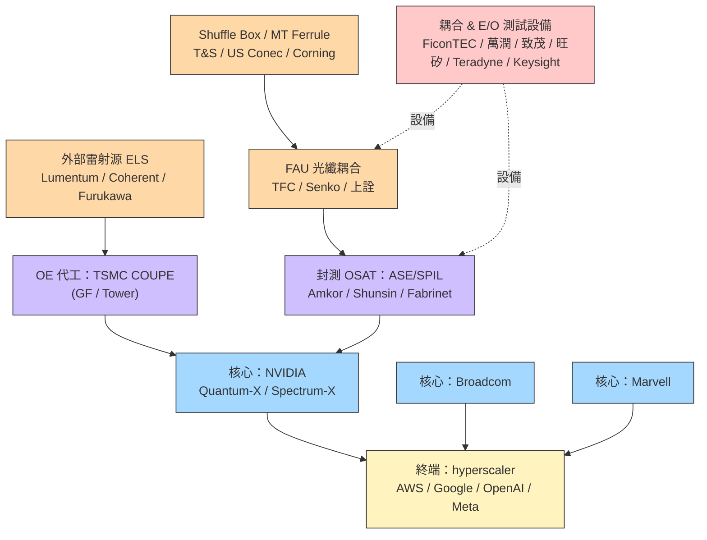

# 供應鏈_CPO

## 供應鏈主軸

> 以 **Nvidia CPO 生態**為主軸的供應鏈地圖（來源：SemiAnalysis CPO Book Part 5）。涵蓋光引擎、外部雷射源（ELS）、FAU、光纖 shuffle box、MPO 連接器、MT ferrule、晶圓代工／封測、E/O 測試。

## 供應鏈結構圖

## 供應鏈整合演進圖

![[web_semicon_taiwan_2026_siph_summit_20260831_07.png]]
圖說：（Simple Tech Trend，2026-08-31）CPO 從晶圓到系統的四道測試插入點與失效成本階梯，凸顯量產瓶頸由「能否做出」轉向測試、良率與失效成本控制。

![[報告_金正禾論壇_CPO光電共封裝_20260325_024.png]]
圖說：（金正禾論壇，2026-03-25）Scale-Up CPO 供應鏈全景——左側為系統整合路徑（Switch ASIC → OE module → ODM → End User），中間為 Hybrid-bond 設備 / 測試設備 / 耦合設備分工，右側為 FAU（ASP $50）→ E/PIC pair → OE module（ASP $1,000）的元件價值層次，以及 TSMC/GlobalFoundries/Intel 代工與 ASE/SPIL/Amkor OSAT 位置。

## 各環節廠商

### 平台 / 交換器 ASIC（核心）
| 廠商 | 地位 | 備註 |
|------|------|------|
| [[NVDA.US(nvidia)]] | 主導 | Quantum-X（115.2T，72→36 OE）、Spectrum-X（102.4/409.6T） |
| [[AVGO.US(broadcom)]] | CPO 老將 | Humboldt→Bailly→Davisson（TH6，16×6.4T OE） |
| [[MRVL.US(marvell)]] | 切入中 | 收購 Celestial AI，主攻 scale-up 光互連 |

### OE 晶圓代工 / 封裝整合（製程）
| 廠商 | 地位 | 備註 |
|------|------|------|
| [[2330_台積電（市）]] | 首選 | COUPE：PIC N65 + EIC N7，SoIC 混合鍵合，逾 23× 頻寬密度 |

代工（未建頁）：GlobalFoundries（Fotonix）、Tower——具 SiPho 但缺先進 CMOS 與先進封裝。

### 封測 OSAT（製程）
| 廠商 | 地位 | 備註 |
|------|------|------|
| [[AMKR.US(amkor)]] | 主要 OSAT | OE 封裝/測試/系統組裝 |

OSAT（未建頁）：ASE/SPIL（3711.TW，Nvidia 供應鏈關鍵，含未來 Rubin-rack CPO）、Shunsin（6451.TW，與 Broadcom 緊密）、Fabrinet（FN，Nvidia 模組老夥伴）、Foxconn（2354.TW）、Micas、Celestica。

### 外部雷射源 ELS（外部材料）
| 廠商 | 地位 | 備註 |
|------|------|------|
| [[LITE.US(lumentum)]] | 首批主供 | Nvidia 初期 CPO ELS 預期唯一供應商（June note 因 CPO 延後轉保守） |

ELS（未建頁）：Coherent（COHR，估 2026 下半進入第二供應）、Furukawa、Broadcom 自供、源傑 Yuanjie（中）、仕佳 Shijia（中）。CW DFB 每顆 ~350mW；高功率雷射仍有護城河。

### ELS-COS（待查證架構）

[[memo_光通_CPO_ELS_COS_20260901]] 轉述 SemiAnalysis 將 ELS-COS 描述為介於傳統 ELSFP 與 ILS 之間、更靠近 OE 但仍位於 ASIC 封裝之外的方案。若此路線成立，CoS／COS 封裝可能成為外部雷射與 OE 之間的關鍵製造環節；[[3450_聯鈞（市）]] 的切入仍須以 design-in、客戶驗證與量產資料確認，不能由架構描述直接推導為訂單。

> [!warning] ELS 中系供應商技術門檻
> Scale-Up CPO ELS 目前最低需 **100mW DFB @1310nm**；中系廠商在此規格下勉強達標。若升至 200mW/DFB 或 400mW/DFB，或引入 CWDM 多波長規格（1270/1290/1310/1330/1350nm），中系廠商在輸出功率與多波長均勻性上暫時無法滿足，技術護城河短期支撐 Lumentum/Coherent 地位。（來源：[[報告_金正禾論壇_CPO光電共封裝_20260325]]，2026-03-25）

### FAU / 光纖耦合（外部材料）
| 廠商 | 地位 | 備註 |
|------|------|------|
| [[3363_上詮（櫃）]] | 台廠 FAU | 光纖被動元件；CPO FAU/耦合相關追蹤 |

FAU（未建頁）：TFC Optical（300394.SH，與 Nvidia 合作 3-4 年、Q3450 FAU 主供，蘇州擴產）、Senko（9069.JP，SEAT 可拆式 FAU、與 GFS 合作 edge coupling）、Sumitomo、AFR（近 Broadcom）。耦合/對位設備（未建頁）：FiconTEC（德，>$300k/台）、All Ring Tech（台）、GMT Global（台）。

> ⚠️ **GlassBridge 顛覆風險（2026-06-24 Corning 正式發布）**：Corning GlassBridge 是 Fiber-to-PIC 直接耦合平台，將光纖直接連到 PIC，無需傳統 FAU 中間組裝。特性：wafer-based、被動對位、高密度、可插拔。MS 評估（2026-06-28）：CPO 開發中 **FAU 廠商面臨顛覆風險**，AI 收發模組廠商近 1-2 年影響有限（NPO 應用或可抵消 CPO 風險）。商業量產時程仍不確定；康寧已將 GlassBridge 納入 Analyst Day US$10bn Photonics 目標中。來源：[[GlassBridge_Fiber-to-PIC_光收發模組_MS260628]]

### Shuffle Box / MPO / MT Ferrule（外部材料）
| 環節 | 廠商（未建頁） | 備註 |
|------|------|------|
| Shuffle Box | T&S Communications（300570.SH）、Molex | T&S 主供、自動對位專利；Corning 分包給 T&S |
| MPO 連接器 | US Conec、T&S、Senko、Broadex、Optec | X800-Q3450 需 144 個 |
| MT Ferrule | US Conec、Fukushima、Senko、FOCI、Sumitomo、TFC、T&S | US Conec 三十年經驗，Q3450 主供之一 |

### CPO 光學鏡頭（光學元件）
| 廠商 | 地位 | 備註 |
|------|------|------|
| [[3008_大立光（市）]] | 積極擴張中 | 全球手機鏡頭龍頭切入 CPO 光學元件；GS Buy TP NT$6,231，2026-07-01；CPO 鏡頭帶動估值重估（re-rating），TP PE 從 17.9x 上調至 29.5x |

CPO 鏡頭廠商利用精密光學製造優勢切入 OE 模組所需鏡頭，為 AI 伺服器供應鏈提供多元化。

### 光耦合設備（上游設備）
| 廠商 | 地位 | 備註 |
|------|------|------|
| ficonTEC（德，未上市）| 實質壟斷 | 精度 < 0.3µm，單台 ~$500 萬 USD，交期 9-12 個月 |
| [[6187_萬潤（市）]] | 台廠切入 | CPO 光耦合 + FAU 貼合設備；掌握 Insertion 2-3 環節；SRS 估 3Q26 首現 CPO 業績（信心：中）；聲稱 UPH 優於 ficonTEC |

耦合設備（未建頁）：ADST（台廠，與萬潤同環節）；ASMPT（新加坡，技術接近 ficonTEC，尚未切入 CPO）

### E/O 測試設備（上游設備）
| 廠商 | 地位 | 備註 |
|------|------|------|
| [[2360_致茂（市）]] | Insertion 3/4 主導 | Insertion 1 ATE 驗證中；Insertion 3 ATE + 光學對準切入確認；Insertion 4 FT/SLT 核心強項（高功耗 3,000W 能力）|
| [[6515_穎崴（市）]] | 全環節卡位 | CPO 測試三環節：① Die Level 探針卡、② Package Level 獨家 Double Sided Probing System、③ Module Level HyperSocket；公司認為 2028 年是 CPO 確定量產年；CTBC TP NT$10,000（2026-07-01）|
| [[6223_旺矽（櫃）]] | Insertion 1-3 探針台 | Insertion 1 驗證中、Insertion 2 雙面探針台認證中、Insertion 3 確認；MS 2026-08-04 稱 Insertion 3 預計 4Q26 出貨、Insertion 2 可能 2027 年中開始；「CPO 不論誰贏，旺矽都受益」 |
| [[6710_汎銓（市）]] | Insertion 3 光通量檢測 | IR-OM 光損偵測裝置（漏光偵測與精準定位）；與光焱科技並列 |

測試設備（未建頁）：Keysight（高速測試龍頭）、Teradyne（NVDA 認證領先、ficonTEC 夥伴）、FormFactor（晶圓探針，光學對準模組）、Advantest、Anritsu、Multilane、Hon Precision 鴻勁（AI/HPC 終測 handler）、光焱科技（Insertion 3 光通量，未建頁）。

## 競爭格局

- **TSMC COUPE 形成綁定**：採 COUPE 即綁定 TSMC 製 PIC，是供應鏈最關鍵的卡位。
- **雷射 ELS 短期由 Lumentum 主導**，Coherent 第二、中系廠商伺機切入標準化品項。
- **FAU/被動件**：精密對位與技術人力是門檻；台廠（上詮、FOCI）與中、日（TFC、Senko）並進。
- **測試是 picks-and-shovels**：系統整合良率是 CPO 最大瓶頸，測試需求領先量產。
- **NPO／Pluggable CPO 成為分流路線**：[[報告_SemiAnalysis_NPO光互連接棒_20260713]] 認為，將可更換 OE 置於 ASIC 鄰近的 NPO 可降低 attach yield、維修與供應商鎖定風險；相對地，它仍需處理約 150 mm 電通道、socket 與 OE 量產可靠度。AWS、Meta、NVIDIA 等個別平台採用敘述皆屬該報告模型，須以客戶設計定案與實際驗證為準。

## 觀察重點（投資視角）

1. **CPO 量產時程下修風險**（見 [[技術_CPO]] 衝突 callout）：scale-out 2026/2027 出貨可能不如預期。
2. Lumentum 對 CPO 量的曝險使其在 June note 轉保守——ELS 供應地位與時程下修的拉鋸。
3. 良率（attach yield → 系統良率）是放量的硬門檻，利多測試與設備端先行。
4. 台廠卡位：上詮（FAU）、致茂（測試）、ASE/SPIL（封測）、Foxconn（系統組裝）。

## 相關頁面

- [[4979_華星光（櫃）]]
- [[2248_華勝-KY（市）]]
- [[4755_三福化（市）]]
- [[供應鏈_AI光互聯]]
- [[6442_光聖（市）]]
- [[7769_鴻勁精密（市）]]
- [[7856_漢測（興）]]
- [[供應鏈_AI伺服器散熱]]
- [[供應鏈_光測試設備]]
- [[供應鏈_半導體測試設備]]
- [[惠特（TW-ticker待確認）]]
- [[技術_InP磷化銦]]
- [[技術_光互連]]
- [[3008_大立光（市）]]（CPO 鏡頭）
- [[6187_萬潤（市）]]（CPO 光耦合 + FAU 貼合設備）
- [[6515_穎崴（市）]]（CPO 全環節測試）
- [[6223_旺矽（櫃）]]（Insertion 1-3 探針台）
- [[6710_汎銓（市）]]（Insertion 3 光通量檢測）
- [[2455_全新（市）]]
- [[3081_LandMark光電（市）]]
- [[3105_穩懋（櫃）]]
- [[3450_聯鈞（市）]]
- [[分析_光通_CPO與ELS-COS_20260901]]
- [[分析_大量與聯鈞_2Q26法說_20260818]]
- [[3711_日月光投控（市）]]
- [[APH.US(amphenol)]]
- 技術：[[技術_CPO]]
- 對照供應鏈：[[供應鏈_先進封裝載板]]、[[供應鏈_AI伺服器PCB]]

## 來源

- [[web_SEMICON_Taiwan_2026_矽光子國際論壇_20260831]] — Simple Tech Trend，2026-08-31

- [[memo_OCPAPAC_CPO_NPO_XPO專家會議_20260820]]（OCP APAC panel，2026-08-20；CPO／NPO／XPO 路線分化、409.6T forcing function、25.6T+ CPO 標準化）
- [[報告_金正禾論壇_InP晶圓代工CPO_20260130]] — 金正禾論壇（CPO 供應鏈前段圖），2026-01-30
- [[報告_金正禾論壇_CPO光電共封裝_20260325]] — 金正禾論壇（供應鏈整合演進、ELS 門檻），2026-03-25
- [[報告_Semianalysis_CPO_20260102]]（CPO Book Part 5：Nvidia CPO 供應鏈，2026-01-02）
- [[報告_Semianalysis_CPOand800VDC_20260609]]（CPO 個股 read-across，2026-06-09）
- [[報告_SemiAnalysis_NPO光互連接棒_20260713]]（SemiAnalysis，2026-07-13；NPO／Pluggable CPO 的架構取捨與平台情境）
- [[memo_光通_CPO_ELS_COS_20260901]]（使用者提供筆記，2026-09-01；NVIDIA manual／Q3450-LD 與 ELS-COS 待查證觀察）
- [[報告_GS_大立光3008_20260701]]（GS，大立光 CPO 鏡頭擴張，2026-07-01）
- [[報告_MS_測試耗材_旺矽6223_穎崴6515_20260630]]（MS，測試耗材 OW，旺矽/穎崴 CPO 測試布局，2026-06-30）
- [[報告_CTBC_穎崴6515_20260701]]（CTBC，穎崴 CPO 三環節卡位，TP NT$10,000，2026-07-01）
- [[報告_GoldmanSachs_旺矽6223_20260727]]（Goldman Sachs，旺矽 MEMS 擴產與 CPO 展望，2026-07-27）
- [[報告_MorganStanley_測試耗材_旺矽6223_穎崴6515_20260804]]（Morgan Stanley，CPO insertion 測試進度，2026-08-04）
- [[光測試期中產業報告]]（SRS，Insertion 1-4 流程、設備廠商、萬潤/致茂/旺矽/汎銓台廠布局，2026-07-01）

## 本次 ingest 更新

- [[CPO時代來臨，AI_高速互連中長期技術演進與挑戰_DIGITIMES]]（DIGITIMES，2026-08-21）補充 51.2T CPO、3.2T 光引擎、800G／1.6T 交換器升速，以及封裝、熱管理、陣列測試與標準化的量產瓶頸。
- [[Scale全棧式方案成形，伺服器連網晶片業者競爭升級_DIGITIMES]]（DIGITIMES，2026-08-21）將 AI Fabric 供應鏈從 GPU／交換器 ASIC 擴展至 SerDes、DSP、CPO、客製 ASIC 與跨機櫃光互連；平台採用仍屬研究整理。
- [[分析_富世達_Lumentum_Rubin_20260901]]：補充 UHP／ELS／COS、OCS 與 Rubin 平台時程的交叉觀察；使用者轉述部分保留低至中信心。
