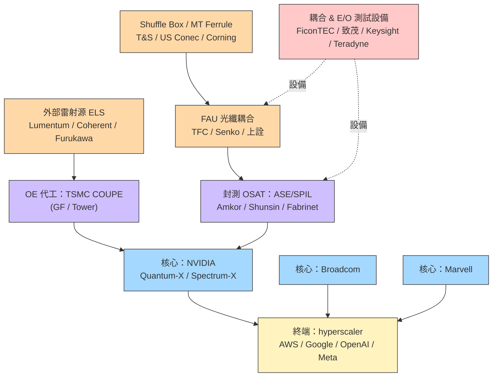

# 供應鏈_CPO

## 供應鏈主軸

> 以 **Nvidia CPO 生態**為主軸的供應鏈地圖（來源：SemiAnalysis CPO Book Part 5）。涵蓋光引擎、外部雷射源（ELS）、FAU、光纖 shuffle box、MPO 連接器、MT ferrule、晶圓代工／封測、E/O 測試。

## 供應鏈結構圖

## 各環節廠商

### 平台 / 交換器 ASIC（核心）
| 廠商 | 地位 | 備註 |
|------|------|------|
| [[NVDA.US(nvidia)]] | 主導 | Quantum-X（115.2T，72→36 OE）、Spectrum-X（102.4/409.6T） |
| [[AVGO.US(broadcom)]] | CPO 老將 | Humboldt→Bailly→Davisson（TH6，16×6.4T OE） |
| [[MRVL.US(marvell)]] | 切入中 | 收購 Celestial AI，主攻 scale-up 光互連 |

### OE 晶圓代工 / 封裝整合（製程）
| 廠商 | 地位 | 備註 |
|------|------|------|
| [[2330_台積電（市）]] | 首選 | COUPE：PIC N65 + EIC N7，SoIC 混合鍵合，逾 23× 頻寬密度 |

代工（未建頁）：GlobalFoundries（Fotonix）、Tower——具 SiPho 但缺先進 CMOS 與先進封裝。

### 封測 OSAT（製程）
| 廠商 | 地位 | 備註 |
|------|------|------|
| [[AMKR.US(amkor)]] | 主要 OSAT | OE 封裝/測試/系統組裝 |

OSAT（未建頁）：ASE/SPIL（3711.TW，Nvidia 供應鏈關鍵，含未來 Rubin-rack CPO）、Shunsin（6451.TW，與 Broadcom 緊密）、Fabrinet（FN，Nvidia 模組老夥伴）、Foxconn（2354.TW）、Micas、Celestica。

### 外部雷射源 ELS（外部材料）
| 廠商 | 地位 | 備註 |
|------|------|------|
| [[LITE.US(lumentum)]] | 首批主供 | Nvidia 初期 CPO ELS 預期唯一供應商（June note 因 CPO 延後轉保守） |

ELS（未建頁）：Coherent（COHR，估 2026 下半進入第二供應）、Furukawa、Broadcom 自供、源傑 Yuanjie（中）、仕佳 Shijia（中）。CW DFB 每顆 ~350mW；高功率雷射仍有護城河。

### FAU / 光纖耦合（外部材料）
| 廠商 | 地位 | 備註 |
|------|------|------|
| [[3363_上詮（櫃）]] | 台廠 FAU | 光纖被動元件；CPO FAU/耦合相關追蹤 |

FAU（未建頁）：TFC Optical（300394.SH，與 Nvidia 合作 3-4 年、Q3450 FAU 主供，蘇州擴產）、Senko（9069.JP，SEAT 可拆式 FAU、與 GFS 合作 edge coupling）、Sumitomo、AFR（近 Broadcom）。耦合/對位設備（未建頁）：FiconTEC（德，>$300k/台）、All Ring Tech（台）、GMT Global（台）。

> ⚠️ **GlassBridge 顛覆風險（2026-06-24 Corning 正式發布）**：Corning GlassBridge 是 Fiber-to-PIC 直接耦合平台，將光纖直接連到 PIC，無需傳統 FAU 中間組裝。特性：wafer-based、被動對位、高密度、可插拔。MS 評估（2026-06-28）：CPO 開發中 **FAU 廠商面臨顛覆風險**，AI 收發模組廠商近 1-2 年影響有限（NPO 應用或可抵消 CPO 風險）。商業量產時程仍不確定；康寧已將 GlassBridge 納入 Analyst Day US$10bn Photonics 目標中。來源：[[GlassBridge_Fiber-to-PIC_光收發模組_MS260628]]

### Shuffle Box / MPO / MT Ferrule（外部材料）
| 環節 | 廠商（未建頁） | 備註 |
|------|------|------|
| Shuffle Box | T&S Communications（300570.SH）、Molex | T&S 主供、自動對位專利；Corning 分包給 T&S |
| MPO 連接器 | US Conec、T&S、Senko、Broadex、Optec | X800-Q3450 需 144 個 |
| MT Ferrule | US Conec、Fukushima、Senko、FOCI、Sumitomo、TFC、T&S | US Conec 三十年經驗，Q3450 主供之一 |

### E/O 測試設備（上游設備）
| 廠商 | 地位 | 備註 |
|------|------|------|
| [[2360_致茂（市）]] | 潛在切入 | 雷射二極體/光通訊測試起家，可延伸 CPO die/系統級測試 |

測試設備（未建頁）：Keysight（高速測試龍頭）、Teradyne（NVDA 認證領先、ficonTEC 夥伴）、FormFactor（晶圓探針）、Advantest、Anritsu、Multilane、Hon Precision 鴻勁（AI/HPC 終測 handler）。

## 競爭格局

- **TSMC COUPE 形成綁定**：採 COUPE 即綁定 TSMC 製 PIC，是供應鏈最關鍵的卡位。
- **雷射 ELS 短期由 Lumentum 主導**，Coherent 第二、中系廠商伺機切入標準化品項。
- **FAU/被動件**：精密對位與技術人力是門檻；台廠（上詮、FOCI）與中、日（TFC、Senko）並進。
- **測試是 picks-and-shovels**：系統整合良率是 CPO 最大瓶頸，測試需求領先量產。

## 觀察重點（投資視角）

1. **CPO 量產時程下修風險**（見 [[技術_CPO]] 衝突 callout）：scale-out 2026/2027 出貨可能不如預期。
2. Lumentum 對 CPO 量的曝險使其在 June note 轉保守——ELS 供應地位與時程下修的拉鋸。
3. 良率（attach yield → 系統良率）是放量的硬門檻，利多測試與設備端先行。
4. 台廠卡位：上詮（FAU）、致茂（測試）、ASE/SPIL（封測）、Foxconn（系統組裝）。

## 相關頁面

- [[2455_全新（市）]]
- [[3081_LandMark光電（市）]]
- [[3105_穩懋（市）]]
- [[3450_聯鈞（市）]]
- [[3711_日月光投控（市）]]
- [[APH.US(amphenol)]]
- 技術：[[技術_CPO]]
- 對照供應鏈：[[供應鏈_先進封裝載板]]、[[供應鏈_AI伺服器PCB]]

## 來源

- [[報告_Semianalysis_CPO_20260102]]（CPO Book Part 5：Nvidia CPO 供應鏈，2026-01-02）
- [[報告_Semianalysis_CPOand800VDC_20260609]]（CPO 個股 read-across，2026-06-09）
