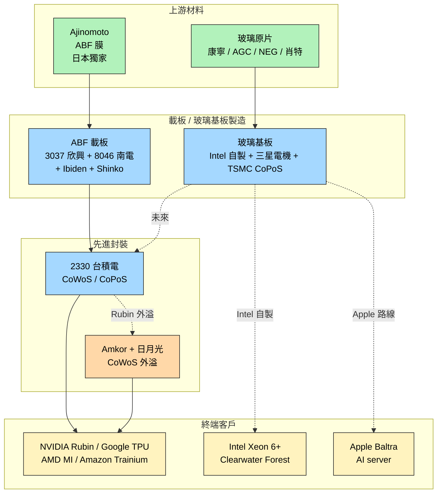

# 供應鏈_先進封裝載板

## 供應鏈主軸

本頁整理 **ABF 載板 → 玻璃基板** 的雙軌先進封裝載板供應鏈，核心 anchor 為台積電 CoWoS 平台。先進封裝市場 2024→2030 CAGR 9.5%，IC 載板市場 2030 預估 310 億美元（Yole，引自 [[報告_其他_玻璃基板_20260511]]）。Morgan Stanley（2026-05-08）維持 [[3037_欣興（市）]] / [[8046_南電（市）]] 雙 Overweight，理由為 ABF 漲價可 100% 轉嫁且 TSMC CoWoS 月產能 2026 底估 11.5–14 萬片持續拉動需求；中期觀察焦點則移向玻璃基板量產時程（Intel 2026 動工、Apple Baltra 路線、TSMC CoPoS「未來幾年內量產」）。

## 供應鏈結構圖

Canvas 圖譜：（待後續補，下次有 canvas 工具時補連結）

![[報告_其他_玻璃基板_20260511_002.png]]
> 先進封裝市場 2024 → 2030 持續擴容，CAGR 9.5%（國金引 Yole 數據）

![[報告_其他_玻璃基板_20260511_006.png]]
> IC 載板市場 2030 預估達 310 億美元（國金引 Yole 數據）

## 各環節廠商

### 上游材料

**ABF 鏈**

| 廠商 | 地位 | 備註 |
|------|------|------|
| Ajinomoto 味之素（日本，未建頁） | 獨家壟斷 | ABF 膜原料；2026-05 啟動 per-customer 漲價 |

**玻璃基板鏈**

| 廠商 | 地位 | 備註 |
|------|------|------|
| 康寧 Corning（美國，未建頁） | 國際巨頭 | 玻璃原片 |
| AGC 旭硝子（日本，未建頁） | 國際巨頭 | 玻璃原片 |
| NEG 電氣硝子（日本，未建頁） | 國際巨頭 | 玻璃原片 |
| Schott 肖特（德國，未建頁） | 國際巨頭 | 玻璃原片 |

> 中國 A 股潛在受惠（國金證券 2026-05-11 點名）：凱盛科技、旗濱集團、戈碧迦、沃格光電（原片 / 加工）、天承科技（電鍍液）、江化微（蝕刻）、德邦科技（鍵合膠）。本次 ingest **不主動建公司頁**，詳見 [[技術_玻璃基板]]「關鍵廠商」段。

### 載板 / 玻璃基板製造

**ABF 載板廠**

| 廠商 | 地位 | 備註 |
|------|------|------|
| [[3037_欣興（市）]] | 台廠 ABF 雙雄 | Morgan Stanley 維持 Overweight（2026-05-08） |
| [[8046_南電（市）]] | 台廠 ABF 雙雄 | Morgan Stanley 維持 Overweight；MS 中期成長率較高 |
| Ibiden（日本 4062，未建頁） | 日廠領先 | ABF 載板領先廠 |
| Shinko（日本 6967，未建頁） | 日廠 | ABF 載板 |
| Kinsus 景碩（台灣 3189，未建頁） | 台廠 | ABF 載板 |

**玻璃基板量產推手**

| 廠商 | 地位 | 備註 |
|------|------|------|
| [[INTC.US(intel)]] | 自製垂直整合 | 亞利桑那州 >10 億美元投入；3DGS 量產線；2026-04 動工，年產 ~7 萬 |
| 三星電機 Samsung Electro-Mechanics（未建頁） | Apple 玻璃基板供應商 | T-glass，目標 2027 後量產 |
| [[2330_台積電（市）]] | CoPoS 平台 | 26Q1 法說，「未來幾年內量產」 |

### 先進封裝

| 廠商 | 地位 | 備註 |
|------|------|------|
| [[2330_台積電（市）]] | CoWoS 主導 | 月產能 2024 ~3.5 萬 → 2026 底 11.5–14 萬 → 2027 ~17 萬 |
| [[AMKR.US(amkor)]] | CoWoS 外溢承接 | 接 NVIDIA Rubin 部分 CoWoS |
| [[3711_日月光投控（市）]] | CoWoS oS 外包主要承接方 | Nomura：TSMC 已將大部分 oS 業務委外給 ASE；oS 佔 ASE LEAP FY26F 59%、FY27F 51%；LEAP 總規模 USD3.5bn→6.9bn |

### 終端客戶

| 廠商 | 地位 | 備註 |
|------|------|------|
| [[NVDA.US(nvidia)]] | AI GPU 龍頭 | 與 Google/AMD/Amazon 共占 CoWoS/HBM 90%/92% |
| Google（未建頁） | AI ASIC 大客戶 | TPU 系列 |
| [[AMD.US(amd)]] | AI GPU / CPU | MI 系列（AI GPU）+ Venice CPU（採 ASE FOCoS-B） |
| Amazon AWS（未建頁） | AI ASIC | Trainium 系列 |
| [[INTC.US(intel)]] | Server CPU + 玻璃基板自製 | Xeon 6+ Clearwater Forest |
| [[AAPL.US(apple)]] | 內部 AI server | Baltra（玻璃基板路線） |

## 競爭格局

雙軌敘事，反映「現行載板 vs 下一世代基板」的時間張力：

### 短期（2026）：ABF 載板漲價、現金牛持續

- **Ajinomoto 啟動漲價**：[[3037_欣興（市）]] / [[8046_南電（市）]] 等載板廠可 100% 轉嫁至下游，AI 端可能多賺一點 ASP（Morgan Stanley 2026-05-08）
- **TSMC CoWoS 產能持續擴張**：月產能 2024 ~3.5 萬 → 2026 底 11.5–14 萬 → 2027 ~17 萬，ABF 載板需求穩定成長
- **CoWoS 外溢出口**：[[NVDA.US(nvidia)]] Rubin 部分 CoWoS 外包给 [[AMKR.US(amkor)]] 與 [[3711_日月光投控（市）]]，OSAT 受惠；Nomura（2026-06-30）估算 ASE 承接 TSMC 大部分 oS 業務，FY27F CoWoS oS 收入達 USD3.5bn

### 中期（2026-2030）：玻璃基板量產推進

- **[[INTC.US(intel)]]**：垂直整合自製，亞利桑那州 >10 億美元，2026-04 3DGS 動工，2026-2030 大規模商用窗口
- **[[AAPL.US(apple)]]**：依靠三星電機 T-glass，三星電機目標 2027 後量產
- **[[2330_台積電（市）]]**：CoPoS「未來幾年內量產」
- **材料端增量**：TSV → TGV 替代後，材料端增量主要在玻璃原片與加工輔材
- **國產替代空間**：中國 A 股供應鏈（凱盛科技 / 旗濱 / 戈碧迦 / 沃格光電 / 天承 / 江化微 / 德邦）潛在受惠

> [!warning] 技術路線轉向（兩份來源並列）
> 兩份來源觀察時點僅差 3 天，反映時間結構不互相否定：
> - **Morgan Stanley（2026-05-08）**：ABF 短期 cash flow 強化、維持 Uni/NYPCB OW
> - **國金證券（2026-05-11）**：玻璃基板中期路線替代，Intel / Apple / TSMC 三軌量產
>
> 同時持有兩個視角是合理的。

## 觀察重點（投資視角）

1. **Ajinomoto 漲價節奏**：能否持續、轉嫁幅度 → 影響 [[3037_欣興（市）]] / [[8046_南電（市）]] 短期 ASP / GM
2. **TSMC CoWoS 產能擴張**：2027 達 17 萬月產能目標是否達成 → ABF 載板需求基本盤
3. **CoWoS 外溢規模**：[[AMKR.US(amkor)]] / 日月光承接量是否擴大 → 反映 TSMC 產能不足程度，也是 OSAT 受惠
4. **玻璃基板量產時點**：[[INTC.US(intel)]] 3DGS / [[AAPL.US(apple)]] Baltra / [[2330_台積電（市）]] CoPoS 三軌實際 SKU 出貨節奏 → 影響 ABF 載板中期成長空間
5. **CoWoP 等不需基板技術**：良率突破與否 → MS 視角的雙向風險（突破則壓縮 ABF / 不突破則 ABF 受惠延長）
6. **中國 A 股供應鏈滲透**：本次未建公司頁的中國廠商若進入國際供應鏈或拿到送樣訂單，是國產替代敘事的關鍵節點

## 來源

- [[報告_MS_ABF產業_260508]]（Morgan Stanley，2026-05-08，ABF 漲價邏輯；分析師 Howard Kao / Sharon Shih / Irene Yen）
- [[報告_其他_玻璃基板_20260511]]（國金證券「玻璃基板行業深度」，2026-05-11，玻璃基板技術 + 中國 A 股供應鏈；分析師李陽 S1130524120003）

## 相關頁面

- [[2467_志聖（市）]]
- [[3532_台勝科（市）]]
- [[3541_印能科技（市）]]
- [[3563_牧德（市）]]
- [[4966_福懋科（市）]]
- [[6239_頎邦（市）]]
- [[6257_矽格（市）]]
- [[6640_均華精密（市）]]
- [[6658_聯策（市）]]
- [[6770_力積電（市）]]
- [[8482_創新服務（市）]]
- [[供應鏈_AI伺服器散熱]]
- [[1303_南亞（市）]]
- [[1802_台玻（市）]]
- [[3189_景碩（市）]]
- [[4958_臻鼎（市）]]
- [[6664_群翊（市）]]
- [[AVGO.US(broadcom)]]
- [[供應鏈_AI伺服器PCB]]
- [[供應鏈_CPO]]
- [[技術_ABF載板]]

---

## ABF 載板供需缺口更新（2026-2028）

### 全球 ABF 產能供給（統一投顧 2026-03-24）

| 廠商 | 2024 | 2025 | 2026E | 2027E | 2028E |
|------|------|------|-------|-------|-------|
| Ibiden | 9,000 | 11,700 | 15,795 | 21,323 | 28,786 |
| 欣興 | 10,000 | 11,200 | 12,544 | 14,802 | 17,466 |
| 景碩 | 4,000 | 4,000 | 4,200 | 5,000 | 5,150 |
| 南電 | 5,000 | 5,000 | 5,150 | 5,305 | 5,464 |
| 其他 | 6,884 | 7,091 | 7,303 | 7,523 | 7,748 |
| 合計 | 34,884 | 38,991 | 44,992 | 53,952 | 64,614 |
| YoY | +14% | +12% | +15% | +20% | +20% |

單位：萬顆（37×37mm/8L 基準）

### 供需缺口預估（福邦投顧 2026-03-19）

| 年度 | 供需狀況 | 缺口估計 |
|------|----------|----------|
| 2025 | 供需平衡 | — |
| 2026 | 供不應求（開始） | 約 1% |
| 2027E | 缺口擴大 | 約 26% |
| 2028E | 缺口持續擴大 | 約 46% |

### T-glass 缺料是制約核心

T-glass（低 CTE 玻璃纖維布）為 ABF 載板核心層必要材料，需求因 AI 晶片世代升級呈倍增：

| 晶片 | 載板面積 | T-glass 層數 |
|------|---------|-------------|
| H100 | 50×50mm | 6 層 |
| Blackwell / GB300 | 80×80mm（平均） | 12 層 |
| Rubin（2027） | 100×100mm | 18 層 |

**Nittobo 日東紡**為全球最大 T-glass 供應商（市占 50-60%），2025-08-29 宣布投入 150 億日圓擴產，預計 4Q26 產能開出達目前 3 倍。台玻（1802）、南亞（1303）4Q25 陸續通過認證，但產能仍低。Asahi、AST 已停產 T-glass。

業界普遍認為即使 Nittobo 4Q26 擴產完成，2027 年仍可能無法完全緩解短缺。

## 主要客戶供應格局更新

### GB200/GB300（Nvidia）

| 供應商 | 份額 | 備註 |
|--------|------|------|
| Ibiden | 80-90% | 主要供應商 |
| 欣興 | 10-20% | 次要供應商 |

### VR200 Rubin（Nvidia，2027）

| 供應商 | 份額 | 備註 |
|--------|------|------|
| Ibiden | 90-95% | 主要供應商 |
| 欣興 | 5-10% | 次要供應商 |

### Google TPU v9 HumuFish（EMIB-T，2027）

供應商：Ibiden + 欣興（EMIB-T 高複雜度載板，僅 Tier 1 能供應）

### Trainium 系列（Amazon）

欣興 + 南電（Tier 1 台廠共同供應）

## 先進封裝路線比較（ABF 定位）

| 封裝方式 | 需要 ABF 載板？ | 現況 | 主要應用 |
|----------|---------------|------|----------|
| CoWoS（TSMC） | 需要 | 量產主流 | NV/Google/AWS |
| CoPoS（TSMC） | 換玻璃基板 | 量產中未到 | 未來路線 |
| CoWoP | 不需要 | 良率仍是問題 | 未來路線 |
| EMIB-T（Intel） | 需要（高階） | 供應商僅 Ibiden+欣興 | Google TPU v9 |
| FOPLP（力成） | 需要 ABF 基板 | 驗證中，1H27 量產 | AI 晶片 |
| CoPoS/面板級 | ABF 面板型態 | 研發階段 | 下代 GPU |

## 各環節廠商更新

### ABF 載板廠（補充景碩）

| 廠商 | 代號 | 定位 | 2026E EPS | 2027E EPS | TP | 評等 |
|------|------|------|-----------|-----------|-----|------|
| 欣興 | 3037.TW | 台廠 ABF 第一 | NT\.2 | NT\.0 | NT\ | 買進（統一投顧） |
| 南電 | 8046.TW | 台廠 ABF 第二 | NT\.2 | NT\.5 | NT\ | 買進（統一投顧） |
| 景碩 | 3189.TW | 台廠 ABF 第三 | NT\.2 | NT\.2 | NT\ | 買進（統一投顧） |
| Ibiden | 4062.JP | 全球 ABF 龍頭 | — | — | — | — |

### 上游材料（T-glass 供應鏈）

| 廠商 | 代號 | 市占 | 狀態 |
|------|------|------|------|
| Nittobo 日東紡 | 3110.JP | 50-60% | 4Q26 擴產 3 倍 |
| 台玻 | 1802.TW | 15-20% | 4Q25 通過認證，產能仍低 |
| 宏和電子 | — | 10-15% | — |
| 南亞 | 1303.TW | 新進 | 4Q25 通過認證 |

## 觀察重點更新

1. T-glass 缺口：Nittobo 4Q26 擴產是否如期，台玻/南亞認證後能否快速爬坡
2. 欣興 vs 南電：擴產策略分歧——欣興走量（2026-28 CAGR +18%），南電走質（CAGR +3% 但漲幅假設更高）
3. 景碩（3189）：台廠 ABF 第三，楊梅 K6 廠 2027 擴產，統一投顧中性 TP NT\
4. Ibiden 擴產：大野廠+河間廠合計 5,000 億日圓投資，2027-28 產能大幅成長，供需缺口能否比預期更早收斂
5. EMIB-T 量產：欣興是 Intel EMIB-T 唯二供應商，Google TPU v9 是重要催化劑（2027）
6. 股價行為對照（統一投顧）：2025 為初升段，2026 為主升段，2027 為末升段或主跌段

## 來源（補充）

- [[報告_統一投顧_ABF載板專題_20260324]]（統一投顧，2026-03-24；供需缺口、T-glass、三廠擴產、情境分析）
- [[報告_福邦_PCB載板產業展望_20260401]]（福邦投顧，2026-03-19；2027-28 缺口 26%/46%、T-glass 市占、客戶供應格局）

---

## 載板廠估值比較（JPM 2026-04-10，股價 4/9）

| 公司 | 代號 | 股價 | PE 2026E | PE 2027E | PB 2026E | NI YoY 2026E | ROE 2026E |
|------|------|------|----------|----------|----------|-------------|----------|
| 欣興 Unimicron | 3037.TW | NT\ | 41.6x | 23.4x | 8.0x | +244% | 21% |
| 景碩 Kinsus | 3189.TW | NT\ | 43.8x | 25.7x | 4.6x | +193% | 11% |
| 南電 Nanya | 8046.TW | NT\ | 65.9x | 39.2x | 8.6x | +305% | 14% |
| Ibiden | 4062.JP | JPY 9,810 | 48.8x | 42.8x | 4.4x | -26% | 9% |
| SEMCO | 009150.KS | KRW 516,000 | 30.7x | 22.1x | 3.9x | +79% | 12% |

資料來源：JPMorgan（2026-04-10）；股價以 4/9 收盤為準

## 來源（補充）

- [[報告_JPM_亞洲PCB_CCL_載板_20260410]]（JPMorgan，2026-04-10）
