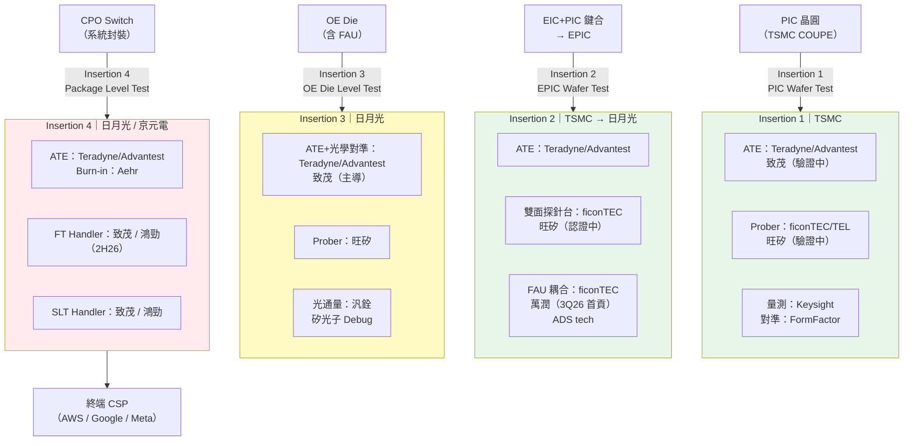

# 供應鏈_光測試設備

## 主軸

CPO（Co-Packaged Optics）及矽光子元件從晶圓到系統封裝需經過 **4 個測試節點（Insertion 1-4）**，每個節點有完全不同的測試設備組合。本頁記錄各 Insertion 的測試設備玩家、測試地點，以及台廠的切入位置。

> 與 [[供應鏈_CPO]] 的分工：供應鏈_CPO 記錄「光引擎零組件」的製造供應鏈；本頁記錄「光引擎如何測試」的測試設備供應鏈。

---

## 全覽：4 Insertion 設備地圖

![[光測試期中產業報告_009.png]]

> Insertion 1-2 測試地點在台積電（晶圓廠）；Insertion 3 移至 OSAT（日月光）；Insertion 4（CPO Switch 系統封裝後）在日月光/京元電，需 ATE + FT Handler + SLT Handler。台廠可切入的主要角色標示為橘色。（來源：SRS 光測試期中產業報告，2026-07）

---

## 各 Insertion 詳細拆解

### Insertion 1｜PIC Wafer Level Test（測試地點：台積電）

光子 IC（PIC）在晶圓廠完成後的第一道測試。測試 PIC 上的環形共振器（Ring Resonator）、光調變器（Modulator）、光電二極管（PD）、耦合器（Coupler）等元件的 DC 電性與光學特性。

![[光測試期中產業報告_010.png]]

> PIC 晶圓包含多種光學元件，每種元件測試項目不同：Ring Resonator 測頻寬/波長/偏壓；PD 測 Dark Current/Responsivity；Coupler 測 Insertion Loss/Optical Return Loss。（來源：SRS，2026）

| 角色 | 玩家 | 台廠 | 狀態 |
|------|------|------|------|
| ATE / Tester | Teradyne、Advantest | [[2360_致茂（市）]]（驗證中） | 外資主導，致茂搶入 |
| Prober（光路探針台） | ficonTEC、TEL | [[6223_旺矽（櫃）]]（光電探針台，驗證中） | 旺矽切入驗證 |
| 光學對準（FAU/光柵） | FormFactor | — | 仍外資壟斷 |
| 量測儀器 | Keysight、Advantest | — | 外資主導 |

**測試重點**：光柵耦合（Grating Coupler）將光路引出晶圓面，偏差 0.5µm → 50% 光功率流失；測試精度要求 < 0.3µm。

---

### Insertion 2｜EPIC Wafer Level Test（測試地點：台積電 → 耦合製程移至日月光）

EIC（Electrical IC）與 PIC 混合鍵合為 EPIC 後的晶圓級測試。需**雙面同測**：上方傳統探針卡接觸 EIC 電性接點，下方光纖光學探針耦合 PIC 光學面（需開槽晶圓卡盤）。

測試後進入 **FAU 貼合耦合製程**（Insertion 2 後製程，在 OSAT 日月光進行）：將光纖陣列（FAU）精密對準並 UV 固化貼合至 OE（光引擎）Die 上。

| 角色 | 玩家 | 台廠 | 狀態 |
|------|------|------|------|
| ATE / Tester | Teradyne、Advantest | — | 外資主導 |
| 雙面光電探針台 | ficonTEC、旺矽 | [[6223_旺矽（櫃）]]（開槽卡盤雙面台，認證中） | 旺矽核心機會 |
| 光學對準 | ficonTEC | — | 外資壟斷（交期 9-12 個月） |
| FAU 貼合耦合設備 | ficonTEC、萬潤、ADS tech | [[6187_萬潤（市）]]（UPH 優於 ficonTEC，3Q26 首貢獻） | 關鍵瓶頸 |
| 耦合地點（OSAT） | [[3711_日月光投控（市）]] | — | ASE/SPIL 為主要耦合廠 |

**瓶頸**：FAU 耦合對位精度 < 0.3µm，是整條 CPO 產線最難良率管控點。萬潤以更短交期挑戰 ficonTEC 壟斷。

---

### Insertion 3｜OE Die Level Test（測試地點：日月光）

光引擎（OE = OE Die，含 FAU 的組件）在系統封裝前的 Die 級測試。同時驗證光性（插入損耗、波長、光功率）與電性（SerDes 訊號完整性、224G PAM4 高速訊號）。

| 角色 | 玩家 | 台廠 | 狀態 |
|------|------|------|------|
| ATE / Tester + 光學對準 | Teradyne、Advantest、ficonTEC | [[2360_致茂（市）]]（ATE + 奈米對準，主導 Insertion 3） | 致茂核心強項 |
| Prober | 旺矽 | [[6223_旺矽（櫃）]]（Die Level 探針台） | 確認切入 |
| 光通量檢測儀器 | 汎銓、光焱 | [[6710_汎銓（市）]]（矽光子 Debug 設備；IR-OM 光損偵測） | 小眾但高利潤 |
| 測試地點 | [[3711_日月光投控（市）]] | ASE/SPIL | OSAT 主測試地 |

**台廠優勢**：Insertion 3 是致茂最明確的切入點（整合式 ATE + 光學對準 + 量測三合一平台）；旺矽探針台與致茂 ATE 協作；汎銓 IR-OM 設備做光路 Debug。

---

### Insertion 4｜CPO Switch Package Level Test（測試地點：日月光 / 京元電）

最終封裝後的系統級測試——ASIC（CPO Switch）與光引擎整合成完整 CPO 模組後，進行光電同測（外部雷射注入 + 電性測試 + SLT 系統驗證）。

| 角色 | 玩家 | 台廠 | 狀態 |
|------|------|------|------|
| ATE / Tester | Teradyne、Advantest | — | 外資主導 |
| Burn-in | Aehr、Advantest | — | 外資主導 |
| 量測儀器 | Keysight、Anritsu、ficonTEC | — | 外資主導 |
| **FT Handler**（光電同測，主力） | **[[2360_致茂（市）]]**（ATE 主導）、**[[7769_鴻勁精密（市）]]**（3kW ATC，開發中 2H26 量產目標） | 兩家台廠 | 最高價值環節 |
| **SLT Handler**（純光測試） | **[[2360_致茂（市）]]**、**[[7769_鴻勁精密（市）]]** | 兩家台廠 | 致茂 SLT 可省 ATE 直接測 |
| 測試地點 OSAT | [[3711_日月光投控（市）]]、[[2449_京元電（市）]] | — | 日月光/京元電 為主 |

**台廠集中度高**：Insertion 4 是 CPO 測試設備 ASP 最高、台廠參與最深的環節。致茂主 ATE/SLT，鴻勁主 FT ATC Handler（已有數百台 CPO 電性測試 ATC Handler 出貨，Insertion 4 光電同測 2H26 目標量產）。

---

## 供應鏈結構圖

---

## 台廠對照表

| 公司 | 切入 Insertion | 核心產品 | 狀態 | 時機 |
|------|--------------|---------|------|------|
| [[2360_致茂（市）]] | 1（驗證）/ 3（主導）/ 4（主導） | ATE + 光學對準；FT/SLT Handler | 3/4 已確認，1 驗證中 | 已有明確訂單 |
| [[6223_旺矽（櫃）]] | 1（驗證）/ 2（認證）/ 3（確認） | 光電探針台、雙面探針台 | 各階段認證進行中 | 認證 → 量產 |
| [[6187_萬潤（市）]] | 2 後製程（FAU 耦合） | 光耦合設備（UPH > ficonTEC） | 3Q26 首次貢獻 | 搶 ficonTEC 份額 |
| [[7769_鴻勁精密（市）]] | 4（FT + SLT Handler） | CPO ATC FT Handler（光電同測） | 2H26 量產目標 | 高 ASP，已有 Insertion 3 電性 Handler 基礎 |
| [[6710_汎銓（市）]] | 3（光通量量測） | 矽光子 Debug 設備（IR-OM 光損偵測） | 年底首台設備出貨 | 小眾高利潤 |
| [[3711_日月光投控（市）]] | 2 後（FAU 耦合地點）/ 3 / 4 | OSAT 測試地點 | 現有 CPO OSAT 基礎 | 作為場地持有者受益 |
| [[2449_京元電（市）]] | 4 | OSAT 測試地點 | — | 測試外包需求 |

---

## 外資競爭者

| 公司 | 角色 | 競爭地位 |
|------|------|---------|
| ficonTEC（德） | 光學對準 + CPO 耦合設備（Insertion 1-3）| 實質壟斷，交期 9-12 個月；萬潤/旺矽挑戰 |
| Teradyne（US） | ATE（Insertion 1-4 全程） | 與 Advantest 雙寡頭 |
| Advantest（JP，6857.JP） | ATE + Burn-in | 同上 |
| FormFactor（US） | 光學對準探針台（Insertion 1） | 工程驗證階段主力 |
| Keysight（US） | 量測儀器（Insertion 1/4） | 廣泛使用 |
| Aehr（US） | Burn-in 系統（Insertion 4） | IC Burn-in 專家 |

---

## 投資觀察

1. **CPO 測試是「picks-and-shovels」環節**：即使 CPO 量產時程下修，測試設備仍比組件廠商更早採購，且每顆 OE Die 必測，不受架構路線影響（任何 CPO 設計都需走 4 個 Insertion）。

2. **台廠集中在 Insertion 3/4**：附加值最高的兩個節點，致茂與鴻勁在 Insertion 4 的 FT/SLT Handler 互補而非純競爭（致茂偏 ATE 主機整合，鴻勁偏 Handler 熱控）。

3. **旺矽受益於「無論哪種 CPO 架構都需要探針台」**：PIC 架構（TFLN / SiPh / InP）無論哪條路線勝出，測試端的探針台需求都成立。

4. **ficonTEC 替代為中期風險**：萬潤、旺矽均在挑戰 ficonTEC 壟斷；若台廠切入成功，整體光耦合設備供應鏈本土化比例將大幅提升（設備交期縮短，有利 CPO 量產加速）。

---

## 相關頁面

- [[供應鏈_CPO]]（CPO 光引擎零組件製造供應鏈）
- [[供應鏈_半導體測試設備]]（AI/HPC Final Test ATE Handler，與 Insertion 4 FT/SLT 有交集）
- [[技術_CPO]]（CPO 技術原理）
- [[7769_鴻勁精密（市）]]（FT ATC Handler）
- [[2360_致茂（市）]]（CPO ATE + Handler）
- [[6223_旺矽（櫃）]]（光電探針台）
- [[6187_萬潤（市）]]（FAU 耦合設備）
- [[6710_汎銓（市）]]（矽光子 Debug 設備）
