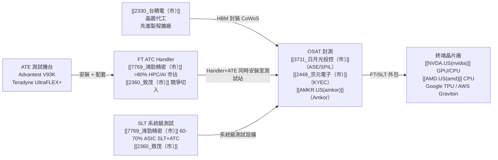

# 供應鏈_半導體測試設備

## 供應鏈主軸

AI/HPC 晶片從晶圓到成品需經過多個測試節點（Wafer Sort → Final Test → Burn-in → SLT）。本頁聚焦 **Final Test（FT）Handler** 與 **SLT 系統級測試** 段，即鴻勁精密（[[7769_鴻勁精密（市）]]）的主力市場。

高盛 2026-07-30 報告指出，[[7769_鴻勁精密（市）]] 的 2026 年產能擴張可能超過原先 +40% YoY 指引，但年底仍供不應求且排程已到 1Q27；2027 年再擴 50%，顯示高功率 ATC handler 與大封裝測試仍是測試設備鏈的主要瓶頸。

## 供應鏈結構圖

## 各測試節點與供應商

| 測試節點 | 在晶片製造流程位置 | ATE 設備 | Handler / 測試設備 | 主要玩家 |
|----------|-------------------|-----------|--------------------|----------|
| Wafer Sort | TSMC 晶圓廠內 | V93K / UltraFLEX+ | HA1200 / N/A | Advantest、Teradyne |
| Die Level Test（選裝） | 晶圓廠 / 部分 OSAT | V93K / UltraFLEX+ | HA1200 | Advantest |
| Final Test (FT) | OSAT（KYEC、ASE/SPIL、Amkor） | V93K / UltraFLEX+ | **[[7769_鴻勁精密（市）]]** | 鴻勁（>80% HPC/AI） |
| Burn-in Test | OSAT | Burn-in 系統 | N/A | KYEC、MCC、AEM、AEHR |
| 2nd FT / SLT | OSAT | Chroma / Advantest / Teradyne | **[[7769_鴻勁精密（市）]]** | 鴻勁（ASIC SLT 60-70%） |
| CPO FT Insertion 3 | OSAT（Package Level） | V93K + ATC | [[7769_鴻勁精密（市）]] 2kW | 鴻勁（唯一 CPO Switch ATC Handler） |
| CPO FT Insertion 4 | OSAT（光電同測） | 大型 ATE + ATC 3kW | [[7769_鴻勁精密（市）]]（開發中） | 鴻勁（2H26 量產目標） |
| 大封裝 FT／SLT | OSAT；>120×150mm mega tray | 高功率 ATE + ATC | [[7769_鴻勁精密（市）]] 大封裝 solution | 2026-10 出貨；2027H2 滲透率預估 >50% |

## 主要廠商

| 廠商 | 角色 | 特點 |
|------|------|------|
| [[7769_鴻勁精密（市）]] | FT Handler / SLT / CPO Handler | HPC/AI FT >80%；唯一雙溫+三溫系統 |
| [[2360_致茂（市）]] | ATE / 量測儀器 / CPO 測試 | CPO Insertion 3/4 競爭切入；SLT 競爭 |
| [[6857.JP(advantest)]] | ATE 測試機台 | V93K 主力；CY25 整體市占 65%（SoC 66%）；CY28H2 產能擴至 10k 台/年 |
| Teradyne（TER.US） | ATE 測試機台 | UltraFLEX+ |
| [[3711_日月光投控（市）]] | OSAT（裝機客戶） | AMD 台灣 CPU 測試主要基地 |
| [[2449_京元電子（市）]] | OSAT（裝機客戶） | HPC AI FT 及 Burn-in 主要台廠 |
| [[AMKR.US(amkor)]] | OSAT（裝機客戶）| 韓國廠，NVIDIA Vera CPU 新訂單 |
| [[3374_精材（櫃）]] | 晶圓級封裝／測試服務 | 測試服務 2Q26 年增 103%；8 吋 CSP 與 12 吋 IVR 晶背銅加工專案 |

Nomura 2026-07-24 將測試鏈的成長驅動歸納為測試時間延長、先進封裝新增 BIT／SLT 插入、規格與測試硬體升級，以及 AI 需求外溢。其估計 NVIDIA Hopper→Blackwell→Rubin 的 final test 時間約為 1×／4×／7×，SLT 約為 1×／1.5×／2.5×；這些為研究模型，並非公司揭露的實測標準。

| 新增觀察 | 供應鏈含義 | 來源 |
|----------|------------|------|
| AI 晶片測試流程增加 BIT、SLT 與更早的 KGD probing | OSAT 測試服務、ATE、handler、probe card 與 socket 的內容值同步提高 | [[報告_Nomura_南茂升級測試_20260724]] |
| 大封裝與高 TDP 推動 mega tray、ATC 與高功耗 SLT 升級 | [[7769_鴻勁精密（市）]]、[[2360_致茂（市）]] 等客製化設備商的認證門檻提高 | [[報告_Nomura_南茂升級測試_20260724]] |
| ASE 2026 CapEx 上調至 US$10.5bn，約 40% 設備 CapEx 投向測試 | 先進封裝擴產帶動 OSAT 測試設備需求，但仍受產能與執行速度制約 | [[報告_Citi_日月光投控_20260730]] |

## 高階 ATE 平台能力比較

| 平台 | 主要定位 | 官方揭露的擴充能力 | 對 OSAT 的意義 |
|------|----------|--------------------|-----------------|
| [[6857.JP(advantest)]] V93000 EXA Scale | AI／HPC、mobile／RF、車用與工業 SoC；wafer sort 與 final test | CX 至 LX tester class；跨世代 load board／DUT board／測試程式相容；DUT Scale Duo 增加 50% 以上介面板面積；XPS256 電流範圍由 mA 至逾 1,000A | 以平台相容性提高既有資產利用率；支援高 pin-count、高功率與高 multisite 測試 |
| Teradyne UltraFLEX | 高效能 digital／SoC；mobile、RF、microprocessor、network processor 與高速 SerDes | HD 12-slot、SC 24-slot；UltraPin1600 每卡 128／256 channels、最高 2.2Gbps；UltraSerial10G 為 42Mbps–10.7Gbps；UltraWaveMX 最高 53GHz、部分配置可擴至 128 個 mmWave ports | 通用 slot、DIB 相容與高平行度有利於降低 cost of test，並覆蓋 digital、RF、DDR、SerDes 與 mmWave 測試 |

資料來源：[[web_Advantest_V93000_2026-08-18]]、[[web_Teradyne_UltraFLEX_2026-08-18]]（官方產品頁，擷取日 2026-08-18；產品規格 fact、信心高）。

> [!note] 單台產值建模邊界
> 兩個官方產品頁均未揭露設備 ASP、OSAT 機時費率、實際稼動率或單台年產值。因此「每台先進 tester 年產值」仍需由 OSAT 報價、設備數與測試營收交叉推估，不能由這兩個網站直接得出；先前以機時費率換算的數字應視為情境估算，而非官方 fact。

## 競爭格局 / 觀察重點（投資視角）

1. **大封裝內容值提升**：mega tray 與 advanced ATC 使設備 ASP 較主流 GPU handler 高 20–25%，若 2027H2 滲透率達 >50%，[[7769_鴻勁精密（市）]] 的成長將由台數擴張轉為台數＋單價雙驅動。
2. **高功率規格升級**：AI ASIC／GPU 的 FT 與 SLT 熱設計由約 3kW 升至 2027–2028 年最高 10kW，拉高認證與熱控門檻。
3. **供給仍是瓶頸**：2026 年產能擴張後仍供不應求，2027 +50% 的擴產能否準時投產，決定訂單轉化速度與競爭者切入空間。
4. **CPU／GPU／TPU 分流**：美系 CPU、GPU 與 TPU 客戶的 FT／SLT 導入進度不同，單一平台延後可能造成季度波動，但多平台並進可降低單一產品風險。
5. **平台相容性影響投資效率**：V93000 的跨世代介面／程式相容，以及 UltraFLEX 的通用 slot／DIB 相容，都有助 OSAT 提高設備利用率並縮短換線時間；評估 [[2449_京元電子（市）]]、[[3711_日月光投控（市）]] 與 [[6257_矽格（市）]] 的先進測試資本效率時，不能只看購機台數，還要追蹤配置、multisite 與測試程式移轉效率。

## 來源

- [[報告_高盛_鴻勁精密_20260730]] — 高盛，2026-07-30
- [[報告_國金_機械設備周報_20260705]] — 國金證券，2026-07-05
- [[web_Advantest_V93000_2026-08-18]] — Advantest 官方 V93000 產品頁，擷取日 2026-08-18
- [[web_Teradyne_UltraFLEX_2026-08-18]] — Teradyne 官方 UltraFLEX 產品頁，擷取日 2026-08-18
- [[報告_Nomura_南茂升級測試_20260724]] — Nomura，AI 時代測試流程、ATE／handler／test interface 升級，2026-07-24
- [[報告_Citi_日月光投控_20260730]] — Citi，ASE LEAP、CapEx 與先進封裝／測試展望，2026-07-30

## 2026年記憶體擴產周期（測試需求驅動）

## 2026-08-24 國金證券更新

[[報告_國金證券_半導體測試設備結構成長_202608]] 以 SEMI 預測為基礎，估全球半導體測試設備銷售額 2026 年年增 31% 至 153 億美元、2028 年達 208 億美元，2025–2028 CAGR 約 21%；數字屬產業預測。報告的核心判斷是 AI 帶來「更多晶片、更複雜晶片、更多測試」，並使測試由單機採購轉向平台、Test Cell、程式生態與量產交付能力的競爭。

| 觀察 | 供應鏈含義 | 信心 |
|---|---|---|
| SoC 測試受 GPU／ASIC 擴產拉動，2026 年市場估 85–95 億美元 | [[6857.JP(advantest)]]、Teradyne 與國內平台型設備商受惠 | 中 |
| Chiplet／HBM／先進封裝增加 KGD、Die-level、Burn-in 與 SLT 插入點 | ATE、handler、probe card、socket 與 OSAT 測試服務內容值提升 | 高 |
| 長川科技、華峰測控、聯動科技被列為國內平台化／專業化觀察標的 | 需追蹤數位 SoC、模擬／功率、存儲測試的量產驗證，不等同訂單確認 | 中 |

來源：[[報告_國金證券_半導體測試設備結構成長_202608]]（國金證券，2026-08-24）。

## 2026-07 追加觀察

- [[TER.US(teradyne)]] 認為測試設備支出占半導體資本支出比重可維持約 7–9%，先進封裝與 AI chiplet 提高 wafer、final 與 system-level 測試強度；其 2028 年 CPO 測試市場估計 US$0.3–0.7bn，為公司／券商觀點。
- 國金證券估全球測試設備市場由 2024 年 US$7.6bn 增至 2027E US$13.4bn（CAGR 21.1%）；這是中國設備供應鏈研究估計，應與各設備商實際訂單、記憶體資本支出交叉驗證。

來源：[[報告_富邦_Teradyne2Q26法說_20260730]]（2026-07-30）、[[報告_國金證券_半導體設備深度_20260709]]（2026-07-09）。

全球三大記憶體廠同步大規模擴產，半導體設備與測試設備需求進入超級週期：

| 廠商 | 擴產動作 | 資本支出 |
|------|---------|---------|
| **Micron** | 斥資 90 億美元擴建日本西部晶片工廠 | FY26Q4 ~$100億，FY26 全年 ~$270億，FY27 各季均高於 FY26Q4（>$400億/年）|
| **SK Hynix** | 明確未來 5 年擴產計畫 | — |
| **Samsung** | 明確未來 5 年擴產計畫 | — |

> 頭部三廠 2026 年已均明確擴產計畫，全球半導體設備與測試設備超級週期剛開始。前段蝕刻、後段 FT 測試、量測／檢測環節均看好。
>
> 來源：[[報告_國金_機械設備周報_20260705]]（國金證券，2026-07-05）

## 相關頁面

- [[6510_中華精測（櫃）]]
- [[8227_巨有科技（櫃）]]
- [[分析_2026Q3半導體供需與AI伺服器供應鏈]]
- [[分析_CP_FT_BI_SLT測試產業與外包]]
- [[3374_精材（櫃）]]
- [[6510_精測（市）]]
- [[6515_穎崴（市）]]
- [[2395_研華（市）]]
- [[5269_祥碩（市）]]
- [[6223_旺矽（櫃）]]
- [[8035.JP(tokyo electron)]]
- [[供應鏈_光測試設備]]
- [[7769_鴻勁精密（市）]]（FT ATC Handler 主力廠商）
- [[2360_致茂（市）]]（競爭 / 互補廠商）
- [[供應鏈_CPO]]（CPO 測試相關）
- [[技術_CPO]]（CPO 原理）
