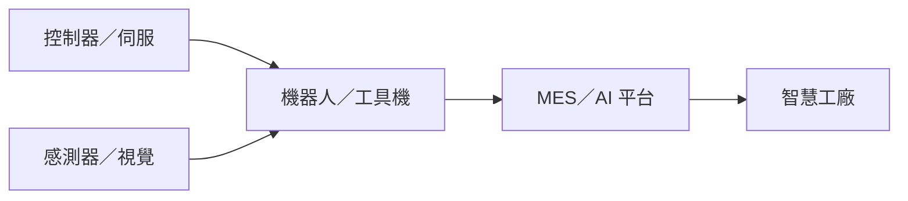

# 供應鏈_工業自動化

## 結構
工業自動化由控制器、伺服與感測器形成設備核心，再由機器人、機台與 MES／AI 軟體整合至工廠產線；工具機、半導體與 AI 伺服器液冷設備是新代近期揭露的應用。

## 相關公司
- [[7750_新代（市）]]：控制器、伺服、機器人與智慧製造整合。

## 來源
- [[7750新代I 20260825 I康和]]（康和證券，2026-08-25）
- [[7750新代｜20260826｜玉山]]（玉山投顧，2026-08-26）
