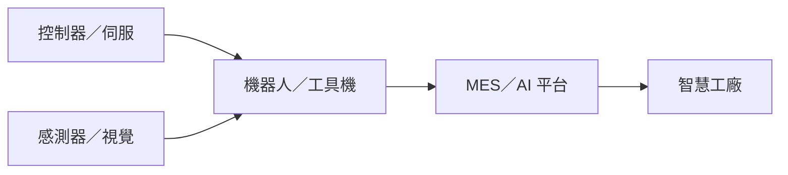

# 供應鏈_工業自動化

## 結構
工業自動化由控制器、伺服與感測器形成設備核心，再由機器人、機台與 MES／AI 軟體整合至工廠產線；工具機、半導體與 AI 伺服器液冷設備是新代近期揭露的應用。

## 相關公司
- [[7750_新代（市）]]：控制器、伺服、機器人與智慧製造整合。

## 來源
- [[7750新代I 20260825 I康和]]（康和證券，2026-08-25）
- [[7750新代｜20260826｜玉山]]（玉山投顧，2026-08-26）

## 2026-08-18 具身智能補充

[[20260821_1041_全球機器人產業前景_具身智能與台灣供應鏈研究]] 將台灣機器人鏈拆為 Edge AI／控制器、電源／驅動、精密傳動、半導體物流與 AI 視覺；其中可直接對應既有公司頁的觀察標的包括 [[2308_台達電（市）]]、[[2395_研華（市）]]、[[2049_上銀（市）]]。報告判斷人形機器人仍處驗證與特定場域導入期，應以客戶驗證、量產、單機成本與營收認列逐級確認，不將展示或合作直接視為訂單。

## 2026-09-17 盟立自動化與機器人更新

- [[2464_盟立（市）]]聚焦先進封裝／高階載板自動化，產品含 OHT、EFEM、Stocker、AMR／AGV；截至 2026 年 8 月累計訂單約 NT$140 億，年底估約 NT$200 億，75%–80% 預計於 2027 年底前完成。
- OHT 2027 年底產能估 2,500–3,000 台、EFEM 3,000 台、Stocker 500–800 台、AMR 800–1,000 台；諧波減速機產能由 2026 年底 30 萬件提升至 2027 年 80 萬件。上述為券商／公司展望，公司頁待使用者確認後再建立。

來源：[[報告_CTBC_盟立_20260917]]（中信投顧，2026-09-17）。
